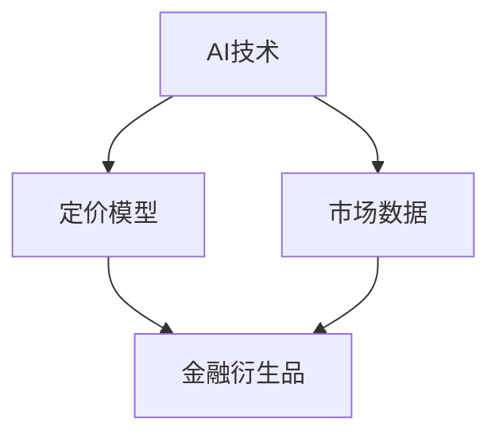
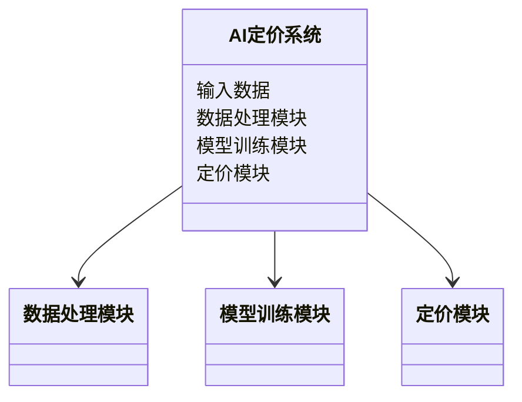
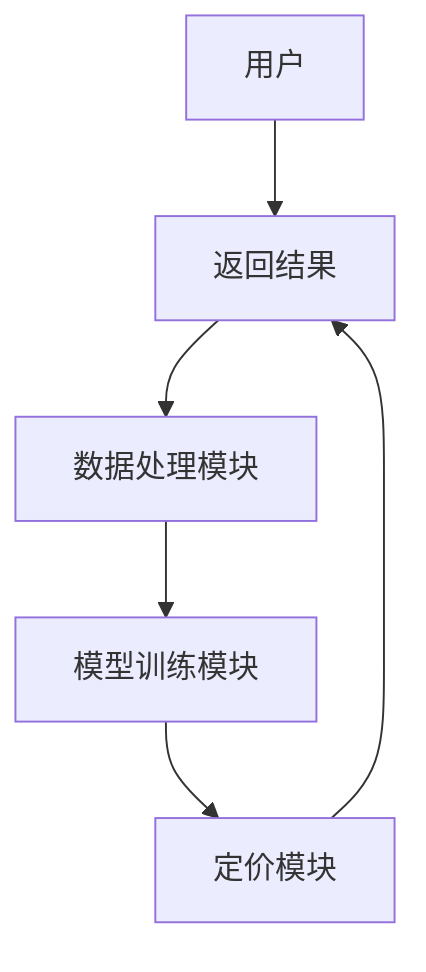
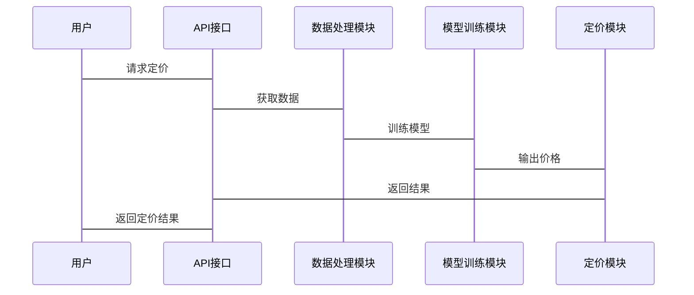

                 


# AI在金融衍生品定价中的深度应用研究

## 关键词
人工智能、金融衍生品、定价模型、机器学习、深度学习、时间序列分析、风险管理

## 摘要
本文深入探讨了人工智能技术在金融衍生品定价中的应用，从背景介绍、核心概念到算法实现、系统架构，再到项目实战，全面分析了AI如何提升金融衍生品定价的准确性与效率。文章结合理论与实践，提供了详细的模型构建过程、算法优化方法以及系统设计思路，为金融从业者和研究人员提供了有价值的参考。

---

# 第1章: 背景介绍

## 1.1 人工智能与金融衍生品定价的结合
### 1.1.1 人工智能的基本概念
人工智能（AI）是指模拟人类智能的计算机系统，通过机器学习、深度学习等技术，使系统能够从数据中学习并做出决策或预测。

### 1.1.2 金融衍生品定价的核心概念
金融衍生品是一种金融合约，其价值依赖于基础资产的价格。定价模型通常基于数学公式，如Black-Scholes模型，但需要考虑市场波动性、流动性等多种因素。

### 1.1.3 AI在金融衍生品定价中的应用背景
传统定价模型在处理复杂市场条件下存在局限性，AI技术的引入能够提高模型的适应性和预测精度。

## 1.2 问题背景与描述
### 1.2.1 传统金融衍生品定价的局限性
传统模型假设市场无摩擦，但实际市场存在交易成本、流动性风险等问题。

### 1.2.2 AI技术如何解决定价问题
AI能够处理非线性关系和高维数据，捕捉市场中的隐含模式，提高定价的准确性。

### 1.2.3 问题的边界与外延
本文聚焦于AI技术在衍生品定价中的应用，涵盖股票期权、股指期货等多种金融工具。

## 1.3 核心概念与联系
### 1.3.1 核心概念的定义与属性
- **AI技术**：包括机器学习、深度学习等。
- **定价模型**：基于数据的预测模型。

### 1.3.2 ER实体关系图架构


## 1.4 本章小结
本章介绍了AI与金融衍生品定价的结合背景，明确了核心概念和问题边界。

---

# 第2章: AI在金融衍生品定价中的核心概念

## 2.1 机器学习模型在定价中的应用
### 2.1.1 监督学习模型
- **回归模型**：用于预测期权价格。
- **分类模型**：用于判断市场状态。

### 2.1.2 无监督学习模型
- **聚类分析**：识别市场中的相似资产。

### 2.1.3 强化学习模型
- **策略网络**：优化交易策略。

## 2.2 数据特征提取与处理
### 2.2.1 市场数据特征
- **价格历史**：开盘价、收盘价等。
- **波动率指标**：如VIX指数。

### 2.2.2 风险因子分析
- **VaR**：在险价值。
- **信用风险**：违约概率。

### 2.2.3 数据预处理方法
- **标准化**：归一化处理。
- **缺失值处理**：插值法填充。

## 2.3 定价模型的构建与评估
### 2.3.1 模型选择标准
- **准确性**：预测与实际的偏差。
- **鲁棒性**：对数据变化的适应能力。

### 2.3.2 模型评估指标
- **均方误差（MSE）**：预测值与实际值的平方差之和。
- **R²值**：模型解释力度。

### 2.3.3 模型的适用场景
- **时间序列预测**：适用于期权定价。
- **市场状态识别**：适用于动态调整策略。

## 2.4 核心概念对比分析
### 2.4.1 传统定价模型与AI模型的对比
| 特性       | 传统模型             | AI模型              |
|------------|----------------------|---------------------|
| 数据需求   | 低                   | 高                   |
| 非线性处理 | 差                   | 强                   |

### 2.4.2 不同AI模型的特征对比
| 模型类型    | 监督学习             | 无监督学习          |
|------------|----------------------|---------------------|
| 适用场景    | 预测                 | 聚类                 |

### 2.4.3 数据特征对模型性能的影响
- **高维数据**：可能引发维度灾难。
- **相关性**：特征相关性高会降低模型性能。

## 2.5 本章小结
本章分析了AI在金融衍生品定价中的核心概念，对比了传统模型与AI模型的优劣。

---

# 第3章: 金融衍生品定价模型的构建

## 3.1 数据准备与特征工程
### 3.1.1 数据来源与预处理
- **数据来源**：股票价格、市场指数等。
- **数据清洗**：处理缺失值、异常值。

### 3.1.2 特征工程
- **特征选择**：筛选重要特征。
- **特征转换**：如对数变换。

## 3.2 定价模型的构建
### 3.2.1 模型选择
- **随机森林**：适用于非线性关系。
- **神经网络**：处理复杂模式。

### 3.2.2 模型训练
- **训练过程**：使用历史数据训练模型。
- **验证集**：评估模型性能。

## 3.3 模型优化与评估
### 3.3.1 超参数调整
- **网格搜索**：寻找最佳参数组合。

### 3.3.2 模型评估
- **回测分析**：在历史数据上测试模型表现。

## 3.4 本章小结
本章详细介绍了定价模型的构建过程，包括数据准备、模型选择和优化。

---

# 第4章: 定价算法的优化

## 4.1 超参数优化
### 4.1.1 网格搜索
- **实现方法**：遍历所有可能的参数组合。

### 4.1.2 随机搜索
- **优势**：减少计算量，快速找到最优解。

## 4.2 模型集成
### 4.2.1 Bagging
- **原理**：通过生成多个训练集，集成结果。

### 4.2.2 Boosting
- **原理**：逐步提高模型性能。

## 4.3 算法优化效果评估
### 4.3.1 精度提升
- **对比分析**：优化前后的模型精度对比。

### 4.3.2 稳定性分析
- **鲁棒性测试**：模型在不同数据集上的表现。

## 4.4 本章小结
本章探讨了定价算法的优化方法，包括超参数调整和模型集成。

---

# 第5章: 系统架构与交互设计

## 5.1 系统功能设计
### 5.1.1 领域模型


### 5.1.2 系统架构设计


## 5.2 系统交互设计
### 5.2.1 交互流程


## 5.3 本章小结
本章设计了AI定价系统的架构，展示了系统的模块组成和交互流程。

---

# 第6章: 项目实战与案例分析

## 6.1 环境配置
### 6.1.1 工具安装
- **Python**：安装Jupyter Notebook。
- **库安装**：使用pip安装scikit-learn、TensorFlow等。

## 6.2 核心代码实现
### 6.2.1 数据处理
```python
import pandas as pd
data = pd.read_csv('stock_data.csv')
```

### 6.2.2 模型训练
```python
from sklearn.ensemble import RandomForestRegressor
model = RandomForestRegressor()
model.fit(X_train, y_train)
```

### 6.2.3 模型预测
```python
predictions = model.predict(X_test)
```

## 6.3 案例分析
### 6.3.1 数据分析
- **可视化**：绘制价格走势。
- **模型评估**：计算准确率。

### 6.3.2 结果解读
- **预测准确性**：与实际价格的对比。
- **误差分析**：找出模型的不足之处。

## 6.4 本章小结
本章通过实际案例展示了AI在金融衍生品定价中的应用，提供了详细的代码实现和结果分析。

---

# 第7章: 总结与展望

## 7.1 全文总结
本文系统地探讨了AI在金融衍生品定价中的应用，从理论到实践，详细分析了模型构建、算法优化和系统设计。

## 7.2 未来展望
随着AI技术的发展，未来的定价模型将更加智能化，能够实时适应市场变化，提供更精准的定价服务。

## 7.3 最佳实践 tips
- **数据质量**：确保数据的准确性和完整性。
- **模型解释性**：选择可解释的模型，便于业务理解。
- **风险控制**：结合传统金融模型，降低AI模型的黑箱风险。

## 7.4 本章小结
本文总结了AI在金融衍生品定价中的应用，并展望了未来的发展方向。

---

# 结束语

通过本文的详细探讨，读者可以深入了解AI在金融衍生品定价中的深度应用，掌握从模型构建到系统设计的全过程。未来，随着技术的进步，AI将在金融领域发挥更大的作用，为投资者和金融机构带来更多的价值。

---

# 参考文献
（此处列出相关文献和资料）

---

# 致谢
感谢读者的耐心阅读，感谢同行专家的指导与支持。

