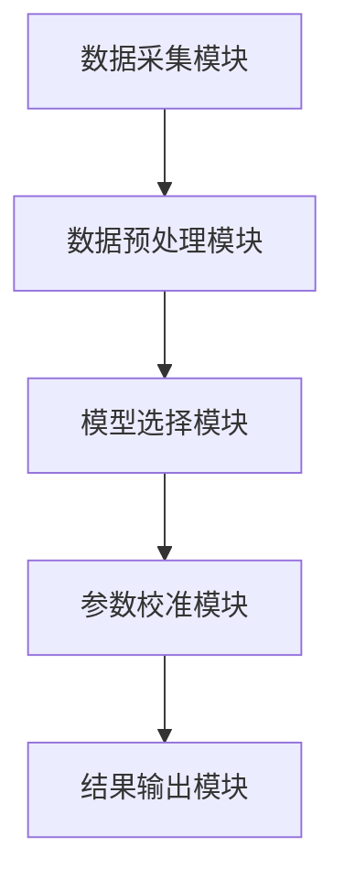

                 


# AI在金融衍生品定价模型动态选择与校准中的创新应用

---

## 关键词：  
AI, 金融衍生品, 定价模型, 动态选择, 参数校准, 机器学习, 深度学习  

---

## 摘要：  
本文探讨了人工智能（AI）技术在金融衍生品定价模型中的创新应用，特别是动态选择与参数校准方面的突破性进展。通过结合机器学习和深度学习技术，AI能够实时优化定价模型的选择与参数调整，显著提升了金融衍生品定价的准确性和效率。文章从背景、原理、算法实现到实际应用，系统性地分析了AI在金融衍生品定价中的作用，并通过具体案例展示了其在实践中的巨大潜力。

---

## 第1章: 金融衍生品与AI技术基础  

### 1.1 金融衍生品概述  
#### 1.1.1 衍生品的定义与分类  
金融衍生品是一种以其他金融资产为标的物的金融合约，其价值依赖于基础资产的价格波动。常见的衍生品包括期货、期权、掉期和互换等。  

#### 1.1.2 金融衍生品的市场结构  
衍生品市场是一个复杂的系统，涉及交易商、做市商、投资者和监管机构等多个角色。其价格受市场流动性、波动性、利率和信用风险等多种因素影响。  

#### 1.1.3 金融衍生品在金融体系中的作用  
衍生品不仅是风险管理工具，也是投机和套利的重要手段。它们能够帮助机构和个人对冲风险，同时为市场提供流动性和价格发现机制。  

### 1.2 AI技术的基本概念  
#### 1.2.1 人工智能的定义与分类  
人工智能（AI）是指模拟人类智能的计算机系统，主要分为弱人工智能（专注于特定任务）和强人工智能（具备广泛认知能力）。  

#### 1.2.2 机器学习与深度学习的区别  
机器学习是一种基于数据的模式识别技术，而深度学习是机器学习的一种特殊形式，通过多层神经网络进行特征学习。  

#### 1.2.3 AI在金融领域的应用现状  
AI在金融领域的应用包括交易策略优化、风险评估、客户画像构建和欺诈检测等。  

---

## 第2章: 金融衍生品定价模型基础  

### 2.1 衍生品定价的基本原理  
#### 2.1.1 Black-Scholes模型  
Black-Scholes模型是期权定价的经典公式，假设资产价格服从几何布朗运动，可以通过公式计算期权的理论价格。  

#### 2.1.2 Greeks参数与风险度量  
Greeks参数（如Delta、Gamma、Vega等）用于衡量期权价格对各种风险因素的敏感性，是衍生品定价中的重要指标。  

#### 2.1.3 模型假设与限制  
传统的定价模型依赖于严格的假设（如资产价格服从对数正态分布），而现实市场中存在跳跃、 fat-tail 等特征，导致模型的局限性。  

### 2.2 传统定价模型的局限性  
#### 2.2.1 参数估计的挑战  
传统模型需要手动指定参数，可能导致估计误差较大。  

#### 2.2.2 模型假设的局限性  
传统模型对市场假设过于简化，难以捕捉复杂的市场动态。  

#### 2.2.3 计算复杂性与实时性问题  
复杂的定价模型计算耗时较长，难以满足高频交易的实时性要求。  

---

## 第3章: AI在金融衍生品定价中的创新应用  

### 3.1 AI驱动的动态模型选择  
#### 3.1.1 基于机器学习的模型选择方法  
通过训练机器学习模型，AI可以根据市场环境动态选择最优的定价模型。  

#### 3.1.2 神经网络在定价模型中的应用  
深度学习模型可以捕捉复杂的市场特征，用于生成更准确的定价模型。  

#### 3.1.3 集成学习与模型优化  
通过集成多个模型的结果，AI可以实现模型的优势互补，提升定价的准确性。  

### 3.2 AI在参数校准中的创新  
#### 3.2.1 基于深度学习的参数估计  
深度学习模型可以通过历史数据自动学习参数，减少人工干预。  

#### 3.2.2 近似推理与贝叶斯网络  
贝叶斯网络可以结合先验知识和数据，实现参数的动态校准。  

#### 3.2.3 自适应校准方法  
AI可以通过实时数据调整参数，使定价模型更具适应性。  

---

## 第4章: 动态模型选择的AI实现  

### 4.1 动态模型选择的背景与挑战  
#### 4.1.1 市场环境变化对模型选择的影响  
市场波动性和参与者行为的变化需要模型选择具备动态调整能力。  

#### 4.1.2 动态选择的算法复杂性  
动态选择需要在短时间内处理大量数据，对算法的效率和准确性提出更高要求。  

#### 4.1.3 数据驱动的动态选择策略  
基于实时数据的动态选择策略可以显著提升模型的适应性。  

### 4.2 基于机器学习的动态模型选择算法  
#### 4.2.1 基于强化学习的模型选择  
强化学习可以通过试错机制找到最优模型选择策略。  

#### 4.2.2 基于元学习的动态模型选择  
元学习（Meta-Learning）可以在不同场景间共享知识，提升模型选择的效率。  

#### 4.2.3 基于时间序列分析的动态选择  
通过分析时间序列数据，AI可以预测市场变化并调整模型选择。  

---

## 第5章: AI驱动的参数校准方法  

### 5.1 参数校准的基本原理  
#### 5.1.1 参数估计的数学模型  
参数校准需要通过数学优化方法找到最优参数组合。  

#### 5.1.2 基于梯度的优化方法  
梯度下降等优化算法可以用于参数校准问题。  

#### 5.1.3 贝叶斯校准方法  
贝叶斯方法可以结合先验知识和数据，实现参数的后验估计。  

### 5.2 基于深度学习的参数校准  
#### 5.2.1 神经网络在参数估计中的应用  
深度学习模型可以自动学习参数之间的关系。  

#### 5.2.2 基于生成对抗网络的校准方法  
生成对抗网络（GAN）可以通过对抗训练实现参数的优化。  

#### 5.2.3 自监督学习在参数校准中的应用  
自监督学习可以利用未标记数据进行参数优化。  

---

## 第6章: 综合定价模型的动态选择与校准  

### 6.1 综合模型的设计与实现  
#### 6.1.1 模型选择与校准的协同优化  
模型选择和参数校准需要协同优化，以实现整体性能的提升。  

#### 6.1.2 多目标优化在动态选择中的应用  
多目标优化可以同时优化多个目标函数，提升模型的适应性。  

#### 6.1.3 基于反馈机制的自适应调整  
通过实时反馈调整模型选择和参数校准，可以实现动态优化。  

### 6.2 实际案例分析  
#### 6.2.1 某类衍生品的动态定价模型设计  
以某类衍生品为例，展示AI在动态定价模型设计中的应用。  

#### 6.2.2 基于AI的参数校准案例  
通过具体案例展示AI在参数校准中的实际效果。  

#### 6.2.3 模型性能评估与优化  
通过性能指标评估模型的优劣，并提出改进建议。  

---

## 第7章: 系统架构与实现  

### 7.1 系统架构设计  
#### 7.1.1 系统功能模块划分  
系统包括数据采集、模型选择、参数校准和结果输出等模块。  

#### 7.1.2 系统架构图  


#### 7.1.3 系统接口设计  
系统需要与数据源、交易系统和用户界面进行交互。  

### 7.2 系统实现细节  
#### 7.2.1 数据采集与预处理  
数据采集模块负责获取市场数据，预处理模块对数据进行清洗和特征提取。  

#### 7.2.2 模型选择与校准的算法实现  
基于机器学习的模型选择算法和深度学习的参数校准算法实现。  

#### 7.2.3 系统性能优化  
通过并行计算和分布式架构优化系统性能。  

---

## 第8章: 项目实战  

### 8.1 项目背景  
以某类金融衍生品为例，展示AI在定价模型中的应用。  

### 8.2 核心代码实现  
#### 8.2.1 数据预处理代码  
```python
import pandas as pd

# 读取数据
data = pd.read_csv('market_data.csv')

# 数据清洗
data.dropna(inplace=True)
data['date'] = pd.to_datetime(data['date'])
```

#### 8.2.2 模型选择代码  
```python
from sklearn.ensemble import RandomForestRegressor
from sklearn.model_selection import GridSearchCV

# 参数设置
param_grid = {'n_estimators': [100, 200], 'max_depth': [None, 10, 20]}

# 网格搜索优化
grid_search = GridSearchCV(RandomForestRegressor(), param_grid, cv=5)
grid_search.fit(X_train, y_train)
best_model = grid_search.best_estimator_
```

#### 8.2.3 参数校准代码  
```python
import tensorflow as tf
from tensorflow.keras import layers

# 深度学习模型构建
model = tf.keras.Sequential([
    layers.Dense(64, activation='relu'),
    layers.Dense(1, activation='linear')
])

# 编译模型
model.compile(optimizer='adam', loss='mean_squared_error')
model.fit(X_train, y_train, epochs=100, batch_size=32)
```

### 8.3 案例分析与结果解读  
通过具体案例分析，展示AI在定价模型中的实际效果，并解读结果。  

---

## 第9章: 总结与展望  

### 9.1 总结  
AI技术在金融衍生品定价中的应用显著提升了模型的准确性和效率，特别是在动态选择与参数校准方面展现了巨大潜力。  

### 9.2 未来展望  
未来，AI技术将进一步深度融合金融衍生品定价，实现更智能化和个性化的定价服务。  

### 9.3 注意事项  
在实际应用中，需要注意数据质量和模型解释性，避免黑箱模型带来的风险。  

### 9.4 最佳实践 Tips  
- 数据预处理是关键，需确保数据的准确性和完整性。  
- 模型选择和校准需结合业务需求，避免过度优化。  
- 定期监控模型性能，及时调整和优化。  

---

## 参考文献  
（此处列出相关文献和资料）  

---

通过本文的系统分析，读者可以全面了解AI在金融衍生品定价模型动态选择与校准中的创新应用，掌握其核心原理和实现方法，并能够将其应用于实际场景中。

