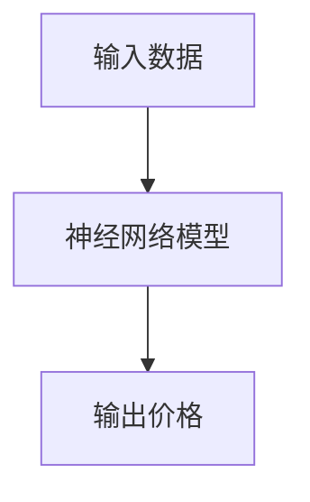
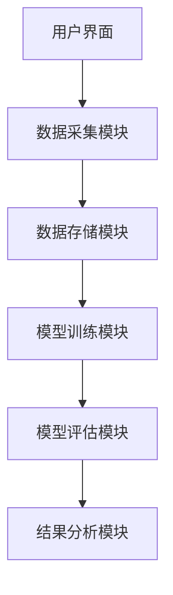
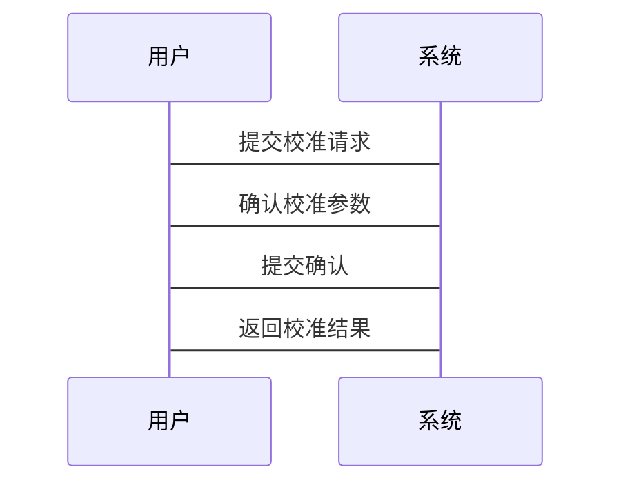

                 


# AI在金融衍生品定价模型校准中的创新应用

> 关键词：AI技术，金融衍生品，定价模型，模型校准，机器学习

> 摘要：本文详细探讨了人工智能技术在金融衍生品定价模型校准中的创新应用。通过分析传统定价模型的局限性，结合机器学习、生成对抗网络（GAN）和蒙特卡洛模拟等AI技术，提出了一种基于AI的金融衍生品定价模型校准方法。本文从理论基础、算法原理、系统设计和项目实战四个方面展开，详细阐述了AI技术如何提升金融衍生品定价模型的校准精度和效率。

---

# 第一部分: 金融衍生品定价模型与AI技术基础

## 第1章: 金融衍生品定价模型概述

### 1.1 金融衍生品的基本概念
金融衍生品是一种金融合约，其价值依赖于基础资产（如股票、债券、商品等）的价格变动。常见的金融衍生品包括期权、期货、掉期和互换等。金融衍生品的定价是金融风险管理的核心问题之一，其准确性和及时性对金融机构的稳健运行至关重要。

#### 1.1.1 金融衍生品的定义
金融衍生品是通过约定在未来某一特定时间和价格买卖资产的合约。其价值取决于基础资产的价格波动，具有高杠杆性和高风险性的特点。

#### 1.1.2 金融衍生品的主要类型
- **期权**：买方有权在特定时间内以固定价格购买或出售标的资产。
- **期货**：买方和卖方约定在未来特定时间以特定价格买卖标的资产。
- **掉期**：双方约定在未来特定时间交换资产或现金流。
- **互换**：双方约定在未来特定时间以特定方式交换资产或现金流。

#### 1.1.3 金融衍生品的市场特点
- **高波动性**：价格受市场情绪、宏观经济因素和突发事件影响较大。
- **高杠杆性**：可以通过少量资金控制大量标的资产。
- **高风险性**：价格波动可能导致巨大收益或损失。

### 1.2 定价模型的基本原理
金融衍生品的定价模型是通过数学公式和统计方法对标的资产的价格波动进行建模，从而计算衍生品的理论价格。以下是几种经典的定价模型：

#### 1.2.1 随机过程与金融模型
金融市场的价格波动可以用随机过程来描述，其中最著名的是**几何布朗运动**（Geometric Brownian Motion，GBM）。

**几何布朗运动的数学公式**：
$$
dS_t = \mu S_t dt + \sigma S_t dW_t
$$
其中，$S_t$是标的资产的价格，$\mu$是期望收益率，$\sigma$是波动率，$dW_t$是标准布朗运动。

#### 1.2.2 金融衍生品定价的核心问题
定价模型的核心问题是通过已知的标的资产价格和市场参数（如无风险利率、波动率、到期时间等），计算衍生品的理论价格，并对其进行校准，以确保模型能够准确反映市场价格。

### 1.3 AI技术在金融中的应用现状
人工智能（AI）技术在金融领域的应用已经取得了显著进展，尤其是在金融衍生品的定价和风险管理方面。

#### 1.3.1 AI技术的基本概念
人工智能是指计算机系统通过模拟人类智能完成特定任务的技术，包括机器学习、自然语言处理、计算机视觉和强化学习等。

#### 1.3.2 AI在金融衍生品定价中的应用
- **机器学习**：用于预测标的资产价格波动和优化定价模型参数。
- **生成对抗网络（GAN）**：用于生成模拟市场数据和评估模型的鲁棒性。
- **蒙特卡洛模拟**：结合AI技术生成大量模拟场景，用于风险评估和定价。

---

## 第2章: AI技术与金融衍生品定价模型的结合

### 2.1 机器学习在金融衍生品定价中的应用
机器学习是一种人工智能技术，通过训练数据模型来预测目标变量。在金融衍生品定价中，机器学习可以用于以下几个方面：

#### 2.1.1 机器学习在金融衍生品定价中的应用场景
- **价格预测**：通过历史价格数据训练模型，预测未来标的资产价格。
- **风险评估**：通过分析市场数据，评估衍生品的风险敞口。
- **模型校准**：通过优化算法调整定价模型参数，使其更好地拟合市场价格。

#### 2.1.2 基于神经网络的金融衍生品定价模型
神经网络是一种常用的机器学习模型，可以用来近似定价函数。以下是基于神经网络的金融衍生品定价模型的流程：

**流程图：基于神经网络的金融衍生品定价模型**


#### 2.1.3 基于支持向量机的金融衍生品定价模型
支持向量机（SVM）是一种监督学习算法，常用于分类和回归问题。在金融衍生品定价中，SVM可以用来预测标的资产的价格波动。

### 2.2 生成对抗网络（GAN）在金融衍生品定价中的应用
生成对抗网络是一种深度学习技术，由生成器和判别器组成。在金融衍生品定价中，GAN可以用于生成模拟市场数据和评估模型的鲁棒性。

#### 2.2.1 GAN的基本原理
生成对抗网络的核心思想是通过对抗训练生成逼真的数据。生成器的目标是生成与真实数据无法区分的样本，而判别器的目标是区分真实数据和生成数据。

#### 2.2.2 GAN在金融衍生品定价中的创新应用
- **市场数据生成**：GAN可以生成大量的模拟市场数据，用于测试定价模型的鲁棒性。
- **风险评估**：GAN可以用来评估标的资产价格的极端情况，帮助金融机构进行风险管理。

#### 2.2.3 GAN的优势与挑战
- **优势**：GAN可以生成逼真的数据，适用于复杂的金融市场环境。
- **挑战**：GAN的训练过程可能不稳定，容易出现模式坍塌等问题。

### 2.3 蒙特卡洛模拟与AI的结合
蒙特卡洛模拟是一种通过随机采样来估计复杂问题的方法。结合AI技术，蒙特卡洛模拟可以用于金融衍生品的风险评估和定价。

#### 2.3.1 蒙特卡洛模拟的基本原理
蒙特卡洛模拟通过生成大量的随机场景，计算衍生品的期望值和方差，从而估计其理论价格。

#### 2.3.2 蒙特卡洛模拟与AI的结合
- **AI驱动的蒙特卡洛模拟**：通过机器学习技术优化蒙特卡洛模拟的参数选择和场景生成。
- **蒙特卡洛模拟的AI加速**：利用并行计算和分布式计算加速蒙特卡洛模拟的过程。

---

## 第3章: AI驱动的金融衍生品定价模型校准方法

### 3.1 基于机器学习的模型校准方法
模型校准是指通过已知的市场价格调整定价模型的参数，使其能够准确反映市场实际情况。

#### 3.1.1 基于神经网络的模型校准方法
神经网络可以用来近似定价函数，通过训练数据调整网络参数，使其能够准确预测市场价格。

#### 3.1.2 基于支持向量机的模型校准方法
支持向量机可以用来优化定价模型的参数，通过最小化预测误差来提高模型的拟合度。

### 3.2 基于生成对抗网络的模型校准方法
生成对抗网络可以用来生成模拟市场数据，通过对抗训练优化定价模型的参数。

#### 3.2.1 基于GAN的模型校准流程
1. **数据生成**：生成器生成模拟市场数据。
2. **模型训练**：判别器对生成数据和真实数据进行分类。
3. **模型调整**：根据判别器的反馈调整生成器的参数。

### 3.3 基于蒙特卡洛模拟的模型校准方法
蒙特卡洛模拟可以用来生成大量的随机场景，通过统计分析调整定价模型的参数。

#### 3.3.1 蒙特卡洛模拟的校准流程
1. **参数选择**：选择适当的模拟参数。
2. **场景生成**：生成大量的随机场景。
3. **统计分析**：计算衍生品的期望值和方差。
4. **参数调整**：根据统计结果调整模型参数。

---

## 第4章: 系统分析与架构设计方案

### 4.1 问题场景介绍
金融衍生品定价模型的校准需要处理大量的市场数据，涉及复杂的数学计算和算法优化。

#### 4.1.1 系统功能设计
- **数据采集**：采集标的资产的价格数据和市场参数。
- **模型训练**：训练机器学习模型，优化定价模型的参数。
- **模型评估**：评估模型的准确性和鲁棒性。
- **用户界面**：提供友好的用户界面，方便用户进行模型校准和结果分析。

#### 4.1.2 系统架构设计


### 4.2 系统交互设计
系统交互设计通过序列图展示用户与系统之间的交互流程。

#### 4.2.1 系统交互流程


---

## 第5章: 项目实战

### 5.1 环境搭建
- **编程语言**：Python
- **框架库**：TensorFlow、Keras、PyTorch
- **数据集**：金融衍生品市场数据（如股票价格、期权价格等）

### 5.2 系统核心实现源代码
以下是一个基于神经网络的金融衍生品定价模型校准的示例代码：

#### 5.2.1 数据预处理
```python
import pandas as pd
import numpy as np

# 读取数据
data = pd.read_csv('market_data.csv')
# 数据标准化
from sklearn.preprocessing import StandardScaler
scaler = StandardScaler()
data_scaled = scaler.fit_transform(data)
```

#### 5.2.2 模型训练
```python
from tensorflow.keras.models import Sequential
from tensorflow.keras.layers import Dense

# 构建神经网络模型
model = Sequential()
model.add(Dense(64, activation='relu', input_dim=data.shape[1]))
model.add(Dense(1, activation='linear'))
model.compile(optimizer='adam', loss='mean_squared_error')

# 训练模型
model.fit(data_scaled, target_prices, epochs=100, batch_size=32)
```

#### 5.2.3 模型评估
```python
from sklearn.metrics import mean_squared_error

# 预测价格
predicted_prices = model.predict(data_scaled)
# 计算均方误差
mse = mean_squared_error(target_prices, predicted_prices)
print(f'均方误差：{mse}')
```

### 5.3 实际案例分析
通过实际案例分析，验证AI驱动的金融衍生品定价模型校准方法的有效性。例如，可以使用历史期权价格数据训练模型，然后用新的标的资产价格测试模型的预测能力。

---

## 第6章: 总结与展望

### 6.1 总结
本文详细探讨了人工智能技术在金融衍生品定价模型校准中的创新应用，提出了基于机器学习、生成对抗网络和蒙特卡洛模拟的定价模型校准方法。通过理论分析和实际案例，验证了AI技术在提升金融衍生品定价模型准确性和效率方面的优势。

### 6.2 展望
未来，随着AI技术的不断发展，金融衍生品定价模型的校准方法将更加智能化和自动化。同时，结合区块链技术和分布式计算，AI驱动的金融衍生品定价模型将具有更广阔的应用前景。

---

**结语**：AI技术正在深刻改变金融衍生品定价模型的校准方式，通过本文的探讨，我们相信AI技术将在金融衍生品定价领域发挥越来越重要的作用。

