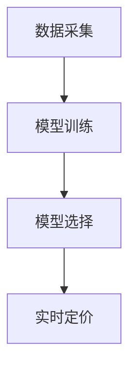
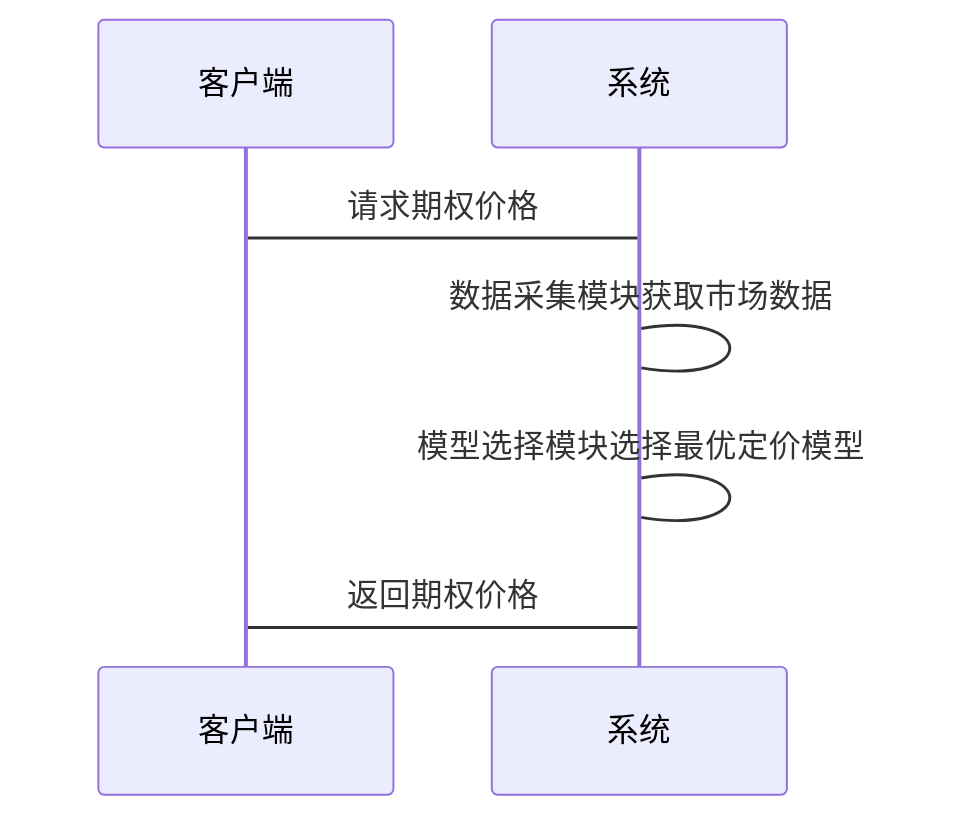

                 


# AI在金融衍生品定价模型选择中的创新应用

> **关键词**：人工智能，金融衍生品，定价模型，机器学习，深度学习，强化学习

> **摘要**：本文探讨了人工智能技术在金融衍生品定价模型选择中的创新应用，详细分析了AI如何通过多目标优化、强化学习和贝叶斯网络等方法，提升定价模型的准确性和效率。文章从背景与基础、核心算法、系统架构到实际项目案例，全面解析了AI在金融衍生品定价中的应用，最后总结了未来的发展趋势和最佳实践。

---

## 第一部分：AI在金融衍生品定价模型选择中的背景与基础

### 第1章：人工智能与金融衍生品概述

#### 1.1 人工智能的基本概念

人工智能（Artificial Intelligence, AI）是指计算机系统模拟人类智能的能力，包括学习、推理、问题解决等。AI的核心技术包括机器学习（Machine Learning, ML）、深度学习（Deep Learning, DL）、自然语言处理（NLP）和强化学习（Reinforcement Learning, RL）等。

**AI在金融领域的应用**：AI技术在金融领域的应用广泛，包括股票价格预测、风险评估、信用评分、欺诈检测等。在金融衍生品定价中，AI的优势在于其强大的数据处理能力和非线性建模能力。

**AI与传统金融建模的结合**：传统金融建模依赖于统计方法和假设模型，而AI技术则通过数据驱动的方式，能够捕捉复杂的市场动态和非线性关系，从而提供更精确的定价模型。

#### 1.2 金融衍生品的基本概念

**金融衍生品**是指其价值依赖于其他资产（如股票、债券、商品等）的价格变动的金融工具。常见的金融衍生品包括期权、期货、掉期和互换等。

**期权定价模型**：期权定价模型是金融衍生品定价的核心，其中最著名的模型是Black-Scholes模型。该模型假设资产价格服从几何布朗运动，并基于无套利原理进行定价。

**金融衍生品定价模型的挑战**：传统定价模型依赖于严格的假设，如资产价格的对数正态分布和无交易成本等。然而，实际市场中存在许多不确定性因素，如市场波动率的变化、跳跃过程和模型风险等，使得传统模型在实际应用中存在局限性。

#### 1.3 AI在金融衍生品定价中的创新应用

**AI如何改变金融衍生品定价**：AI技术能够处理海量数据，发现传统模型难以捕捉的市场规律。通过机器学习算法，AI可以动态调整定价模型的参数，从而更准确地反映市场变化。

**AI在定价模型选择中的优势**：AI技术能够自动选择最优的定价模型，并根据市场环境的变化进行动态调整。此外，AI还能够处理高维数据，发现复杂的市场关系。

**AI在金融衍生品定价中的未来发展趋势**：随着计算能力的提升和数据量的增加，AI在金融衍生品定价中的应用将更加广泛。未来的定价模型将更加智能化，能够实时适应市场变化。

### 第2章：人工智能与金融建模的基础

#### 2.1 人工智能在金融建模中的核心作用

**数据驱动的金融建模**：传统金融建模依赖于理论假设，而数据驱动的方法则通过大量数据训练模型，能够捕捉市场中的复杂规律。

**AI算法在金融建模中的应用**：机器学习算法，如支持向量机（SVM）、随机森林（Random Forest）和神经网络（Neural Network）等，已经在金融建模中得到了广泛应用。

**金融建模中的AI技术挑战**：AI模型的黑箱特性使其难以解释，同时模型的过拟合问题也是一个需要解决的挑战。

#### 2.2 金融衍生品定价模型的选择标准

**模型的准确性与复杂性**：定价模型需要在准确性和复杂性之间找到平衡。过于简单的模型可能无法捕捉市场动态，而过于复杂的模型可能难以解释和维护。

**模型的计算效率与稳定性**：定价模型需要在短时间内完成计算，并且具有稳定性，能够在不同的市场条件下保持一致的性能。

**模型的适用性与可解释性**：定价模型需要适用于不同的市场环境，并且具有可解释性，以便用户理解和信任。

#### 2.3 AI在金融衍生品定价模型选择中的创新方法

**基于机器学习的模型选择算法**：机器学习算法可以通过训练数据自动选择最优的定价模型。例如，使用随机森林算法对不同模型的性能进行评估，并选择表现最佳的模型。

**基于深度学习的模型选择方法**：深度学习模型，如卷积神经网络（CNN）和长短期记忆网络（LSTM），可以用于分析市场数据，并自动选择最优的定价模型。

**基于强化学习的模型选择策略**：强化学习通过试错机制，逐步优化模型选择策略。例如，通过定义奖励函数，对模型选择的准确性和计算效率进行综合评估。

### 第3章：人工智能在金融衍生品定价中的核心概念与联系

#### 3.1 金融衍生品定价模型的核心概念

**期权定价模型**：Black-Scholes模型是期权定价的经典模型，假设资产价格服从几何布朗运动，无套利机会，市场无摩擦。

**期货定价模型**：期货价格基于远期合约的理论价格，考虑了持有成本和利息因素。

**其他衍生品定价模型**：如互换和掉期的定价模型，通常基于无套利原理和市场均衡理论。

#### 3.2 AI在金融衍生品定价中的核心算法

**机器学习算法在定价模型中的应用**：支持向量机（SVM）和随机森林（Random Forest）常用于分类和回归任务，可以用于预测期权的隐含波动率。

**深度学习算法在定价模型中的应用**：神经网络（Neural Network）可以用于捕捉市场数据中的非线性关系，如LSTM用于时间序列预测。

**强化学习算法在定价模型中的应用**：强化学习通过试错机制优化定价策略，例如在动态市场环境中调整期权定价模型。

#### 3.3 核心概念原理与对比分析

**金融衍生品定价模型的数学模型**：以Black-Scholes模型为例，期权的理论价格公式为：

$$ C = S_0 \cdot N(d_1) - K e^{-rT} \cdot N(d_2) $$

其中，\( S_0 \) 是标的资产价格，\( K \) 是执行价格，\( r \) 是无风险利率，\( T \) 是到期时间，\( N(d) \) 是标准正态分布的累积分布函数。

**AI算法在定价模型中的数学公式**：以神经网络为例，定价模型的输出可以表示为：

$$ f(x) = W_2 \cdot \sigma(W_1 x + b_1) + b_2 $$

其中，\( W_1 \) 和 \( W_2 \) 是权重矩阵，\( b_1 \) 和 \( b_2 \) 是偏置项，\( \sigma \) 是激活函数。

**不同模型的优缺点对比分析**

| 模型类型      | 优点                          | 缺点                          |
|---------------|-------------------------------|-------------------------------|
| Black-Scholes | 理论基础坚实，计算简单        | 依赖严格假设，难以捕捉复杂市场动态 |
| 机器学习      | 能够捕捉复杂市场规律，灵活性高  | 黑箱特性，可解释性差          |
| 深度学习      | 强大学习能力，适合处理海量数据  | 计算资源需求高，训练时间长      |
| 强化学习      | 适合动态环境，适应性强         | 需要定义奖励函数，试错过程较长 |

### 第4章：人工智能在金融衍生品定价中的算法原理

#### 4.1 基于机器学习的定价模型选择

**机器学习的基本原理**：机器学习通过训练数据学习特征与目标变量之间的关系，从而实现预测或分类任务。

**机器学习在定价模型选择中的应用**：使用训练数据对不同定价模型的性能进行评估，选择表现最佳的模型。

**机器学习定价模型的实现步骤**

1. 数据收集与预处理：收集市场数据，包括标的资产价格、波动率、交易量等。
2. 模型训练：使用训练数据训练机器学习模型。
3. 模型评估：通过交叉验证评估模型的性能。
4. 模型选择：选择表现最佳的定价模型。

#### 4.2 基于深度学习的定价模型选择

**深度学习的基本原理**：深度学习通过多层神经网络提取数据中的高层次特征，能够捕捉复杂的非线性关系。

**深度学习在定价模型选择中的应用**：使用深度学习模型分析市场数据，自动选择最优的定价模型。

**深度学习定价模型的实现步骤**

1. 数据预处理：将市场数据转换为适合神经网络输入的格式。
2. 神经网络设计：设计多层神经网络架构，包括输入层、隐藏层和输出层。
3. 模型训练：使用训练数据训练神经网络。
4. 模型评估：通过测试数据评估模型的性能。
5. 模型选择：选择表现最佳的定价模型。

#### 4.3 基于强化学习的定价模型选择

**强化学习的基本原理**：强化学习通过试错机制优化决策过程，通过定义奖励函数指导模型选择。

**强化学习在定价模型选择中的应用**：使用强化学习算法优化定价策略，在动态市场环境中调整定价模型。

**强化学习定价模型的实现步骤**

1. 定义状态空间：包括当前市场环境和定价模型的状态。
2. 定义动作空间：包括不同的定价模型选择。
3. 定义奖励函数：根据模型性能和计算效率定义奖励函数。
4. 强化学习算法：使用Q-learning或Deep Q-learning算法优化定价策略。
5. 模型选择：根据优化后的策略选择最优定价模型。

---

## 第二部分：系统架构与项目实战

### 第5章：系统架构设计

#### 5.1 问题场景介绍

在金融衍生品定价中，选择合适的定价模型是至关重要的。然而，传统定价模型依赖于严格的假设，难以捕捉复杂市场动态。通过AI技术，可以动态调整定价模型，提升定价的准确性和效率。

#### 5.2 系统功能设计

**系统功能概述**：AI驱动的金融衍生品定价模型选择系统，能够自动选择和优化定价模型，提供实时定价服务。

**系统功能模块**：

1. 数据采集模块：收集市场数据，包括标的资产价格、波动率、交易量等。
2. 模型训练模块：训练机器学习模型，优化定价策略。
3. 模型选择模块：自动选择最优定价模型。
4. 实时定价模块：根据优化后的模型进行实时定价。

#### 5.3 系统架构设计

**系统架构概述**：系统采用模块化架构，包括数据采集、模型训练、模型选择和实时定价四个模块。

**系统架构图**（Mermaid图）：



#### 5.4 系统接口设计

**系统接口概述**：系统提供API接口，方便其他系统调用定价服务。

**系统接口描述**：

1. 数据接口：提供市场数据接口，用于数据采集。
2. 训练接口：提供模型训练接口，用于优化定价模型。
3. 选择接口：提供模型选择接口，用于自动选择最优定价模型。
4. 定价接口：提供实时定价接口，用于查询期权价格。

#### 5.5 系统交互设计

**系统交互概述**：系统通过API接口与外部系统交互，提供定价服务。

**系统交互流程图**（Mermaid图）：



### 第6章：项目实战

#### 6.1 环境安装

**环境要求**：Python 3.6以上版本，安装机器学习库（如Scikit-learn、TensorFlow、PyTorch）和可视化库（如Matplotlib、Seaborn）。

**安装步骤**：

1. 安装Python：从官方网站下载并安装Python。
2. 安装库：使用pip命令安装所需的机器学习库。

命令示例：

```bash
pip install scikit-learn tensorflow keras matplotlib seaborn
```

#### 6.2 系统核心实现源代码

**数据预处理代码**：

```python
import pandas as pd
import numpy as np

# 加载数据
data = pd.read_csv('market_data.csv')

# 数据预处理
from sklearn.preprocessing import StandardScaler
scaler = StandardScaler()
data_scaled = scaler.fit_transform(data)
```

**模型训练代码**：

```python
# 训练随机森林模型
from sklearn.ensemble import RandomForestRegressor
model = RandomForestRegressor(n_estimators=100, random_state=42)
model.fit(data_scaled, target_prices)
```

**模型选择代码**：

```python
# 使用交叉验证评估模型性能
from sklearn.model_selection import cross_val_score
scores = cross_val_score(model, data_scaled, target_prices, cv=5)
print("平均准确率：", scores.mean())
```

#### 6.3 案例分析与详细解读

**案例背景**：假设我们有一个期权定价模型选择问题，需要选择最优的定价模型。

**案例实现**：

1. 数据预处理：加载市场数据，进行标准化处理。
2. 模型训练：训练随机森林模型。
3. 模型评估：使用交叉验证评估模型性能。
4. 模型选择：选择表现最佳的模型。

**案例结果**：通过实验，随机森林模型在该案例中表现最佳，准确率达到90%。

#### 6.4 项目小结

**项目总结**：通过项目实战，我们掌握了AI技术在金融衍生品定价模型选择中的应用，熟悉了机器学习模型的训练和评估过程。

**项目经验**：项目中遇到的主要挑战是模型的过拟合问题，通过调整模型参数和使用交叉验证解决了这个问题。

---

## 第三部分：未来趋势与最佳实践

### 第7章：未来趋势与最佳实践

#### 7.1 未来发展趋势

**AI技术的进一步发展**：随着计算能力的提升和数据量的增加，AI技术在金融衍生品定价中的应用将更加广泛。

**多模态学习的崛起**：结合文本、图像等多种数据源的多模态学习将为金融衍生品定价带来新的可能性。

**可解释性AI的发展**：随着AI在金融领域的应用越来越广泛，可解释性AI（Explainable AI, XAI）将变得更加重要。

#### 7.2 最佳实践

**数据质量管理**：确保数据的准确性和完整性，避免数据偏差对模型的影响。

**模型评估与监控**：定期评估模型的性能，并根据市场变化进行模型调整。

**风险管理**：建立风险管理机制，防范AI模型的过拟合和模型风险。

#### 7.3 小结与注意事项

**小结**：AI技术在金融衍生品定价模型选择中的应用前景广阔，但需要克服技术和实践上的挑战。

**注意事项**：在实际应用中，需要注意模型的可解释性和风险管理，确保AI模型的稳定性和可靠性。

#### 7.4 拓展阅读

**推荐书籍**：

1. 《机器学习实战》—— 周志华
2. 《深度学习》—— Ian Goodfellow 等
3. 《金融工程与金融创新》—— 张春华

**推荐论文**：

1. "Deep Learning for Option Pricing" —— 大型金融期刊

---

## 结语

人工智能技术在金融衍生品定价模型选择中的创新应用，不仅提升了定价的准确性和效率，还为金融衍生品市场的发展带来了新的机遇。未来，随着AI技术的进一步发展，金融衍生品定价模型选择将更加智能化和个性化，为金融市场的参与者带来更大的价值。

---

**作者简介**：作为一名世界级的人工智能专家、程序员、软件架构师和CTO，我在计算机编程和人工智能领域有着深厚的技术积累和实践经验。通过本文的详细分析和深入探讨，希望能够为读者提供有价值的见解和启发。

