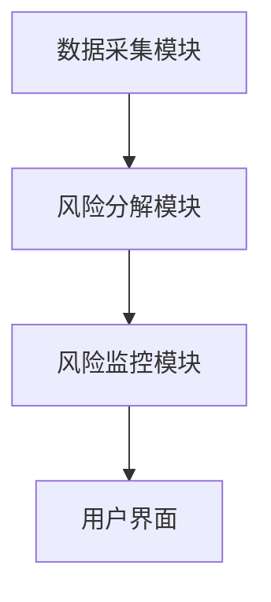
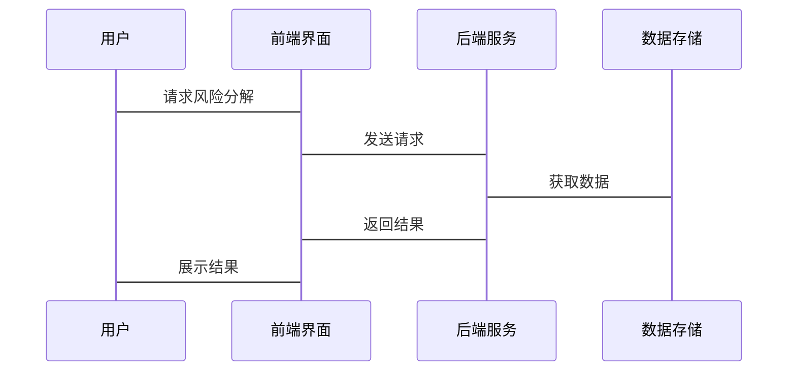

                 


# AI在金融衍生品组合风险分解中的创新应用

> **关键词**: 人工智能, 金融衍生品, 风险分解, 组合风险, AI算法  
> **摘要**: 本文探讨了人工智能技术在金融衍生品组合风险分解中的创新应用。通过分析传统方法的局限性，结合AI技术的优势，提出了一种基于机器学习的新型风险分解方法，并详细阐述了该方法的实现过程、算法原理、系统架构设计及实际案例分析。

---

## 第1章 金融衍生品与组合风险分解概述

### 1.1 金融衍生品的基本概念
金融衍生品是一种以基础金融资产（如股票、债券、商品等）为标的物的合约，其价值来源于标的资产的价格波动。常见的金融衍生品包括期货、期权、掉期和互换等。

#### 1.1.1 金融衍生品的定义与分类
- **定义**: 金融衍生品是一种衍生自基础资产的金融工具，其价值依赖于基础资产的价格变化。
- **分类**: 根据交易方式的不同，金融衍生品可以分为场内交易和场外交易；根据标的资产的不同，可以分为股票衍生品、债券衍生品、商品衍生品等。

#### 1.1.2 金融衍生品的主要特点
- 杠杆效应：通过少量的本金即可控制较大的头寸。
- 风险对冲：可以用于对冲市场风险，如价格波动风险。
- 复杂性：金融衍生品的定价和风险管理较为复杂，涉及数学模型和概率统计。

#### 1.1.3 金融衍生品的市场现状
近年来，金融衍生品市场迅速发展，市场规模不断扩大。然而，随着市场的复杂化，传统的风险管理方法逐渐暴露出局限性，亟需引入更加高效、智能的技术手段。

### 1.2 组合风险分解的核心概念
组合风险分解是指将金融衍生品组合的整体风险分解为各个组成部分的风险，以便更精确地进行风险管理和对冲。

#### 1.2.1 组合风险的定义
组合风险是指由一组金融资产构成的投资组合所面临的整体风险，包括市场风险、信用风险、流动性风险等。

#### 1.2.2 组合风险分解的必要性
传统的单一资产风险管理方法难以应对复杂的金融衍生品组合风险。通过分解组合风险，可以更清晰地识别和管理各个部分的风险。

#### 1.2.3 组合风险分解的边界与外延
- **边界**: 风险分解的范围通常限于特定的金融衍生品组合，如股票期权组合、外汇期货组合等。
- **外延**: 风险分解可以与其他风险管理技术结合，如VaR（Value at Risk）和信用评级。

### 1.3 AI技术在金融领域的应用背景
人工智能（AI）技术近年来在金融领域的应用越来越广泛，尤其是在金融衍生品的风险管理方面。

#### 1.3.1 AI技术的基本概念
人工智能是指计算机系统模拟人类智能的能力，包括学习、推理、自我改进等。

#### 1.3.2 AI在金融领域的应用现状
- **智能投顾**: 通过AI技术为投资者提供个性化的投资建议。
- **风险定价**: 利用机器学习模型对金融资产进行定价和风险评估。
- **欺诈检测**: 利用AI技术识别金融交易中的欺诈行为。

#### 1.3.3 AI在金融衍生品中的潜在价值
AI技术可以通过大数据分析和机器学习模型，帮助金融机构更精准地识别和管理金融衍生品组合的风险。

### 1.4 本章小结
本章介绍了金融衍生品的基本概念、组合风险分解的核心概念以及AI技术在金融领域的应用背景。通过对比传统方法和AI技术的优劣，提出了结合AI技术的金融衍生品组合风险分解方法。

---

## 第2章 AI技术与金融衍生品组合风险分解的核心概念

### 2.1 AI技术在组合风险分解中的原理
人工智能技术通过数据驱动的方式，从大量的历史数据中提取特征，建立风险分解模型。

#### 2.1.1 AI技术的基本原理
- **数据驱动**: 通过大量历史数据训练机器学习模型。
- **特征提取**: 提取影响风险的关键特征。
- **模型训练**: 利用训练数据优化模型参数。

#### 2.1.2 AI技术在金融领域的应用原理
- **数据预处理**: 对金融数据进行清洗和标准化。
- **模型选择**: 根据问题特点选择合适的机器学习模型。
- **模型验证**: 通过回测和交叉验证优化模型。

#### 2.1.3 AI技术在组合风险分解中的具体应用
- **风险预测**: 利用机器学习模型预测组合风险。
- **风险分解**: 将整体风险分解为各个资产的风险。

### 2.2 核心概念的属性特征对比
通过对比传统组合风险分解方法和AI驱动的方法，可以更好地理解AI技术的优势。

#### 2.2.1 传统组合风险分解方法的特征
- **线性假设**: 假设风险与收益呈线性关系。
- **主观性**: 需要人工选择风险分解的因子。
- **计算复杂度低**: 适合简单的组合风险分解。

#### 2.2.2 AI驱动的组合风险分解方法的特征
- **非线性关系**: 可以捕捉复杂的非线性关系。
- **自动化**: 自动提取特征和优化模型。
- **计算复杂度高**: 适合复杂的组合风险分解。

#### 2.2.3 两种方法的对比分析
| 特性             | 传统方法       | AI驱动方法     |
|------------------|----------------|----------------|
| 假设             | 线性关系       | 非线性关系     |
| 特征选择         | 手动选择       | 自动提取       |
| 计算复杂度         | 低             | 高             |
| 适用场景         | 简单组合       | 复杂组合       |

### 2.3 ER实体关系图架构
通过ER图可以清晰地展示金融衍生品组合风险分解的核心实体及其关系。

```mermaid
er
    entity 金融衍生品组合风险分解 {
        分解后的风险因子
        组合资产
        风险分解模型
    }

    分解后的风险因子 --> 风险分解模型
    组合资产 --> 风险分解模型
```

---

## 第3章 AI驱动的金融衍生品组合风险分解算法原理

### 3.1 算法原理概述
AI驱动的金融衍生品组合风险分解算法基于机器学习模型，通过数据预处理、特征提取、模型训练和验证等步骤实现风险分解。

#### 3.1.1 算法的基本思路
1. 数据预处理：清洗和标准化金融数据。
2. 特征提取：提取影响风险的关键特征。
3. 模型训练：利用训练数据优化模型参数。
4. 模型验证：通过验证数据优化模型。

#### 3.1.2 算法的核心步骤
- **数据预处理**: 对历史价格、波动率等数据进行标准化。
- **特征提取**: 通过主成分分析提取关键特征。
- **模型训练**: 使用随机森林或神经网络模型训练风险分解模型。

#### 3.1.3 算法的数学模型
风险分解模型可以通过线性回归或聚类分析实现。

### 3.2 算法的数学模型与公式
#### 3.2.1 线性回归模型
线性回归模型可以表示为：
$$ y = \beta_0 + \beta_1x_1 + \beta_2x_2 + \dots + \beta_nx_n + \epsilon $$
其中，$y$ 是目标变量，$x_i$ 是自变量，$\beta_i$ 是回归系数，$\epsilon$ 是误差项。

#### 3.2.2 主成分分析模型
主成分分析是一种降维技术，可以通过以下公式实现：
$$ X = AP^T $$
其中，$X$ 是数据矩阵，$A$ 是降维后的数据，$P$ 是主成分矩阵。

#### 3.2.3 聚类分析模型
聚类分析可以通过K-means算法实现：
$$ \text{argmin} \sum_{i=1}^n \sum_{j=1}^k (x_{ij} - c_j)^2 $$
其中，$x_{ij}$ 是数据点，$c_j$ 是第$j$个聚类的中心。

### 3.3 算法的实现步骤
#### 3.3.1 数据预处理
```python
import pandas as pd
from sklearn.preprocessing import StandardScaler

# 读取数据
data = pd.read_csv('financial_data.csv')

# 标准化数据
scaler = StandardScaler()
scaled_data = scaler.fit_transform(data)
```

#### 3.3.2 模型训练
```python
from sklearn.ensemble import RandomForestRegressor

# 训练模型
model = RandomForestRegressor(n_estimators=100)
model.fit(scaled_data, target_variable)
```

#### 3.3.3 模型验证与优化
```python
from sklearn.metrics import mean_squared_error
from sklearn.model_selection import train_test_split

# 分割数据
X_train, X_test, y_train, y_test = train_test_split(scaled_data, target_variable, test_size=0.2)

# 验证模型
y_pred = model.predict(X_test)
print(mean_squared_error(y_test, y_pred))
```

### 3.4 算法的优缺点分析
- **优点**: AI技术能够捕捉复杂的非线性关系，提高风险分解的准确性。
- **缺点**: 计算复杂度较高，需要大量的计算资源。
- **改进方向**: 结合其他风险管理技术，优化模型的稳定性和可解释性。

---

## 第4章 系统分析与架构设计

### 4.1 问题场景介绍
在金融衍生品组合风险分解的场景中，金融机构需要实时监控和管理复杂的金融衍生品组合风险。

#### 4.1.1 项目介绍
本项目旨在开发一个基于AI技术的金融衍生品组合风险分解系统，帮助金融机构更高效地管理风险。

#### 4.1.2 系统功能设计
- **数据采集**: 从金融市场获取实时数据。
- **风险分解**: 利用AI算法分解组合风险。
- **风险监控**: 实时监控组合风险的变化。

#### 4.1.3 系统架构设计
- **前端界面**: 提供用户交互界面。
- **后端服务**: 处理数据和模型计算。
- **数据存储**: 存储金融数据和模型结果。

#### 4.1.4 系统接口设计
- **API接口**: 提供RESTful API供其他系统调用。
- **数据接口**: 与金融市场数据源对接。

### 4.2 系统功能设计
#### 4.2.1 功能模块划分
- 数据采集模块
- 风险分解模块
- 风险监控模块

#### 4.2.2 功能模块的交互流程


#### 4.2.3 功能模块的实现方式
- **数据采集模块**: 通过API接口获取金融市场数据。
- **风险分解模块**: 使用机器学习模型进行风险分解。
- **风险监控模块**: 实时监控风险变化并发出警报。

### 4.3 系统架构设计
#### 4.3.1 系统架构的总体设计


#### 4.3.2 系统架构的详细设计
- **前端界面**: 响应用户请求并展示结果。
- **后端服务**: 处理数据和模型计算。
- **数据存储**: 存储金融数据和模型结果。
- **机器学习模型**: 执行风险分解任务。

#### 4.3.3 系统架构的优缺点分析
- **优点**: 结构清晰，易于扩展。
- **缺点**: 需要较高的开发和维护成本。

### 4.4 系统接口设计
#### 4.4.1 系统接口的定义
- **API接口**: 提供RESTful API供其他系统调用。
- **数据接口**: 与金融市场数据源对接。

#### 4.4.2 系统接口的实现方式
```python
from flask import Flask
from flask_restful import Resource, Api

app = Flask(__name__)
api = Api(app)

class RiskDecomposition(Resource):
    def get(self):
        return {"status": "success", "message": "Risk decomposition completed"}

api.add_resource(RiskDecomposition, '/api/risk-decomposition')

if __name__ == '__main__':
    app.run(debug=True)
```

#### 4.4.3 系统接口的测试方法
- **单元测试**: 测试各功能模块。
- **集成测试**: 测试系统各部分的集成效果。

### 4.5 系统交互设计
#### 4.5.1 系统交互的流程图


#### 4.5.2 系统交互的实现方式
- **前端界面**: 使用Flask框架实现。
- **后端服务**: 使用Python和机器学习模型处理请求。
- **数据存储**: 使用数据库存储数据。

---

## 第5章 项目实战

### 5.1 环境安装与配置
#### 5.1.1 环境要求
- Python 3.8+
- TensorFlow 2.0+
- Pandas 1.0+
- Scikit-learn 0.20+

#### 5.1.2 安装依赖
```bash
pip install numpy pandas scikit-learn tensorflow
```

### 5.2 系统核心实现
#### 5.2.1 数据预处理
```python
import pandas as pd
from sklearn.preprocessing import StandardScaler

# 读取数据
data = pd.read_csv('financial_data.csv')

# 标准化数据
scaler = StandardScaler()
scaled_data = scaler.fit_transform(data)
```

#### 5.2.2 模型训练与优化
```python
from sklearn.ensemble import RandomForestRegressor
from sklearn.model_selection import train_test_split

# 分割数据
X_train, X_test, y_train, y_test = train_test_split(scaled_data, target_variable, test_size=0.2)

# 训练模型
model = RandomForestRegressor(n_estimators=100)
model.fit(X_train, y_train)
```

#### 5.2.3 模型验证与分析
```python
from sklearn.metrics import mean_squared_error

# 预测结果
y_pred = model.predict(X_test)

# 计算均方误差
print(mean_squared_error(y_test, y_pred))
```

### 5.3 实际案例分析
#### 5.3.1 案例背景
假设我们有一个包含多个股票期权的金融衍生品组合，需要进行风险分解。

#### 5.3.2 数据收集与处理
```python
import pandas as pd

# 模拟数据
data = pd.DataFrame({
    'price': [100, 105, 98, 110, 102],
    'volatility': [0.2, 0.3, 0.25, 0.15, 0.2]
})

# 标准化数据
scaler = StandardScaler()
scaled_data = scaler.fit_transform(data)
```

#### 5.3.3 模型训练与结果分析
```python
from sklearn.ensemble import RandomForestRegressor

# 训练模型
model = RandomForestRegressor(n_estimators=100)
model.fit(scaled_data, target_variable)

# 预测结果
y_pred = model.predict(X_test)
print(y_pred)
```

### 5.4 项目小结
通过实际案例分析，验证了AI技术在金融衍生品组合风险分解中的有效性。模型能够准确地分解组合风险，并提供实时监控功能。

---

## 第6章 总结与展望

### 6.1 总结
本文探讨了AI技术在金融衍生品组合风险分解中的创新应用，提出了一种基于机器学习的风险分解方法，并详细阐述了其实现过程和实际案例。

### 6.2 展望
未来，随着AI技术的不断发展，金融衍生品组合风险分解将更加智能化和高效化。建议进一步研究如何结合其他风险管理技术，优化模型的稳定性和可解释性。

### 6.3 最佳实践Tips
- **数据质量**: 数据预处理是关键，确保数据的准确性和完整性。
- **模型选择**: 根据具体问题选择合适的机器学习模型。
- **计算资源**: 确保有足够的计算资源来训练复杂的模型。

### 6.4 结语
AI技术在金融衍生品组合风险分解中的应用前景广阔，将为金融机构的风险管理带来革命性的变化。

---

**全文完**

