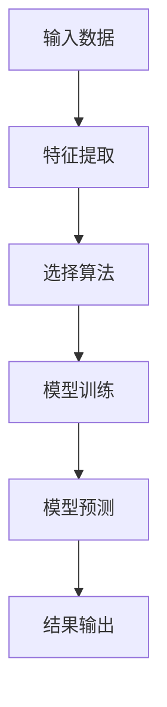
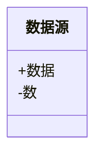

                 


# AI在金融衍生品设计中的创新应用

> 关键词：人工智能、金融衍生品、机器学习、神经网络、随机森林、自然语言处理

> 摘要：随着人工智能技术的飞速发展，其在金融领域的应用也愈发广泛。本文探讨了人工智能在金融衍生品设计中的创新应用，详细分析了核心概念、算法原理、系统架构以及实际案例，揭示了AI技术如何推动金融衍生品设计的智能化与高效化。

---

# 第1章: AI与金融衍生品的结合背景

## 1.1 人工智能的基本概念

### 1.1.1 人工智能的定义
人工智能（Artificial Intelligence, AI）是指计算机系统执行人类智能任务的能力，如视觉识别、语音识别、决策推理等。AI的核心在于模拟人类的学习和推理能力，通过数据驱动的方法实现自动化任务处理。

### 1.1.2 人工智能的核心技术
- **机器学习（Machine Learning）**：通过训练模型从数据中学习规律。
- **深度学习（Deep Learning）**：基于人工神经网络的机器学习技术。
- **自然语言处理（NLP）**：处理人类语言的计算机技术。

### 1.1.3 人工智能的发展历程
人工智能起源于20世纪50年代，经历了符号推理、专家系统、机器学习到深度学习的演变，现已成为各领域的核心技术。

## 1.2 金融衍生品的基本概念

### 1.2.1 金融衍生品的定义
金融衍生品是基于标的资产的金融合约，其价值取决于基础资产的价格波动，包括期权、期货、掉期等。

### 1.2.2 金融衍生品的分类
- **期权**：买方有权在特定时间以特定价格买入或卖出标的资产。
- **期货**：在未来特定时间以约定价格买卖标的资产。
- **掉期**：长期资产交换协议。

### 1.2.3 金融衍生品的市场现状
衍生品市场是全球最大的金融市场之一，广泛应用于风险管理、投机和套利。

## 1.3 AI与金融衍生品结合的背景与趋势

### 1.3.1 人工智能在金融领域的应用现状
AI已广泛应用于金融数据分析、风险评估、投资决策等领域，提升效率和准确性。

### 1.3.2 金融衍生品设计中的传统方法与挑战
传统方法依赖统计模型，存在数据依赖性强、计算复杂度高的问题，难以应对复杂市场环境。

### 1.3.3 AI技术在金融衍生品设计中的创新应用
AI技术通过深度学习和NLP等方法，优化衍生品定价、风险评估和市场预测，实现更精准和高效的决策。

## 1.4 本章小结
本章介绍了AI和金融衍生品的基本概念，分析了AI在衍生品设计中的背景和趋势，为后续内容奠定了基础。

---

# 第2章: AI在金融衍生品设计中的核心概念与联系

## 2.1 AI在金融衍生品设计中的核心概念

### 2.1.1 数据驱动的金融衍生品设计
AI通过分析大量历史数据，识别市场规律，优化衍生品设计。

### 2.1.2 机器学习在衍生品定价中的应用
利用机器学习模型预测衍生品价格，优化定价策略。

### 2.1.3 自然语言处理在衍生品市场分析中的应用
NLP技术用于分析市场新闻、公司财报，辅助市场预测。

## 2.2 AI与金融衍生品设计的核心联系

### 2.2.1 数据的获取与处理
AI需要大量结构化和非结构化数据，进行清洗、特征提取和预处理。

### 2.2.2 模型的构建与优化
基于数据构建机器学习或深度学习模型，通过训练优化模型参数。

### 2.2.3 结果的解释与应用
将模型输出应用于实际衍生品设计，如风险评估和定价策略。

## 2.3 AI在金融衍生品设计中的优势与劣势

### 2.3.1 AI的优势
- **高效性**：快速处理大量数据，提高决策效率。
- **准确性**：通过深度学习提升预测精度。
- **适应性**：能够快速适应市场变化。

### 2.3.2 AI的劣势
- **计算成本高**：需要大量计算资源。
- **模型解释性差**：部分模型难以解释结果。
- **数据依赖性强**：依赖高质量数据，否则可能导致错误决策。

### 2.3.3 传统方法与AI方法的对比分析
传统方法依赖统计模型，计算复杂；AI方法通过数据驱动优化，提高效率和准确性。

## 2.4 本章小结
本章详细探讨了AI在金融衍生品设计中的核心概念和应用优势，分析了AI与传统方法的对比。

---

# 第3章: AI在金融衍生品设计中的算法原理

## 3.1 机器学习算法在衍生品定价中的应用

### 3.1.1 线性回归模型
线性回归用于预测衍生品价格，公式如下：
$$ y = \beta_0 + \beta_1x + \epsilon $$
其中，$y$为预测价格，$x$为自变量，$\beta_0$和$\beta_1$为回归系数，$\epsilon$为误差项。

### 3.1.2 支持向量机模型
支持向量机（SVM）用于分类和回归，适用于非线性关系。公式如下：
$$ y = \text{sign}(w \cdot x + b) $$
其中，$w$为权重向量，$b$为偏置项，$x$为输入数据。

### 3.1.3 随机森林模型
随机森林通过集成多个决策树模型，提高预测准确性。

## 3.2 神经网络在衍生品市场预测中的应用

### 3.2.1 卷积神经网络
CNN用于图像和序列数据的处理，应用于时间序列预测。

### 3.2.2 循环神经网络
RNN适用于序列数据，如时间序列预测，公式如下：
$$ a^{(l+1)} = \sigma(w^{(l)}a^{(l)} + b^{(l)}) $$

### 3.2.3 图神经网络
GNN用于复杂关系网络，如市场网络分析。

## 3.3 算法原理的数学模型与公式

### 3.3.1 线性回归模型的公式推导
$$ \hat{y} = \beta_0 + \beta_1x $$
最小二乘法求解系数：
$$ \beta = (X^T X)^{-1} X^T y $$

### 3.3.2 神经网络的前向传播公式
$$ a^{(l+1)} = \sigma(w^{(l)}a^{(l)} + b^{(l)}) $$

## 3.4 算法实现的流程图


## 3.5 本章小结
本章介绍了几种常用的机器学习和深度学习算法，分析了它们在衍生品设计中的应用，展示了算法的数学模型和流程图。

---

# 第4章: AI在金融衍生品设计中的系统分析与架构设计

## 4.1 系统分析

### 4.1.1 问题场景介绍
设计一个AI驱动的金融衍生品定价系统，解决传统方法效率低、精度差的问题。

### 4.1.2 项目目标与范围
目标是优化衍生品定价和风险管理，范围包括数据获取、模型训练和结果输出。

### 4.1.3 项目需求分析
- 数据需求：结构化和非结构化数据。
- 功能需求：定价模型、风险评估、市场预测。
- 性能需求：高计算效率和结果准确性。

## 4.2 系统架构设计

### 4.2.1 领域模型类图


### 4.2.2 系统架构图


### 4.2.3 系统接口设计
- 数据输入接口：接收结构化和非结构化数据。
- 模型训练接口：处理和训练模型。
- 结果输出接口：提供预测结果和解释。

### 4.2.4 系统交互序列图
```mermaid
sequenceDiagram
参与者：用户
系统：AI金融衍生品设计系统
用户 -> 系统：请求数据处理
系统 -> 数据源：获取数据
数据源 -> 系统：返回数据
系统 -> 特征提取模块：提取特征
特征提取模块 -> 系统：返回特征
系统 -> 算法选择模块：选择算法
算法选择模块 -> 系统：返回算法
系统 -> 模型训练模块：训练模型
模型训练模块 -> 系统：返回训练好的模型
系统 -> 模型预测模块：进行预测
模型预测模块 -> 系统：返回预测结果
系统 -> 用户：输出结果
```

## 4.3 本章小结
本章详细分析了AI驱动的金融衍生品设计系统的架构设计，展示了各模块之间的关系和交互流程。

---

# 第5章: AI在金融衍生品设计中的项目实战

## 5.1 项目介绍

### 5.1.1 项目背景
设计一个基于AI的衍生品定价系统，优化传统定价模型。

### 5.1.2 项目目标
实现衍生品定价模型，验证其准确性和效率。

## 5.2 系统核心实现源代码

### 5.2.1 环境安装
- Python 3.8及以上
- TensorFlow、Keras、Scikit-learn等库

### 5.2.2 核心代码实现
```python
import numpy as np
from sklearn.ensemble import RandomForestRegressor

# 数据准备
X = np.array([[feature1, feature2, ...], ...])
y = np.array([target_values])

# 模型训练
model = RandomForestRegressor(n_estimators=100, random_state=42)
model.fit(X, y)

# 预测
new_X = np.array([[new_feature1, new_feature2, ...], ...])
prediction = model.predict(new_X)
```

### 5.2.3 代码功能解读
- 数据准备：整理输入数据，提取特征。
- 模型训练：使用随机森林回归模型训练模型。
- 模型预测：对新数据进行预测，输出结果。

## 5.3 案例分析与详细讲解

### 5.3.1 数据准备
收集历史价格、波动率、市场指数等数据，进行清洗和特征提取。

### 5.3.2 模型训练
训练随机森林模型，评估其准确性和稳定性。

### 5.3.3 模型预测
对新数据进行预测，分析结果并优化模型。

## 5.4 本章小结
本章通过实际案例展示了AI在金融衍生品设计中的应用，详细讲解了项目实现的全过程。

---

# 第6章: 总结与展望

## 6.1 本章总结
本文详细探讨了AI在金融衍生品设计中的创新应用，分析了核心概念、算法原理和系统架构，展示了实际案例。

## 6.2 未来展望
随着AI技术的进步，衍生品设计将更加智能化和个性化，可能出现更多创新应用，如动态定价和实时风险管理。

## 6.3 最佳实践 Tips
- 数据质量是关键，需确保数据的完整性和准确性。
- 模型解释性需重视，确保结果可解释。
- 定期更新模型，适应市场变化。

## 6.4 注意事项
- 数据隐私和安全需严格保护。
- 模型需结合业务背景，避免片面化。
- 避免过度依赖AI，保持人工审核和监控。

## 6.5 拓展阅读
- 《机器学习实战》
- 《深度学习》
- 《金融衍生品定价》

---

# 附录

## 附录A: 参考文献
1. 姚期智. 《人工智能导论》
2. 李航. 《统计学习题》
3. 张成林. 《金融衍生品定价》

## 附录B: 工具与库
- TensorFlow：深度学习框架
- Keras：神经网络库
- Scikit-learn：机器学习库

---

# 结语

人工智能正在深刻改变金融衍生品设计的方式，通过数据驱动和智能化方法，AI技术为衍生品设计提供了新的可能性。未来，随着技术进步，AI在金融领域的应用将更加广泛和深入。

--- 

以上是《AI在金融衍生品设计中的创新应用》的完整目录大纲，涵盖从基础概念到实际应用的各个方面，结构清晰，内容详实，适合技术博客的撰写。

