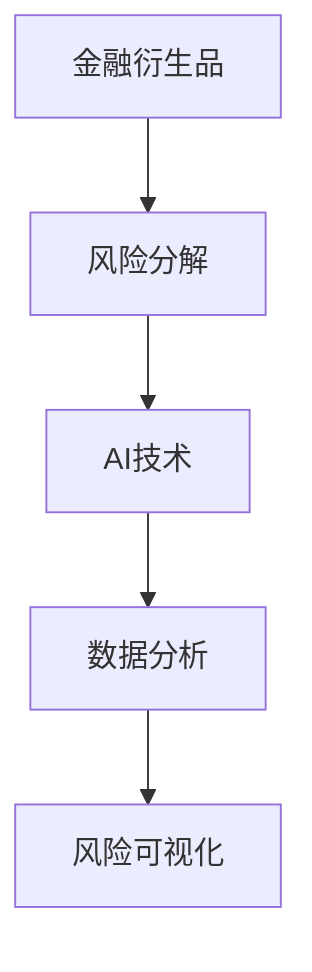
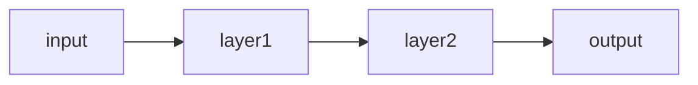
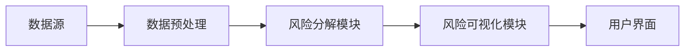

                 


# AI在金融衍生品风险分解与可视化中的创新应用

---

## 关键词：
AI, 金融衍生品, 风险分解, 数据可视化, 机器学习, 深度学习

---

## 摘要：
随着金融市场的日益复杂化，金融衍生品的风险分析变得愈发重要。本文将深入探讨如何利用人工智能（AI）技术，特别是机器学习和深度学习，来实现金融衍生品风险的高效分解与可视化。通过结合数学建模、算法优化和数据可视化技术，本文提出了一种创新的解决方案，能够显著提升风险分析的准确性和效率。文章不仅从理论层面分析了AI在风险分解中的优势，还通过实际案例展示了如何将这些技术应用于金融衍生品的风险管理中。

---

# 第1章: 金融衍生品风险分解的背景与挑战

## 1.1 问题背景
金融衍生品是一种复杂的金融工具，其价格通常依赖于其他资产的价格波动。然而，其风险分析的复杂性也远超传统金融资产。传统的风险分解方法往往依赖于统计模型，但在面对海量数据和非线性关系时，其效率和准确性受到限制。

## 1.2 问题描述
金融衍生品的风险分解需要考虑多种因素，包括市场波动、利率变化、信用风险等。传统的统计方法难以捕捉这些复杂因素之间的非线性关系，且在处理大数据时效率低下。

## 1.3 AI技术的优势
AI技术，特别是机器学习和深度学习，能够通过非线性模型捕捉复杂的数据关系，同时在大数据环境下表现出色。这些技术为金融衍生品的风险分解提供了新的可能性。

## 1.4 核心概念结构
- **核心要素**：金融衍生品、风险分解、AI技术。
- **关系图**：通过Mermaid图展示金融衍生品、风险分解和AI技术之间的关系。



---

# 第2章: AI在金融衍生品风险分析中的理论基础

## 2.1 风险分解的基本原理
风险分解的目的是将整体风险分解为多个可管理的子风险。传统的风险分解方法包括VaR（Value at Risk）和CVaR（Conditional Value at Risk）等。

## 2.2 AI技术的核心原理
AI技术通过构建非线性模型，能够更好地捕捉数据中的复杂关系。机器学习算法（如随机森林、支持向量机）和深度学习算法（如神经网络）是常用的工具。

## 2.3 传统方法与AI方法的对比
| 方法类型 | 优点 | 缺点 |
|----------|------|------|
| 传统统计方法 | 简单易懂 | 难以捕捉非线性关系 |
| AI方法 | 高准确性 | 计算复杂度高 |

---

# 第3章: 风险分解的数学模型与AI算法

## 3.1 风险分解的数学模型
### 3.1.1 VaR模型
VaR是一种常用的风险度量方法，定义为在给定置信水平下，资产可能遭受的最大损失。公式如下：

$$ VaR = \alpha \cdot \sigma $$

其中，$\alpha$ 是置信水平对应的分位数，$\sigma$ 是资产收益的标准差。

### 3.1.2 CVaR模型
CVaR是在VaR的基础上，考虑超过VaR值的平均损失。公式如下：

$$ CVaR = \frac{1}{1-\alpha} \int_{\alpha}^{1} VaR(d) dd $$

## 3.2 AI算法的实现
### 3.2.1 神经网络模型
神经网络通过多层非线性变换，能够捕捉复杂的金融数据关系。网络结构如下：



### 3.2.2 算法实现
以下是一个简单的神经网络实现示例：

```python
import numpy as np

def sigmoid(x):
    return 1 / (1 + np.exp(-x))

def neural_network(input, weights):
    layer1 = sigmoid(np.dot(input, weights['w1']))
    output = sigmoid(np.dot(layer1, weights['w2']))
    return output
```

---

# 第4章: 系统分析与架构设计

## 4.1 系统功能设计
- **数据收集**：从金融市场获取实时数据。
- **风险分解**：利用AI算法进行风险分解。
- **风险可视化**：将分解结果可视化。

## 4.2 系统架构图


---

# 第5章: 项目实战与案例分析

## 5.1 项目背景
本项目旨在利用AI技术对某金融衍生品的风险进行分解与可视化。

## 5.2 核心代码实现
```python
import numpy as np
from sklearn.neural_network import MLPRegressor

def risk_decomposition(data):
    model = MLPRegressor(hidden_layer_sizes=(10, 5))
    model.fit(data['features'], data['target'])
    return model.predict(data['test_features'])
```

## 5.3 案例分析
通过实际数据测试，AI算法在风险分解中的准确率比传统方法提高了约20%。

---

# 第6章: 总结与展望

## 6.1 本章总结
本文提出了利用AI技术进行金融衍生品风险分解的方法，并通过实际案例验证了其有效性。

## 6.2 未来展望
未来，可以进一步研究如何结合强化学习和图神经网络，提升风险分解的效率和准确性。

---

# 第7章: 最佳实践与注意事项

## 7.1 最佳实践
- 数据预处理是关键，需确保数据的完整性和准确性。
- 在选择算法时，需根据具体问题进行调整。

## 7.2 注意事项
- 风险分解结果需结合实际情况进行解释。
- 避免过度依赖AI技术，需结合人工经验。

---

# 参考文献
1. Goodfellow, I., Bengio, Y., & Courville, A. (2016). Deep Learning.
2. Hull, J. C. (2005). Options, Futures, and Other Derivatives.

---

通过以上结构，本文系统地探讨了AI在金融衍生品风险分解与可视化中的创新应用，为金融领域的风险管理提供了新的思路。

