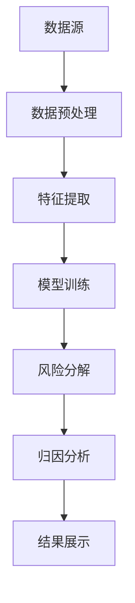
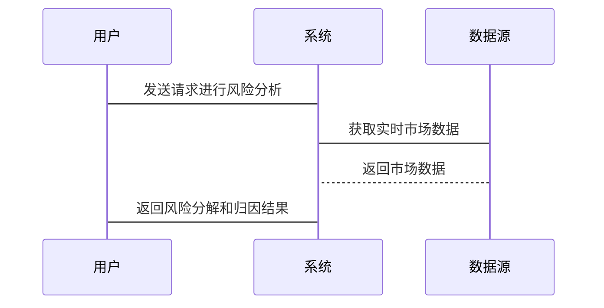

                 


# AI在金融衍生品风险分解与归因中的创新应用

## 关键词：AI技术、金融衍生品、风险分解、归因分析、机器学习、深度学习

## 摘要

本文深入探讨了人工智能技术在金融衍生品风险分解与归因中的创新应用。首先介绍了金融衍生品的基本概念和风险管理的重要性，然后讲解了人工智能在金融领域的应用基础，包括机器学习和深度学习的基本原理。接着，详细分析了风险分解与归因的核心概念和算法原理，特别是AI技术在其中的应用。最后，通过系统架构设计和项目实战，展示了如何将AI技术应用于实际的金融衍生品风险管理中，为读者提供了丰富的案例和详细的实现方法。

---

## 第一部分: 金融衍生品风险分解与归因的背景与概念

### 第1章: 金融衍生品概述

#### 1.1 金融衍生品的基本概念

金融衍生品是基于标的资产（如股票、债券、商品等）价格波动而衍生出来的金融工具。它们通常用于对冲风险或进行投机交易。常见的衍生品类型包括远期合约、期货、期权和互换。

**远期合约**：双方约定在未来某一特定时间以预定价格买卖资产的协议。  
**期货**：在交易所标准化交易的衍生品，具有标准化的合约规格和到期日。  
**期权**：赋予买方在未来特定时间内以预定价格买入或卖出资产的权利，而不承担必须交易的义务。  
**互换**：双方约定在未来某一时期交换现金流的协议，通常涉及利率或汇率。

#### 1.2 金融衍生品的风险管理

风险管理在衍生品交易中至关重要，涉及市场风险、信用风险和流动性风险。市场风险是由于市场价格波动导致的损失，信用风险是由于交易对手违约导致的损失，流动性风险则是由于无法在合理时间内以合理价格买卖资产导致的损失。

#### 1.3 金融衍生品的风险分解与归因

风险分解将整体风险拆解为多个因素，如市场波动率、波动相关性等。归因分析则确定各个风险因素对整体风险的贡献程度。这种分解和归因帮助投资者更好地理解风险来源，优化投资组合，并制定有效的风险管理策略。

---

### 第2章: AI技术在金融中的应用基础

#### 2.1 人工智能的基本概念

人工智能（AI）是指计算机系统执行人类智能任务的能力，如视觉识别、语音识别、决策制定等。机器学习（ML）是AI的一个子领域，通过数据训练模型以做出预测或决策。深度学习（DL）是ML的子领域，使用多层神经网络来学习数据的复杂特征。

#### 2.2 机器学习在金融中的应用

- **监督学习**：用于分类和回归任务，如信用评分和股价预测。
- **非监督学习**：用于聚类分析，如客户细分和异常交易检测。
- **强化学习**：用于策略优化，如算法交易和投资组合管理。

#### 2.3 深度学习在金融中的应用

- **神经网络**：用于复杂模式识别，如股票价格预测和信用评分。
- **卷积神经网络（CNN）**：用于图像和序列数据处理，如股票K线图分析。
- **循环神经网络（RNN）**：用于时间序列分析，如外汇价格预测。

---

## 第二部分: AI在金融衍生品风险分解与归因中的算法原理

### 第5章: 风险分解的算法原理

#### 5.1 监督学习在风险分解中的应用

- **线性回归**：用于预测资产价格变动，帮助识别主要影响因素。
- **支持向量机（SVM）**：用于分类和回归，帮助识别风险因素的类别。
- **随机森林**：用于特征重要性分析，识别对风险贡献最大的因素。

#### 5.2 非监督学习在风险分解中的应用

- **聚类分析**：将相似的风险因素分组，识别潜在的风险因子。
- **主成分分析（PCA）**：降低数据维度，提取主要风险因子。
- **稀疏编码**：用于特征选择，识别关键风险因素。

#### 5.3 深度学习在风险分解中的应用

- **卷积神经网络（CNN）**：用于图像数据处理，分析K线图中的价格模式。
- **循环神经网络（RNN）**：用于时间序列数据处理，分析价格波动趋势。
- **图神经网络（GNN）**：用于复杂网络结构分析，识别关联风险因素。

---

### 第6章: 归因分析的算法原理

#### 6.1 监督学习在归因分析中的应用

- **线性回归**：用于量化各风险因素对整体风险的贡献。
- **支持向量机（SVM）**：用于分类，识别风险因素的影响方向。
- **随机森林**：用于特征重要性分析，确定关键风险因素。

#### 6.2 非监督学习在归因分析中的应用

- **聚类分析**：将相似风险因素分组，归因于同一类别。
- **主成分分析（PCA）**：提取主要风险因子，分析其对整体风险的贡献。
- **稀疏编码**：用于特征选择，识别关键风险因素。

#### 6.3 深度学习在归因分析中的应用

- **卷积神经网络（CNN）**：用于图像数据处理，分析K线图中的价格模式。
- **循环神经网络（RNN）**：用于时间序列数据处理，分析价格波动趋势。
- **图神经网络（GNN）**：用于复杂网络结构分析，识别关联风险因素。

---

## 第三部分: 系统分析与架构设计方案

### 7章: 系统架构设计

#### 7.1 问题场景介绍

金融衍生品的风险管理需要实时监控和分析大量数据，包括市场价格、波动率、相关性等。通过AI技术，可以快速识别和量化风险因素，帮助投资者做出决策。

#### 7.2 系统功能设计

- **数据采集模块**：实时采集市场数据，包括价格、成交量等。
- **模型构建模块**：训练机器学习模型，进行风险分解和归因分析。
- **结果展示模块**：以可视化方式展示风险分解和归因结果。

#### 7.3 系统架构设计



#### 7.4 系统接口设计

- **API接口**：提供RESTful API，供其他系统调用风险分析结果。
- **数据接口**：与数据源（如交易所）连接，获取实时市场数据。

#### 7.5 系统交互设计



---

## 第四部分: 项目实战

### 8章: 项目实战

#### 8.1 环境安装

- **Python**：安装Anaconda或Miniconda。
- **机器学习库**：安装scikit-learn、TensorFlow、Keras。
- **可视化库**：安装Matplotlib、Seaborn。
- **数据处理库**：安装Pandas、NumPy。

#### 8.2 核心实现源代码

```python
import numpy as np
import pandas as pd
from sklearn.ensemble import RandomForestRegressor
from sklearn.metrics import mean_squared_error

# 数据加载
data = pd.read_csv('market_data.csv')

# 特征选择
features = data.drop(columns=['return'])
target = data['return']

# 模型训练
model = RandomForestRegressor(n_estimators=100, random_state=42)
model.fit(features, target)

# 预测
predictions = model.predict(features)

# 评估
mse = mean_squared_error(target, predictions)
print(f'Mean Squared Error: {mse}')
```

#### 8.3 代码解读与分析

上述代码使用随机森林回归模型进行风险预测。首先加载数据，选择特征和目标变量，然后训练模型，进行预测，并计算均方误差以评估模型性能。

#### 8.4 案例分析

假设我们有一个股票的市场数据，包括开盘价、收盘价、最高价、最低价和成交量。我们使用随机森林模型来预测股票的收益率，并分析各个因素对收益率的贡献。

#### 8.5 项目小结

通过项目实战，我们可以看到AI技术在金融衍生品风险管理中的强大能力。随机森林等机器学习模型可以帮助我们分解风险，并归因于各个因素。

---

## 第五部分: 最佳实践与总结

### 9章: 最佳实践

- **数据质量**：确保数据的准确性和完整性，避免噪声干扰模型。
- **模型选择**：根据具体问题选择合适的模型，如线性回归适用于线性关系，随机森林适用于复杂关系。
- **模型解释性**：使用特征重要性分析等方法，解释模型结果，便于业务理解。

### 10章: 小结与展望

本文详细探讨了AI技术在金融衍生品风险分解与归因中的应用，通过理论分析和项目实战，展示了AI技术在风险管理中的巨大潜力。未来，随着AI技术的不断发展，金融风险管理将更加智能化和精准化。

---

## 第六部分: 注意事项与拓展阅读

### 注意事项

- **过拟合问题**：在模型训练中，需注意过拟合，使用交叉验证等方法进行调参。
- **数据泄漏**：避免在模型训练中使用未来数据，确保模型的泛化能力。
- **计算资源**：深度学习模型需要大量计算资源，需合理配置硬件。

### 拓展阅读

- 《机器学习实战》：深入讲解机器学习算法的实现和应用。
- 《深度学习》：系统介绍深度学习的理论和应用。
- 《金融风险管理》：详细讲解金融衍生品的风险管理方法。

---

通过以上结构和内容，本文系统地介绍了AI技术在金融衍生品风险分解与归因中的创新应用，从理论到实践，为读者提供了全面的指导和深入的分析。

