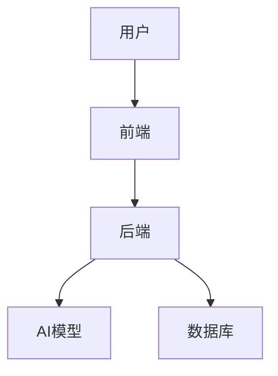
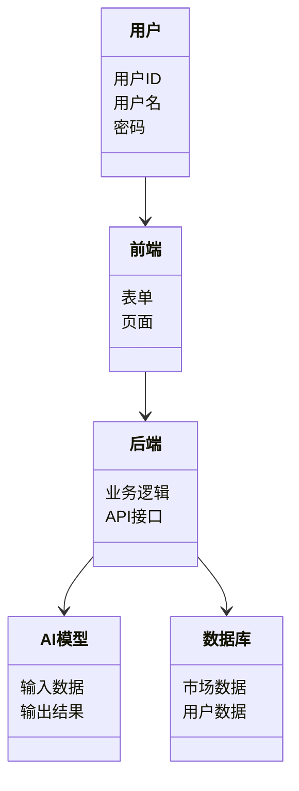

                 


# AI在金融衍生品风险度量中的应用

## 关键词：人工智能, 金融衍生品, 风险度量, 统计套利, 时间序列分析, 深度学习

## 摘要：  
本文详细探讨了人工智能技术在金融衍生品风险度量中的应用，从理论基础到实际案例，结合统计套利、时间序列分析和深度学习等方法，分析了AI在提高风险预测和管理中的优势与挑战。文章结构清晰，内容详实，旨在为金融从业者和技术爱好者提供有价值的参考。

---

# 第一部分：AI在金融衍生品风险度量中的基础概念

## 第1章：金融衍生品与风险度量概述

### 1.1 金融衍生品的定义与分类
- **1.1.1 金融衍生品的定义**  
  金融衍生品是一种金融合约，其价值来源于基础资产（如股票、债券、商品等）的价格变动。常见的金融衍生品包括期货、期权、互换和远期合约。

- **1.1.2 金融衍生品的分类**  
  | 类型       | 描述                             |
  |------------|----------------------------------|
  | 期货       | 标准化合约，交易场所集中         |
  | 期权       | 给予买方在特定时间以特定价格买卖的权利 |
  | 互换       | 交易双方交换现金流的协议       |
  | 远期合约   | 私人之间的非标准化合约           |

- **1.1.3 金融衍生品的基本特性**  
  - 杠杆效应：以小博大，放大收益或损失。  
  - 风险转移：用于对冲或投机。  
  - 时间敏感性：价值受时间因素影响较大。  

### 1.2 风险度量的核心概念
- **1.2.1 风险的定义与分类**  
  风险是投资损失的可能性，可分为市场风险、信用风险、流动性风险等。  

- **1.2.2 风险度量的目标与方法**  
  - 目标：量化潜在损失，优化投资组合。  
  - 方法：VaR（Value at Risk）、CVaR（Conditional Value at Risk）等。  

- **1.2.3 金融衍生品风险的特殊性**  
  衍生品的价值波动性高，且杠杆效应放大了风险。  

### 1.3 AI技术在金融领域的应用背景
- **1.3.1 AI技术的发展与现状**  
  AI技术在金融领域的应用日益广泛，尤其是在高频交易和风险控制方面。  

- **1.3.2 AI在金融领域的典型应用**  
  - 自动化交易系统  
  - 客户画像与信用评估  
  - 市场情绪分析  

- **1.3.3 AI在金融衍生品风险度量中的潜力**  
  AI能够处理海量数据，发现非线性关系，提高风险预测的准确性。  

### 1.4 本章小结  
本章介绍了金融衍生品的基本概念、风险度量的核心概念，以及AI技术在金融领域的应用背景，为后续分析奠定了基础。

---

## 第2章：AI技术在金融衍生品风险度量中的核心概念

### 2.1 AI驱动的风险度量模型
- **2.1.1 传统风险度量方法的局限性**  
  传统方法（如VaR）难以捕捉非线性关系和极端事件。  

- **2.1.2 AI驱动的风险度量模型的优势**  
  - 高维度数据处理能力强。  
  - 能够发现数据中的非线性关系。  
  - 实时更新，适应市场变化。  

- **2.1.3 基于AI的风险度量模型的分类**  
  - 统计套利模型  
  - 时间序列分析模型  
  - 深度学习模型  

### 2.2 金融衍生品风险的核心要素
- **2.2.1 市场风险**  
  由于市场价格波动导致的损失。  

- **2.2.2 信用风险**  
  对方违约的风险。  

- **2.2.3 流动性风险**  
  无法快速变现的风险。  

### 2.3 AI技术在风险度量中的关键作用
- **2.3.1 数据处理与特征提取**  
  AI能够从大量历史数据中提取有用的特征，如波动率、相关性等。  

- **2.3.2 模型训练与预测**  
  利用机器学习算法（如随机森林、神经网络）训练模型，预测风险值。  

- **2.3.3 结果解释与优化**  
  解释模型结果，优化投资组合。  

### 2.4 本章小结  
本章详细探讨了AI技术在金融衍生品风险度量中的核心概念，分析了其在数据处理、模型训练和结果解释中的作用。

---

## 第3章：金融衍生品风险度量的AI算法原理

### 3.1 统计套利与AI算法的结合
- **3.1.1 统计套利的基本原理**  
  利用资产价格的统计规律进行套利，常见策略包括配对交易。  

- **3.1.2 基于AI的统计套利模型**  
  - 数据预处理：清洗和归一化数据。  
  - 特征提取：计算相关性、均值回归等指标。  
  - 模型训练：使用机器学习算法预测套利机会。  

- **3.1.3 案例分析**  
  使用Python代码实现配对交易策略，计算收益和风险。  

### 3.2 时间序列分析与AI算法
- **3.2.1 时间序列分析的基本原理**  
  分析时间数据的变化趋势和周期性。  

- **3.2.2 基于AI的时间序列预测模型**  
  - ARIMA模型：常用于预测未来值。  
  - LSTM（长短期记忆网络）：适用于捕捉长期依赖关系。  

- **3.2.3 案例分析**  
  使用LSTM预测期权价格波动，计算预测准确率。  

### 3.3 深度学习在风险度量中的应用
- **3.3.1 深度学习的基本原理**  
  通过多层神经网络学习数据的特征表示。  

- **3.3.2 基于深度学习的风险度量模型**  
  - 卷积神经网络（CNN）：用于图像和序列数据处理。  
  - 循环神经网络（RNN）：适用于时间序列数据。  

- **3.3.3 案例分析**  
  使用深度学习模型预测市场崩盘的概率，分析模型的性能。  

### 3.4 本章小结  
本章介绍了统计套利、时间序列分析和深度学习在金融衍生品风险度量中的应用，通过案例分析展示了不同算法的优势。

---

## 第4章：金融衍生品风险度量的系统分析与架构设计

### 4.1 系统分析与设计概述
- **4.1.1 问题场景介绍**  
  金融机构需要实时监控衍生品的风险，优化投资组合。  

- **4.1.2 项目目标与范围**  
  开发一个基于AI的风险度量系统，支持多种衍生品的分析。  

- **4.1.3 系统功能需求**  
  - 数据采集：实时获取市场数据。  
  - 风险计算：基于AI算法计算VaR、CVaR等指标。  
  - 可视化：展示风险结果，支持决策。  

### 4.2 系统架构设计
- **4.2.1 系统架构图（Mermaid）**  


- **4.2.2 系统功能设计（Mermaid）**  


### 4.3 本章小结  
本章通过系统架构设计展示了AI在金融衍生品风险度量中的应用，明确了系统各部分的职责和交互关系。

---

## 第5章：项目实战——基于AI的风险度量系统实现

### 5.1 环境安装
- **5.1.1 安装Python**  
  安装Anaconda或Miniconda，选择Python 3.8或更高版本。  

- **5.1.2 安装相关库**  
  ```bash
  pip install numpy pandas scikit-learn tensorflow keras matplotlib
  ```

### 5.2 系统核心实现
- **5.2.1 数据采集与预处理**  
  使用Yahoo Finance API获取期权数据，清洗和归一化数据。  

- **5.2.2 模型训练与部署**  
  使用LSTM模型训练时间序列数据，部署为RESTful API。  

- **5.2.3 系统集成**  
  使用Flask框架搭建前端和后端，集成AI模型和数据库。  

### 5.3 案例分析与结果解读
- **5.3.1 案例分析**  
  使用训练好的模型预测期权价格波动，计算VaR值。  

- **5.3.2 结果解读**  
  对比传统方法和AI方法的结果，展示AI的优势。  

### 5.4 本章小结  
本章通过实际案例展示了AI在金融衍生品风险度量中的应用，详细讲解了系统的实现过程。

---

## 第6章：总结与最佳实践

### 6.1 本章总结
- AI技术在金融衍生品风险度量中的应用前景广阔。  
- 不同算法有其适用场景，需根据实际情况选择合适的方法。  

### 6.2 最佳实践 tips
- **数据质量**：确保数据的完整性和准确性。  
- **模型解释性**：选择可解释性强的模型，便于分析结果。  
- **实时性**：优化算法和架构，确保实时监控能力。  

### 6.3 拓展阅读
- 推荐阅读《机器学习在金融中的应用》和《深度学习实战》。  

### 6.4 本章小结  
总结全文，强调AI技术在金融衍生品风险度量中的重要性，并给出实际应用的建议。

---

## 附录：代码示例

### 附录A：LSTM模型实现
```python
import numpy as np
from keras.models import Sequential
from keras.layers import LSTM, Dense

# 示例数据
data = np.random.randn(1000, 1)
model = Sequential()
model.add(LSTM(64, input_shape=(None, 1)))
model.add(Dense(1))
model.compile(optimizer='adam', loss='mean_squared_error')
model.fit(data, data, epochs=10, batch_size=32)
```

### 附录B：系统架构图


---

通过以上目录和内容，我们可以看到AI在金融衍生品风险度量中的应用前景广阔，结合统计套利、时间序列分析和深度学习等方法，能够显著提高风险预测的准确性和效率。

