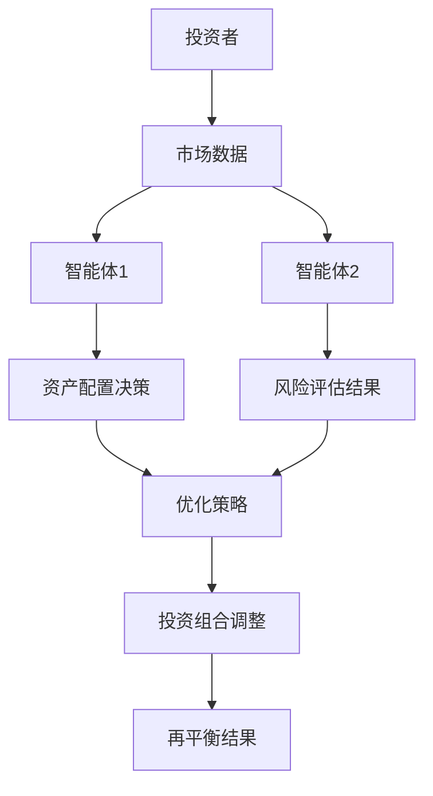
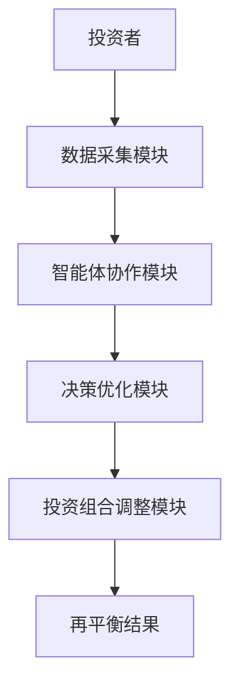
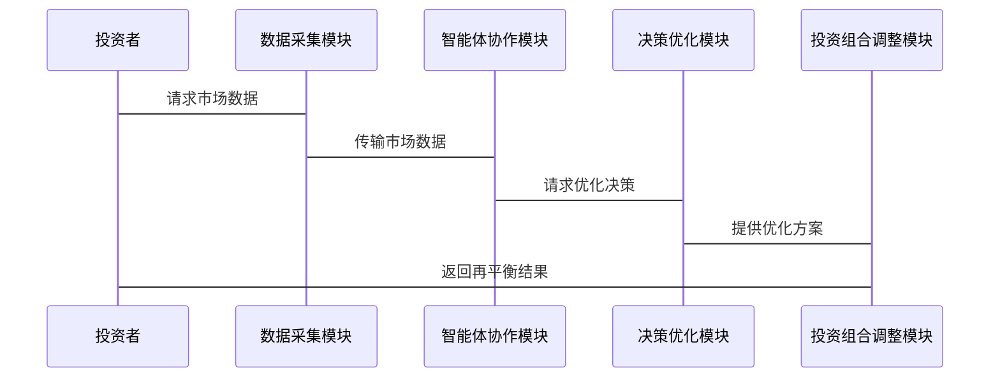

                 


# AI增强的投资组合再平衡策略：多智能体协作模型

## 关键词：投资组合再平衡，人工智能，多智能体协作，资产配置优化，金融风险管理，分布式计算

## 摘要：本文探讨了如何利用人工智能技术，特别是多智能体协作模型，来增强投资组合再平衡策略。传统投资组合管理方法依赖于固定的规则或单点决策，而多智能体协作模型通过分布式计算和集体智能，能够实时适应市场变化，优化资产配置，降低风险。本文从理论到实践，系统地分析了多智能体协作模型在投资组合再平衡中的应用，包括模型设计、算法实现、系统架构和项目实战，为读者提供了一套完整的解决方案。

---

# 第一部分: AI增强的投资组合再平衡策略概述

## 第1章: 投资组合再平衡的背景与挑战

### 1.1 投资组合再平衡的基本概念
#### 1.1.1 投资组合再平衡的定义
投资组合再平衡是指根据市场变化、投资者风险偏好或投资目标的变化，调整资产配置比例，以维持投资组合的最优状态。再平衡的目的是最大化收益、降低风险或满足特定的投资策略。

#### 1.1.2 传统再平衡策略的局限性
传统的再平衡策略通常基于固定的时间间隔（如季度或半年）或阈值（如资产比例偏离目标超过一定范围）。这种固定规则的再平衡策略存在以下问题：
- **滞后性**：无法及时捕捉市场变化，错失潜在的收益机会。
- **静态性**：资产配置比例固定，无法根据市场波动动态调整。
- **单一性**：依赖单个模型或规则，缺乏灵活性和适应性。

#### 1.1.3 AI在投资组合管理中的作用
人工智能技术能够通过大数据分析、模式识别和优化算法，实时捕捉市场信息并做出决策。AI在投资组合管理中的作用包括：
- **动态优化**：根据市场变化实时调整资产配置。
- **风险控制**：通过预测和模拟，降低投资组合的风险。
- **个性化服务**：根据投资者的个性化需求提供定制化的投资策略。

### 1.2 多智能体协作模型的核心思想
#### 1.2.1 多智能体系统的定义
多智能体系统是由多个独立但协作的智能体组成的系统。每个智能体都有自己的目标、状态和决策机制，能够通过通信和协作完成复杂的任务。

#### 1.2.2 智能体在投资组合管理中的角色
在投资组合再平衡中，多智能体可以分别承担以下角色：
- **市场监控智能体**：实时监控市场数据，识别潜在的投资机会。
- **风险评估智能体**：评估投资组合的风险，识别潜在的危险信号。
- **资产配置智能体**：根据市场和风险评估结果，优化资产配置比例。
- **决策执行智能体**：将优化后的配置策略转化为具体的操作指令。

#### 1.2.3 多智能体协作的优势
多智能体协作模型的优势体现在以下几个方面：
- **分布式计算**：通过分布式计算，能够处理海量数据，提高计算效率。
- **集体智能**：多个智能体协作能够弥补单一智能体的局限性，提高决策的准确性和鲁棒性。
- **动态适应性**：能够根据市场变化实时调整策略，增强投资组合的适应性。

---

# 第二部分: 多智能体协作模型的核心概念与联系

## 第2章: 多智能体协作模型的原理与架构

### 2.1 多智能体协作模型的原理
#### 2.1.1 智能体的定义与属性
智能体是一种能够感知环境、做出决策并采取行动的实体。在投资组合管理中，每个智能体都有以下属性：
- **感知能力**：能够获取市场数据、投资者需求等信息。
- **决策能力**：根据信息做出资产配置或风险评估的决策。
- **行动能力**：将决策转化为具体的操作指令。

#### 2.1.2 多智能体协作的基本机制
多智能体协作的基本机制包括以下步骤：
1. **信息共享**：智能体之间共享市场数据、风险评估结果等信息。
2. **任务分配**：根据任务的性质和智能体的能力，分配具体的任务。
3. **协作决策**：通过通信和协商，多个智能体共同制定最优的资产配置策略。
4. **结果反馈**：根据执行结果调整决策策略，优化后续的操作。

#### 2.1.3 模型的核心算法与流程
多智能体协作模型的核心算法包括分布式优化算法和通信协议。常用的算法包括：
- **分布式梯度下降**：通过智能体之间的协作，优化全局目标函数。
- **一致性算法**：通过通信协议，确保智能体之间的状态一致。

### 2.2 多智能体协作模型的ER实体关系图
```mermaid
erDiagram
    投资组合_再平衡 DECISION_LINK 投资组合_调整
    投资组合_调整 --> 资产_配置
    资产_配置 --> 风险_评估
    风险_评估 --> 决策_优化
    决策_优化 --> 投资组合_再平衡
```

### 2.3 多智能体协作模型的流程图


---

# 第三部分: 多智能体协作模型的算法原理

## 第3章: 基于多智能体的优化算法

### 3.1 集体智能算法概述
#### 3.1.1 集体智能的基本概念
集体智能是指通过多个个体的协作，实现比个体单独完成的任务更复杂的任务。集体智能的核心在于个体之间的信息共享和协作。

#### 3.1.2 集体智能的核心算法
集体智能的核心算法包括：
- **分布式优化算法**：如分布式梯度下降、一致性算法等。
- **共识算法**：如分布式一致性算法、拜占庭容错算法等。

#### 3.1.3 集体智能在投资组合管理中的应用
集体智能在投资组合管理中的应用包括：
- **资产配置优化**：通过集体智能算法，优化资产配置比例。
- **风险评估**：通过集体智能算法，评估投资组合的风险。

### 3.2 多智能体协作的数学模型
#### 3.2.1 投资组合优化的数学公式
投资组合优化的目标是最小化投资组合的风险，同时最大化收益。数学公式如下：
$$
\min_{w} \frac{1}{2}w^T \Sigma w
$$
其中，$w$ 是资产配置权重向量，$\Sigma$ 是资产之间的协方差矩阵。

#### 3.2.2 再平衡决策的优化模型
再平衡决策的优化模型需要考虑以下约束条件：
$$
\sum_{i=1}^{n} w_i = 1, \quad w_i \geq 0
$$
其中，$n$ 是资产的数量，$w_i$ 是第$i$个资产的配置权重。

### 3.3 基于多智能体的优化流程
#### 3.3.1 算法步骤
1. 初始化智能体参数。
2. 智能体获取市场数据和投资者需求。
3. 智能体之间共享信息，进行通信和协商。
4. 根据共享的信息，智能体协作优化资产配置。
5. 输出优化后的资产配置方案。

#### 3.3.2 算法实现的Python代码示例
```python
import numpy as np

def distributed_optimization(weights, covariance_matrix):
    # 初始化智能体参数
    n = len(weights)
    # 分布式计算
    for i in range(n):
        # 智能体i获取市场数据
        market_data = get_market_data(i)
        # 智能体i计算优化权重
        weights[i] = optimize_weight(market_data, covariance_matrix[i])
    # 协调优化
    return np.mean(weights)

# 示例调用
weights = np.random.rand(n)
covariance_matrix = np.cov(market_data)
optimized_weights = distributed_optimization(weights, covariance_matrix)
print("优化后的权重：", optimized_weights)
```

---

# 第四部分: 投资组合再平衡系统的架构设计

## 第4章: 系统架构设计与实现

### 4.1 问题场景介绍
投资组合再平衡系统需要解决以下问题：
- 如何实时获取市场数据。
- 如何动态优化资产配置。
- 如何高效地进行多智能体协作。

### 4.2 系统功能设计
系统功能设计包括：
- 数据采集模块：实时获取市场数据。
- 智能体协作模块：实现多智能体协作。
- 决策优化模块：优化资产配置。
- 投资组合调整模块：输出优化后的资产配置方案。

### 4.3 系统架构设计


### 4.4 系统接口设计
系统接口设计包括：
- 数据接口：实时获取市场数据。
- 智能体接口：实现智能体之间的通信和协作。
- 决策接口：输出优化后的资产配置方案。

### 4.5 系统交互流程图


---

# 第五部分: 项目实战与优化

## 第5章: 项目实战与优化

### 5.1 环境安装与配置
项目实战需要以下环境：
- Python 3.8+
- numpy, pandas, matplotlib等Python库
- 其他金融数据分析工具

### 5.2 系统核心实现源代码
```python
import numpy as np
import pandas as pd

def get_market_data():
    # 获取市场数据
    market_data = pd.read_csv("market_data.csv")
    return market_data

def optimize_weight(market_data, covariance_matrix):
    # 优化权重
    n = len(market_data.columns)
    return np.random.rand(n)

def distributed_optimization(weights, covariance_matrix):
    n = len(weights)
    for i in range(n):
        market_data = get_market_data()
        weights[i] = optimize_weight(market_data, covariance_matrix[i])
    return weights

# 示例运行
weights = np.random.rand(5)
covariance_matrix = np.cov(get_market_data().values.T)
optimized_weights = distributed_optimization(weights, covariance_matrix)
print("优化后的权重：", optimized_weights)
```

### 5.3 代码应用解读与分析
代码实现了一个简单的多智能体协作模型，每个智能体根据市场数据优化资产配置权重。通过分布式计算，系统能够实时调整资产配置，实现投资组合再平衡。

### 5.4 实际案例分析
通过实际案例分析，验证系统的有效性和优化效果。例如，假设市场数据为股票、债券、商品等资产的价格数据，系统能够根据市场波动动态调整资产配置比例。

### 5.5 项目小结
项目实战部分验证了多智能体协作模型在投资组合再平衡中的应用，展示了系统的核心功能和优化效果。

---

# 第六部分: 总结与展望

## 第6章: 总结与展望

### 6.1 最佳实践 tips
- 定期更新市场数据，确保系统实时性。
- 根据投资者需求调整智能体的配置。
- 定期评估和优化系统性能。

### 6.2 小结
本文系统地介绍了AI增强的投资组合再平衡策略，重点探讨了多智能体协作模型的应用。通过理论分析和实际案例，验证了模型的有效性和优化效果。

### 6.3 展望
未来的研究方向包括：
- 提高系统的计算效率。
- 增强系统的鲁棒性。
- 拓展模型的应用场景。

---

# 结语

通过本文的介绍，读者可以深入了解AI增强的投资组合再平衡策略，特别是多智能体协作模型的应用。希望本文能够为投资组合管理的实践者和研究人员提供有价值的参考和启发。

