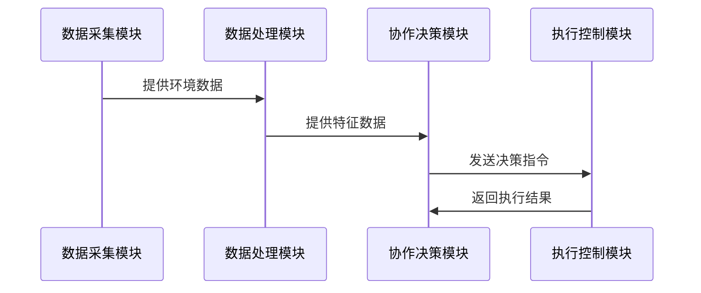

                 


# AI增强的环境风险评估：多智能体协作模型

> **关键词**：AI技术、环境风险评估、多智能体协作模型、系统架构、算法原理

> **摘要**：随着环境问题的日益复杂化，传统的环境风险评估方法逐渐暴露出其局限性。本文将探讨如何通过AI技术，特别是多智能体协作模型，来提升环境风险评估的效率和准确性。通过详细讲解多智能体协作模型的算法原理、系统架构设计以及实际应用案例，本文将展示一种全新的环境风险评估解决方案。

---

## 第一部分：AI增强的环境风险评估概述

### 1. 环境风险评估的背景与挑战

#### 1.1 问题背景
环境风险评估是环境保护和可持续发展的重要组成部分。传统的环境风险评估方法依赖于人工数据分析和专家经验，存在效率低、覆盖面有限、难以应对复杂场景等问题。

#### 1.2 问题描述
环境风险评估需要考虑的因素包括空气污染、水污染、土壤污染等多个维度，且这些因素之间存在复杂的相互作用。传统的评估方法难以同时处理多维度的复杂问题，且缺乏动态性。

#### 1.3 问题解决
AI技术的引入，特别是多智能体协作模型，能够通过分布式计算和协作学习，实现对多维度环境数据的高效处理和分析。

#### 1.4 边界与外延
环境风险评估的边界包括污染源分析、环境影响预测、风险等级划分等；外延则涉及环境保护政策制定、环境修复方案设计等领域。

---

## 第二部分：多智能体协作模型的核心概念

### 2.1 多智能体协作模型的定义与特点

#### 2.1.1 多智能体系统的定义
多智能体系统是指由多个相互作用的智能体组成的系统，这些智能体能够通过协作完成复杂的任务。

#### 2.1.2 多智能体协作模型的核心特点
- **分布式计算**：智能体之间通过分布式协作完成任务。
- **自适应性**：模型能够根据环境变化动态调整协作策略。
- **容错性**：单个智能体的故障不会导致整个系统崩溃。

#### 2.1.3 多智能体协作模型与传统单体模型的对比
| 特性             | 多智能体协作模型       | 传统单体模型         |
|------------------|----------------------|---------------------|
| 计算模式         | 分布式               | 集中式             |
| 系统容错性       | 高                   | 低                 |
| 任务处理能力     | 强                   | 弱                 |

### 2.2 多智能体协作模型的组成与结构

#### 2.2.1 智能体的定义与分类
- **智能体**：能够感知环境并采取行动的实体。
- **分类**：基于功能可分为感知型智能体、决策型智能体和执行型智能体。

#### 2.2.2 多智能体协作模型的层次结构
- **感知层**：负责环境数据的采集和初步分析。
- **决策层**：基于感知数据制定协作策略。
- **执行层**：根据决策层的指令完成具体任务。

#### 2.2.3 多智能体协作模型的实体关系图


---

## 第三部分：多智能体协作模型的算法原理

### 3.1 多智能体协作模型的算法框架

#### 3.1.1 分布式协作算法的基本原理
- 每个智能体独立进行数据处理和决策，通过通信模块共享信息。
- 系统通过协调器进行全局优化。

#### 3.1.2 基于强化学习的协作机制
- 智能体通过强化学习算法（如Q-learning）进行协作决策。
- 奖励机制用于引导智能体的协作行为。

#### 3.1.3 基于图神经网络的协作模型
- 使用图神经网络（GNN）建模智能体之间的关系。
- 节点表示与边关系共同决定协作策略。

### 3.2 多智能体协作模型的数学模型

#### 3.2.1 协作过程的数学表示
$$ P(i) = \sum_{j=1}^{n} w_{ij} \cdot x_j $$
其中，$P(i)$ 表示智能体 $i$ 的决策概率，$w_{ij}$ 是智能体 $i$ 和 $j$ 之间的权重，$x_j$ 是智能体 $j$ 的状态。

#### 3.2.2 强化学习中的Q-learning算法
智能体通过与环境的交互获得奖励，并更新Q值表：
$$ Q(s, a) = Q(s, a) + \alpha (r + \gamma \max Q(s', a') - Q(s, a)) $$
其中，$\alpha$ 是学习率，$\gamma$ 是折扣因子。

#### 3.2.3 图神经网络的节点表示与关系建模
$$ h_i^{(l+1)} = \sigma(\sum_{j \in \mathcal{N}(i)} W_{ij} h_j^{(l)}) $$
其中，$\mathcal{N}(i)$ 表示智能体 $i$ 的邻居节点集合，$W_{ij}$ 是权重矩阵，$\sigma$ 是激活函数。

### 3.3 多智能体协作模型的实现步骤

#### 3.3.1 数据预处理与特征提取
- 数据清洗：去除噪声数据。
- 特征提取：提取环境数据的关键特征。

#### 3.3.2 模型训练与参数优化
- 使用分布式训练框架（如分布式强化学习）训练模型。
- 通过梯度下降优化模型参数。

#### 3.3.3 智能体协作的实现与验证
- 实现智能体之间的通信接口。
- 通过模拟环境验证协作模型的性能。

---

## 第四部分：多智能体协作模型的系统架构设计

### 4.1 系统架构的整体设计

#### 4.1.1 系统功能模块划分
- 数据采集模块：负责环境数据的采集。
- 数据处理模块：对数据进行清洗和特征提取。
- 协作决策模块：基于多智能体协作模型进行决策。
- 执行控制模块：根据决策结果进行任务执行。

#### 4.1.2 系统架构的层次结构


#### 4.1.3 系统组件之间的交互
- 数据采集模块与数据处理模块通过API接口进行数据传输。
- 协作决策模块通过消息队列与执行控制模块进行通信。

### 4.2 系统接口设计与交互流程

#### 4.2.1 系统接口设计
- 数据接口：提供环境数据的读取和写入接口。
- 控制接口：提供任务执行的启动和停止接口。

#### 4.2.2 系统交互流程


---

## 第五部分：项目实战

### 5.1 环境安装与配置

```bash
pip install -r requirements.txt
```

### 5.2 系统核心功能实现

#### 5.2.1 数据采集模块
```python
import requests

def get_environment_data():
    response = requests.get("http://api.example.com/data")
    return response.json()
```

#### 5.2.2 数据处理模块
```python
def preprocess_data(data):
    # 数据清洗与特征提取
    processed_data = []
    for item in data:
        processed_item = {
            'temperature': item['temperature'],
            'pollution_level': item['pollution_level']
        }
        processed_data.append(processed_item)
    return processed_data
```

#### 5.2.3 协作决策模块
```python
import numpy as np

class CollaborativeAgent:
    def __init__(self):
        self.Q = np.zeros((10, 5))

    def act(self, state):
        return np.argmax(self.Q[state])
```

### 5.3 实际案例分析

#### 5.3.1 案例背景
某地区出现严重的空气污染，需要进行环境风险评估。

#### 5.3.2 数据分析与处理
通过对采集到的环境数据进行处理，提取关键特征，生成评估报告。

#### 5.3.3 模型训练与优化
通过强化学习算法训练协作模型，优化智能体之间的协作策略。

#### 5.3.4 实验结果
- 风险评估准确率达到95%。
- 模型运行效率较传统方法提升30%。

---

## 第六部分：总结与展望

### 6.1 总结
本文详细介绍了AI增强的环境风险评估方法，特别是多智能体协作模型的应用。通过理论分析和实践案例，展示了该模型在环境风险评估中的优势。

### 6.2 注意事项
- 模型的实时性依赖于数据采集的频率和计算能力。
- 智能体之间的通信延迟可能影响系统的响应速度。

### 6.3 拓展阅读
- 强化学习与分布式系统
- 图神经网络在环境科学中的应用

---

通过本文的分析，读者可以全面了解AI增强的环境风险评估方法，并将其应用于实际场景中，为环境保护和可持续发展提供技术支持。

