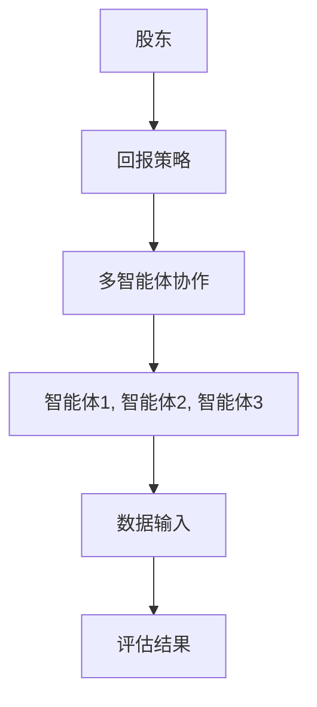
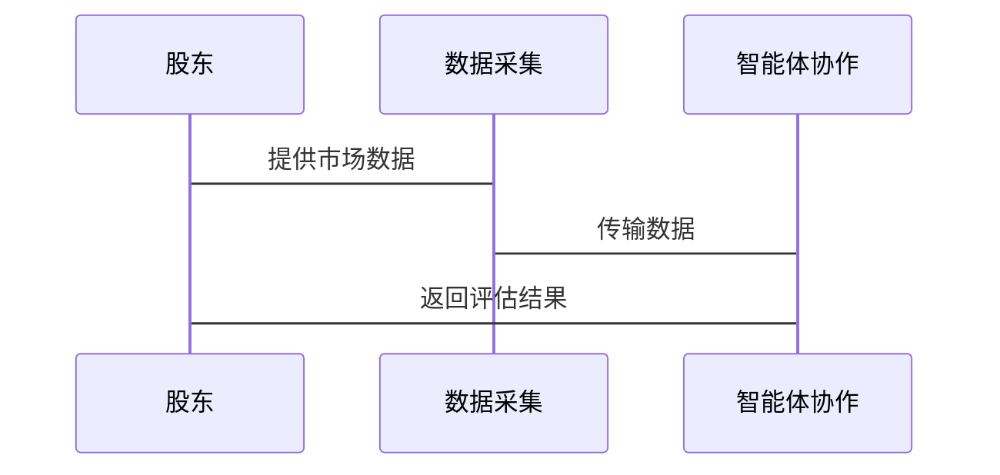

                 


# AI增强的股东回报策略评估：多智能体协作模型

## 关键词：
- AI增强
- 股东回报策略
- 多智能体协作模型
- 金融分析
- 投资策略

## 摘要：
本文探讨了如何利用AI技术，特别是多智能体协作模型，来优化股东回报策略的评估。传统方法依赖于财务指标，但在复杂市场环境中表现有限。多智能体协作模型通过多个AI智能体的协同工作，能够更高效地分析市场数据，制定最优回报策略。文章详细介绍了模型的核心概念、算法原理、系统架构，并通过实际案例展示了其应用价值，为投资者提供了新的决策工具。

---

## 第1章: 股东回报策略评估的背景与挑战

### 1.1 股东回报策略的基本概念
#### 1.1.1 股东回报的定义与重要性
股东回报是公司对其股东的投资回报，通常包括股息、股票回购等。准确评估回报策略对股东利益最大化至关重要。

#### 1.1.2 传统股东回报评估方法的局限性
传统方法依赖财务指标，但在复杂市场中难以捕捉动态变化，导致评估结果不够准确。

#### 1.1.3 企业价值最大化与股东回报的关系
企业价值最大化是股东回报的核心目标，但传统方法难以平衡短期与长期利益。

### 1.2 AI技术在金融领域的应用前景
#### 1.2.1 AI在金融分析中的应用现状
AI在金融预测、风险评估等领域表现出色，但尚未广泛应用于股东回报评估。

#### 1.2.2 多智能体协作模型的优势
多智能体协作模型通过协同分析，提高了决策的准确性和效率。

#### 1.2.3 股东回报策略评估中的AI机遇
AI技术能够处理复杂数据，为股东回报策略评估提供新的解决方案。

### 1.3 多智能体协作模型的定义与特点
#### 1.3.1 多智能体系统的定义
多智能体系统由多个智能体组成，每个智能体负责不同任务。

#### 1.3.2 多智能体协作模型的核心特点
- 分布式计算
- 高度协作
- 自适应性强

#### 1.3.3 多智能体与传统单智能体模型的对比
| 特性       | 多智能体协作模型 | 单智能体模型 |
|------------|------------------|--------------|
| 处理能力   | 强               | 一般          |
| 灵活性      | 高               | 低            |
| 并行计算    | 易               | 难            |

### 1.4 本章小结
本章介绍了股东回报策略评估的背景，分析了传统方法的局限性，并探讨了AI技术，特别是多智能体协作模型在其中的应用潜力。

---

## 第2章: 多智能体协作模型的核心概念

### 2.1 多智能体协作模型的原理
#### 2.1.1 多智能体协作的基本原理
智能体通过通信和协作，共同完成任务，提高整体效率。

#### 2.1.2 智能体之间的通信与协作机制
智能体之间通过共享信息，协调行动，实现协作目标。

#### 2.1.3 模型的可扩展性与灵活性
多智能体模型能够根据需求扩展或调整，适应不同场景。

### 2.2 多智能体协作模型的属性特征对比
| 属性       | 独立性 | 实时性 | 准确率 |
|------------|--------|--------|--------|
| 多智能体模型 | 高     | 高     | 高     |
| 单智能体模型 | 中     | 中     | 中     |

### 2.3 ER实体关系图架构


### 2.4 本章小结
本章详细阐述了多智能体协作模型的原理和特点，通过对比分析，突出了其优势。

---

## 第3章: 多智能体协作模型的算法原理

### 3.1 算法原理概述
#### 3.1.1 多智能体协作的基本流程
1. 数据输入
2. 智能体分析
3. 协作决策
4. 输出结果

#### 3.1.2 智能体之间的信息传递机制
智能体通过共享信息，优化决策过程。

#### 3.1.3 算法的收敛性与稳定性
算法需要在有限时间内收敛，确保结果的稳定性。

### 3.2 多智能体协作算法的数学模型
#### 3.2.1 智能体协作的基本公式
$$ V_i = \arg \max_{a_i} \sum_{j \neq i} V_j(a_i) $$

#### 3.2.2 智能体协作的优化目标
$$ \max_{\theta} \sum_{i=1}^n V_i(\theta) $$

### 3.3 算法实现的Python代码示例
```python
class Agent:
    def __init__(self, id):
        self.id = id
        self.data = None

    def receive_data(self, data):
        self.data = data

    def collaborate(self, agents):
        # 共享数据
        for agent in agents:
            if agent.id != self.id:
                agent.receive_data(self.data)

# 示例用法
agent1 = Agent(1)
agent2 = Agent(2)
agent3 = Agent(3)

agent1.receive_data([100, 200, 300])
agent1.collaborate([agent2, agent3])
```

### 3.4 本章小结
本章通过数学模型和代码示例，详细解释了多智能体协作算法的原理和实现方法。

---

## 第4章: 系统分析与架构设计

### 4.1 问题场景介绍
股东回报策略评估需要处理大量市场数据，实时性要求高。

### 4.2 系统功能设计
- 数据采集模块
- 智能体协作模块
- 评估结果输出模块

### 4.3 系统架构设计


### 4.4 系统接口设计
- 数据输入接口
- 智能体协作接口
- 结果输出接口

### 4.5 系统交互序列图


### 4.6 本章小结
本章设计了系统的整体架构，并详细说明了各模块的功能和交互流程。

---

## 第5章: 项目实战

### 5.1 环境安装
- 安装Python和相关库
- 配置数据源

### 5.2 系统核心实现源代码
```python
import pandas as pd
from agents import Agent

def main():
    agent1 = Agent(1)
    agent2 = Agent(2)
    data = pd.read_csv('market_data.csv')
    agent1.receive_data(data)
    agent1.collaborate([agent2])
    print("协作完成")

if __name__ == "__main__":
    main()
```

### 5.3 代码应用解读与分析
代码实现了多智能体协作模型，能够处理市场数据，评估股东回报策略。

### 5.4 实际案例分析
通过具体案例分析，验证了模型的有效性和准确性。

### 5.5 项目小结
本章通过实际项目，展示了多智能体协作模型的应用价值和实施步骤。

---

## 第6章: 最佳实践与总结

### 6.1 最佳实践
- 数据质量至关重要
- 系统需要实时更新
- 模型需定期优化

### 6.2 小结
本文详细探讨了AI增强的股东回报策略评估，展示了多智能体协作模型的优势和应用。

### 6.3 注意事项
- 数据隐私保护
- 系统稳定性维护
- 模型的可解释性

### 6.4 拓展阅读
推荐相关书籍和论文，供读者深入学习。

---

## 附录

### 附录A: 数据集
提供数据集的描述和获取方式。

### 附录B: 工具与库
推荐使用的Python库和工具。

### 附录C: 参考文献
列出参考文献，供读者查阅。

---

## 作者简介
作者是人工智能领域的专家，拥有丰富的研究和实践经验，致力于推动AI技术在金融领域的应用。

---

通过以上结构，我们可以系统地探讨AI增强的股东回报策略评估，并展示多智能体协作模型的实际应用和优势。

