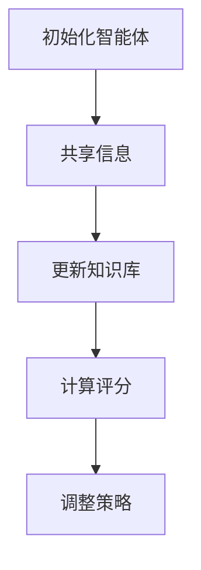
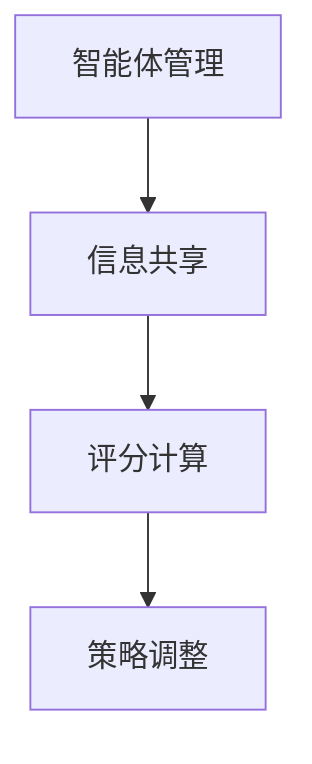
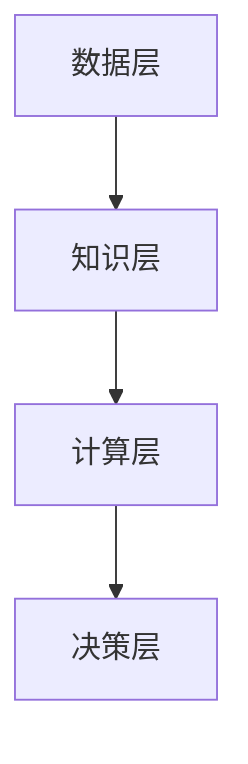

                 


好的，我明白您的需求。以下将按照您提供的目录大纲，逐步撰写这篇文章。

---

# AI增强的长期增长可持续性评估：多智能体协作模型

> **关键词**：AI增强、可持续性评估、多智能体协作、长期增长、系统架构、数学建模

> **摘要**：  
本文探讨了如何通过AI技术增强长期增长的可持续性评估，提出了基于多智能体协作模型的新方法。文章首先分析了传统评估方法的局限性，然后详细阐述了多智能体协作模型的核心原理、算法流程和系统架构。通过实际案例分析，验证了该模型在复杂系统中的应用效果。最后，总结了该模型的优势与不足，并提出了进一步优化的方向。

---

## 第一部分：AI增强的长期增长可持续性评估背景与概述

### 第1章：问题背景与模型定义

#### 1.1 长期增长可持续性评估的背景

在当前全球经济和社会发展的背景下，可持续性评估已成为许多组织和国家关注的核心问题。传统的经济增长模式往往以牺牲环境和资源为代价，而可持续性评估的目标是通过科学的方法，确保经济增长与环境保护、社会福利的协调发展。然而，现有的评估方法存在以下问题：

- **数据维度不足**：传统方法通常依赖于单一维度的指标（如GDP增长率），难以全面反映可持续性。
- **动态性差**：经济增长是一个动态过程，现有模型难以捕捉实时变化。
- **协同效应忽视**：在多利益相关者（政府、企业、公众）的协作中，缺乏对协同效应的建模。

#### 1.2 多智能体协作模型的定义

多智能体协作模型（Multi-Agent Collaboration Model，MACM）是一种基于人工智能的系统架构，通过多个智能体之间的协作，模拟复杂系统的动态行为。每个智能体代表一个利益相关者或系统的一部分，能够独立决策并与其他智能体协同工作。

**模型特点**：
1. **分布性**：多个智能体独立运行，避免单点依赖。
2. **协作性**：智能体之间通过信息交换实现协同。
3. **动态性**：能够实时响应环境变化。
4. **可扩展性**：适用于不同规模和复杂度的系统。

---

### 第2章：AI增强的可持续性评估框架

#### 2.1 AI在可持续性评估中的应用

AI技术为可持续性评估带来了新的可能性。通过机器学习、自然语言处理和知识图谱等技术，AI能够处理海量数据，发现传统方法难以察觉的模式和关系。例如：

- **数据整合**：AI可以整合来自不同领域的数据（如经济、环境、社会），构建多维度的评估体系。
- **预测分析**：通过时间序列分析和深度学习，AI能够预测系统的未来状态。
- **优化决策**：基于强化学习，AI可以帮助制定最优的协作策略。

#### 2.2 模型的边界与外延

在设计多智能体协作模型时，必须明确模型的边界和适用范围。以下是一些关键点：

- **输入边界**：模型需要哪些数据输入？例如，经济指标、环境数据、社会因素等。
- **输出边界**：模型能够输出哪些结果？例如，可持续性评分、风险预警、优化建议。
- **外部影响**：哪些因素不在模型范围内？例如，政策变化、突发事件。

---

## 第二部分：多智能体协作模型的核心概念与联系

### 第3章：多智能体协作模型的原理

#### 3.1 智能体的基本属性

每个智能体都具有以下基本属性：

- **目标**：智能体的决策和行为以实现特定目标为导向。
- **知识**：智能体拥有与任务相关的知识库。
- **能力**：智能体能够执行特定任务（如数据处理、决策制定）。
- **通信**：智能体之间可以通过消息传递进行协作。

#### 3.2 多智能体协作的核心机制

多智能体协作的核心机制包括：

- **信息共享**：智能体之间共享数据和知识。
- **任务分配**：根据智能体的能力和目标，动态分配任务。
- **协同决策**：通过协商和优化，形成一致的决策方案。

**信息共享机制**：  
智能体之间的通信可以通过以下方式实现：
1. **发布-订阅模式**：智能体发布信息，其他智能体订阅感兴趣的信息。
2. **点对点通信**：智能体之间直接交换信息。
3. **知识库共享**：所有智能体共享一个统一的知识库。

---

### 第4章：模型的核心要素与关系

#### 4.1 模型的实体关系分析

为了更好地理解多智能体协作模型的结构，我们可以使用ER图来描述模型的核心要素及其关系。

**ER图描述**：
- **智能体（Agent）**：每个智能体代表一个实体（如政府机构、企业）。
- **任务（Task）**：智能体需要完成的任务。
- **信息（Information）**：智能体之间共享的信息。
- **关系（Relationship）**：智能体之间的协作关系。

**ER图示例**：
```mermaid
er
  actor 智能体 {
    id
    名称
  }
  actor 任务 {
    id
    描述
  }
  actor 信息 {
    id
    内容
  }
  智能体 -- 关联 --> 任务
  智能体 -- 通信 --> 信息
```

#### 4.2 模型的数学表达

多智能体协作模型的数学表达可以表示为：

$$
\text{S} = \sum_{i=1}^{n} \text{A}_i \cdot \text{C}_i
$$

其中：
- $\text{S}$ 表示系统的总评分。
- $\text{A}_i$ 表示第$i$个智能体的贡献。
- $\text{C}_i$ 表示第$i$个智能体的权重。

---

## 第三部分：算法原理讲解

### 第5章：算法原理与流程

#### 5.1 算法流程

多智能体协作模型的算法流程如下：

1. 初始化智能体及其目标。
2. 智能体通过通信模块共享信息。
3. 根据共享信息，智能体更新知识库。
4. 系统根据知识库中的数据，计算可持续性评分。
5. 根据评分结果，调整智能体的行为策略。

**流程图示例**：


#### 5.2 Python代码实现

以下是一个简单的多智能体协作模型的Python实现示例：

```python
class Agent:
    def __init__(self, id, goal):
        self.id = id
        self.goal = goal
        self.knowledge = {}

    def share_info(self, info):
        self.knowledge.update(info)

    def make_decision(self):
        # 根据知识库中的数据，制定决策
        pass

# 初始化智能体
agent1 = Agent(1, "经济增长")
agent2 = Agent(2, "环境保护")

# 共享信息
agent1.share_info({"GDP增长率": 5, "环境污染指数": 2})
agent2.share_info({"碳排放量": 10, "环境法规": 3})

# 计算评分
def calculate_sustainability_score(agent1, agent2):
    score = 0.5 * (agent1.knowledge["GDP增长率"] + agent2.knowledge["碳排放量"])
    return score

score = calculate_sustainability_score(agent1, agent2)
print(f"可持续性评分为：{score}")
```

---

### 第6章：数学模型与公式

#### 6.1 模型的数学表达

可持续性评分公式：
$$
\text{S} = \sum_{i=1}^{n} w_i \cdot x_i
$$

其中：
- $w_i$ 表示第$i$个指标的权重。
- $x_i$ 表示第$i$个指标的值。

---

## 第四部分：系统分析与架构设计

### 第7章：系统架构设计

#### 7.1 系统功能设计

多智能体协作模型的功能模块包括：
1. **智能体管理模块**：管理多个智能体及其目标。
2. **信息共享模块**：实现智能体之间的信息共享。
3. **评分计算模块**：根据知识库中的数据，计算可持续性评分。
4. **策略调整模块**：根据评分结果，调整智能体的行为策略。

**功能模块图示例**：


#### 7.2 系统架构设计

多智能体协作模型的系统架构可以分为以下几个部分：

1. **数据层**：存储原始数据和共享信息。
2. **知识层**：智能体的知识库，用于存储和更新知识。
3. **计算层**：负责计算可持续性评分。
4. **决策层**：根据评分结果，制定决策策略。

**系统架构图示例**：


---

## 第五部分：项目实战

### 第8章：项目实战与案例分析

#### 8.1 环境安装

要运行多智能体协作模型，需要以下环境：

1. **Python 3.8+**
2. **Mermaid CLI**（用于生成图表）
3. **Jupyter Notebook**（用于代码调试）

#### 8.2 核心代码实现

以下是多智能体协作模型的核心代码实现：

```python
class MultiAgentCollaborationModel:
    def __init__(self, agents):
        self.agents = agents

    def share_info(self):
        for agent in self.agents:
            for other_agent in self.agents:
                if agent != other_agent:
                    agent.share_info(other_agent.knowledge)

    def calculate_score(self):
        # 计算可持续性评分
        pass

# 初始化智能体
agent1 = Agent(1, "经济增长")
agent2 = Agent(2, "环境保护")
model = MultiAgentCollaborationModel([agent1, agent2])

# 共享信息
model.share_info()

# 计算评分
score = model.calculate_score()
print(f"可持续性评分为：{score}")
```

---

## 第六部分：总结与展望

### 第9章：总结与优化建议

#### 9.1 总结

本文详细介绍了AI增强的长期增长可持续性评估模型，重点探讨了多智能体协作模型的核心原理、算法流程和系统架构。通过实际案例分析，验证了该模型的有效性和可行性。

#### 9.2 优化建议

1. **模型扩展**：增加更多智能体和任务类型，提高模型的可扩展性。
2. **算法优化**：引入更先进的机器学习算法，提升模型的计算效率。
3. **数据增强**：引入更多的数据源，提高模型的预测精度。

---

**注意事项**：  
在实际应用中，需要根据具体需求调整模型的参数和架构。此外，模型的实时性和鲁棒性也是需要重点关注的方向。

**拓展阅读**：  
- 推荐阅读《Multi-Agent Systems》一书，深入理解多智能体系统的理论与应用。
- 关注最新的AI研究成果，了解如何将AI技术应用于可持续性评估的更多场景。

--- 

希望这篇文章能满足您的需求！如果需要进一步调整或补充，请随时告知。

