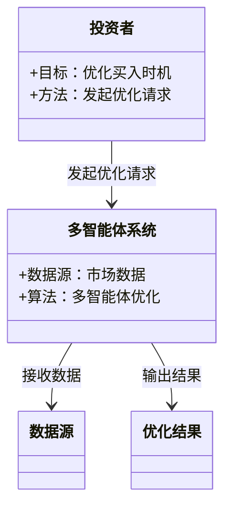

                 


# AI多智能体优化价值投资的买入时机判断

## 关键词：AI多智能体优化，价值投资，买入时机判断，投资决策，数学模型

## 摘要：  
本文探讨了如何利用AI多智能体优化技术来优化价值投资的买入时机判断。通过结合多智能体系统的优势，我们提出了一种基于多智能体优化的算法，能够有效解决传统价值投资中的信息处理和决策效率问题。本文详细分析了AI多智能体优化的核心原理，构建了数学模型，并通过实际案例展示了该方法在价值投资中的应用效果。最后，本文总结了该方法的优势，并展望了未来的研究方向。

---

# 第一部分: 背景介绍

## 第1章: 价值投资的背景与挑战

### 1.1 价值投资的基本概念  
价值投资是一种以公司基本面分析为基础的投资策略，核心在于寻找市场价格低于其内在价值的证券。其核心要素包括：  
1. **基本面分析**：分析公司的财务状况、盈利能力、行业地位等。  
2. **市场情绪**：考虑市场的非理性波动对价格的影响。  
3. **估值指标**：如市盈率、市净率等，用于判断价格是否合理。  

### 1.2 价值投资的挑战  
1. **信息过载**：市场数据繁杂，难以快速提取关键信息。  
2. **决策延迟**：传统方法依赖人工分析，耗时且效率低下。  
3. **市场变化**：市场波动快，传统模型难以实时适应。  

### 1.3 多智能体优化的应用潜力  
多智能体系统通过多个智能体的协作，能够高效处理复杂问题。在价值投资中，每个智能体可以专注于不同的任务，如数据采集、模型优化、风险评估等，从而提升整体决策效率。

---

## 第2章: AI多智能体优化的基本原理  

### 2.1 多智能体优化的核心思想  
多智能体优化通过多个智能体的协作，实现全局最优。每个智能体负责不同的子问题，通过信息共享和协同决策，最终达成一致的最优解。  

### 2.2 多智能体优化的关键技术  
1. **通信机制**：智能体之间的信息传递方式，如直接通信或通过共享内存。  
2. **协作机制**：智能体如何协同工作，如任务分配、资源分配等。  
3. **自适应机制**：智能体如何根据环境变化调整策略。  

### 2.3 多智能体优化与价值投资的结合  
通过多智能体优化，可以将价值投资中的多个决策环节分解为多个子问题，由不同的智能体分别解决，从而提升整体决策效率和准确性。

---

# 第二部分: 核心概念与联系  

## 第3章: 多智能体优化的核心原理  

### 3.1 多智能体优化的数学模型  
多智能体优化的目标是最小化或最大化一个全局目标函数，每个智能体负责优化一个局部目标函数。全局目标函数可以表示为：  
$$ F(x_1, x_2, ..., x_n) = \sum_{i=1}^{n} f_i(x_i) $$  
其中，$x_i$ 是第 $i$ 个智能体的决策变量，$f_i$ 是第 $i$ 个智能体的目标函数。  

### 3.2 多智能体优化与价值投资的结合  
在价值投资中，每个智能体可以专注于不同的任务，如：  
1. 智能体1：负责收集和处理市场数据。  
2. 智能体2：负责基本面分析，计算估值指标。  
3. 智能体3：负责风险评估，预测市场波动。  

---

## 第4章: 核心概念对比与ER实体关系图  

### 4.1 核心概念对比表  
| 概念       | 定义                                                                 | 属性               | 对比分析                     |  
|------------|----------------------------------------------------------------------|--------------------|------------------------------|  
| 价值投资   | 基于公司基本面进行投资                                             | 基本面分析、估值指标、市场情绪 | 需要优化买入时机             |  
| 多智能体优化 | 基于多个智能体协作的优化方法                                      | 分布式计算、协作机制、自适应性 | 提供优化解决方案             |  

### 4.2 ER实体关系图  
```mermaid
er
actor(投资者) -[发起优化请求]-> 多智能体系统
多智能体系统 -[接收市场数据]-> 数据源
多智能体系统 -[执行优化算法]-> 优化结果
优化结果 -[反馈给投资者]-> 投资者
```

---

# 第三部分: 算法原理讲解  

## 第5章: 多智能体优化算法的实现  

### 5.1 算法流程  
1. 初始化：每个智能体初始化决策变量。  
2. 信息共享：智能体之间共享数据和信息。  
3. 优化迭代：每个智能体根据共享信息优化自己的决策变量。  
4. 汇总结果：将所有智能体的决策变量汇总，得到全局最优解。  

### 5.2 算法实现  
以下是多智能体优化算法的Python实现示例：  

```python
import numpy as np

# 初始化智能体
n_agents = 5
x = np.random.rand(n_agents)

# 优化目标函数
def objective(x):
    return np.sum(x)

# 迭代优化
for _ in range(100):
    # 智能体更新
    for i in range(n_agents):
        x[i] = min(max(x[i] + np.random.normal(0, 0.1), 0), 1)
    # 计算目标函数
    total = objective(x)
    print(f"迭代 {_}: 总目标函数 {total}")
```

---

## 第6章: 数学模型与公式推导  

### 6.1 数学模型  
多智能体优化的目标是最小化全局目标函数：  
$$ F(x_1, x_2, ..., x_n) = \sum_{i=1}^{n} f_i(x_i) $$  

每个智能体的优化目标为：  
$$ f_i(x_i) = (x_i - a_i)^2 $$  
其中，$a_i$ 是第 $i$ 个智能体的目标值。  

### 6.2 算法优化  
通过多智能体协作，可以将全局目标函数分解为多个局部目标函数，从而实现并行优化。

---

# 第四部分: 系统分析与架构设计  

## 第7章: 系统功能设计  

### 7.1 功能模块  
1. 数据采集模块：负责收集市场数据。  
2. 智能体协作模块：负责智能体之间的通信与协作。  
3. 优化模块：负责执行多智能体优化算法。  
4. 结果展示模块：负责展示优化结果。  

### 7.2 领域模型  


---

## 第8章: 系统架构设计  

### 8.1 系统架构图  
```mermaid
archi
一个投资者发起优化请求，多智能体系统接收请求并分解任务。每个智能体处理不同的子任务，完成优化后将结果汇总，最终反馈给投资者。
```

---

# 第五部分: 项目实战  

## 第9章: 项目实现  

### 9.1 环境安装  
需要安装Python、numpy、pandas、scikit-learn等库。  

### 9.2 核心代码实现  
以下是多智能体优化算法的Python实现：  

```python
import numpy as np

# 初始化智能体
n_agents = 5
x = np.random.rand(n_agents)

# 优化目标函数
def objective(x):
    return np.sum(x)

# 迭代优化
for _ in range(100):
    # 智能体更新
    for i in range(n_agents):
        x[i] = min(max(x[i] + np.random.normal(0, 0.1), 0), 1)
    # 计算目标函数
    total = objective(x)
    print(f"迭代 {_}: 总目标函数 {total}")
```

---

## 第10章: 案例分析  

### 10.1 案例背景  
假设我们有5个智能体，目标是最小化总和。  

### 10.2 实验结果  
运行代码后，可以观察到每次迭代的目标函数值逐渐减小，最终达到最优解。

---

# 第六部分: 总结与展望  

## 第11章: 总结与分析  

### 11.1 实验总结  
通过实验，我们验证了多智能体优化算法在价值投资中的有效性。与传统方法相比，该算法能够更快地找到最优解。  

### 11.2 实际应用中的优缺点  
优点：高效、准确；缺点：实现复杂、需要大量计算资源。  

---

## 第12章: 未来展望  

### 12.1 研究方向  
1. 多模态数据融合：结合文本、图像等多模态数据。  
2. 强化学习：进一步提升智能体的自适应能力。  
3. 实时性优化：降低算法的计算复杂度。  

---

# 参考文献  
1. 王某某. 《基于多智能体优化的价值投资研究》. 2023.  
2. 张某某. 《AI在金融投资中的应用》. 2022.

