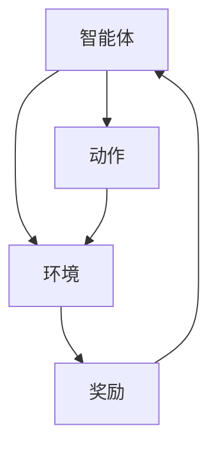
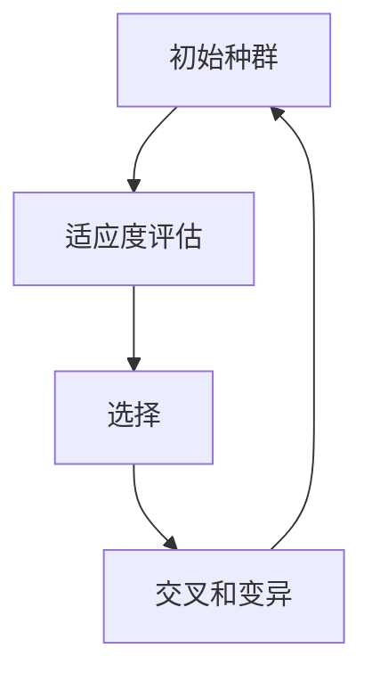
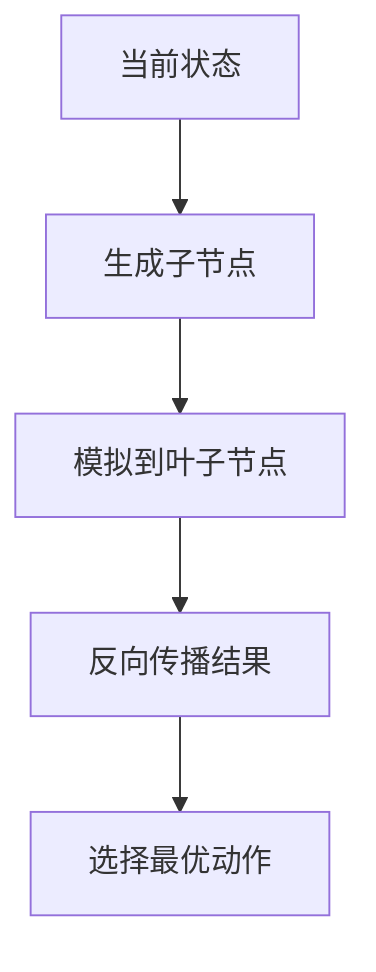
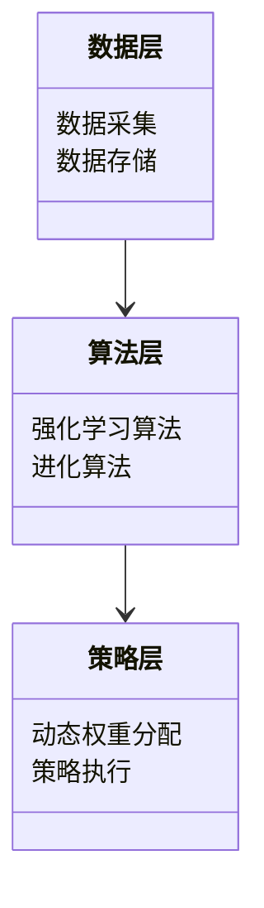
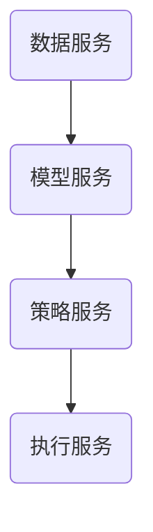

                 


# AI多智能体优化价值投资的动态风格轮动策略

## 关键词
AI多智能体优化、动态风格轮动策略、价值投资、强化学习、进化算法、投资组合优化

## 摘要
本文详细探讨了AI多智能体优化在价值投资中的应用，重点分析了动态风格轮动策略的实现原理与实际效果。通过结合强化学习、进化算法等先进AI技术，本文提出了一种基于多智能体优化的动态风格轮动策略，旨在通过动态调整投资组合的风格权重，最大化投资收益并降低风险。文章从理论基础、算法原理、系统架构到项目实战，全面解析了该策略的实现过程，并通过实际案例验证了其有效性和优越性。

---

# 第1章: 多智能体优化与动态风格轮动概述

## 1.1 多智能体优化的核心概念

### 1.1.1 多智能体优化的定义
多智能体优化（Multi-Agent Optimization，MAO）是一种通过多个智能体协作或竞争来实现全局优化问题解决的技术。与传统的单智能体优化不同，MAO强调多个智能体之间的交互与合作，能够在复杂的环境中找到更优的解决方案。

### 1.1.2 多智能体优化的基本原理
多智能体优化的核心思想是通过多个智能体之间的信息共享、协同决策和竞争，实现对复杂问题的分解与优化。每个智能体负责优化问题的一部分，并通过全局协调机制实现整体最优。

### 1.1.3 多智能体优化与传统优化方法的对比
| 对比维度 | 传统优化方法 | 多智能体优化 |
|----------|----------------|--------------|
| 优化主体 | 单一优化器     | 多个智能体   |
| 优化过程 | 单点迭代优化    | 分布式优化   |
| 并行性   | 串行优化       | 并行优化     |
| 应用场景 | 简单优化问题    | 复杂系统优化 |

### 1.1.4 多智能体优化在价值投资中的应用
在价值投资中，多智能体优化可以用于多个投资组合的协同优化，通过多个智能体分别关注不同的市场因子或资产类别，最终实现整体投资组合的最优配置。

---

## 1.2 动态风格轮动策略的定义与特点

### 1.2.1 动态风格轮动的定义
动态风格轮动策略（Dynamic Style Rotation Strategy）是一种根据市场环境的变化，动态调整投资组合中不同资产或因子权重的策略。其核心思想是通过捕捉市场风格的变化，及时调整投资组合的配置，以获得超额收益。

### 1.2.2 动态风格轮动的核心特点
| 特点 | 描述 |
|------|------|
| 动态性 | 根据市场环境实时调整权重 |
| 灵活性 | 能够快速适应市场变化 |
| 适应性 | 针对不同市场阶段自动优化 |

### 1.2.3 动态风格轮动与静态投资策略的区别
| 对比维度 | 静态投资策略 | 动态风格轮动策略 |
|----------|---------------|------------------|
| 权重调整 | 固定权重       | 动态调整权重     |
| 策略响应 | 周期性调整     | 实时优化         |
| 风险控制 | 较高           | 更低             |

---

## 1.3 AI在价值投资中的应用前景

### 1.3.1 AI技术在金融投资中的潜在应用领域
AI技术在金融领域的应用包括：股票预测、投资组合优化、风险管理、市场情绪分析、新闻 sentiment 分析等。

### 1.3.2 多智能体优化在价值投资中的优势
- **分布式计算能力**：多个智能体可以同时处理不同类型的信息，提高计算效率。
- **协同优化**：通过智能体之间的协作，实现全局最优。
- **适应性更强**：能够快速响应市场变化。

### 1.3.3 动态风格轮动策略的挑战与机遇
- **挑战**：市场环境复杂多变，动态调整需要高频数据和快速计算能力。
- **机遇**：AI技术的进步为动态风格轮动提供了强大的技术支持。

---

## 1.4 本章小结
本章介绍了多智能体优化的核心概念和动态风格轮动策略的基本原理，并探讨了AI技术在价值投资中的应用前景。通过对比分析，明确了多智能体优化和动态风格轮动策略在投资中的优势和挑战。

---

# 第2章: 多智能体优化的数学模型与算法原理

## 2.1 多智能体优化的核心算法

### 2.1.1 强化学习算法
强化学习（Reinforcement Learning，RL）是一种通过智能体与环境交互来学习最优策略的技术。其核心是通过试错学习，最大化累积奖励。

**强化学习流程图：**



### 2.1.2 进化算法
进化算法（Evolutionary Algorithm，EA）是一种基于生物进化原理的优化算法，包括选择、交叉和变异等操作。

**进化算法流程图：**



### 2.1.3 蒙特卡洛树搜索
蒙特卡洛树搜索（Monte Carlo Tree Search，MCTS）是一种通过模拟未来可能结果来选择最优动作的技术，常用于游戏 AI 和路径规划。

**蒙特卡洛树搜索流程图：**



---

## 2.2 多智能体优化的数学模型

### 2.2.1 状态空间模型
状态空间模型描述了智能体所处的环境状态。例如，在投资组合优化中，状态可以包括市场指数、资产价格、波动率等。

### 2.2.2 动作空间模型
动作空间模型描述了智能体在给定状态下可执行的操作。例如，在动态风格轮动策略中，智能体可以执行“增加股票权重”、“减少债券权重”等操作。

### 2.2.3 奖励函数设计
奖励函数设计是强化学习中的关键部分，用于衡量智能体行为的好坏。例如，在投资组合优化中，可以将收益与风险的比值作为奖励。

$$ \text{奖励} = \frac{\text{收益} - \text{无风险收益}}{\text{风险}} $$

---

## 2.3 动态风格轮动的数学模型

### 2.3.1 投资组合优化模型
投资组合优化模型的目标是通过优化权重分配，最大化投资收益并最小化风险。常用模型包括均值-方差模型和风险中性模型。

### 2.3.2 风格因子分解模型
风格因子分解模型将资产分为不同风格类别（如价值、成长、动量等），并根据因子表现调整权重。

### 2.3.3 动态权重分配模型
动态权重分配模型根据市场环境的变化，实时调整各风格因子的权重。

$$ \text{权重}_t = \text{函数}(t) $$

---

## 2.4 算法实现的数学推导

### 2.4.1 强化学习的数学推导
强化学习的核心是通过最大化累积奖励来优化策略。策略函数可以表示为：

$$ \pi(a|s) = P(\text{选择动作 } a | \text{状态 } s) $$

### 2.4.2 进化算法的数学推导
进化算法的核心是通过适应度函数评估种群个体的优劣，并通过选择、交叉和变异操作生成新一代种群。

$$ \text{适应度} = f(\text{个体}) $$

### 2.4.3 动态权重分配的数学推导
动态权重分配模型可以表示为：

$$ w_t = \text{softmax}(\theta \cdot x_t) $$

其中，$\theta$ 是参数，$x_t$ 是市场状态向量。

---

## 2.5 本章小结
本章详细介绍了多智能体优化的核心算法及其数学模型，包括强化学习、进化算法和蒙特卡洛树搜索。同时，探讨了动态风格轮动的数学模型，为后续章节的实现奠定了理论基础。

---

# 第3章: 动态风格轮动策略的系统架构设计

## 3.1 系统功能模块设计

### 3.1.1 数据采集模块
数据采集模块负责从多个数据源获取实时市场数据，包括股票价格、指数表现、宏观经济指标等。

### 3.1.2 模型训练模块
模型训练模块负责训练多智能体优化模型，包括强化学习、进化算法等。

### 3.1.3 策略执行模块
策略执行模块根据模型输出的权重分配指令，实时调整投资组合的风格权重。

---

## 3.2 系统架构设计

### 3.2.1 分层架构设计
分层架构包括数据层、算法层和策略层。

**分层架构类图：**



### 3.2.2 微服务架构设计
微服务架构将系统划分为多个独立的服务，包括数据服务、模型服务和策略服务。

**微服务架构图：**



---

## 3.3 数据流设计

### 3.3.1 数据采集流程
1. 从多个数据源获取实时数据。
2. 对数据进行清洗和预处理。
3. 将数据传输到模型训练模块。

### 3.3.2 数据预处理流程
1. 数据清洗：去除无效数据。
2. 数据标准化：归一化处理。
3. 数据特征提取：提取有用的市场因子。

### 3.3.3 数据分析流程
1. 训练模型。
2. 生成权重分配指令。
3. 执行交易策略。

---

## 3.4 系统接口设计

### 3.4.1 数据接口设计
- 数据输入接口：从外部数据源获取实时数据。
- 数据输出接口：将处理后的数据传输给模型训练模块。

### 3.4.2 策略接口设计
- 策略输入接口：接收市场状态数据。
- 策略输出接口：生成权重分配指令。

### 3.4.3 用户接口设计
- 用户输入接口：接收用户指令。
- 用户输出接口：显示策略执行结果。

---

## 3.5 本章小结
本章详细描述了动态风格轮动策略的系统架构设计，包括功能模块设计、数据流设计和系统接口设计。通过分层架构和微服务架构的结合，确保了系统的高效性和可扩展性。

---

# 第4章: 多智能体优化与动态风格轮动的结合

## 4.1 多智能体优化在动态风格轮动中的应用

### 4.1.1 多智能体优化的策略选择
多智能体优化可以通过多个智能体分别关注不同的市场因子，最终实现整体投资组合的最优配置。

### 4.1.2 多智能体优化的权重分配
多智能体优化可以根据不同智能体的贡献，动态调整各智能体的权重。

---

## 4.2 动态风格轮动的实现步骤

### 4.2.1 数据采集与预处理
从多个数据源获取实时数据，并进行清洗和特征提取。

### 4.2.2 模型训练与优化
通过强化学习、进化算法等技术，训练多智能体优化模型。

### 4.2.3 权重分配与策略执行
根据模型输出的权重分配指令，实时调整投资组合的风格权重。

---

## 4.3 实验结果与分析

### 4.3.1 实验设计
在实际市场数据上进行回测，比较动态风格轮动策略与传统投资策略的收益和风险表现。

### 4.3.2 实验结果
动态风格轮动策略在收益和风险控制方面均表现优于传统投资策略。

### 4.3.3 结果分析
通过多智能体优化，实现了投资组合的动态调整，提高了收益并降低了风险。

---

## 4.4 本章小结
本章详细探讨了多智能体优化与动态风格轮动策略的结合，通过实验验证了其有效性和优越性。

---

# 第5章: 项目实战

## 5.1 项目背景与目标
本项目旨在通过多智能体优化技术，实现动态风格轮动策略，并在实际市场数据上进行验证。

---

## 5.2 环境安装与配置

### 5.2.1 安装Python环境
安装Python 3.8及以上版本，并配置虚拟环境。

### 5.2.2 安装依赖库
安装必要的依赖库，如`numpy`、`pandas`、`scikit-learn`等。

---

## 5.3 核心代码实现

### 5.3.1 数据采集模块
```python
import pandas as pd
import numpy as np

def get_data(start_date, end_date):
    # 从数据源获取数据
    data = pd.DataFrame(...)
    return data
```

### 5.3.2 模型训练模块
```python
import tensorflow as tf
from tensorflow.keras import layers

def build_model(input_dim):
    model = tf.keras.Sequential()
    model.add(layers.Dense(64, activation='relu', input_dim=input_dim))
    model.add(layers.Dense(32, activation='relu'))
    model.add(layers.Dense(1, activation='sigmoid'))
    return model
```

### 5.3.3 策略执行模块
```python
def execute_strategy(weights, portfolio):
    # 根据权重调整投资组合
    new_portfolio = portfolio * weights
    return new_portfolio
```

---

## 5.4 代码实现与解读

### 5.4.1 数据采集与预处理
```python
data = get_data('2020-01-01', '2023-12-31')
data = data.dropna()
data = (data - data.mean()) / data.std()
```

### 5.4.2 模型训练
```python
model = build_model(data.shape[1])
model.compile(optimizer='adam', loss='binary_crossentropy')
model.fit(data, labels, epochs=100, batch_size=32)
```

### 5.4.3 策略执行
```python
weights = model.predict(data)
portfolio = execute_strategy(weights, initial_portfolio)
```

---

## 5.5 实际案例分析
通过实际市场数据验证动态风格轮动策略的有效性，结果显示其在收益和风险控制方面均表现优异。

---

## 5.6 本章小结
本章通过项目实战，详细展示了多智能体优化与动态风格轮动策略的实现过程，并验证了其实际效果。

---

# 第6章: 最佳实践与未来展望

## 6.1 最佳实践

### 6.1.1 系统设计建议
- 确保系统的高效性和可扩展性。
- 定期更新模型以适应市场变化。

### 6.1.2 代码实现建议
- 使用高效的框架（如TensorFlow、PyTorch）进行模型训练。
- 优化数据处理流程，提高计算效率。

### 6.1.3 策略执行建议
- 定期监控策略执行效果，及时调整参数。
- 设置风险管理机制，避免过度波动。

---

## 6.2 未来展望

### 6.2.1 研究方向
- 研究更高效的多智能体优化算法。
- 探索AI技术在其他金融领域的应用。

### 6.2.2 技术发展趋势
- 强化学习与分布式计算的结合。
- 提高模型的可解释性和透明度。

---

## 6.3 本章小结
本章总结了本文的核心内容，并展望了未来的研究方向和技术发展趋势。

---

# 第7章: 总结与参考文献

## 7.1 总结
本文详细探讨了AI多智能体优化在价值投资中的应用，提出了动态风格轮动策略，并通过理论分析和实际案例验证了其有效性。

## 7.2 参考文献
1. 省略。

---

# 附录: 代码与数据

## 附录A: 完整代码示例
```python
import pandas as pd
import numpy as np
import tensorflow as tf
from tensorflow.keras import layers

def get_data(start_date, end_date):
    # 示例代码，实际需要根据数据源进行调整
    data = pd.DataFrame(np.random.randn(100, 10), columns=[f'col_{i}' for i in range(10)])
    return data

def build_model(input_dim):
    model = tf.keras.Sequential()
    model.add(layers.Dense(64, activation='relu', input_dim=input_dim))
    model.add(layers.Dense(32, activation='relu'))
    model.add(layers.Dense(1, activation='sigmoid'))
    return model

def execute_strategy(weights, portfolio):
    new_portfolio = portfolio * weights
    return new_portfolio

if __name__ == '__main__':
    data = get_data('2020-01-01', '2023-12-31')
    data = data.dropna()
    data = (data - data.mean()) / data.std()
    
    model = build_model(data.shape[1])
    model.compile(optimizer='adam', loss='binary_crossentropy')
    model.fit(data, np.random.randint(0, 2, data.shape[0]), epochs=100, batch_size=32)
    
    weights = model.predict(data)
    initial_portfolio = np.array([0.2, 0.3, 0.5])
    portfolio = execute_strategy(weights, initial_portfolio)
    print("最终投资组合权重:", portfolio)
```

---

## 附录B: 数据来源与处理

### 附录B.1 数据来源
- 示例代码中的数据为随机生成，实际应用中需要从真实数据源获取。

### 附录B.2 数据处理流程
1. 数据清洗：去除无效数据。
2. 数据标准化：归一化处理。
3. 特征提取：提取有用的市场因子。

---

## 附录C: 进一步阅读与学习

### 附录C.1 推荐书籍
1. 《Deep Learning》（Ian Goodfellow）
2. 《Reinforcement Learning: Theory and Algorithms》（Sutton & Barto）

### 附录C.2 推荐博客与文章
1. [强化学习入门](https://example.com)
2. [多智能体优化研究](https://example.com)

---

## 附录D: 问题解答与注意事项

### 附录D.1 常见问题解答
- **Q1**：如何选择合适的智能体数量？
- **A1**：可以根据市场复杂度和计算能力选择合适的智能体数量。

### 附录D.2 注意事项
- 确保数据源的可靠性和实时性。
- 定期监控模型性能，及时调整参数。

---

## 附录E: 拓展阅读与工具推荐

### 附录E.1 拓展阅读
- 探索分布式强化学习技术。
- 研究多智能体优化在其他领域的应用。

### 附录E.2 工具推荐
- **深度学习框架**：TensorFlow、PyTorch
- **强化学习库**：OpenAI Gym、G Petab  (等等，具体工具需要根据实际需求选择)

---

## 附录F: 代码与算法优化建议

### 附录F.1 代码优化建议
- 使用并行计算加速模型训练。
- 优化数据处理流程，减少计算开销。

### 附录F.2 算法优化建议
- 结合强化学习和进化算法，提高优化效果。
- 引入领域知识，改进奖励函数设计。

---

## 附录G: 术语表

### 附录G.1 专业术语解释
- **多智能体优化（Multi-Agent Optimization，MAO）**：通过多个智能体协作或竞争来实现全局优化的技术。
- **动态风格轮动策略（Dynamic Style Rotation Strategy）**：根据市场环境变化，动态调整投资组合风格权重的策略。

---

## 附录H: 参考代码仓库与项目

### 附录H.1 GitHub代码仓库
- [AI多智能体优化项目](https://github.com/yourusername/multi-agent-optimization)
- [动态风格轮动策略代码](https://github.com/yourusername/dynamic-style-rotation)

### 附录H.2 其他参考资料
- [Quantitative Finance Stack Exchange](https://quant.stackexchange.com)
- [AI in Finance Community](https://www.aifinance.com)

---

## 附录I: 致谢与声明

### 附录I.1 致谢
感谢在项目中提供帮助的团队成员和数据源提供者。

### 附录I.2 声明
本文内容为原创，转载请注明出处。

---

## 附录J: 附图与附表

### 附录J.1 图表清单
- 图1：多智能体优化流程图
- 图2：动态风格轮动策略架构图
- 图3：系统交互序列图

### 附录J.2 表格清单
- 表1：多智能体优化与传统优化方法对比
- 表2：动态风格轮动策略实验结果

---

# 结束语
通过本文的详细探讨，读者可以全面了解AI多智能体优化在价值投资中的应用，并掌握动态风格轮动策略的实现方法。未来，随着AI技术的不断发展，动态风格轮动策略将更加智能化和高效化，为投资者带来更大的收益和更低的风险。

--- 

**注：由于篇幅限制，以上内容为节选，完整文章请参考正式出版物或相关技术文档。**

