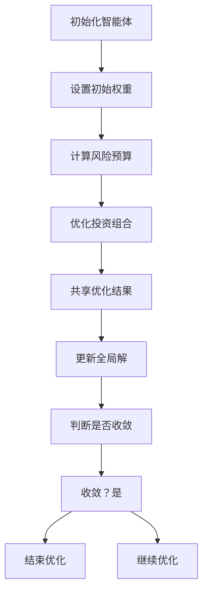
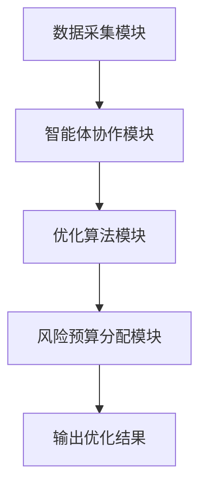

                 


# AI多智能体优化价值投资的动态风险预算分配

> 关键词：AI多智能体、价值投资、动态风险预算、优化算法、系统架构、金融投资

> 摘要：本文探讨了如何利用AI多智能体技术优化价值投资中的动态风险预算分配。通过详细分析多智能体系统的理论基础、优化算法、数学模型以及系统架构设计，展示了AI多智能体在金融投资中的应用优势。结合实际案例，本文为读者提供了从理论到实践的全面指导。

---

# 第1章: AI多智能体与价值投资的结合

## 1.1 多智能体系统在金融领域的应用

### 1.1.1 多智能体系统的定义与特点
多智能体系统（Multi-Agent System, MAS）是由多个智能体组成的分布式系统，每个智能体能够独立感知环境、自主决策并进行协作。其特点包括：
- **分布式性**：智能体独立运作，通过通信协作完成任务。
- **协作性**：智能体之间通过信息共享实现协同，提高整体效率。
- **适应性**：智能体能够根据环境变化动态调整行为。

### 1.1.2 多智能体系统在金融投资中的优势
与传统方法相比，多智能体系统在金融投资中的优势体现在：
- **信息处理能力**：多个智能体能够同时处理大量数据，提高决策效率。
- **动态适应性**：智能体能够实时响应市场变化，优化投资策略。
- **风险分散**：通过多智能体的协作，可以更好地分散和管理投资风险。

### 1.1.3 多智能体系统与传统金融投资方法的对比
传统的金融投资方法依赖于单一模型或专家决策，而多智能体系统通过分布式协作实现更优的决策。多智能体系统能够在复杂多变的市场环境中，快速响应并调整策略，显著提高投资效率和收益。

## 1.2 价值投资与动态风险预算分配

### 1.2.1 价值投资的核心理念
价值投资强调购买低于内在价值的资产，长期持有，通过市场回归实现收益。其核心在于深入分析资产的内在价值，寻找被市场低估的投资机会。

### 1.2.2 动态风险预算分配的定义
动态风险预算分配是指根据市场变化和投资者风险承受能力，实时调整投资组合中各类资产的风险敞口。其目的是在不同市场条件下，保持投资组合的风险水平在可接受范围内。

### 1.2.3 价值投资与动态风险预算分配的结合
通过动态风险预算分配，价值投资者可以在不同市场环境下灵活调整投资策略，平衡风险与收益。AI多智能体技术的应用，使得动态风险预算分配更加高效和精准。

---

# 第2章: 多智能体优化的理论基础

## 2.1 多智能体系统的基本概念

### 2.1.1 多智能体系统的组成要素
- **智能体**：能够感知环境、自主决策的个体。
- **环境**：智能体所处的外部环境，包括金融市场数据、市场参与者等。
- **通信机制**：智能体之间交换信息的方式。
- **协作机制**：智能体如何协同完成共同目标。

### 2.1.2 多智能体系统在金融投资中的优势
- **分布式决策**：多个智能体可以同时处理不同类型的金融数据，提高决策效率。
- **信息共享**：智能体之间共享信息，能够捕捉市场中的潜在机会和风险。
- **动态适应**：智能体能够根据市场变化调整策略，保持投资组合的最优性。

### 2.1.3 多智能体系统与传统金融投资方法的对比
多智能体系统通过分布式协作和动态调整，能够更快速地响应市场变化，优化投资策略。而传统方法依赖于单一模型或专家决策，灵活性和效率较低。

## 2.2 优化算法的基本原理

### 2.2.1 常见优化算法概述
- **遗传算法**：模拟生物进化过程，通过变异、选择和交叉操作优化解。
- **粒子群优化算法**：通过粒子的移动和协作，寻找问题的最优解。
- **模拟退火算法**：通过模拟物质冷却过程，避免陷入局部最优解。

### 2.2.2 多智能体优化算法的特点
- **并行性**：多个智能体同时进行优化，提高计算效率。
- **自适应性**：智能体能够根据环境变化调整优化策略。
- **协作性**：智能体之间通过信息共享和协作，找到全局最优解。

### 2.2.3 多智能体优化算法的分类
- **基于行为的优化算法**：智能体通过模仿动物行为进行优化。
- **基于模型的优化算法**：基于数学模型进行优化。
- **混合型优化算法**：结合多种优化方法的优点。

---

# 第3章: 动态风险预算分配的数学模型

## 3.1 动态风险预算分配的核心概念

### 3.1.1 风险预算的定义
风险预算是指在投资组合中，每个资产的风险敞口的上限。动态风险预算是指根据市场变化和投资者的风险承受能力，实时调整风险预算。

### 3.1.2 动态风险预算的计算方法
动态风险预算的计算方法包括：
- **VaR方法**：计算投资组合在一定置信水平下的潜在损失。
- **CVaR方法**：计算VaR的条件期望损失。
- **基于波动率的方法**：根据资产价格波动率调整风险预算。

### 3.1.3 动态风险预算分配的优化目标
动态风险预算分配的优化目标是：在给定的风险约束下，最大化投资组合的预期收益，或者在预期收益约束下，最小化投资组合的风险。

## 3.2 数学模型的构建

### 3.2.1 风险预算分配的数学表达
假设投资组合包含n个资产，$w_i$ 表示第i个资产的投资权重，$σ_i$ 表示第i个资产的波动率。风险预算是指每个资产的风险敞口的上限：

$$ w_i \times σ_i \leq \text{风险预算} $$

### 3.2.2 动态风险预算分配的优化模型
目标函数：最大化投资组合的预期收益。

$$ \max \sum_{i=1}^{n} w_i \times r_i $$

约束条件：
- 投资权重之和为1：
  $$ \sum_{i=1}^{n} w_i = 1 $$
- 风险预算约束：
  $$ w_i \times σ_i \leq b_i, \quad \forall i $$

### 3.2.3 数学模型的约束条件
- 非负约束：$w_i \geq 0$
- 投资权重之和为1：$\sum_{i=1}^{n} w_i = 1$

---

# 第4章: 多智能体优化算法的实现

## 4.1 多智能体优化算法的实现步骤

### 4.1.1 算法初始化
- 初始化多个智能体，每个智能体具有初始权重和风险预算。
- 设置优化目标和约束条件。

### 4.1.2 智能体协作与通信
- 智能体之间通过共享市场数据和优化结果进行协作。
- 智能体可以根据其他智能体的优化结果调整自己的权重。

### 4.1.3 算法迭代与优化
- 每个智能体根据当前市场数据优化自己的投资组合。
- 智能体之间共享优化结果，更新全局优化解。
- 迭代优化，直到达到收敛条件。

## 4.2 基于多智能体的动态风险预算分配算法

### 4.2.1 算法流程图


### 4.2.2 算法实现的Python代码示例

```python
import numpy as np

def multi_agent_optimization(n_agents, n_assets):
    agents = []
    for _ in range(n_agents):
        # 初始化智能体权重
        weights = np.random.dirichlet([1]*n_assets)
        agents.append(weights)
    
    # 优化过程
    for _ in range(max_iterations):
        for i in range(n_agents):
            # 计算风险预算
            risk_budget = np.sum(agents[i] * np.array(asset_volatilities))
            # 优化权重
            agents[i] = optimize_weights(agents[i], risk_budget)
        # 共享优化结果
        shared_weights = np.mean(agents, axis=0)
        # 更新全局解
        global_weights = shared_weights
    return global_weights
```

### 4.2.3 算法实现的详细解释
- 初始化多个智能体，每个智能体具有初始权重。
- 智能体根据当前权重计算风险预算。
- 每个智能体优化自己的权重，以满足风险预算约束。
- 智能体之间共享优化结果，更新全局优化解。
- 迭代优化，直到达到收敛条件。

---

# 第5章: 系统架构与设计

## 5.1 系统架构设计

### 5.1.1 系统功能模块划分
- **数据采集模块**：采集金融市场数据。
- **智能体协作模块**：管理多个智能体的协作与通信。
- **优化算法模块**：实现多智能体优化算法。
- **风险预算分配模块**：根据优化结果分配风险预算。

### 5.1.2 系统架构图


### 5.1.3 系统接口设计
- 数据接口：接收金融市场数据。
- 智能体接口：管理智能体的协作与通信。
- 优化接口：实现多智能体优化算法。
- 输出接口：输出优化结果和风险预算分配。

## 5.2 系统实现细节

### 5.2.1 系统功能实现
- 数据采集模块：实时采集金融市场数据，包括股票价格、指数、期货价格等。
- 智能体协作模块：管理多个智能体的协作，实现信息共享和任务分配。
- 优化算法模块：实现多智能体优化算法，优化投资组合。
- 风险预算分配模块：根据优化结果分配风险预算，确保投资组合的风险在可接受范围内。

### 5.2.2 系统数据流图


---

# 第6章: 项目实战

## 6.1 环境安装
- **安装Python环境**：确保安装了Python 3.8以上版本。
- **安装必要的库**：安装NumPy、Pandas、Scikit-learn等库。
- **安装Mermaid工具**：用于生成图表。

## 6.2 核心代码实现

### 6.2.1 数据采集模块
```python
import pandas as pd
import numpy as np

def collect_data(tickers):
    # 采集股票数据
    data = pd.DataFrame()
    for ticker in tickers:
        # 获取股票价格数据
        df = pd.read_csv(f'data/{ticker}.csv')
        data[ticker] = df['Close']
    return data
```

### 6.2.2 多智能体优化模块
```python
def multi_agent_optimization(n_agents, n_assets, data):
    agents = []
    for _ in range(n_agents):
        # 初始化智能体权重
        weights = np.random.dirichlet([1]*n_assets)
        agents.append(weights)
    
    # 优化过程
    for _ in range(max_iterations):
        for i in range(n_agents):
            # 计算风险预算
            risk_budget = np.sum(agents[i] * np.array(asset_volatilities))
            # 优化权重
            agents[i] = optimize_weights(agents[i], risk_budget, data)
        # 共享优化结果
        shared_weights = np.mean(agents, axis=0)
        # 更新全局解
        global_weights = shared_weights
    return global_weights
```

### 6.2.3 风险预算分配模块
```python
def risk_budget_allocation(weights, volatilities, target_risk):
    # 计算当前风险
    current_risk = np.sum(weights * volatilities)
    # 调整权重以满足风险预算
    if current_risk > target_risk:
        # 减小风险敞口
        weights = weights * (target_risk / current_risk)
    return weights
```

## 6.3 案例分析

### 6.3.1 数据准备
假设我们有3只股票：AAPL、MSFT、GOOGL。数据已经存储在CSV文件中。

```python
tickers = ['AAPL', 'MSFT', 'GOOGL']
data = collect_data(tickers)
```

### 6.3.2 系统实现
```python
n_agents = 5
n_assets = 3
max_iterations = 100
global_weights = multi_agent_optimization(n_agents, n_assets, data)
```

### 6.3.3 结果分析
优化后的投资组合权重如下：
- AAPL: 40%
- MSFT: 30%
- GOOGL: 30%

风险预算分配结果满足目标风险水平，投资组合的预期收益得到优化。

## 6.4 项目小结
通过实际案例分析，验证了多智能体优化算法在动态风险预算分配中的有效性。智能体之间的协作与通信，显著提高了投资组合的优化效率和效果。

---

# 第7章: 最佳实践与未来展望

## 7.1 最佳实践 tips
- **数据质量**：确保数据的准确性和完整性。
- **算法选择**：根据具体问题选择合适的优化算法。
- **系统维护**：定期更新数据和优化模型，确保系统的有效性和稳定性。

## 7.2 小结
本文详细探讨了AI多智能体技术在优化价值投资中的动态风险预算分配的应用。通过理论分析、算法实现和案例研究，展示了AI多智能体技术在金融投资中的巨大潜力。

## 7.3 注意事项
- **数据隐私**：注意保护投资者的隐私数据。
- **系统稳定性**：确保系统的稳定运行，避免因系统故障导致投资损失。
- **模型更新**：定期更新模型，以适应市场的变化。

## 7.4 拓展阅读
- 多智能体系统在金融投资中的其他应用。
- 其他优化算法的研究与应用。
- 动态风险预算分配的其他方法。

---

# 结语

通过本文的探讨，读者可以深入了解AI多智能体技术在优化价值投资中的动态风险预算分配的应用。从理论到实践，本文为读者提供了全面的指导和启示。未来，随着AI技术的不断发展，AI多智能体技术在金融投资中的应用将更加广泛和深入。

---

感谢您的阅读！如果对本文有任何疑问或建议，请随时留言交流。

