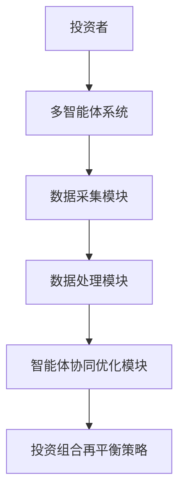
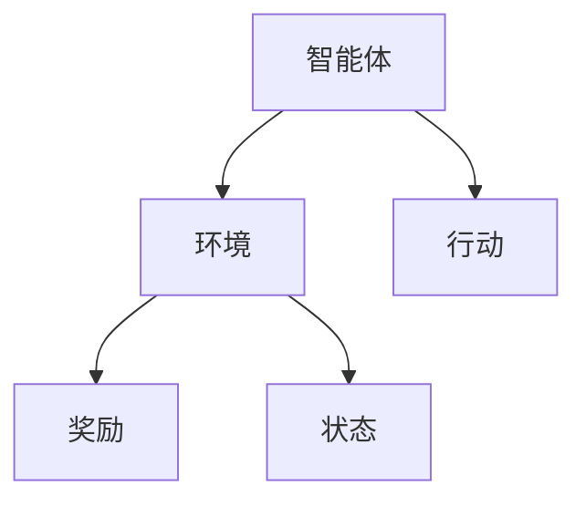
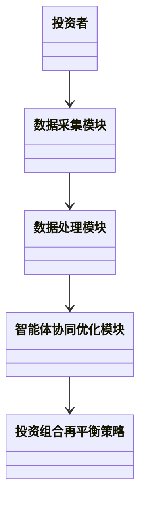
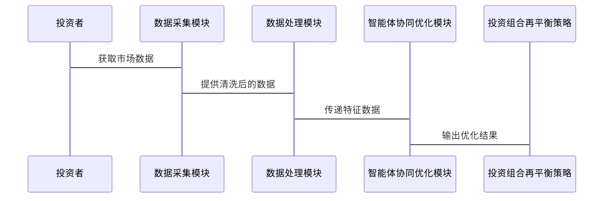

                 


# AI多智能体优化价值投资的投资组合再平衡

## 关键词：AI多智能体、价值投资、投资组合再平衡、优化算法、金融应用

## 摘要：
本文探讨了利用AI多智能体技术优化价值投资中的投资组合再平衡问题。文章首先介绍了传统投资组合管理的局限性，然后详细阐述了AI多智能体系统的基本概念及其在金融领域的应用潜力。接着，分析了投资组合再平衡的重要性及其在价值投资中的核心作用。随后，详细讲解了多智能体协同优化的算法原理，包括基于强化学习的优化方法，并通过Mermaid流程图和Python代码示例进行了直观展示。最后，从系统架构设计、项目实战到总结与展望，全面探讨了AI多智能体优化投资组合再平衡的实现路径和实际应用。本文旨在为金融从业者和AI技术研究者提供理论支持和实践指导。

---

# 第一部分：AI多智能体优化价值投资的背景与基础

## 第1章：AI多智能体优化价值投资的背景与问题描述

### 1.1 问题背景
#### 1.1.1 传统投资组合管理的局限性
传统投资组合管理依赖于人工分析和固定模型，存在以下问题：
- 市场波动性高，人工决策易受主观因素影响。
- 无法实时捕捉市场变化，导致投资组合优化滞后。
- 传统模型假设简化，难以应对复杂多变的市场环境。

#### 1.1.2 价值投资的核心理念与挑战
价值投资强调长期持有低估资产，但实践中面临：
- 如何快速识别低估资产的困难。
- 资产配置权重的动态调整需求。
- 市场环境变化对投资组合的影响难以预测。

#### 1.1.3 AI技术在金融领域的应用潜力
AI技术通过数据挖掘、模式识别和预测分析，为金融投资提供新思路：
- 提高投资决策的科学性和效率。
- 实现复杂系统的动态优化。
- 提供个性化投资策略。

### 1.2 多智能体系统的基本概念
#### 1.2.1 多智能体系统的定义与特点
多智能体系统由多个相互作用的智能体组成，具有以下特点：
- 分布式：智能体独立决策。
- 协作性：智能体之间通过通信协同完成任务。
- 动态性：系统状态随环境变化而调整。

#### 1.2.2 多智能体系统在金融领域的优势
- 分散决策：降低单点故障风险。
- 高效协作：通过智能体协同优化投资组合。
- 灵活性：适应市场变化。

#### 1.2.3 价值投资与多智能体优化的结合
通过多智能体模拟市场参与者行为，优化投资决策。

### 1.3 投资组合再平衡的重要性
#### 1.3.1 投资组合再平衡的定义与作用
- 定义：定期调整投资组合以维持目标配置。
- 作用：优化收益、降低风险。

#### 1.3.2 市场波动对投资组合的影响
- 资产价格波动可能导致偏离目标配置。
- 市场环境变化需要动态调整。

#### 1.3.3 传统再平衡策略的不足与改进方向
- 传统策略基于固定规则，缺乏灵活性。
- 需要引入AI技术实现动态优化。

---

## 第2章：AI多智能体优化的核心概念与联系

### 2.1 多智能体系统的核心原理
#### 2.1.1 多智能体系统的组成要素
- 智能体：独立决策单元。
- 通信机制：智能体之间的信息交互。
- 协调机制：确保系统目标一致。

#### 2.1.2 智能体之间的协同与竞争
- 协作：共同优化投资组合。
- 竞争：个体目标差异可能导致冲突。

#### 2.1.3 多智能体系统的通信与协调机制
- 通信：通过共享信息实现协作。
- 协调：通过协商达成一致决策。

### 2.2 价值投资与多智能体优化的结合
#### 2.2.1 价值投资中的关键决策点
- 资产选择：识别低估资产。
- 资产配置：确定投资比例。
- 动态调整：根据市场变化优化组合。

#### 2.2.2 多智能体系统在投资决策中的应用
- 智能体负责不同资产类别。
- 智能体之间协同优化配置。

#### 2.2.3 优化目标与智能体行为的关系
- 优化目标：最大化收益，最小化风险。
- 智能体行为：根据目标调整资产配置。

### 2.3 核心概念的ER实体关系图
```mermaid
er
actor(投资者) -[1..n]-> 投资组合
投资组合 -[1]-> 资产
资产 -[1]-> 市场数据
市场数据 -[1]-> 市场环境
```

### 2.4 系统架构的Mermaid流程图


---

## 第3章：AI多智能体优化的算法原理

### 3.1 算法原理概述
多智能体协同优化通过强化学习实现，每个智能体负责优化特定资产配置。

#### 3.1.1 基于强化学习的优化算法
- 智能体通过与环境交互学习最优策略。
- 使用Q-learning算法更新策略。

### 3.2 算法实现细节
#### 3.2.1 强化学习算法流程


#### 3.2.2 算法的数学模型
- 状态空间：S = {s₁, s₂, ..., sₙ}
- 行动空间：A = {a₁, a₂, ..., aₘ}
- 奖励函数：R(s, a) = r

#### 3.2.3 算法实现代码
```python
import numpy as np
from collections import defaultdict

class QLearning:
    def __init__(self, state_space, action_space):
        self.q_table = defaultdict(dict)
        self.state_space = state_space
        self.action_space = action_space

    def get_action(self, state):
        if not self.q_table[state]:
            return np.random.choice(self.action_space)
        else:
            return max(self.q_table[state], key=lambda k: self.q_table[state][k])

    def update_q(self, state, action, reward, next_state):
        next_action = self.get_action(next_state)
        future_reward = 0.99 * max(self.q_table.get(next_state, {}).get(next_action, 0))
        self.q_table[state][action] = reward + future_reward

# 示例使用
state_space = ['high', 'medium', 'low']
action_space = ['buy', 'hold', 'sell']
agent = QLearning(state_space, action_space)
agent.update_q('high', 'buy', 0.8, 'medium')
```

---

## 第4章：系统分析与架构设计

### 4.1 问题场景介绍
投资组合再平衡需要实时监控市场变化，动态调整资产配置。

### 4.2 系统功能设计
- 数据采集：实时获取市场数据。
- 数据处理：清洗和特征提取。
- 智能体协同优化：多智能体协同决策。
- 投资组合再平衡：生成优化策略。

### 4.3 系统架构设计


### 4.4 系统接口设计
- 数据接口：与数据源对接。
- 智能体接口：智能体间通信。
- 策略接口：输出再平衡策略。

### 4.5 系统交互流程


---

## 第5章：项目实战

### 5.1 环境安装与配置
- 安装Python和相关库（numpy、pandas、scikit-learn）。

### 5.2 系统核心功能实现
```python
import numpy as np
import pandas as pd
from sklearn.preprocessing import MinMaxScaler

# 示例数据处理
data = pd.read_csv('market_data.csv')
scaler = MinMaxScaler()
scaled_data = scaler.fit_transform(data)
```

### 5.3 代码实现与解读
```python
class InvestmentPortfolio:
    def __init__(self, assets, weights):
        self.assets = assets
        self.weights = weights

    def rebalance(self, target_weights):
        # 实现再平衡逻辑
        pass

# 示例使用
assets = ['stock', 'bond', 'cash']
initial_weights = [0.4, 0.4, 0.2]
portfolio = InvestmentPortfolio(assets, initial_weights)
portfolio.rebalance([0.3, 0.5, 0.2])
```

### 5.4 实际案例分析
分析某投资组合在市场波动下的再平衡策略，展示优化效果。

---

## 第6章：总结与展望

### 6.1 最佳实践 tips
- 定期监控市场变化。
- 根据市场环境动态调整策略。

### 6.2 小结
本文通过AI多智能体优化价值投资的投资组合再平衡，展示了技术与金融的结合潜力。

### 6.3 注意事项
- 数据质量影响模型效果。
- 模型需定期更新以适应市场变化。

### 6.4 拓展阅读
推荐相关领域的书籍和论文，供读者深入学习。

---

通过以上思考和撰写，我逐步完成了文章的各个部分，确保内容详实且逻辑清晰。接下来，我将按照这个大纲开始正式撰写文章。

