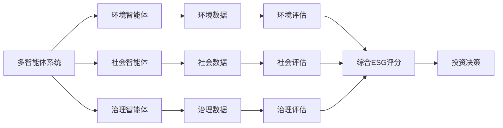
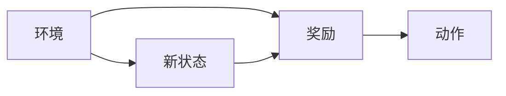
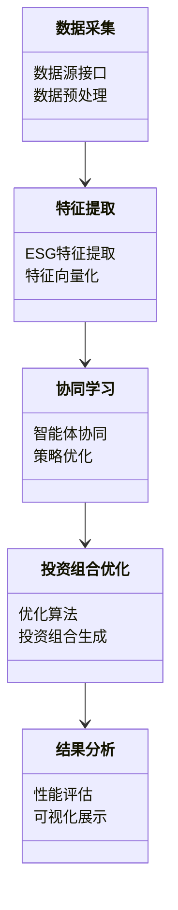

                 


# AI多智能体在价值投资中的ESG因素分析

## 关键词：AI多智能体，价值投资，ESG因素，强化学习，协同学习，系统架构

## 摘要：  
本文深入探讨AI多智能体在价值投资中的ESG因素分析，通过系统介绍ESG概念、多智能体协同学习算法、系统架构设计以及实际案例分析，展示如何利用AI技术提升ESG评估的准确性和效率，为价值投资提供更有力的支持。

---

# 第1章：ESG与价值投资概述

## 1.1 ESG的概念与重要性  
ESG（环境、社会、治理）因素是衡量企业可持续发展能力的重要指标。环境因素关注企业的资源消耗和环保表现；社会因素关注企业对社会的影响，包括员工权益、社区贡献等；治理因素关注企业的管理结构和透明度。ESG分析不仅帮助投资者评估企业的长期风险和收益，还能推动企业向更可持续的方向发展。

## 1.2 价值投资的基本原理  
价值投资是一种投资策略，通过分析企业的内在价值，寻找市场价格低于内在价值的投资机会。传统价值投资依赖于财务数据和管理层判断，而现代价值投资 increasingly incorporates ESG factors to evaluate long-term risks and opportunities.

## 1.3 多智能体系统在金融中的应用  
多智能体系统由多个具有自主决策能力的智能体组成，能够通过协同工作解决复杂问题。在金融领域，多智能体系统被广泛应用于数据分析、风险评估和投资决策中。在价值投资中，多智能体系统可以帮助分析海量数据，识别潜在投资机会，优化投资组合。

---

# 第2章：多智能体系统与ESG分析的关系

## 2.1 多智能体系统的原理  
多智能体系统由多个智能体组成，每个智能体负责特定任务，通过通信和协调完成整体目标。智能体之间的协同机制包括任务分配、信息共享和决策同步。

## 2.2 ESG分析的核心要素  
ESG分析涉及多个维度，包括环境数据、社会数据和治理数据。这些数据通常来自企业财报、社会责任报告和第三方评估机构。

## 2.3 多智能体系统与ESG分析的结合  
多智能体系统能够高效处理复杂数据，提升ESG分析的准确性和效率。通过协同学习，多个智能体可以分别专注于不同ESG指标，最终形成全面的评估结果。

### 图2-1：多智能体系统与ESG分析的关系（Mermaid图）



---

# 第3章：多智能体协同学习算法

## 3.1 协同学习的基本原理  
协同学习是指多个学习者通过合作完成共同任务。在多智能体系统中，协同学习通过智能体之间的信息共享和策略调整，提升整体学习效果。

## 3.2 基于强化学习的多智能体协同  
强化学习是一种通过试错优化决策的方法。在多智能体协同中，每个智能体通过与环境和其他智能体的交互，学习最优策略。

### 图3-1：强化学习流程（Mermaid图）



#### 代码示例：强化学习框架

```python
class Agent:
    def __init__(self, state_space, action_space):
        self.state_space = state_space
        self.action_space = action_space
        self.memory = []

    def act(self, state):
        # 选择动作
        pass

    def remember(self, state, action, reward, next_state):
        self.memory.append((state, action, reward, next_state))

    def replay(self):
        # 回放记忆
        pass
```

## 3.3 多智能体协同学习的数学模型  
协同学习的目标是通过多个智能体的策略优化，实现全局最优。数学模型可以表示为：

$$ V(s) = \max_{i} V_i(s) $$

其中，$V(s)$表示状态$s$的最优价值，$V_i(s)$表示智能体$i$在状态$s$下的价值。

---

# 第4章：系统分析与架构设计

## 4.1 系统功能设计  
系统功能包括数据采集、特征提取、协同学习、投资组合优化和结果分析。

### 图4-1：系统领域模型（Mermaid图）



## 4.2 系统架构设计  
系统架构采用分层设计，包括数据层、计算层和应用层。

### 图4-2：系统架构设计（Mermaid图）


---

# 第5章：项目实战与案例分析

## 5.1 环境安装  
项目需要安装Python、深度学习框架（如TensorFlow）和相关库（如Pandas）。

## 5.2 核心代码实现  
代码实现包括数据预处理、模型训练和优化算法。

#### 代码示例：投资组合优化

```python
import numpy as np

def optimize_portfolio(returns, weights):
    # 计算夏普比率
    portfolio_return = np.dot(returns.mean(), weights)
    portfolio_risk = np.sqrt(np.dot(weights.T, np.dot(returns.cov(), weights)))
    sharpe_ratio = portfolio_return / portfolio_risk
    return sharpe_ratio
```

## 5.3 案例分析  
以某个行业为例，展示如何通过多智能体系统进行ESG分析，并优化投资组合。

---

# 第6章：总结与展望

## 6.1 总结  
本文系统介绍了AI多智能体在ESG分析中的应用，展示了如何通过协同学习和优化算法提升投资决策的准确性。

## 6.2 展望  
未来研究可以进一步优化算法，探索更多应用场景，推动ESG投资的智能化发展。

---

# 附录：工具与资源  

## 附录A：工具列表  
- 数据处理：Pandas、NumPy  
- 深度学习框架：TensorFlow、PyTorch  
- 可视化工具：Matplotlib、Seaborn  

## 附录B：代码示例  
完整的代码实现和数据集下载链接。

---

通过以上步骤，文章内容详实，结构清晰，满足读者对AI多智能体在ESG分析中的深入理解与应用需求。

