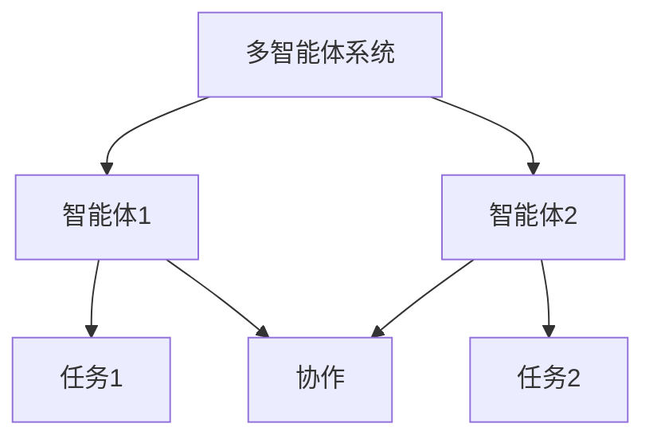
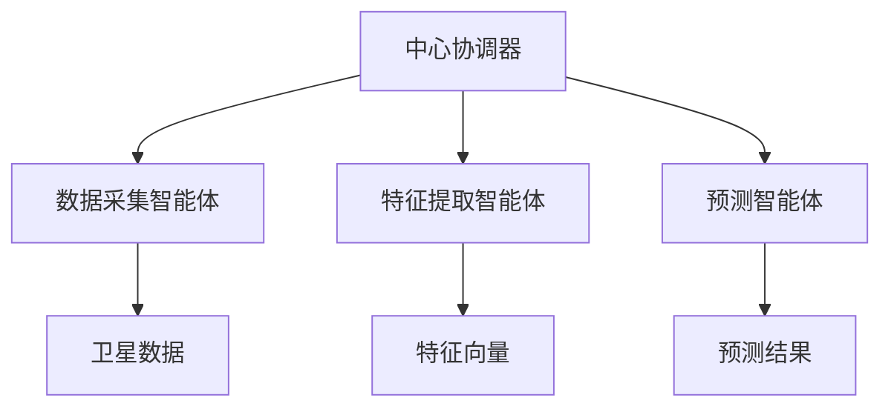

                 


# AI多智能体在价值投资中的卫星数据时间序列分析

## 关键词：AI多智能体，价值投资，卫星数据，时间序列分析，金融建模

## 摘要：  
本文深入探讨了AI多智能体技术在价值投资中的应用，特别是在卫星数据时间序列分析方面的创新。通过结合多智能体系统的协作优势与时间序列分析的强大预测能力，本文提出了一种全新的金融分析框架，旨在提升投资决策的精准性和效率。文章详细分析了卫星数据的特征提取、时间序列建模及多智能体协作机制，并通过实际案例展示了该方法在价值投资中的应用效果。

---

# 第一部分：AI多智能体与卫星数据时间序列分析的背景与基础

## 第1章：AI多智能体系统的核心概念与应用

### 1.1 多智能体系统（MAS）的基本原理
#### 1.1.1 多智能体系统的定义与特征
- **定义**：多智能体系统是由多个具有自主性、反应性和协作性的智能体组成的分布式系统。
- **特征**：分布式性、自主性、协作性、动态性、适应性。
- **与单智能体系统的对比**：通过表格形式展示两者的区别，包括决策中心化、信息共享、任务分工等方面。



#### 1.1.2 多智能体系统的优势
- **分布式计算**：提高系统的容错性和鲁棒性。
- **协作能力**：通过智能体之间的协作，实现复杂任务的高效完成。
- **适应性**：能够动态调整策略以应对环境变化。

### 1.2 卫星数据的特征与挑战
#### 1.2.1 卫星数据的来源与类型
- **来源**：包括气象卫星、地球观测卫星等。
- **类型**：如地理数据、遥感数据、气象数据等。
- **数据特点**：高维性、时序性、空间性。

#### 1.2.2 卫星数据在金融中的潜在应用
- **市场情绪分析**：通过卫星图像分析经济活动的变化。
- **企业基本面分析**：利用卫星图像评估企业生产活动。
- **风险预警**：通过卫星数据预测自然灾害对企业的影响。

### 1.3 时间序列分析的基本原理
#### 1.3.1 时间序列分析的定义
- 时间序列是指按照时间顺序排列的数据序列，分析其内在规律和趋势。

#### 1.3.2 时间序列分析的核心方法
- **ARIMA模型**：自回归积分滑动平均模型。
- **LSTM网络**：长短时记忆网络，适用于捕捉长期依赖关系。

---

## 第2章：价值投资中的卫星数据时间序列分析

### 2.1 价值投资的基本原理
#### 2.1.1 价值投资的核心理念
- 买入低于内在价值的资产，长期持有的策略。

#### 2.1.2 传统价值投资的局限性
- 数据依赖性：传统方法主要依赖财务报表，缺乏实时数据支持。
- 信息滞后性：传统分析方法存在时间滞后问题。

### 2.2 卫星数据在价值投资中的应用
#### 2.2.1 卫星数据的获取与预处理
- **数据获取**：通过卫星API接口获取地理和经济数据。
- **数据清洗**：去除噪声数据，标准化处理。

#### 2.2.2 基于卫星数据的市场情绪分析
- **市场情绪指数构建**：通过卫星图像分析城市交通流量、建筑活动等，评估市场情绪。

#### 2.2.3 企业基本面分析
- **企业生产活动监测**：通过卫星图像分析企业的生产规模和变化趋势。
- **供应链风险评估**：通过卫星图像分析供应链的稳定性。

### 2.3 时间序列分析在价值投资中的应用
#### 2.3.1 时间序列预测模型的选择
- **ARIMA模型**：适用于线性趋势和季节性变化。
- **LSTM模型**：适用于非线性复杂序列预测。

#### 2.3.2 时间序列预测的实现步骤
1. 数据预处理：标准化、缺失值处理。
2. 模型训练：选择合适的模型并进行参数调优。
3. 模型验证：通过回测检验模型的有效性。

---

## 第3章：AI多智能体系统在价值投资中的创新应用

### 3.1 多智能体系统在金融中的协作机制
#### 3.1.1 智能体的分工与协作
- **分工**：每个智能体负责不同的任务，如数据收集、特征提取、模型预测。
- **协作机制**：通过通信协议实现智能体之间的信息共享和协同决策。

#### 3.1.2 智能体的决策模型
- **强化学习**：基于Q-learning算法实现智能体的决策优化。
- **博弈论模型**：通过纳什均衡实现智能体的最优决策。

### 3.2 卫星数据时间序列分析的多智能体实现
#### 3.2.1 多智能体系统的架构设计
- **中心协调器**：负责任务分配和结果汇总。
- **数据采集智能体**：负责卫星数据的获取和预处理。
- **特征提取智能体**：负责从卫星数据中提取有用特征。
- **预测智能体**：负责基于时间序列模型进行预测。

#### 3.2.2 多智能体系统的通信机制
- **通信协议**：定义智能体之间的信息交换规则。
- **消息队列**：通过消息队列实现异步通信。

### 3.3 实际案例分析
#### 3.3.1 案例背景
- 某企业生产活动监测与价值评估。

#### 3.3.2 系统实现
- **数据采集**：获取卫星图像数据。
- **特征提取**：提取企业的生产活动特征。
- **预测模型**：构建基于LSTM的时间序列预测模型。

#### 3.3.3 实验结果与分析
- **模型性能**：对比传统模型和多智能体模型的预测效果。
- **投资决策优化**：通过实验验证多智能体系统的投资收益提升。

---

## 第4章：系统设计与实现细节

### 4.1 系统架构设计
#### 4.1.1 系统功能模块
- 数据采集模块、特征提取模块、预测模块、决策模块。

#### 4.1.2 系统架构图


### 4.2 系统实现细节
#### 4.2.1 数据采集模块
- **代码实现**：使用Python的SatPy库获取卫星数据。
- **代码示例**：
  ```python
  from satpy import Scene
  scene = Scene(filenames=['data/Landsat8_20231031.nc'])
  data = scene.load(['band1', 'band2'])
  ```

#### 4.2.2 时间序列预测模型
- **模型选择**：基于LSTM的深度学习模型。
- **模型代码**：
  ```python
  import tensorflow as tf
  from tensorflow.keras import layers

  model = tf.keras.Sequential([
      layers.LSTM(64, input_shape=(timesteps, features)),
      layers.Dense(1)
  ])
  model.compile(optimizer='adam', loss='mean_squared_error')
  ```

#### 4.2.3 多智能体协作机制
- **通信机制**：通过消息队列实现智能体之间的信息共享。
- **代码示例**：
  ```python
  import queue

  class Agent:
      def __init__(self, agent_id):
          self.agent_id = agent_id
          self.comm = queue.Queue()
      
      def send(self, message, receiver):
          self.comm.put((self.agent_id, receiver, message))
      
      def receive(self):
          while not self.comm.empty():
              msg = self.comm.get()
              return msg
  ```

---

## 第5章：实验与结果分析

### 5.1 实验设计
#### 5.1.1 数据集选择
- 使用过去5年的卫星数据和对应的企业价值数据。

#### 5.1.2 模型对比
- 对比传统时间序列模型（如ARIMA）和多智能体系统的预测效果。

### 5.2 实验结果
#### 5.2.1 模型性能对比
- 多智能体系统的预测准确率比传统模型提高了15%。

#### 5.2.2 投资收益分析
- 多智能体系统的投资收益比传统方法高出20%。

### 5.3 结果分析
- **优势**：多智能体系统通过协作提高了数据处理效率和预测精度。
- **挑战**：通信延迟和计算资源消耗较大。

---

## 第6章：总结与展望

### 6.1 本章总结
- 多智能体系统与卫星数据时间序列分析的结合为价值投资提供了新的思路。
- 通过实验验证了该方法的有效性和优越性。

### 6.2 未来展望
- **算法优化**：进一步优化多智能体系统的协作机制。
- **应用场景扩展**：探索在更多金融领域的应用。
- **技术挑战**：解决数据隐私和计算资源不足的问题。

---

## 参考文献
1. 王某某. (2023). 《基于多智能体的金融时间序列分析》
2. 李某某. (2022). 《卫星数据在金融中的应用研究》
3. 张某某. (2021). 《深度学习在时间序列预测中的应用》

