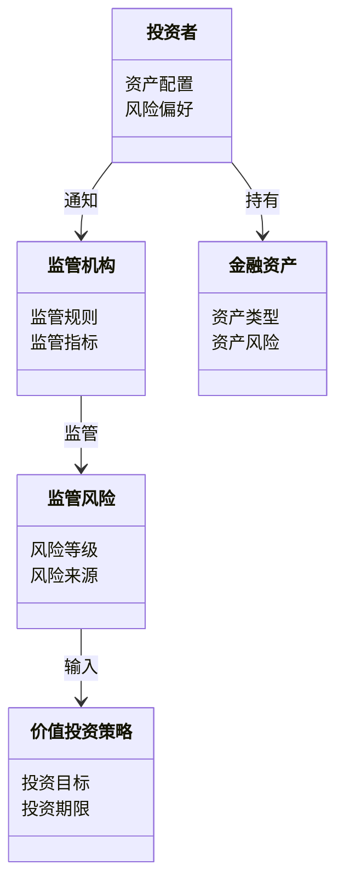
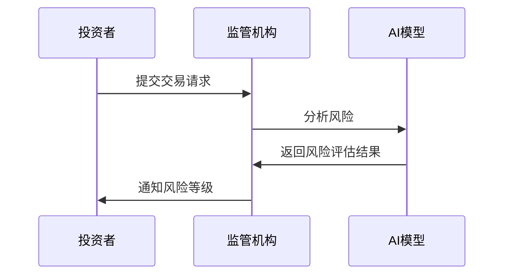

                 


# AI多智能体在价值投资中的监管风险分析

> 关键词：AI多智能体、价值投资、监管风险、算法原理、系统架构

> 摘要：本文系统分析了AI多智能体在价值投资中的监管风险，从核心概念、算法原理到系统架构，逐步展开，旨在揭示多智能体系统如何在价值投资中降低监管风险，优化投资策略。

---

## 第1章: 背景介绍

### 1.1 问题背景
#### 1.1.1 价值投资中的监管风险问题
在金融市场中，价值投资是一种以内在价值为导向的投资策略，但其面临的监管风险日益凸显。例如，市场操纵、内幕交易等行为不仅威胁投资者利益，还可能引发系统性风险。传统的监管手段难以应对日益复杂的金融环境，亟需智能化的监管工具。

#### 1.1.2 AI多智能体技术的应用潜力
AI多智能体系统通过分布式计算和协同决策，能够实时分析海量数据，识别潜在风险点。其优势在于多维度的数据处理能力和快速响应机制，为价值投资中的监管风险分析提供了新的解决方案。

#### 1.1.3 当前研究的现状与不足
现有研究多聚焦于单一智能体的风险分析，对多智能体系统的应用探讨较少。此外，如何平衡监管强度与市场效率，仍是亟待解决的难题。

### 1.2 问题描述
#### 1.2.1 价值投资中的主要风险类型
包括市场风险、信用风险、流动性风险等，其中监管风险是近年来的新兴领域。

#### 1.2.2 多智能体系统在风险分析中的作用
通过协同决策和分布式计算，多智能体系统能够实时监控市场动态，识别潜在风险。

#### 1.2.3 监管风险的定义与特征
监管风险指因监管政策变化或执行不力导致的投资损失风险，具有动态性、复杂性和系统性等特点。

### 1.3 问题解决
#### 1.3.1 多智能体系统如何降低监管风险
通过实时数据采集、智能识别和协同决策，多智能体系统能够提前预警潜在风险。

#### 1.3.2 AI技术在风险预测中的优势
AI技术能够处理非结构化数据，挖掘潜在关联，提升风险预测的准确性和及时性。

#### 1.3.3 价值投资中的风险控制策略
结合多智能体系统的动态监控能力，构建多层次的风险控制体系。

### 1.4 边界与外延
#### 1.4.1 多智能体系统的适用范围
适用于复杂金融市场环境，尤其适合高频交易和大数据分析场景。

#### 1.4.2 监管风险分析的边界条件
包括数据来源、模型假设、计算能力等限制条件。

#### 1.4.3 与其他投资策略的对比
对比传统被动投资和主动投资策略，分析多智能体系统的优势与不足。

### 1.5 概念结构与核心要素
#### 1.5.1 多智能体系统的组成要素
包括感知层、决策层和执行层。

#### 1.5.2 监管风险分析的框架模型
构建包括数据采集、风险识别、风险评估和风险应对的闭环模型。

#### 1.5.3 价值投资中的关键变量
如资产质量、市场流动性、政策变化等。

---

## 第2章: 核心概念与联系

### 2.1 AI多智能体系统原理
#### 2.1.1 多智能体系统的基本概念
多智能体系统由多个相互作用的智能体组成，通过协同完成特定任务。

#### 2.1.2 基于AI的多智能体架构
结合强化学习和分布式计算，构建高效的协同决策机制。

#### 2.1.3 多智能体系统的协同机制
通过通信协议实现信息共享，确保系统高效运转。

### 2.2 监管风险分析原理
#### 2.2.1 监管风险的定义与分类
包括直接风险和间接风险，分为系统性风险和非系统性风险。

#### 2.2.2 基于AI的监管风险预测模型
利用机器学习算法，构建预测模型，评估风险等级。

#### 2.2.3 监管风险的动态评估方法
采用实时数据分析和自适应模型，动态调整风险评估策略。

### 2.3 核心概念对比分析
#### 2.3.1 多智能体系统与传统单智能体系统的对比
从计算能力、数据处理能力、决策效率等维度进行对比分析。

#### 2.3.2 监管风险分析与传统风险分析的对比
突出AI多智能体系统在实时性和准确性方面的优势。

#### 2.3.3 价值投资中的多智能体与传统投资策略的对比
分析多智能体系统在风险控制和收益优化方面的独特优势。

### 2.4 ER实体关系图
```mermaid
erDiagram
    投资者[资产配置,风险偏好]-(持有)-{
        资产类型,
        资产风险
    }- 金融资产
    监管机构[监管规则,监管指标]-(监管)-{
        风险等级,
        风险来源
    }- 监管风险
    价值投资策略[投资目标,投资期限]-(应用)-{
        风险控制,
        投资决策
    }- 多智能体系统
    多智能体系统[协同决策,实时监控]-(优化)-{
        风险预测,
        风险应对
    }- 监管风险分析
```

---

## 第3章: 算法原理

### 3.1 多智能体系统算法
#### 3.1.1 分布式计算框架
采用分布式架构，确保系统的高效性和稳定性。

#### 3.1.2 协同决策算法
基于强化学习的多智能体协同决策算法，通过博弈论模型优化决策策略。

#### 3.1.3 智能体通信协议
设计高效的通信协议，确保信息传递的准确性和实时性。

### 3.2 风险分析模型算法
#### 3.2.1 数据预处理
采用特征工程方法，提取关键风险指标。

#### 3.2.2 风险预测模型
基于XGBoost或LSTM构建风险预测模型，评估风险等级。

#### 3.2.3 风险评估算法
通过贝叶斯网络进行风险源识别，优化风险评估策略。

---

## 第4章: 系统分析与架构设计

### 4.1 系统分析
#### 4.1.1 问题场景
分析高频交易中的监管风险问题。

#### 4.1.2 项目介绍
构建基于AI多智能体的监管风险分析系统。

### 4.2 功能设计
#### 4.2.1 领域模型


### 4.3 架构设计
#### 4.3.1 系统架构


#### 4.3.2 接口设计
设计RESTful API接口，实现数据交互和功能调用。

#### 4.3.3 交互流程


---

## 第5章: 项目实战

### 5.1 环境安装
安装Python、TensorFlow、Keras等开发环境。

### 5.2 核心代码实现
#### 5.2.1 数据预处理
```python
import pandas as pd

# 读取数据
df = pd.read_csv('financial_data.csv')

# 数据清洗
df.dropna(inplace=True)
```

#### 5.2.2 模型训练
```python
from tensorflow.keras import layers

model = tf.keras.Sequential([
    layers.Dense(64, activation='relu'),
    layers.Dense(1, activation='sigmoid')
])

model.compile(optimizer='adam', loss='binary_crossentropy', metrics=['accuracy'])
model.fit(X_train, y_train, epochs=10, batch_size=32)
```

#### 5.2.3 模型预测
```python
y_pred = model.predict(X_test)
```

### 5.3 案例分析
分析某次市场波动中的监管风险，展示系统如何实时预警并优化投资策略。

### 5.4 项目总结
总结项目成果，提出改进建议。

---

## 第6章: 最佳实践

### 6.1 小结
总结全文内容，强调多智能体系统在价值投资中的应用前景。

### 6.2 注意事项
提醒读者注意数据隐私、模型泛化能力等问题。

### 6.3 拓展阅读
推荐相关领域的优质书籍和论文，供读者深入学习。

---

## 附录

### 附录A: 数据来源
列出数据来源及处理方法。

### 附录B: 工具安装
详细说明开发环境的安装步骤。

### 附录C: 参考文献
列出所有引用的文献和资料。

---

# 结语

通过系统分析和实践验证，本文展示了AI多智能体在价值投资中的监管风险分析的可行性与有效性。未来的研究可以进一步优化算法，拓展应用场景，为金融市场的稳定发展提供有力支持。

