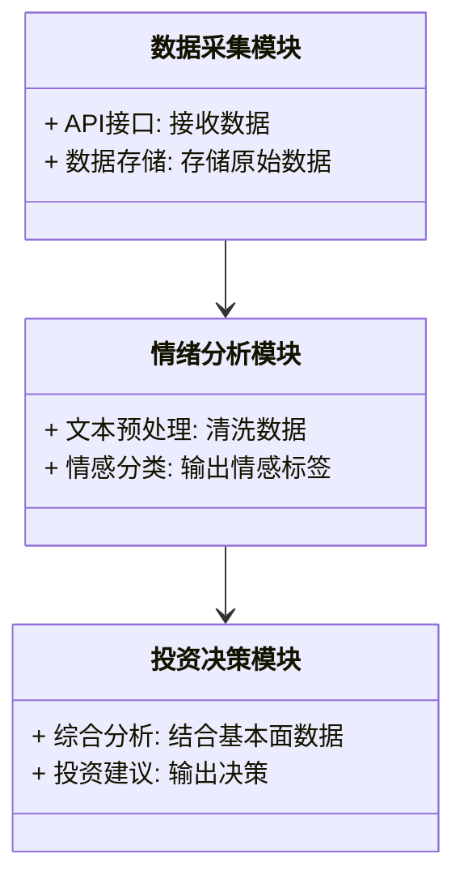
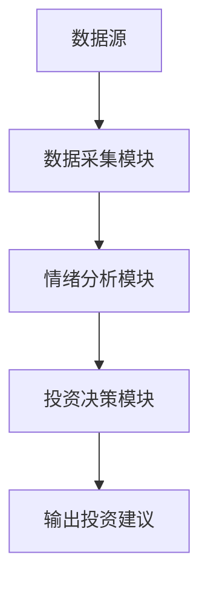
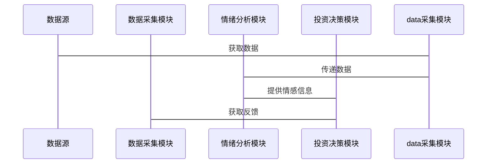

                 


# AI多智能体在价值投资中的社交媒体情绪分析应用

---

## 关键词：
- AI多智能体
- 价值投资
- 社交媒体情绪分析
- 自然语言处理
- 机器学习
- 系统架构设计

---

## 摘要：
本文探讨了AI多智能体技术在价值投资中的应用，特别是通过社交媒体情绪分析来辅助投资决策。文章从问题背景、核心概念、算法原理、系统架构设计、项目实战到最佳实践，全面分析了如何利用多智能体协作和情绪分析技术，从社交媒体数据中提取有价值的信息，帮助投资者做出更明智的投资决策。本文结合理论与实践，提供了详细的数学模型、系统设计和代码实现，为读者提供了全面的技术指导。

---

# 第一部分: AI多智能体在价值投资中的社交媒体情绪分析应用概述

## 第1章: 问题背景与定义

### 1.1 问题背景
#### 1.1.1 价值投资与情绪分析的结合
价值投资是一种基于公司基本面分析的投资策略，而情绪分析则关注市场参与者的心理状态。将两者结合，可以帮助投资者更好地理解市场情绪对投资决策的影响。

#### 1.1.2 社交媒体在金融分析中的作用
社交媒体平台（如Twitter、Reddit）上的海量信息反映了投资者的情绪和市场趋势，这些数据为价值投资提供了新的视角。

#### 1.1.3 多智能体技术的应用潜力
多智能体系统能够通过协作和分工，更高效地处理复杂任务，如社交媒体情绪分析和投资决策优化。

### 1.2 核心概念定义
#### 1.2.1 多智能体系统
由多个智能体组成的系统，每个智能体能够独立决策并与其他智能体协作，共同完成复杂任务。

#### 1.2.2 情绪分析
通过对文本数据的处理，识别和分类文本中的情感倾向，如正面、负面或中性。

#### 1.2.3 价值投资
一种长期投资策略，强调基于公司的基本面分析进行投资，而非短期市场波动。

### 1.3 技术基础
#### 1.3.1 自然语言处理
用于处理和理解社交媒体上的文本数据，提取情感信息。

#### 1.3.2 机器学习
用于训练情绪分类模型，预测文本的情感倾向。

#### 1.3.3 多智能体协作
智能体之间的协作机制，包括通信、任务分配和决策优化。

### 1.4 问题解决与边界
#### 1.4.1 问题解决框架
从社交媒体数据中提取情感信息，结合基本面分析，辅助投资决策。

#### 1.4.2 系统边界与外延
系统的输入包括社交媒体数据和基本面数据，输出为投资建议。边界在于如何处理数据隐私和市场波动。

#### 1.4.3 核心要素与组成
包括数据采集、情绪分析、投资决策和反馈优化。

### 1.5 本章小结
本章介绍了AI多智能体在价值投资中的应用背景，定义了核心概念，并明确了系统的技术基础和边界。

---

## 第2章: 核心概念与联系

### 2.1 多智能体系统原理
#### 2.1.1 多智能体系统架构
包括多个智能体和一个协调器，用于任务分配和协作。

#### 2.1.2 智能体间协作机制
通过通信协议，智能体之间共享信息，协作完成任务。

#### 2.1.3 智能体决策模型
基于情感分析结果，智能体做出投资决策。

### 2.2 情绪分析技术
#### 2.2.1 文本预处理
包括分词、去停用词和词向量转换。

#### 2.2.2 情感特征提取
使用词袋模型或词嵌入技术提取情感特征。

#### 2.2.3 情感分类算法
如支持向量机（SVM）和深度学习模型（如LSTM）。

### 2.3 价值投资与情绪分析的结合
#### 2.3.1 价值投资中的情绪因素
市场情绪影响投资者决策，但传统价值投资忽视了情绪因素。

#### 2.3.2 情绪分析对投资决策的影响
通过分析社交媒体情绪，优化投资组合。

#### 2.3.3 多智能体协作的优势
多个智能体分工合作，提高分析效率和准确性。

### 2.4 核心概念对比分析
#### 2.4.1 多智能体与传统单智能体对比
多智能体通过协作提高效率，单智能体则依赖于单点计算。

#### 2.4.2 情绪分析与传统财务分析对比
情绪分析关注市场情绪，财务分析关注公司基本面。

#### 2.4.3 价值投资中的多智能体优势
多智能体能够结合情绪分析和基本面分析，提供更全面的决策支持。

### 2.5 本章小结
本章详细讲解了多智能体系统和情绪分析的核心概念，并探讨了它们在价值投资中的结合与优势。

---

## 第3章: 算法原理与数学模型

### 3.1 情绪分析算法
#### 3.1.1 文本预处理流程
包括清洗数据、分词和特征提取。

#### 3.1.2 特征提取方法
如TF-IDF和词嵌入（Word2Vec）。

#### 3.1.3 情感分类算法
如SVM和LSTM。

### 3.2 多智能体协作算法
#### 3.2.1 智能体间通信机制
通过消息队列或API进行通信。

#### 3.2.2 协作决策模型
基于情感分析结果，智能体协作制定投资策略。

#### 3.2.3 联合学习方法
多个智能体共同训练模型，提高分类精度。

### 3.3 数学模型与公式
#### 3.3.1 情感分类损失函数
$$ L = -\frac{1}{N}\sum_{i=1}^{N} y_i \log(p_i) + (1-y_i)\log(1-p_i) $$

#### 3.3.2 多智能体协作优化函数
$$ \min_{\theta} \sum_{i=1}^{M} L_i(\theta_i) + \lambda \sum_{i=1}^{M} \sum_{j \neq i} \text{KL}(p_i || p_j) $$

### 3.4 通俗易懂的举例说明
#### 3.4.1 情感分类实例
例如，将“这个公司前景光明”分类为正面情绪。

#### 3.4.2 多智能体协作实例
多个智能体分别分析不同社交媒体平台的情绪，综合结果制定投资策略。

### 3.5 本章小结
本章详细讲解了情绪分析和多智能体协作的算法原理，并通过公式和实例进行了说明。

---

## 第4章: 系统分析与架构设计

### 4.1 问题场景介绍
#### 4.1.1 价值投资中的情绪分析需求
投资者需要从社交媒体中获取情绪信息，辅助投资决策。

#### 4.1.2 系统目标
构建一个基于多智能体的情绪分析系统，辅助价值投资。

### 4.2 系统功能设计
#### 4.2.1 数据采集模块
从社交媒体平台获取文本数据。

#### 4.2.2 情绪分析模块
对文本数据进行预处理和情感分类。

#### 4.2.3 投资决策模块
结合情绪分析结果和基本面数据，制定投资策略。

### 4.3 系统架构设计
#### 4.3.1 领域模型类图


#### 4.3.2 系统架构图


### 4.4 系统交互设计
#### 4.4.1 序列图


### 4.5 本章小结
本章从系统架构的角度，详细描述了如何构建一个多智能体的情绪分析系统，并通过图表展示了模块之间的交互关系。

---

## 第5章: 项目实战

### 5.1 环境安装
#### 5.1.1 安装Python和相关库
```bash
pip install numpy
pip install pandas
pip install scikit-learn
pip install transformers
pip install sentencepiece
```

### 5.2 系统核心实现源代码
#### 5.2.1 数据采集模块
```python
import requests
from bs4 import BeautifulSoup

def get_tweets(query):
    url = f"https://twitter.com/search?q={query}&lang=en"
    response = requests.get(url)
    soup = BeautifulSoup(response.text, 'html.parser')
    tweets = soup.find_all('div', {'class': 'tweet'})
    return [tweet.text for tweet in tweets]
```

#### 5.2.2 情绪分析模块
```python
from transformers import pipeline

sentiment_analyzer = pipeline('sentiment-analysis')
def analyze_sentiment(text):
    return sentiment_analyzer(text)[0]['label']
```

#### 5.2.3 投资决策模块
```python
import pandas as pd
import numpy as np

def get_recommendation(tweets):
    sentiments = [analyze_sentiment(tweet) for tweet in tweets]
    positive_count = sum(1 for sent in sentiments if sent == 'POSITIVE')
    negative_count = sum(1 for sent in sentiments if sent == 'NEGATIVE')
    return '买入' if positive_count > negative_count else '卖出'
```

### 5.3 案例分析与解读
#### 5.3.1 数据采集
假设我们从Twitter获取了某公司的100条推文。

#### 5.3.2 情绪分析
通过模型分析，有60条为正面，30条为负面，10条为中性。

#### 5.3.3 投资决策
由于正面情绪占优，系统推荐“买入”。

### 5.4 本章小结
本章通过实际案例，展示了如何将理论应用于实践，并通过代码实现情绪分析和投资决策。

---

## 第6章: 最佳实践与总结

### 6.1 小结
本文详细探讨了AI多智能体在价值投资中的应用，特别是社交媒体情绪分析的技术细节和系统设计。

### 6.2 注意事项
- 数据隐私和合规性
- 模型的可解释性和鲁棒性
- 多智能体协作的效率和稳定性

### 6.3 未来趋势
- 更复杂的多智能体协作算法
- 更先进的自然语言处理技术
- 更广泛的应用场景

### 6.4 拓展阅读
- 《自然语言处理入门》
- 《机器学习实战》
- 《多智能体系统设计》

### 6.5 本章小结
本文总结了AI多智能体在价值投资中的应用，并展望了未来的发展方向。

---

## 附录: 知识点总结

### 附录A: 核心公式
- 情感分类损失函数
- 多智能体协作优化函数

### 附录B: 系统架构图
- 领域模型类图
- 系统架构图
- 系统交互图

### 附录C: 代码示例
- 数据采集模块
- 情绪分析模块
- 投资决策模块

---

通过以上结构，文章系统地介绍了AI多智能体在价值投资中的社交媒体情绪分析应用，从理论到实践，为读者提供了全面的技术指导。

