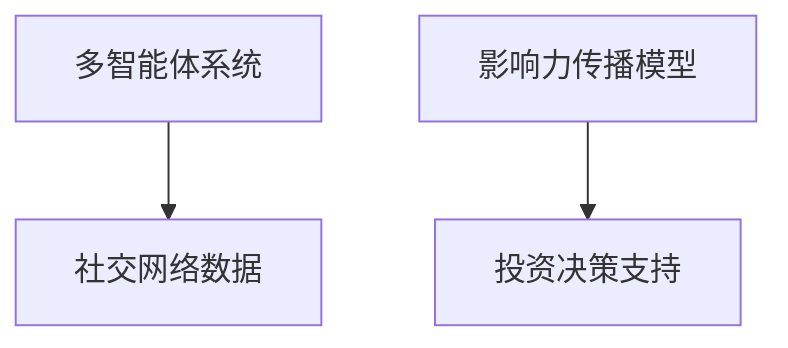
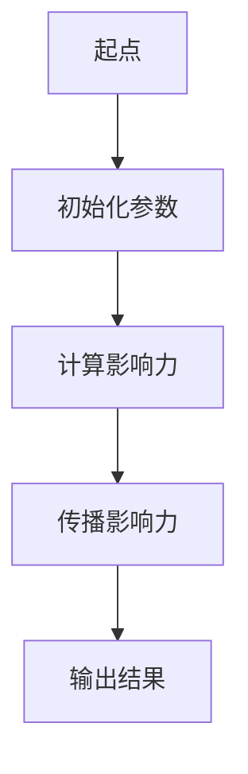
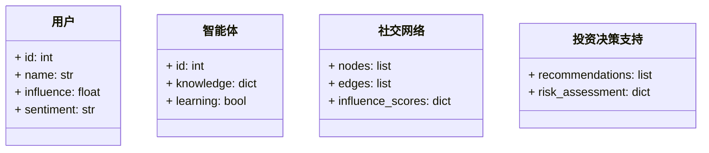
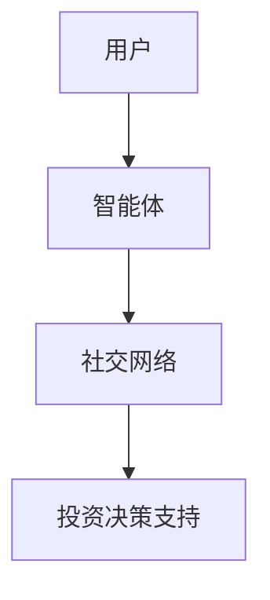

                 


# AI多智能体在价值投资中的社交网络影响力分析

> 关键词：AI多智能体、社交网络影响力、价值投资、金融分析、影响力传播模型

> 摘要：本文详细探讨了AI多智能体在价值投资中的社交网络影响力分析。通过分析社交网络数据，结合多智能体系统的协同学习算法，提出了一种新的价值投资策略，能够更精准地评估投资标的的影响力和潜在风险。本文从问题背景、核心概念、算法原理、系统架构到项目实战，逐步展开，提供了一套完整的解决方案。

---

# 第一部分: AI多智能体在价值投资中的社交网络影响力分析背景介绍

# 第1章: 问题背景与核心概念

## 1.1 问题背景
### 1.1.1 多智能体系统的基本概念
多智能体系统（Multi-Agent System, MAS）是由多个智能体（Agent）组成的分布式系统，这些智能体能够通过交互协作完成复杂任务。与传统单智能体系统相比，MAS具有更高的灵活性和适应性，能够处理动态变化的环境。

### 1.1.2 价值投资的核心理念
价值投资是一种以内在价值为导向的投资策略，强调通过分析企业的基本面（如财务状况、行业地位、竞争优势等）来判断其股票是否被市场低估。传统价值投资依赖于分析师的经验和主观判断，而AI多智能体系统可以通过数据驱动的方法提高分析的客观性和准确性。

### 1.1.3 社交网络在金融领域的应用
社交网络在金融领域的应用日益广泛，投资者通过社交媒体获取实时信息、分享观点、评估风险。例如，Twitter上的市场情绪分析已成为量化交易的重要参考指标。

## 1.2 问题描述
### 1.2.1 传统价值投资的局限性
传统价值投资依赖于主观判断，存在效率低、覆盖面窄、信息滞后等问题。特别是在面对海量数据和复杂市场环境时，传统方法难以快速准确地做出决策。

### 1.2.2 社交网络对投资决策的影响
社交网络中的信息传播会影响投资者的决策，但如何量化这些信息的影响程度，以及如何利用这些信息优化投资策略，是当前研究的热点问题。

### 1.2.3 多智能体系统在金融分析中的优势
多智能体系统能够通过分布式计算和协同学习，快速处理大量数据，发现隐藏的模式和关联，为投资决策提供更精准的支持。

## 1.3 问题解决与边界
### 1.3.1 多智能体系统如何解决传统问题
通过多智能体系统的协同学习和分布式计算，可以实时分析社交网络中的信息，评估其对投资标的影响力，从而优化投资决策。

### 1.3.2 边界与外延
本文的研究范围限定在社交网络影响力对价值投资的影响，不涉及其他类型的金融分析。系统边界包括数据采集、影响力评估、投资决策支持三个主要模块。

### 1.3.3 核心要素与组成结构
核心要素包括：社交网络数据、多智能体系统、影响力传播模型、投资决策支持系统。



## 1.4 本章小结
本章通过分析多智能体系统、价值投资和社交网络的基本概念，明确了本文的研究目标和核心问题。

---

# 第二部分: 核心概念与联系

# 第2章: 多智能体系统与社交网络分析

## 2.1 多智能体系统的核心原理
### 2.1.1 多智能体系统的定义与特点
多智能体系统由多个智能体组成，每个智能体具有自主性、反应性、协作性和学习性。智能体之间通过通信和协调完成任务。

### 2.1.2 多智能体系统与传统AI的区别
| 特性        | 单智能体系统          | 多智能体系统          |
|-------------|----------------------|----------------------|
| 结构化程度    | 高                   | 低                   |
| 可扩展性      | 低                   | 高                   |
| 协作性        | 无                   | 强                   |

### 2.1.3 多智能体系统在金融领域的应用
多智能体系统可以用于金融市场的实时监控、风险评估、投资组合优化等场景。

## 2.2 社交网络分析的基本原理
### 2.2.1 社交网络的定义与特征
社交网络是由节点（用户）和边（关系）构成的图结构，节点之间的连接表示用户之间的关系。

### 2.2.2 社交网络分析的常用方法
常用的社交网络分析方法包括：中心性分析（Degree Centrality、Betweenness Centrality）、社区发现、影响力传播等。

### 2.2.3 社交网络中的影响力传播模型
影响力传播模型通过模拟信息在社交网络中的扩散过程，评估每个节点的影响力。

## 2.3 价值投资中的社交网络影响力
### 2.3.1 价值投资的核心要素
价值投资的核心要素包括：企业的财务状况、行业地位、竞争优势、管理团队等。

### 2.3.2 社交网络在价值投资中的作用
社交网络可以提供实时的市场情绪、投资者 sentiment 分析、行业动态等信息，为价值投资提供数据支持。

### 2.3.3 多智能体系统在价值投资中的应用
多智能体系统可以通过协同学习，实时分析社交网络中的信息，评估其对投资标的影响力，优化投资决策。

## 2.4 核心概念对比与联系
### 2.4.1 多智能体系统与社交网络的对比分析
| 特性        | 多智能体系统          | 社交网络分析          |
|-------------|----------------------|----------------------|
| 数据来源      | 多源数据             | 社交网络数据         |
| 分析目标      | 投资决策优化         | 市场情绪分析          |
| 算法复杂度    | 高                   | 中                   |

### 2.4.2 多智能体系统在价值投资中的优势
多智能体系统能够通过分布式计算和协同学习，快速处理海量数据，发现隐藏的模式和关联，为投资决策提供更精准的支持。

### 2.4.3 核心概念的ER实体关系图
```mermaid
er
actor: 用户
agent: 多智能体
network: 社交网络
action: 行为
```

---

# 第三部分: 算法原理讲解

# 第3章: 多智能体系统的算法原理

## 3.1 多智能体系统的算法概述
### 3.1.1 多智能体系统的基本算法
多智能体系统的算法包括：分布式协作算法、分布式优化算法、分布式学习算法。

### 3.1.2 基于扩散的影响力评估模型
基于扩散的影响力评估模型通过模拟信息在社交网络中的扩散过程，评估每个节点的影响力。

### 3.1.3 多智能体系统的协同学习算法
协同学习算法通过多智能体之间的协作，优化模型参数，提高预测精度。

## 3.2 算法实现与流程图
### 3.2.1 基于扩散的影响力评估算法


### 3.2.2 算法实现的Python代码
```python
def influence_spread(network, initial_influence):
    # 初始化影响力
    influence = {node: 0 for node in network.nodes}
    for node in initial_influence:
        influence[node] = 1
    # 传播过程
    while True:
        new_influence = influence.copy()
        for node in network.nodes:
            for neighbor in network.edges[node]:
                if influence[neighbor] < influence[node] * 0.8:
                    new_influence[neighbor] = max(new_influence[neighbor], influence[node] * 0.8)
        if new_influence == influence:
            break
        influence = new_influence
    return influence
```

### 3.2.3 算法的数学模型
影响力传播的数学模型如下：
$$ I(t+1) = \alpha I(t) + (1-\alpha) \sum_{i \in N(t)} I_i(t) $$
其中，$I(t)$ 表示时间 $t$ 时的影响力，$N(t)$ 表示 $t$ 时刻的邻居节点集合，$\alpha$ 是传播系数。

---

# 第四部分: 系统分析与架构设计

# 第4章: 系统分析与架构设计

## 4.1 问题场景介绍
### 4.1.1 系统目标
系统的目标是通过分析社交网络中的影响力传播，优化价值投资策略。

### 4.1.2 项目介绍
本项目旨在构建一个基于多智能体系统的社交网络影响力分析平台，支持投资者进行更精准的价值投资。

## 4.2 系统功能设计
### 4.2.1 领域模型设计


### 4.2.2 系统架构设计


### 4.2.3 系统接口设计
系统接口包括：数据输入接口、算法调用接口、结果输出接口。

### 4.2.4 系统交互设计
```mermaid
sequenceDiagram
用户 -> 智能体: 提供社交网络数据
智能体 -> 社交网络: 分析影响力传播
社交网络 -> 投资决策支持: 提供投资建议
用户 <- 投资决策支持: 获取投资建议
```

---

# 第五部分: 项目实战

# 第5章: 项目实战

## 5.1 环境安装
### 5.1.1 安装Python环境
使用Anaconda安装Python 3.8以上版本。

### 5.1.2 安装依赖库
安装必要的依赖库：
```bash
pip install networkx matplotlib numpy
```

## 5.2 核心代码实现
### 5.2.1 多智能体系统实现
```python
class Agent:
    def __init__(self, id, knowledge):
        self.id = id
        self.knowledge = knowledge
```

### 5.2.2 社交网络分析实现
```python
import networkx as nx

def build_network(users, edges):
    G = nx.Graph()
    G.add_nodes_from(users)
    G.add_edges_from(edges)
    return G
```

### 5.2.3 影响力传播实现
```python
def spread_influence(G, initial_nodes):
    influence = {node: 0 for node in G.nodes}
    for node in initial_nodes:
        influence[node] = 1
    while True:
        new_influence = influence.copy()
        for node in G.nodes:
            for neighbor in G.neighbors(node):
                if influence[neighbor] < influence[node] * 0.8:
                    new_influence[neighbor] = max(new_influence[neighbor], influence[node] * 0.8)
        if new_influence == influence:
            break
        influence = new_influence
    return influence
```

## 5.3 案例分析
### 5.3.1 数据采集
从Twitter获取某行业相关的用户数据和 tweet 数据。

### 5.3.2 算法实现
使用上述代码实现影响力传播模型，评估每个用户的影响力。

### 5.3.3 结果分析
分析影响力传播结果，优化投资策略。

## 5.4 项目小结
通过本项目，我们验证了多智能体系统在价值投资中的应用潜力，为投资者提供了新的决策支持工具。

---

# 第六部分: 最佳实践

# 第6章: 最佳实践

## 6.1 小结
### 6.1.1 核心知识点总结
- 多智能体系统的定义与特点
- 社交网络分析的基本方法
- 影响力传播模型的实现与应用

## 6.2 注意事项
### 6.2.1 数据质量的重要性
数据质量直接影响分析结果的准确性，必须确保数据的完整性和准确性。

### 6.2.2 模型的可解释性
模型的可解释性是投资者信任的重要因素，需要在算法设计中考虑可解释性。

### 6.2.3 系统的可扩展性
系统的可扩展性是应对未来数据量增长的重要保障。

## 6.3 扩展阅读
### 6.3.1 推荐书籍
- 《Multi-Agent Systems: Algorithmic Foundations》
- 《Network Analysis and its Applications》

### 6.3.2 推荐论文
- "Influence Maximization in Social Networks"
- "Multi-Agent Systems for Financial Analysis"

---

# 结语
本文通过系统性地分析AI多智能体在价值投资中的社交网络影响力，提出了一个基于多智能体系统的解决方案，为投资者提供了新的决策支持工具。未来的研究可以进一步探索多智能体系统的优化算法，以及在更多金融场景中的应用。

--- 

# 致谢
感谢读者的耐心阅读，感谢合作伙伴的支持，感谢家人和朋友的理解与鼓励。

