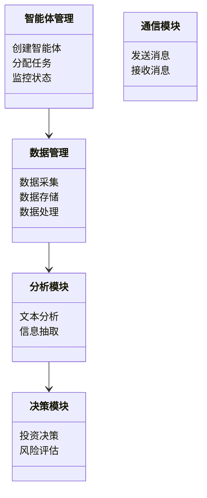
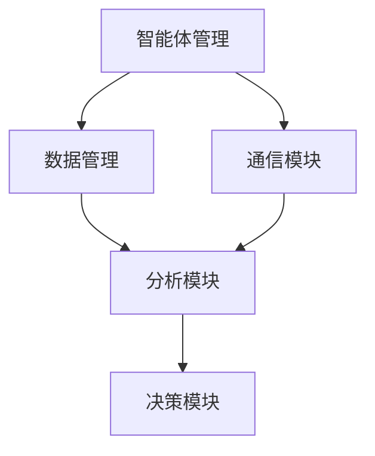
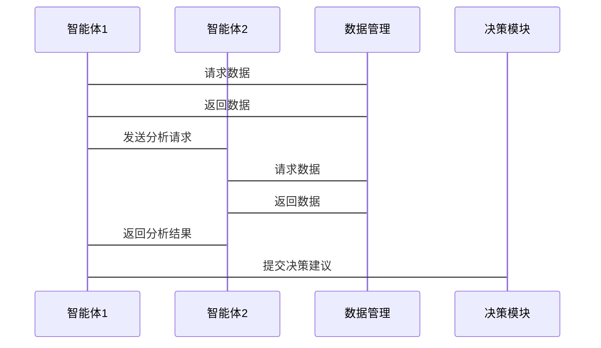

                 


# AI多智能体在价值投资中的自然语言处理应用

## 关键词：
- AI多智能体
- 价值投资
- 自然语言处理
- 金融分析
- 机器学习

## 摘要：
本文探讨了AI多智能体在价值投资中的自然语言处理应用，分析了多智能体系统的协作机制及其在金融文本分析中的作用。通过详细讲解算法原理、系统架构设计和项目实战，本文为读者提供了从理论到实践的全面指导，展示了如何利用多智能体与自然语言处理技术提升投资决策的准确性和效率。

---

## 第1章: 价值投资与自然语言处理的背景

### 1.1 价值投资的基本概念
#### 1.1.1 价值投资的定义与核心思想
价值投资是一种基于对公司内在价值评估的投资策略，核心在于寻找市场价格低于其内在价值的证券。其核心思想是通过分析公司的基本面（财务状况、行业地位、竞争优势等）来判断其长期投资价值。

#### 1.1.2 价值投资的关键要素
- 公司财务数据：如收入、利润、资产负债表等。
- 行业分析：行业趋势、竞争格局等。
- 管理层质量：管理团队的经验和战略能力。
- 估值指标：市盈率、市净率等。

#### 1.1.3 价值投资的实现路径
传统的价值投资依赖于分析师的主观判断，但随着数据量的爆炸式增长和计算能力的提升，人工智能技术为价值投资提供了新的工具和方法。

### 1.2 自然语言处理在金融领域的应用
#### 1.2.1 自然语言处理的基本概念
自然语言处理（NLP）是计算机科学、人工智能、语言学的交叉领域，旨在使计算机能够理解、生成和处理人类语言。

#### 1.2.2 NLP在金融分析中的作用
- 金融文本分析：从新闻、财报、行业报告中提取关键信息。
- 情感分析：判断市场情绪，预测股价走势。
- 信息抽取：从非结构化数据中提取结构化信息。

#### 1.2.3 金融文本分析的挑战与机遇
- 挑战：文本数据的多样性和复杂性，信息噪声多。
- 机遇：通过NLP技术提高数据处理效率和准确性。

### 1.3 AI多智能体的应用背景
#### 1.3.1 多智能体系统的定义
多智能体系统是指由多个智能体组成的分布式系统，各智能体通过协作完成复杂任务。

#### 1.3.2 多智能体在金融领域的优势
- 分布式计算能力：多智能体能够并行处理大量数据。
- 协作能力：通过协作提高决策的准确性和鲁棒性。
- 自适应能力：能够根据环境变化动态调整策略。

#### 1.3.3 价值投资中多智能体的应用场景
- 数据采集与处理：多个智能体分别负责不同数据源的采集和预处理。
- 综合分析：多个智能体协同完成对公司基本面、行业趋势等的综合分析。
- 投资决策：基于多智能体的分析结果，生成投资策略。

---

## 第2章: AI多智能体与自然语言处理的核心概念

### 2.1 多智能体系统的原理
#### 2.1.1 多智能体系统的组成
- 智能体：具有感知和行动能力的实体。
- 通信机制：智能体之间的信息交互方式。
- 协作协议：智能体协作的规则和策略。

#### 2.1.2 多智能体的协作机制
- 分层架构：将任务分解为多个子任务，由不同智能体负责。
- 基于角色的协作：智能体根据角色分配任务。
- 基于目标的协作：智能体根据共同目标协作完成任务。

#### 2.1.3 多智能体的通信与协调
- 信息共享：智能体之间共享必要的信息。
- 协调机制：通过某种协议确保协作的一致性。

### 2.2 自然语言处理的核心技术
#### 2.2.1 词嵌入技术
- 词向量表示：将词语映射到高维向量空间。
- 常见模型：Word2Vec、GloVe、FastText。

#### 2.2.2 文本分类与情感分析
- 文本分类：将文本划分为不同的类别（如新闻分类）。
- 情感分析：判断文本的情感倾向（如积极、消极、中性）。

#### 2.2.3 信息抽取与知识图谱
- 信息抽取：从文本中提取结构化信息（如实体识别、关系抽取）。
- 知识图谱：构建语义网络，表示实体间的关系。

### 2.3 多智能体与自然语言处理的结合
#### 2.3.1 多智能体在NLP任务中的应用
- 分布式计算：多智能体协同完成大规模NLP任务。
- 任务分工：不同智能体负责不同的子任务（如信息抽取、情感分析）。

#### 2.3.2 多智能体协作的NLP模型
- 基于图神经网络的多智能体协作模型：通过图结构建模智能体之间的关系。
- 分层协作模型：将任务分解为多个层次，不同层次的智能体负责不同的部分。

#### 2.3.3 多智能体NLP的优缺点对比
- 优点：提高计算效率，增强模型的表达能力。
- 缺点：协作机制的设计复杂，需要处理智能体之间的通信开销。

---

## 第3章: 多智能体协作的自然语言处理算法原理

### 3.1 多智能体协作的基本算法
#### 3.1.1 基于强化学习的协作机制
- 强化学习：通过奖励机制训练智能体的协作行为。
- 常见算法：多智能体Q学习、价值分解方法。

#### 3.1.2 基于图神经网络的协作模型
- 图神经网络：通过图结构建模智能体之间的关系。
- 常见模型：GraphSAGE、GAT、GCN。

#### 3.1.3 基于分布式计算的协作方法
- 分布式计算：将任务分发到多个智能体，协同完成。
- 通信机制：智能体之间通过共享参数或消息进行协作。

### 3.2 自然语言处理的主流算法
#### 3.2.1 Transformer模型
- 基于自注意力机制的模型。
- 优势：全局依赖关系，计算效率高。

#### 3.2.2 BERT模型
- 预训练语言模型，通过mask任务学习上下文关系。
- 应用：文本分类、问答系统、情感分析。

#### 3.2.3 GPT模型
- 基于自回归的生成模型。
- 应用：文本生成、对话系统。

### 3.3 多智能体协作的NLP算法实现
#### 3.3.1 多智能体协作的文本生成
- 分布式生成：多个智能体协同生成文本片段。
- 协作策略：通过共享上下文信息提高生成质量。

#### 3.3.2 多智能体协作的情感分析
- 分工协作：不同智能体负责不同的情感维度（如情感强度、情感类型）。
- 联合推理：通过智能体之间的协作，综合判断整体情感倾向。

#### 3.3.3 多智能体协作的信息抽取
- 分层抽取：智能体协同完成实体识别、关系抽取等任务。
- 知识图谱构建：通过多智能体协作构建语义网络。

---

## 第4章: 系统分析与架构设计

### 4.1 项目背景介绍
- 项目目标：构建基于多智能体的自然语言处理系统，辅助价值投资决策。
- 项目范围：涵盖数据采集、文本分析、投资决策等环节。

### 4.2 系统功能设计
#### 4.2.1 领域模型设计


#### 4.2.2 系统架构设计


#### 4.2.3 接口设计
- 数据接口：智能体管理与数据管理之间的接口。
- 通信接口：智能体之间的通信接口。
- 分析接口：分析模块对外提供的接口。

#### 4.2.4 交互流程


---

## 第5章: 项目实战

### 5.1 环境安装
- 安装Python
- 安装必要的库：TensorFlow、Keras、NLTK、spacy、networkx等。

### 5.2 核心代码实现
#### 5.2.1 数据预处理
```python
import spacy

nlp = spacy.load("en_core_web_sm")
text = "Apple's revenue increased by 10% last quarter."
doc = nlp(text)
for token in doc:
    print(token.text, token.pos_, token.dep_)
```

#### 5.2.2 多智能体协作的文本分析
```python
import tensorflow as tf
from tensorflow.keras.layers import Dense, Input, Dropout
from tensorflow.keras.models import Model

# 定义智能体
def build_agent(input_dim):
    inputs = Input(shape=(input_dim,))
    x = Dense(64, activation='relu')(inputs)
    x = Dropout(0.5)(x)
    x = Dense(32, activation='relu')(x)
    outputs = Dense(1, activation='sigmoid')(x)
    return Model(inputs=inputs, outputs=outputs)

# 定义协作机制
def collaborative_learning(agents, x):
    for agent in agents:
        # 分配任务
        input_part = x[:, agent.start:agent.end]
        agent.model.trainable = False
        agent.model.compile(optimizer='adam', loss='binary_crossentropy')
        agent.model.fit(input_part, y_train, epochs=10)
        agent.model.trainable = True
```

### 5.3 案例分析
#### 5.3.1 实际案例分析
- 数据来源：某公司财报、行业新闻、市场报告。
- 分析过程：使用多智能体协同完成数据预处理、信息抽取、情感分析等任务。
- 结果展示：生成投资建议，如买入、卖出、持有等。

#### 5.3.2 代码实现解读
- 数据预处理：使用spaCy进行文本分词和词性标注。
- 多智能体协作：通过定义多个智能体，分别负责不同的任务，协作完成整体分析。

### 5.4 项目小结
- 项目实现的关键点：多智能体的协作机制、自然语言处理算法的实现、系统的集成与优化。
- 经验总结：协作机制的设计需要充分考虑任务分解和智能体之间的通信效率。

---

## 第6章: 最佳实践、小结与拓展

### 6.1 最佳实践
- 数据质量：确保数据的准确性和完整性。
- 模型选择：根据具体任务选择合适的NLP模型。
- 协作机制：设计高效的协作机制，减少通信开销。

### 6.2 小结
本文详细探讨了AI多智能体在价值投资中的自然语言处理应用，从理论到实践，全面分析了多智能体系统的协作机制及其在金融文本分析中的应用。通过案例分析和代码实现，展示了如何利用多智能体技术提升投资决策的效率和准确性。

### 6.3 注意事项
- 智能体的通信效率：多智能体之间的通信可能会引入额外的开销，需要进行优化。
- 模型的可解释性：复杂的模型可能难以解释，需要设计可解释的协作机制。
- 数据隐私：处理金融数据时，需要注意数据隐私和合规性。

### 6.4 拓展阅读
- 《Deep Learning》—— Ian Goodfellow
- 《Natural Language Processing with PyTorch》—— Manning
- 《Multi-Agent Systems: Algorithmic, Game-Theoretic, and Computational Aspects》—— Wooldridge

---

## 附录
- 附录A: Python代码实现
- 附录B: Mermaid图表
- 附录C: 参考文献

---

通过本文的详细讲解，读者可以全面理解AI多智能体在价值投资中的自然语言处理应用，并能够通过实际案例和代码实现掌握相关技术。

