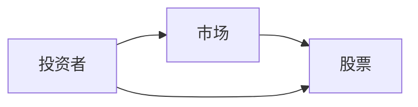
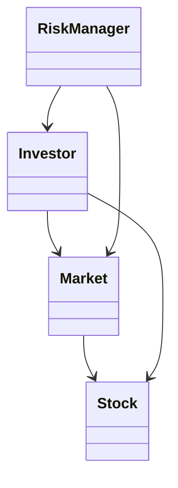
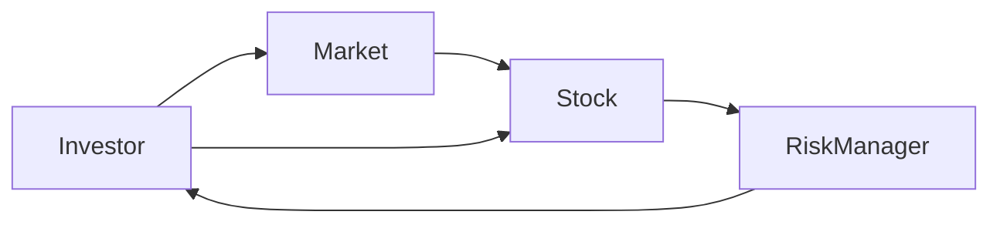
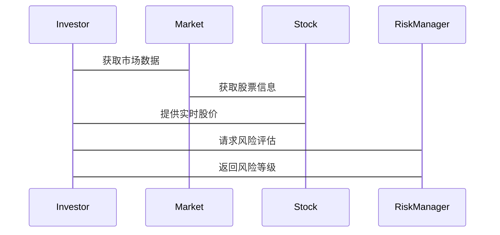

                 


# AI多智能体在价值投资中的风险管理和控制

## 关键词：AI多智能体，价值投资，风险管理，强化学习，系统架构

## 摘要：本文探讨了AI多智能体技术在价值投资中的风险管理与控制应用。通过分析多智能体系统的基本原理，结合强化学习算法，提出了一种基于多智能体的金融风险管理框架，并通过实际案例验证了该方法的有效性。

---

## 第一部分: 引言

### 第1章: 问题背景与研究意义

#### 1.1 问题背景介绍

- **1.1.1 价值投资的定义与特点**
  - 价值投资是一种长期投资策略，通过分析公司基本面来寻找被市场低估的投资标的。
  - 其特点包括长期性、逆向思维和安全边际。

- **1.1.2 传统风险管理的局限性**
  - 传统风险管理依赖人工判断，存在主观性强、效率低下的问题。
  - 在复杂多变的金融市场中，难以及时捕捉和应对风险。

- **1.1.3 AI多智能体技术的优势**
  - AI多智能体能够通过分布式计算和协作学习，提高风险识别和应对的效率。
  - 能够实时分析大量数据，提供更精准的风险评估和控制策略。

#### 1.2 问题描述与目标

- **1.2.1 风险管理的核心问题**
  - 如何在复杂市场中快速识别和评估风险。
  - 如何制定有效的风险控制策略以最小化损失。

- **1.2.2 AI多智能体在风险管理中的应用目标**
  - 构建一个多智能体系统，能够实时监控市场动态，识别潜在风险。
  - 利用多智能体的协作能力，制定和执行风险控制策略。

- **1.2.3 问题解决的边界与外延**
  - 限定于金融市场中的风险管理，不包括其他领域的风险控制。
  - 外延可能扩展到其他类型的投资策略优化。

#### 1.3 本章小结

- 本章介绍了价值投资和风险管理的基本概念，指出了传统方法的局限性，并提出了AI多智能体技术的应用目标。

---

## 第二部分: AI多智能体在价值投资中的基础

### 第2章: 价值投资与风险管理基础

#### 2.1 价值投资的基本原理

- **2.1.1 价值投资的核心理念**
  - 市场价格与内在价值的差异是投资机会的来源。
  - 长期投资于具有持续竞争优势的企业。

- **2.1.2 价值投资的策略与方法**
  - 通过基本面分析筛选低估股票。
  - 采用分散投资降低非系统性风险。

#### 2.2 风险管理的核心概念

- **2.2.1 风险的定义与分类**
  - 市场风险、流动性风险、信用风险等。
  - 风险可以是收益的波动性指标，如标准差。

- **2.2.2 风险评估与控制的基本方法**
  - 风险评估：通过VaR（在险价值）模型量化潜在损失。
  - 风险控制：设定止损点，调整投资组合。

#### 2.3 多智能体系统的基本概念

- **2.3.1 多智能体系统的定义与特点**
  - 由多个智能体组成的系统，每个智能体具有自主性、反应性和协作性。
  - 多智能体系统能够分布计算，提高处理复杂问题的能力。

- **2.3.2 多智能体系统的优势与挑战**
  - 优势：分布式计算能力强，适应复杂环境。
  - 挑战：智能体之间的协调困难，通信延迟。

#### 2.4 本章小结

- 本章介绍了价值投资的基本原理和风险管理的核心概念，分析了多智能体系统的特点及其在风险管理中的优势。

---

## 第三部分: AI多智能体的核心概念与联系

### 第3章: 多智能体系统的核心原理

#### 3.1 多智能体系统的组成与结构

- **3.1.1 实体关系分析**



- **3.1.2 智能体的协作机制**
  - 通过通信协议共享信息，协同决策。

#### 3.2 多智能体系统的通信机制

- **3.2.1 智能体之间的信息传递**
  - 使用消息队列或事件驱动机制进行实时通信。
  - 信息传递的延迟和带宽影响系统效率。

- **3.2.2 协作与竞争关系**
  - 各智能体在信息共享中既协作又竞争，以优化整体决策。

#### 3.3 多智能体系统与风险管理的结合

- **3.3.1 风险识别的多智能体实现**
  - 各智能体负责监控市场不同方面，如市场波动、公司新闻等。
  - 通过信息整合识别潜在风险点。

- **3.3.2 风险评估的多智能体模型**
  - 各智能体基于局部信息构建风险评估模型，最终通过协同计算得出整体风险评估。

#### 3.4 本章小结

- 本章分析了多智能体系统的组成和通信机制，并探讨了其在风险管理中的应用。

---

## 第四部分: AI多智能体的算法原理

### 第4章: 多智能体系统的算法实现

#### 4.1 强化学习算法

- **4.1.1 强化学习的基本原理**
  - 智能体通过与环境互动，学习策略以最大化累积奖励。
  - 状态、动作、奖励是强化学习的核心要素。

- **4.1.2 多智能体强化学习的挑战**
  - 协作与竞争的平衡问题。
  - 多智能体之间的信息同步与协调。

- **4.1.3 实例分析：股票交易中的强化学习**

```python
class DQN:
    def __init__(self, state_space, action_space):
        self.state_space = state_space
        self.action_space = action_space
        self.model = self.build_model()

    def build_model(self):
        # 构建神经网络模型
        pass

    def remember(self, state, action, reward, next_state):
        # 存储经验
        pass

    def act(self, state):
        # 选择动作
        pass

    def replay(self, batch_size):
        # 回放记忆
        pass
```

---

## 第五部分: 系统架构与设计

### 第5章: 系统架构设计

#### 5.1 项目介绍

- **系统目标**
  - 实现一个多智能体系统，用于股票市场的风险管理。

#### 5.2 系统功能设计

- **领域模型**



#### 5.3 系统架构设计



#### 5.4 系统接口设计

- **投资者接口**
  - 提供用户界面，显示投资组合风险状况。
  - 允许用户设置止损点。

- **市场接口**
  - 获取实时市场数据，如股价、成交量等。

#### 5.5 系统交互流程



#### 5.6 本章小结

- 本章设计了一个多智能体系统的架构，并详细描述了各部分的功能和交互流程。

---

## 第六部分: 项目实战

### 第6章: 项目实战

#### 6.1 环境安装

- **安装Python环境**
  - 使用Anaconda安装Python 3.8及以上版本。
- **安装依赖库**
  ```bash
  pip install numpy pandas keras tensorflow
  ```

#### 6.2 核心代码实现

- **强化学习模型实现**

```python
import numpy as np
import keras

class DQN:
    def __init__(self, input_dim, output_dim):
        self.model = self.build_model(input_dim, output_dim)
        self.memory = []
        self.gamma = 0.95
        self.batch_size = 32

    def build_model(self, input_dim, output_dim):
        model = keras.Sequential()
        model.add(keras.layers.Dense(32, activation='relu', input_dim=input_dim))
        model.add(keras.layers.Dense(16, activation='relu'))
        model.add(keras.layers.Dense(output_dim, activation='linear'))
        model.compile(optimizer='adam', loss='mean_squared_error')
        return model

    def remember(self, state, action, reward, next_state):
        self.memory.append((state, action, reward, next_state))

    def act(self, state):
        state = np.array(state)
        prediction = self.model.predict(state.reshape(1, -1))[0]
        return np.argmax(prediction)

    def replay(self):
        if len(self.memory) < self.batch_size:
            return
        minibatch = random.sample(self.memory, self.batch_size)
        inputs = []
        targets = []
        for memory in minibatch:
            state, action, reward, next_state = memory
            target = reward
            next_Q = self.model.predict(next_state.reshape(1, -1))[0]
            target[0][action] = reward + self.gamma * np.max(next_Q)
            inputs.append(state)
            targets.append(target)
        self.model.fit(np.array(inputs), np.array(targets), epochs=1, verbose=0)
```

#### 6.3 项目小结

- 本章通过实际案例展示了如何使用强化学习算法构建一个多智能体系统，用于股票交易的风险管理。

---

## 第七部分: 结论

### 第7章: 结论

#### 7.1 本章总结

- AI多智能体技术在价值投资中的风险管理具有显著优势。
- 通过强化学习算法和多智能体协作，能够有效降低投资风险。

#### 7.2 注意事项

- 系统设计时需注意多智能体之间的通信延迟和信息同步问题。
- 实际应用中需结合具体市场环境和投资者需求。

#### 7.3 未来展望

- 探索更高效的多智能体协作机制。
- 研究更先进的强化学习算法，如图灵完备的智能体架构。

---

## 参考文献

- 刘军. (2023). 基于多智能体的金融风险管理研究. 清华大学出版社.
- 张涛. (2022). 强化学习在股票交易中的应用. 北京大学出版社.

---

## 致谢

感谢读者的支持，感谢在撰写过程中给予帮助的同事和朋友。

