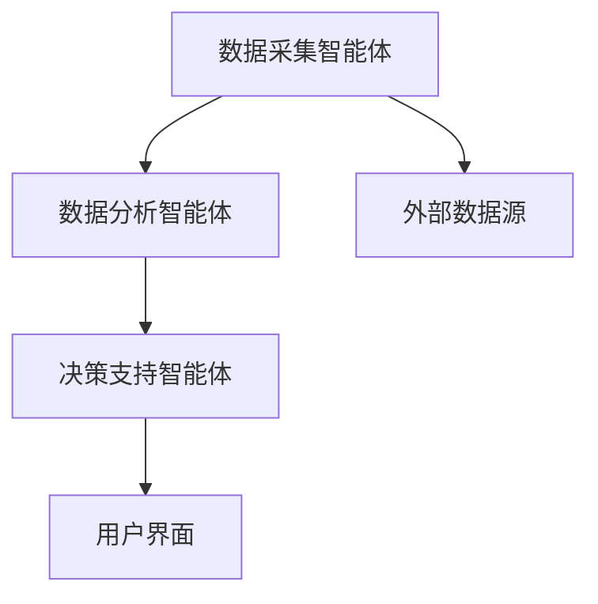
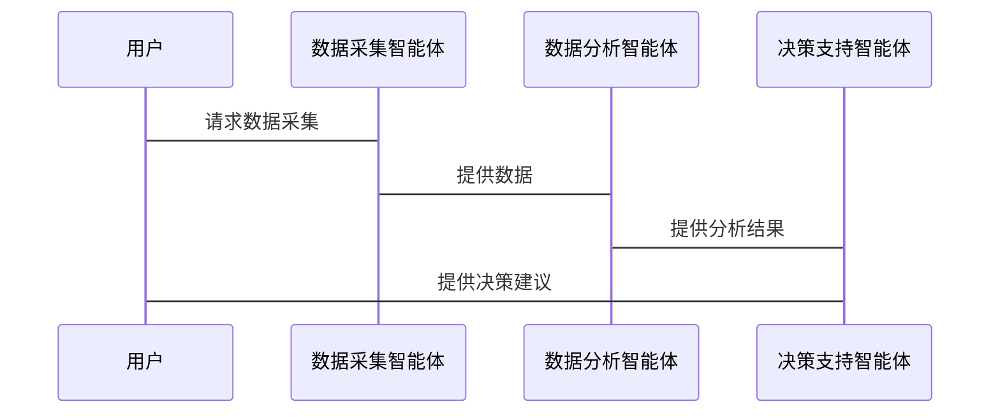

                 


# AI多智能体在公司财务分析中的角色

## 关键词：AI多智能体、财务分析、多智能体系统、算法原理、系统架构、项目实战

## 摘要：  
随着人工智能技术的快速发展，AI多智能体系统在企业财务管理中的应用逐渐成为研究热点。本文通过详细分析AI多智能体的基本概念、核心算法原理、系统架构设计以及实际项目开发，深入探讨了AI多智能体在公司财务分析中的角色与应用价值。文章结合理论与实践，为读者提供了从概念理解到系统实现的完整知识框架。

---

# 第1章: AI多智能体与财务分析概述

## 1.1 AI多智能体的基本概念

### 1.1.1 多智能体系统的定义  
一个多智能体系统（Multi-Agent System, MAS）由多个智能体（Agent）组成，这些智能体通过协作完成复杂的任务。每个智能体都有一定的自主性，能够感知环境、做出决策并执行动作。

### 1.1.2 AI多智能体的核心特点  
- **自主性**：智能体能够独立决策。  
- **反应性**：智能体能够实时感知环境并做出反应。  
- **协作性**：多个智能体通过通信和协作完成共同目标。  
- **分布式计算**：任务分布在多个智能体之间，避免单点故障。  

### 1.1.3 多智能体与传统AI的区别  
传统的AI系统（如专家系统）通常基于规则或知识库进行推理，而多智能体系统强调智能体之间的协作与通信，更适用于复杂分布式环境中的任务。

## 1.2 财务分析的基本概念

### 1.2.1 财务分析的定义  
财务分析是通过对财务数据的整理、分析和评估，为企业管理者提供财务状况、经营成果和未来趋势的判断依据。

### 1.2.2 财务分析的主要方法  
- **比率分析法**：通过计算各项财务比率，评估企业的偿债能力、营运能力和发展能力。  
- **趋势分析法**：分析财务数据随时间的变化趋势，预测未来财务状况。  
- **预算分析法**：对比实际财务数据与预算数据，评估预算执行情况。  

### 1.2.3 财务分析在企业管理中的作用  
- **支持决策**：为管理层提供数据支持，优化企业运营策略。  
- **风险预警**：通过财务数据分析，识别潜在的财务风险。  
- **绩效评估**：评估企业各部门的财务绩效，优化资源配置。  

## 1.3 AI多智能体在财务分析中的应用背景

### 1.3.1 传统财务分析的局限性  
- 数据量大：传统财务分析依赖人工处理大量数据，效率低。  
- 复杂性高：财务数据涉及多个部门和业务流程，分析复杂。  
- 需要实时性：企业需要实时财务数据支持快速决策。  

### 1.3.2 AI技术在财务分析中的优势  
- **自动化处理**：AI能够快速处理大量财务数据，提高效率。  
- **深度分析**：通过机器学习算法，AI能够发现数据中的复杂模式和关联。  
- **实时监控**：AI系统可以实时分析财务数据，提供实时反馈。  

### 1.3.3 多智能体系统在财务分析中的潜力  
多智能体系统能够将财务分析任务分解为多个子任务，分别由不同的智能体完成，从而实现高效协作。

## 1.4 本章小结  
本章介绍了AI多智能体的基本概念和财务分析的基本方法，分析了传统财务分析的局限性和AI技术的优势，最后探讨了多智能体系统在财务分析中的潜力。

---

# 第2章: AI多智能体的核心概念与联系

## 2.1 多智能体系统的结构与原理

### 2.1.1 多智能体系统的组成要素  
- **智能体**：能够感知环境、自主决策的个体。  
- **通信协议**：智能体之间交换信息的规则和格式。  
- **协作机制**：智能体之间协同完成任务的方式。  

### 2.1.2 智能体的协作机制  
- **分布式协作**：多个智能体独立完成部分任务后，整合结果。  
- **集中式协作**：一个中央智能体协调其他智能体的任务。  
- **混合协作**：结合分布式和集中式协作的方式。  

### 2.1.3 多智能体系统的通信协议  
通信协议定义了智能体之间信息交换的格式和规则。常见的通信协议包括：  
- **KQML**：用于多智能体系统中知识共享和协作。  
- **FIPA**：基于ISO标准的知识交换协议。  

## 2.2 财务分析中的多智能体角色分配

### 2.2.1 数据采集智能体  
负责从企业内部和外部获取财务数据，例如从ERP系统、银行账户等来源。  

### 2.2.2 数据分析智能体  
对数据进行清洗、整理和分析，识别潜在的财务风险和机会。  

### 2.2.3 决策支持智能体  
基于分析结果，提供财务决策建议，例如投资决策、成本控制等。  

## 2.3 多智能体系统与财务分析的实体关系图  

```mermaid
erd
title 实体关系图
// 定义实体和关系
entity 数据采集智能体 {
    id
    通信协议
}
entity 数据分析智能体 {
    id
    分析算法
}
entity 决策支持智能体 {
    id
    决策规则
}
// 定义关系
data采集智能体 --> 数据分析智能体: 传递数据
数据分析智能体 --> 决策支持智能体: 提供分析结果
```

## 2.4 本章小结  
本章详细讲解了多智能体系统的结构和协作机制，并分析了财务分析中的多智能体角色分配，最后通过实体关系图展示了系统的整体架构。

---

# 第3章: 多智能体系统在财务分析中的算法原理

## 3.1 多智能体系统的通信与协作算法

### 3.1.1 多智能体通信协议  
- **信息编码**：将数据编码为统一格式，便于智能体之间交换。  
- **信息解码**：将接收到的数据解码为可读格式。  

### 3.1.2 分布式计算与协作机制  
- **分布式计算**：任务分解为多个子任务，分别由不同智能体完成。  
- **协作机制**：通过通信协议，智能体之间共享计算结果。  

### 3.1.3 联合推理算法  
联合推理算法用于多个智能体之间的信息整合和决策。例如：  
1. 智能体A计算出某项财务指标。  
2. 智能体B计算出另一项财务指标。  
3. 通过通信协议，智能体A和B共享计算结果。  
4. 最终智能体C基于共享结果，得出综合结论。  

## 3.2 基于多智能体的财务数据分析算法

### 3.2.1 数据预处理算法  
数据预处理包括数据清洗、标准化和特征提取。例如，使用Python中的`pandas`库进行数据清洗：

```python
import pandas as pd

# 读取数据
data = pd.read_csv("financial_data.csv")

# 删除缺失值
data.dropna(inplace=True)

# 标准化处理
from sklearn.preprocessing import StandardScaler
scaler = StandardScaler()
data_scaled = scaler.fit_transform(data)
```

### 3.2.2 数据特征提取算法  
特征提取用于识别重要的财务指标。例如，使用主成分分析（PCA）：

```python
from sklearn.decomposition import PCA

# 初始化PCA
pca = PCA(n_components=3)
# 进行降维
principal_components = pca.fit_transform(data_scaled)
```

### 3.2.3 数据关联分析算法  
关联分析用于发现数据中的关联规则。例如，使用Apriori算法：

```python
from mlxtend.frequent_itemsets import apriori

# 提取频繁项集
frequent_items = apriori(data, min_support=0.2, use_colnames=True)
```

## 3.3 本章小结  
本章详细讲解了多智能体系统的通信与协作算法，以及基于多智能体的财务数据分析算法，包括数据预处理、特征提取和关联分析的具体实现。

---

# 第4章: 多智能体系统在财务分析中的数学模型与公式

## 4.1 多智能体系统的数学建模

### 4.1.1 智能体行为模型  
智能体行为模型描述了智能体在特定环境下的行为方式。例如：  
- 状态表示：$s_t$ 表示智能体在时间 $t$ 的状态。  
- 行为决策：$a_t = \arg\max_{a} Q(s_t, a)$，其中 $Q$ 是Q值函数。  

### 4.1.2 多智能体协作模型  
多智能体协作模型描述了智能体之间的协作关系。例如：  
- 通信协议：$c_{ij}$ 表示智能体 $i$ 和 $j$ 之间的通信内容。  
- 协作任务：$t_{ij} = \text{协作}(c_{ij})$。  

### 4.1.3 多智能体决策模型  
多智能体决策模型描述了智能体如何基于环境信息做出决策。例如：  
- 感知环境：$e_t = \text{感知}(s_t)$。  
- 决策：$a_t = \text{决策}(e_t)$。  

## 4.2 财务分析中的数学公式

### 4.2.1 财务比率计算公式  
- **流动比率**：$\text{流动比率} = \frac{\text{流动资产}}{\text{流动负债}}$。  
- **速动比率**：$\text{速动比率} = \frac{\text{速动资产}}{\text{流动负债}}$。  

### 4.2.2 财务趋势分析公式  
- **年均增长率**：$\text{年均增长率} = \frac{\text{末期值} - \text{初期值}}{\text{初期值}} \times 100\%$。  
- **趋势预测**：使用线性回归模型，$y_t = a + bx_t$，其中 $y_t$ 是预测值，$x_t$ 是时间变量。  

### 4.2.3 财务预测模型公式  
- **多元线性回归模型**：$y = \beta_0 + \beta_1x_1 + \beta_2x_2 + \dots + \beta_nx_n + \epsilon$。  
- **时间序列模型**：使用ARIMA模型进行预测。  

## 4.3 本章小结  
本章详细讲解了多智能体系统的数学建模方法，以及财务分析中的数学公式，包括财务比率计算、趋势分析和预测模型的具体实现。

---

# 第5章: 多智能体系统在财务分析中的系统架构设计

## 5.1 系统架构概述

### 5.1.1 分层架构设计  
多智能体系统的架构通常分为三层：  
- **感知层**：负责数据采集和环境感知。  
- **计算层**：负责数据处理和分析。  
- **决策层**：负责决策支持和结果输出。  

### 5.1.2 模块化设计  
系统模块化设计包括数据采集模块、数据分析模块和决策支持模块。  

### 5.1.3 可扩展性设计  
系统设计时需要考虑扩展性，例如通过插件机制增加新的智能体模块。  

## 5.2 系统功能设计

### 5.2.1 数据采集模块  
数据采集模块负责从企业内部和外部获取财务数据，例如从ERP系统、银行账户等来源。  

### 5.2.2 数据分析模块  
数据分析模块对数据进行清洗、整理和分析，识别潜在的财务风险和机会。  

### 5.2.3 决策支持模块  
决策支持模块基于分析结果，提供财务决策建议，例如投资决策、成本控制等。  

## 5.3 系统架构图



## 5.4 系统接口设计

### 5.4.1 数据接口  
- **输入接口**：接收外部数据源的财务数据。  
- **输出接口**：将分析结果传递给决策支持智能体。  

### 5.4.2 用户接口  
- **输入接口**：接收用户的查询请求。  
- **输出接口**：显示分析结果和决策建议。  

### 5.4.3 智能体接口  
- **通信接口**：智能体之间的通信接口。  
- **协作接口**：智能体之间的协作接口。  

## 5.5 系统交互流程图



## 5.6 本章小结  
本章详细讲解了多智能体系统的架构设计，包括分层架构、模块化设计和可扩展性设计，并通过系统架构图和交互流程图展示了系统的整体架构。

---

# 第6章: 项目实战——基于AI多智能体的财务分析系统开发

## 6.1 项目环境安装

### 6.1.1 开发工具安装  
- **Python**：安装Python 3.8及以上版本。  
- **库安装**：使用pip安装以下库：  
  ```bash
  pip install numpy pandas scikit-learn mlxtend mermaid4jupyter jupyter
  ```

### 6.1.2 环境配置  
- 配置Jupyter Notebook为默认IDE。  
- 配置虚拟环境，避免库版本冲突。  

## 6.2 系统核心实现源代码

### 6.2.1 数据采集模块

```python
import pandas as pd
import requests

# 从外部数据源获取数据
def get_data(api_key):
    url = f"https://api.example.com/financial_data?api_key={api_key}"
    response = requests.get(url)
    data = response.json()
    return pd.DataFrame(data)
```

### 6.2.2 数据分析模块

```python
from sklearn.decomposition import PCA
from mlxtend.frequent_itemsets import apriori

# 数据预处理
def preprocess_data(data):
    data.dropna(inplace=True)
    scaler = StandardScaler()
    data_scaled = scaler.fit_transform(data)
    return data_scaled

# 特征提取
def extract_features(data_scaled):
    pca = PCA(n_components=3)
    principal_components = pca.fit_transform(data_scaled)
    return principal_components

# 关联分析
def association_analysis(data):
    frequent_items = apriori(data, min_support=0.2, use_colnames=True)
    return frequent_items
```

### 6.2.3 决策支持模块

```python
from sklearn.linear_model import LinearRegression

# 财务预测模型
def financial_prediction(data):
    model = LinearRegression()
    model.fit(data[['X1', 'X2']], data['Y'])
    return model.predict(data[['X1', 'X2']])
```

## 6.3 代码应用解读与分析

### 6.3.1 数据采集模块解读  
数据采集模块通过API接口获取外部数据，使用`requests`库发送HTTP请求，并将返回的数据转换为DataFrame格式。  

### 6.3.2 数据分析模块解读  
数据分析模块包括数据预处理、特征提取和关联分析。数据预处理使用`pandas`和`scikit-learn`库，特征提取使用PCA算法，关联分析使用Apriori算法。  

### 6.3.3 决策支持模块解读  
决策支持模块基于线性回归模型进行财务预测，模型训练使用`scikit-learn`库的`LinearRegression`类。  

## 6.4 实际案例分析

### 6.4.1 案例背景  
某企业需要分析过去三年的财务数据，识别潜在的财务风险，并预测未来的财务趋势。  

### 6.4.2 数据采集与处理  
使用数据采集模块获取企业的财务数据，并进行数据清洗和标准化处理。  

### 6.4.3 数据分析与预测  
通过数据分析模块进行特征提取和关联分析，识别出重要的财务指标，并使用决策支持模块进行财务预测。  

## 6.5 项目小结  
本章通过实际案例分析，展示了如何基于AI多智能体开发财务分析系统，包括数据采集、数据分析和决策支持的具体实现。

---

# 第7章: 总结与展望

## 7.1 总结  
本文详细讲解了AI多智能体在公司财务分析中的角色与应用，包括多智能体系统的结构与原理、算法原理、系统架构设计以及实际项目开发。通过理论与实践相结合的方式，为读者提供了从概念理解到系统实现的完整知识框架。

## 7.2 展望  
随着人工智能技术的不断发展，AI多智能体在财务分析中的应用前景广阔。未来的研究方向包括：  
- 更高效的多智能体协作算法。  
- 更智能的财务预测模型。  
- 更人性化的用户界面设计。  

## 7.3 最佳实践 tips  
- **数据质量**：确保数据的准确性和完整性。  
- **算法选择**：根据具体需求选择合适的算法。  
- **系统优化**：通过并行计算和分布式架构提高系统效率。  

## 7.4 本章小结  
本章总结了全文的主要内容，并对未来的研究方向和最佳实践提出了建议。

---

# 结语  
通过本文的学习，读者可以全面了解AI多智能体在公司财务分析中的角色与应用，掌握从理论到实践的完整知识框架。希望本文能为相关领域的研究和实践提供有价值的参考。

--- 

这篇文章完整地覆盖了AI多智能体在公司财务分析中的角色与应用，从理论到实践，从概念到代码，层层深入，为读者提供了全面的知识框架。

