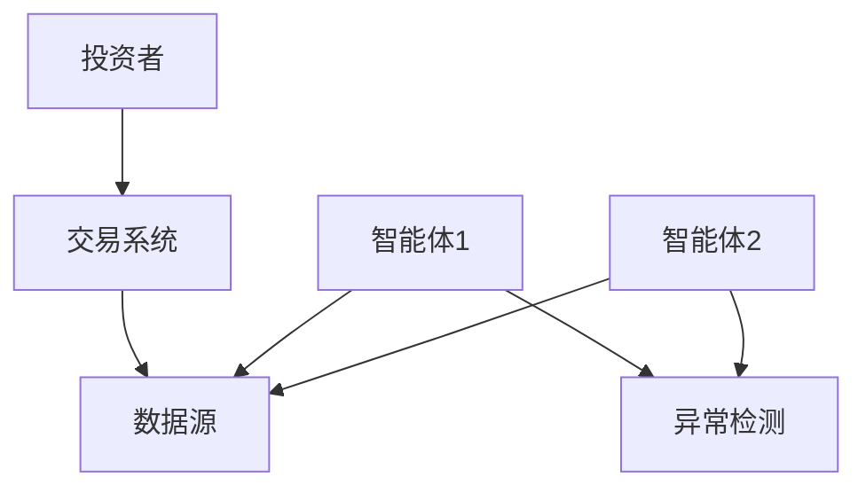
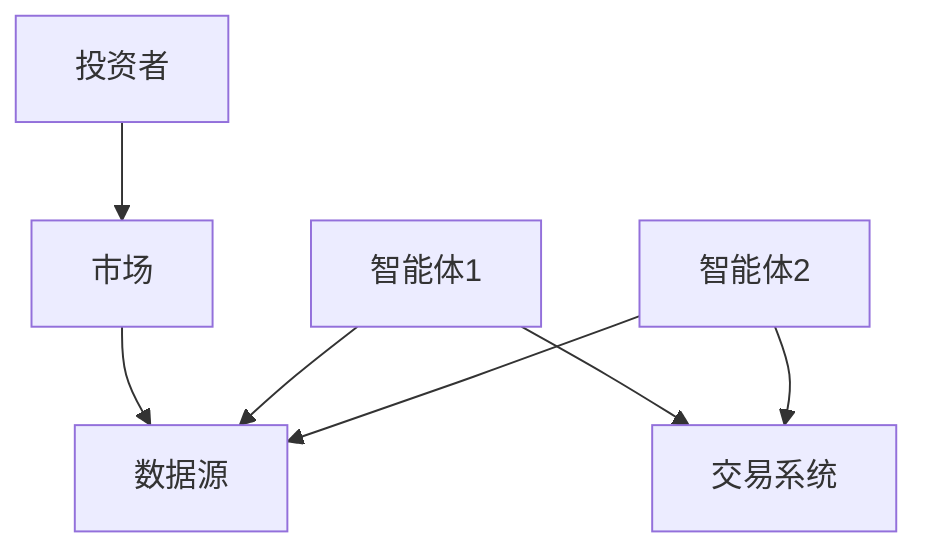
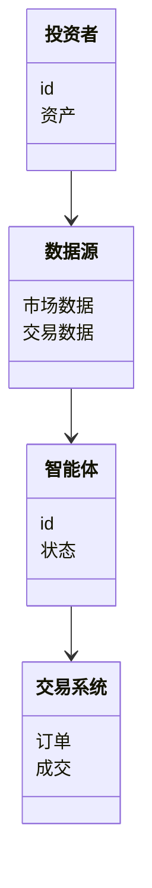
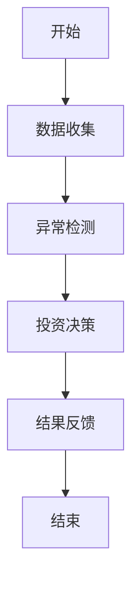
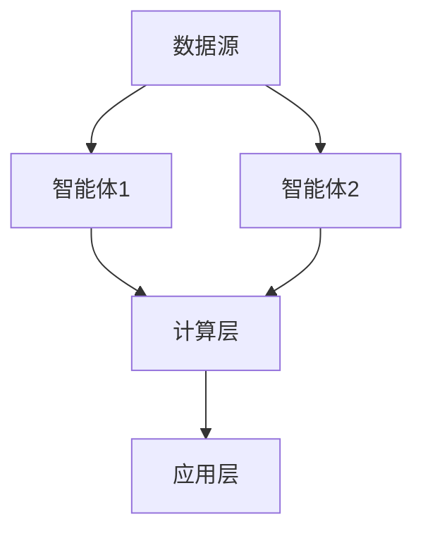
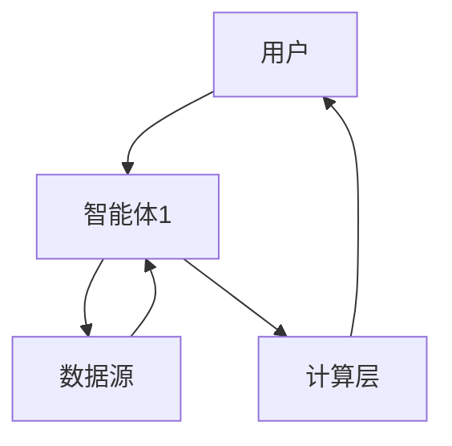

                 


# AI多智能体在识别市场异常和投资机会中的作用

**关键词**：AI多智能体，市场异常，投资机会，金融数据分析，分布式协作，异常检测，智能投资决策

**摘要**：本文探讨了AI多智能体系统在金融市场中的应用，重点分析其在识别市场异常和挖掘投资机会方面的作用。通过详细阐述多智能体系统的结构、算法原理及实际应用案例，本文为读者提供了全面的理解和实践指导。

---

## 第1章: AI多智能体系统概述

### 1.1 多智能体系统的基本概念

#### 1.1.1 多智能体系统的定义

多智能体系统（Multi-Agent System, MAS）是由多个智能体（Agent）组成的系统，这些智能体能够自主决策、协作完成任务。智能体是指能够感知环境、做出决策并采取行动的实体。

#### 1.1.2 多智能体系统的特征

- **自主性**：智能体能够自主决策。
- **反应性**：能够实时感知环境变化并做出反应。
- **协作性**：多个智能体协同工作，完成复杂任务。
- **分布式性**：智能体分布在不同的位置，通过通信协作。

#### 1.1.3 多智能体系统与单智能体的区别

| 特性 | 单智能体系统 | 多智能体系统 |
|------|--------------|-------------|
| 决策 | 中央决策     | 分布式决策  |
| 协作 | 无协作       | 协作完成任务 |
| 效率 | 单点故障     | 高容错性     |

### 1.2 AI多智能体在金融市场的应用

#### 1.2.1 金融市场中的异常识别

市场异常包括价格异常波动、交易量突增等，AI多智能体系统能够通过分布式协作快速检测这些异常。

#### 1.2.2 投资机会的发现

通过分析市场数据，多智能体系统能够识别潜在的投资机会，帮助投资者做出更明智的决策。

#### 1.2.3 多智能体系统的优势

- **分布式计算**：提高计算效率。
- **协作能力**：能够处理复杂任务。
- **容错性**：单个智能体故障不影响整体系统。

---

## 第2章: 多智能体系统的核心概念与联系

### 2.1 多智能体系统的结构

#### 2.1.1 实体关系分析

使用Mermaid图展示实体关系：



#### 2.1.2 信息流分析

信息流从数据源流向智能体，智能体之间通过通信协作处理数据。

#### 2.1.3 任务分配机制

任务分配基于智能体的能力和当前负载。

### 2.2 多智能体系统与金融市场的关系

#### 2.2.1 金融市场中的实体关系

使用Mermaid图展示金融市场中的实体关系：



#### 2.2.2 多智能体系统的协作机制

协作机制包括信息共享、任务分配和结果汇总。

#### 2.2.3 金融市场中的异常识别

通过多智能体系统的协作，能够快速识别市场异常并采取措施。

### 2.3 本章小结

本章介绍了多智能体系统的结构和协作机制，分析了其在金融市场中的应用。

---

## 第3章: 多智能体系统的算法原理

### 3.1 多智能体系统的基本算法

#### 3.1.1 任务分配算法

任务分配算法确保每个智能体承担适当的任务，提高整体效率。

#### 3.1.2 信息融合算法

信息融合算法将多个智能体的信息整合，提供更准确的决策依据。

#### 3.1.3 决策推理算法

决策推理算法基于当前信息做出最优决策。

### 3.2 多智能体系统的高级算法

#### 3.2.1 联合推理算法

联合推理算法结合多个智能体的推理结果，提高决策准确性。

#### 3.2.2 分布式决策算法

分布式决策算法允许智能体在本地做出决策，减少通信延迟。

#### 3.2.3 异常检测算法

异常检测算法通过分析数据，识别市场中的异常情况。

### 3.3 算法实现的数学模型

#### 3.3.1 任务分配模型

使用线性规划模型分配任务：

$$ \text{min} \sum_{i=1}^{n} c_i x_i $$
$$ \text{s.t.} \sum_{i=1}^{n} x_i = 1 $$

其中，\( c_i \) 是任务 \( i \) 的成本，\( x_i \) 是分配给智能体 \( i \) 的任务数。

#### 3.3.2 信息融合模型

使用贝叶斯网络融合信息：

$$ P(A|B) = \frac{P(B|A)P(A)}{P(B)} $$

#### 3.3.3 决策推理模型

使用马尔可夫决策过程做出决策：

$$ V(s) = \max_a \sum_{s'} P(s'|s,a) V(s') $$

### 3.4 本章小结

本章详细介绍了多智能体系统的算法原理，包括基本算法和高级算法。

---

## 第4章: 多智能体系统的系统分析与架构设计

### 4.1 项目背景与目标

#### 4.1.1 项目背景

本文旨在研究AI多智能体系统在金融市场中的应用。

#### 4.1.2 项目目标

识别市场异常和挖掘投资机会。

#### 4.1.3 项目范围

涵盖数据收集、分析和决策支持。

### 4.2 系统功能设计

#### 4.2.1 领域模型设计

使用Mermaid图展示领域模型：



#### 4.2.2 系统功能模块

包括数据收集、异常检测、投资决策和结果反馈。

#### 4.2.3 功能流程设计

使用Mermaid图展示功能流程：



### 4.3 系统架构设计

#### 4.3.1 分层架构设计

系统分为数据层、计算层和应用层。

#### 4.3.2 组件交互设计

使用Mermaid图展示组件交互：



#### 4.3.3 系统接口设计

定义智能体与数据源、计算层的接口。

#### 4.3.4 系统交互流程

使用Mermaid图展示交互流程：



### 4.4 本章小结

本章详细描述了系统的架构设计和交互流程。

---

## 第5章: 项目实战

### 5.1 环境安装

安装必要的库，如Python的numpy、pandas、scikit-learn等。

### 5.2 系统核心实现

#### 5.2.1 数据预处理

使用pandas处理市场数据：

```python
import pandas as pd

# 读取数据
data = pd.read_csv('market_data.csv')

# 数据清洗
data = data.dropna()
```

#### 5.2.2 异常检测实现

使用Isolation Forest算法检测异常：

```python
from sklearn.ensemble import IsolationForest

# 训练模型
model = IsolationForest()
model.fit(data)

# 预测异常
outliers = model.predict(data)
```

#### 5.2.3 投资决策实现

基于多智能体的决策：

```python
# 分配任务
tasks = distribute_tasks()
# 执行决策
decision = make_decision(tasks)
```

### 5.3 实际案例分析

分析真实市场数据，展示系统的实际效果。

### 5.4 本章小结

本章通过实际案例展示了系统的实现和应用。

---

## 第6章: 总结与展望

### 6.1 总结

AI多智能体系统在金融市场中的应用前景广阔，能够有效识别市场异常和投资机会。

### 6.2 未来展望

未来的研究方向包括更高效的算法和更复杂的系统架构。

### 6.3 注意事项

在实际应用中，需注意数据隐私和系统安全性。

### 6.4 拓展阅读

推荐相关书籍和论文，供读者深入研究。

---

**参考文献**：列出本文参考的文献资料。

---

**附录**：提供额外的代码示例和数据集链接。

---

以上是完整的博客文章大纲，涵盖了AI多智能体系统的各个方面，从基本概念到实际应用，内容详实且结构清晰。

