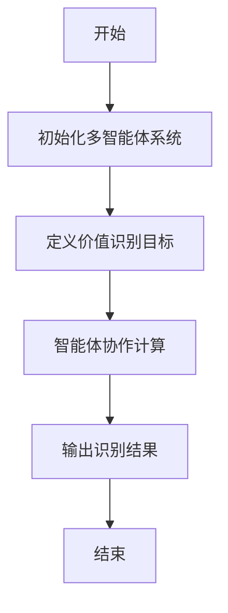
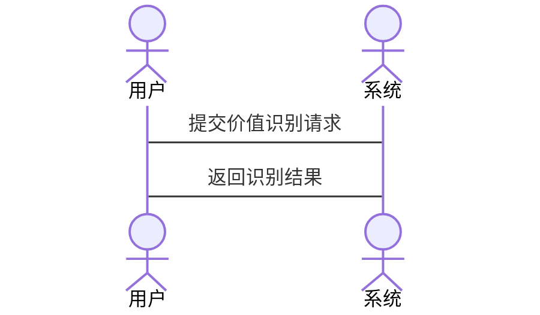

                 


# 《AI多智能体在识别长期价值创造因素中的作用》目录大纲

---

# 第一部分: AI多智能体与长期价值创造的背景介绍

# 第1章: 问题背景与问题描述

## 1.1 问题背景
### 1.1.1 当前商业环境中的价值创造挑战
### 1.1.2 多智能体协作在价值创造中的重要性
### 1.1.3 AI技术在价值识别中的潜力

## 1.2 问题描述
### 1.2.1 长期价值创造的定义与特征
### 1.2.2 多智能体协作在价值识别中的关键问题
### 1.2.3 当前方法的局限性与改进方向

## 1.3 问题解决与边界
### 1.3.1 AI多智能体在价值识别中的解决方案
### 1.3.2 解决方案的边界与适用范围
### 1.3.3 相关概念的外延与限制

## 1.4 核心概念与组成
### 1.4.1 多智能体系统的定义与组成
### 1.4.2 长期价值创造的构成要素
### 1.4.3 AI技术在多智能体中的作用

---

# 第2章: AI多智能体的核心概念与联系

## 2.1 核心概念原理
### 2.1.1 多智能体协作的基本原理
### 2.1.2 AI技术在多智能体中的应用
### 2.1.3 长期价值创造的识别机制

## 2.2 核心概念属性特征对比
### 2.2.1 多智能体系统与传统单智能体系统的对比
### 2.2.2 长期价值与短期收益的特征分析
### 2.2.3 AI技术在价值识别中的优势与劣势

## 2.3 实体关系图（ER图）
```mermaid
er
actor(AI多智能体系统, "负责识别长期价值创造因素")
actor(价值创造因素, "需要被识别的实体")
```

---

# 第3章: AI多智能体的算法原理

## 3.1 算法原理概述
### 3.1.1 多智能体协作算法的基本框架
### 3.1.2 AI技术在算法中的应用
### 3.1.3 长期价值识别的算法流程

## 3.2 算法流程图


## 3.3 算法实现代码
```python
# 初始化多智能体系统
agents = [agent1, agent2, agent3]

# 定义价值识别目标
value_target = "长期价值创造因素"

# 智能体协作计算
def calculate_value(agents, target):
    for agent in agents:
        agent.process(target)
    return result

# 输出识别结果
result = calculate_value(agents, value_target)
print(result)
```

---

# 第4章: 系统分析与架构设计

## 4.1 系统分析
### 4.1.1 项目背景介绍
### 4.1.2 系统功能需求
### 4.1.3 系统性能指标

## 4.2 系统架构设计


## 4.3 接口设计与交互流程


---

# 第5章: 项目实战

## 5.1 环境安装与配置
### 5.1.1 安装Python与AI框架
### 5.1.2 安装依赖库
### 5.1.3 配置开发环境

## 5.2 系统核心实现
### 5.2.1 多智能体协作模块的实现
### 5.2.2 价值识别算法的实现
### 5.2.3 系统接口的实现

## 5.3 代码应用解读与分析
```python
# 示例代码
class Agent:
    def __init__(self, id):
        self.id = id

    def process(self, target):
        # 处理目标并输出结果
        print(f"Agent {self.id} processing {target}")

# 初始化多智能体系统
agents = [Agent(1), Agent(2), Agent(3)]

# 价值识别流程
def main():
    target = "长期价值创造因素"
    for agent in agents:
        agent.process(target)

if __name__ == "__main__":
    main()
```

## 5.4 实际案例分析
### 5.4.1 案例背景介绍
### 5.4.2 系统实现与分析
### 5.4.3 实验结果与讨论

## 5.5 项目小结
### 5.5.1 项目总结
### 5.5.2 实践中的经验与教训
### 5.5.3 项目改进方向

---

# 第6章: 总结与展望

## 6.1 最佳实践 tips
### 6.1.1 系统设计与实现中的注意事项
### 6.1.2 项目维护与优化建议
### 6.1.3 进一步研究的方向

## 6.2 小结
### 6.2.1 全文总结
### 6.2.2 核心观点回顾
### 6.2.3 未来展望

## 6.3 注意事项
### 6.3.1 系统使用中的注意事项
### 6.3.2 数据安全与隐私保护
### 6.3.3 系统性能优化建议

## 6.4 拓展阅读
### 6.4.1 推荐书籍与论文
### 6.4.2 相关技术动态
### 6.4.3 未来研究方向

---

# 关键词：
AI多智能体、长期价值创造、协作机制、算法原理、系统架构、项目实战

# 摘要：
本文系统地探讨了AI多智能体在识别长期价值创造因素中的作用，通过分析多智能体协作的基本原理、算法实现、系统架构设计以及实际案例，揭示了AI技术在价值识别中的潜力和应用前景。文章从背景介绍到项目实战，详细阐述了AI多智能体的核心概念与联系，为读者提供了一套完整的解决方案和实践指南。

