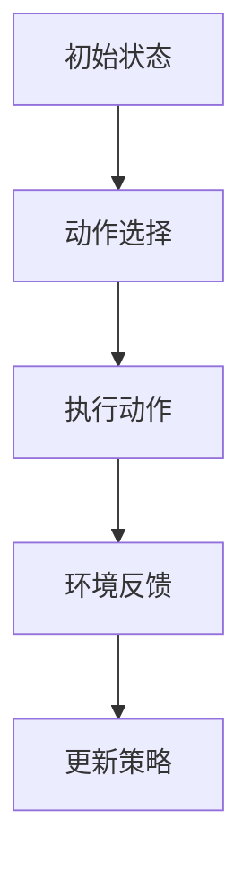
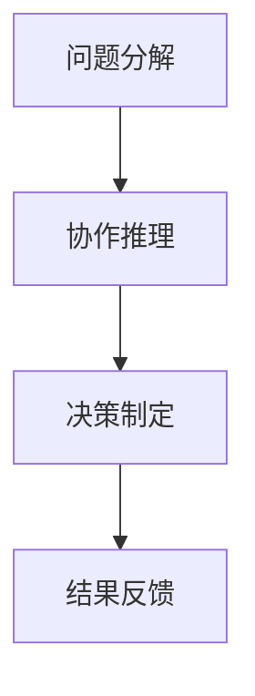
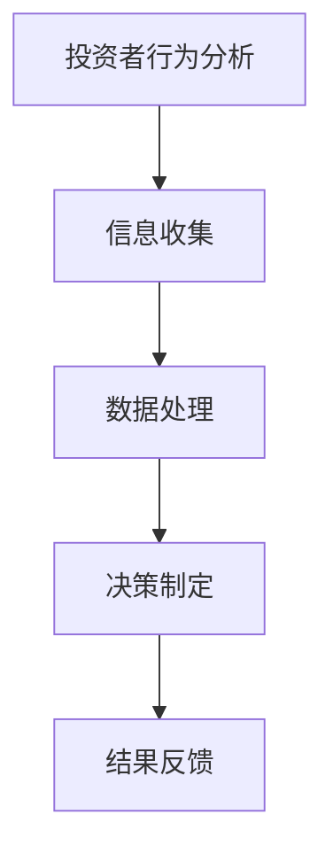
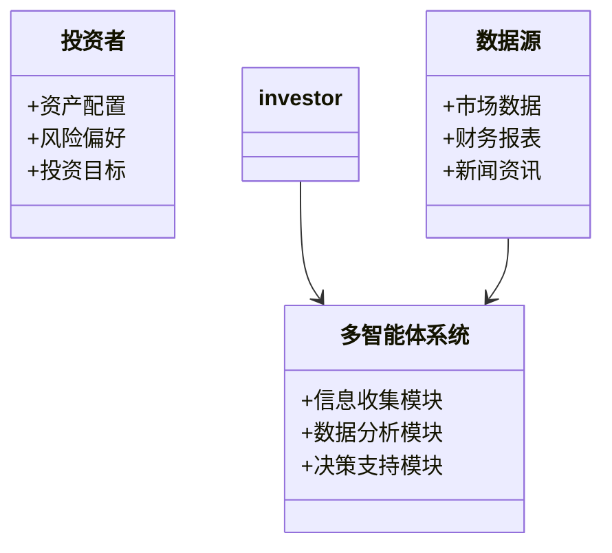
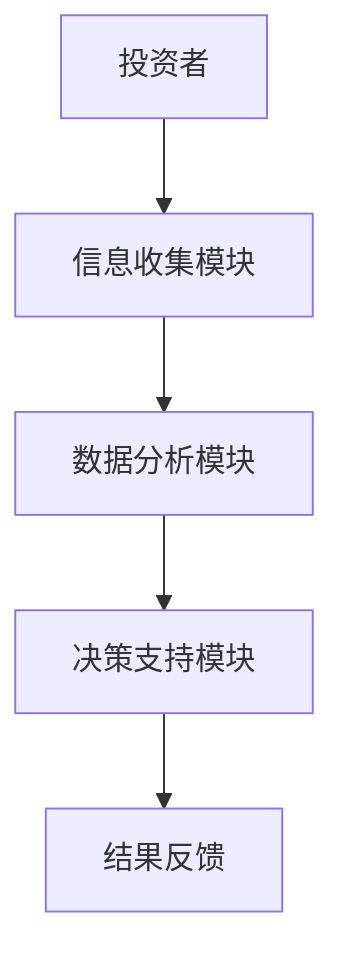

                 


# AI多智能体增强价值投资者的信息处理能力

> 关键词：AI多智能体、价值投资、信息处理、投资者决策、数据分析

> 摘要：本文探讨了如何利用AI多智能体技术提升价值投资者的信息处理能力。通过分析多智能体系统的原理、算法实现及架构设计，展示了其在金融领域中的应用潜力。文章详细讲解了相关概念、技术细节和实际案例，为投资者提供了新的决策支持工具。

---

## 第一部分: AI多智能体与价值投资的背景介绍

### 1.1 问题背景与描述

#### 1.1.1 传统价值投资的局限性
传统价值投资依赖于分析师的主观判断和经验，存在信息处理效率低、决策滞后等问题。投资者难以快速处理海量数据，容易错过市场机会或承担不必要的风险。

#### 1.1.2 AI技术在金融领域的应用现状
AI技术在金融领域的应用日益广泛，包括算法交易、风险评估和市场预测。然而，单个AI模型的能力有限，难以应对复杂的金融环境。

#### 1.1.3 多智能体系统的优势与潜力
多智能体系统通过协作和分布式计算，能够更高效地处理信息，提供更精准的决策支持。多个智能体分工合作，互补优势，显著提升了信息处理能力。

### 1.2 多智能体系统的定义与特征

#### 1.2.1 多智能体系统的定义
多智能体系统是由多个独立或协作的智能体组成的系统，能够在分布式环境中完成复杂任务。

#### 1.2.2 多智能体系统的属性特征对比表

| 特性         | 单智能体系统   | 多智能体系统   |
|--------------|----------------|----------------|
| 任务处理     | 单一任务       | 多任务         |
| 智能体数量   | 1              | 多              |
| 信息共享     | 有限           | 充分            |
| 决策速度     | 较慢           | 较快            |

#### 1.2.3 多智能体系统的ER实体关系图

```mermaid
erd
投资者 --> 多智能体系统
多智能体系统 --> 数据源
数据源 --> 市场数据
数据源 --> 财务报表
数据源 --> 新闻资讯
```

### 1.3 价值投资者的信息处理需求

#### 1.3.1 价值投资者的核心目标
价值投资者追求长期稳定的收益，注重基本面分析和风险管理。

#### 1.3.2 信息处理的关键环节
投资者需要快速收集、分析和处理市场数据，以便做出明智的投资决策。

#### 1.3.3 多智能体如何增强信息处理能力
多智能体系统通过分工协作，提高了信息处理效率和准确性。多个智能体分别负责数据收集、分析和预测，最终整合结果提供决策支持。

---

## 第二部分: 多智能体系统的原理与架构

### 2.1 多智能体系统的原理

#### 2.1.1 分布式计算与协作机制
多智能体系统通过分布式计算，将任务分解为多个子任务，由不同的智能体协作完成。

#### 2.1.2 信息共享与知识表示
智能体之间通过共享知识和信息，提升整体决策能力。知识表示采用图结构，便于推理和分析。

#### 2.1.3 协作任务分配算法
采用分布式算法，根据智能体的能力和任务需求，动态分配任务。

### 2.2 多智能体系统的架构设计

#### 2.2.1 分层架构设计
系统分为感知层、决策层和执行层，各层协同工作，确保高效处理。

#### 2.2.2 模块化设计
系统划分为数据处理模块、决策支持模块和结果反馈模块，各模块独立运行，便于维护和扩展。

#### 2.2.3 通信协议与接口设计
采用标准通信协议，确保智能体之间高效交互。接口设计明确，便于模块间的数据传递。

---

## 第三部分: AI多智能体的算法实现

### 3.1 多智能体协作算法

#### 3.1.1 分布式强化学习算法
智能体通过强化学习，逐步优化决策策略。算法流程如下：



#### 3.1.2 联合推理与决策算法
多个智能体协作推理，共同制定最优决策。算法流程：



#### 3.1.3 自适应协作机制
根据环境变化，动态调整协作策略，提升适应性。

### 3.2 算法流程图

#### 分布式强化学习流程图



#### 联合推理与决策流程图


### 3.3 数学模型与公式

#### 收益预测模型

$$ R = \sum_{i=1}^{n} w_i x_i $$

其中，$w_i$ 是权重，$x_i$ 是特征向量。

#### 风险评估模型

$$ Risk = \sqrt{\sum_{i=1}^{m} (p_i - \mu)^2} $$

其中，$p_i$ 是收益，$\mu$ 是平均收益。

---

## 第四部分: 系统分析与架构设计

### 4.1 问题场景分析

#### 投资者信息处理的痛点
投资者面临数据繁多、信息分散的问题，难以快速获取和处理关键信息。

#### 多智能体系统的解决方案
通过多智能体协作，快速收集、分析和处理数据，提供实时决策支持。

### 4.2 领域模型设计



### 4.3 系统架构设计

#### 系统架构图



#### 系统接口设计
采用RESTful API，便于模块间通信和数据交互。

#### 系统交互流程

```mermaid
sequenceDiagram
investor -> 多智能体系统: 发起请求
多智能体系统 -> 数据源: 获取数据
数据源 --> 多智能体系统: 返回数据
多智能体系统 -> 分析数据
分析数据 --> 多智能体系统: 提供决策支持
多智能体系统 -> 投资者: 返回结果
```

---

## 总结

通过本文的分析，我们可以看到，AI多智能体技术能够显著提升价值投资者的信息处理能力。多智能体系统的协作机制和分布式计算能力，为投资者提供了更高效、更准确的决策支持工具。未来，随着技术的进一步发展，多智能体系统在金融领域的应用前景将更加广阔。

---

**参考文献**
1. [书籍或论文1]
2. [书籍或论文2]
3. [书籍或论文3]

**附录**
[附录内容，如代码片段、数据表格等]

