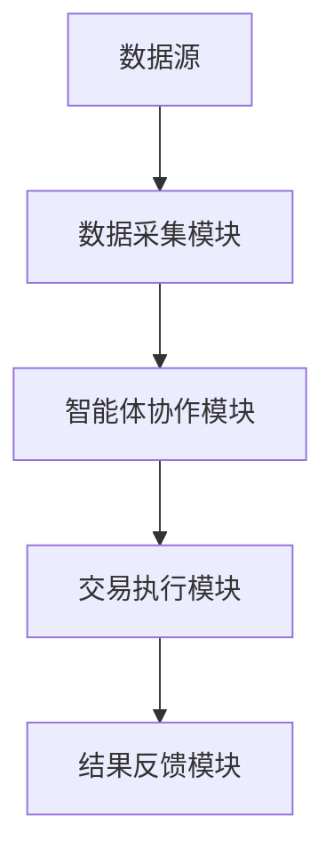
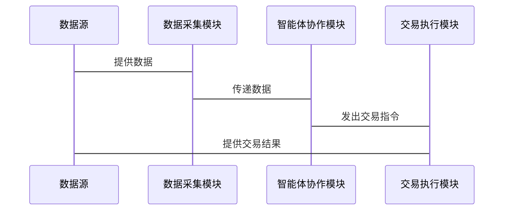

                 


# AI多智能体如何优化价值投资的全球资源配置策略

## 关键词：AI多智能体、价值投资、全球资源配置、优化算法、系统架构

## 摘要：  
本文探讨了如何利用AI多智能体技术优化价值投资的全球资源配置策略。通过分析多智能体系统的协作机制、优化算法以及系统架构，结合实际案例，展示了AI如何提升投资决策的效率和准确性。文章内容涵盖背景介绍、核心概念、算法原理、系统设计和项目实战，旨在为读者提供全面的技术解析。

---

# 第一部分: AI多智能体与价值投资的全球资源配置策略概述

## 第1章: 问题背景与概念介绍

### 1.1 问题背景

#### 1.1.1 价值投资的基本概念
价值投资是一种以低于内在价值的价格买入优质股票的投资策略，核心在于寻找市场低估的资产。传统价值投资依赖分析师的主观判断，存在效率低下和人为误差的问题。

#### 1.1.2 全球资源配置的挑战
在全球化背景下，投资者需要在全球范围内配置资产，但面临市场波动、地域风险和信息不对称等多重挑战。如何在复杂的全球市场中优化资源配置，成为投资者的重要课题。

#### 1.1.3 AI技术在投资领域的应用现状
人工智能技术已在金融领域广泛应用，包括股票预测、风险评估和投资组合优化等。然而，传统AI多为单智能体系统，难以应对多目标、多约束的复杂投资场景。

---

### 1.2 核心概念与问题描述

#### 1.2.1 多智能体系统的定义
多智能体系统（Multi-Agent System, MAS）是由多个相互作用的智能体组成的系统，每个智能体具有自主性、反应性和协作性。在投资领域，多个智能体可以分别负责数据采集、策略制定和风险控制等任务。

#### 1.2.2 多智能体与价值投资的结合
通过多智能体系统的协作，投资者可以更高效地分析全球市场数据，捕捉投资机会，并动态调整投资策略。例如，一个智能体负责分析宏观经济数据，另一个负责评估个股基本面，多个智能体协同工作，提供更全面的投资决策支持。

#### 1.2.3 全球资源配置优化的数学模型
数学模型是优化资源配置的核心工具。以下是优化模型的基本框架：

$$
\text{目标函数：} \quad \max \sum_{i=1}^{n} w_i r_i
$$

$$
\text{约束条件：} \quad \sum_{i=1}^{n} w_i = 1, \quad w_i \geq 0
$$

其中，$w_i$表示资产$i$的权重，$r_i$表示资产$i$的预期收益。

---

## 第2章: 多智能体系统的核心原理

### 2.1 多智能体系统的组成与特点

#### 2.1.1 多智能体系统的组成
- **感知层**：负责数据采集和市场信息处理。
- **决策层**：基于感知数据制定投资策略。
- **执行层**：根据决策层的指令执行交易操作。

#### 2.1.2 多智能体与单智能体的对比
| 特性       | 单智能体           | 多智能体           |
|------------|--------------------|--------------------|
| 独立性      | 高                 | 低                 |
| 协作性      | 无                 | 有                 |
| 效率        | 高                 | 取决于协作机制     |

#### 2.1.3 多智能体系统的协作机制
协作机制是多智能体系统的核心，常见的协作方式包括：

1. **分布式协作**：智能体之间通过共享信息进行协作。
2. **集中式协作**：由一个中央智能体协调各智能体的行动。
3. **混合式协作**：结合分布式和集中式的特点。

---

### 2.2 价值投资的数学模型

#### 2.2.1 价值投资的基本公式
价值投资的核心在于找到市场低估的资产，其公式可以表示为：

$$
\text{内在价值} = \sum_{t=1}^{\infty} \frac{CF_t}{(1 + r)^t}
$$

其中，$CF_t$为第$t$年的现金流，$r$为折现率。

#### 2.2.2 多智能体优化的价值函数
多智能体系统通过优化价值函数来实现投资目标，价值函数可以表示为：

$$
V(w) = \sum_{i=1}^{n} w_i (r_i - r_f)
$$

其中，$w_i$为资产$i$的权重，$r_i$为资产$i$的预期收益，$r_f$为无风险利率。

#### 2.2.3 全球资源配置的数学表达式
全球资源配置可以表示为一个多目标优化问题，目标函数包括风险、收益和流动性等多个维度。

---

# 第二部分: 多智能体优化价值投资的算法原理

## 第3章: 多智能体协作算法

### 3.1 多智能体协作的基本原理

#### 3.1.1 分布式协作机制
分布式协作机制通过智能体之间的信息共享实现协作。以下是协作流程：

1. **信息采集**：智能体收集市场数据。
2. **信息共享**：智能体之间共享数据。
3. **策略制定**：基于共享数据制定投资策略。
4. **策略执行**：根据策略执行交易。

#### 3.1.2 协作目标的设定
协作目标的设定是多智能体系统的关键，需要考虑以下因素：

- **一致性**：所有智能体的目标一致。
- **可分解性**：目标可以分解为子目标。
- **可协调性**：目标之间可以协调。

#### 3.1.3 协作过程中的信息传递
信息传递是多智能体协作的核心，以下是常见的信息传递方式：

1. **全连接式传递**：所有智能体之间直接传递信息。
2. **分层式传递**：信息通过分层传递。
3. **事件驱动传递**：基于事件触发信息传递。

---

### 3.2 基于强化学习的多智能体优化

#### 3.2.1 强化学习的基本原理
强化学习是一种通过试错机制来优化策略的算法。以下是强化学习的基本流程：

1. **状态采集**：智能体感知环境状态。
2. **动作选择**：基于当前状态选择动作。
3. **奖励机制**：根据动作的结果获得奖励或惩罚。
4. **策略更新**：根据奖励更新策略。

#### 3.2.2 多智能体强化学习的挑战
多智能体强化学习面临以下挑战：

- **协调问题**：智能体之间需要协调动作。
- **信用分配问题**：难以确定每个智能体对结果的贡献。
- **计算复杂度**：多智能体系统的计算复杂度高。

#### 3.2.3 实际案例中的应用
以股票交易为例，多个智能体可以分别负责市场分析、风险评估和交易执行。通过协作，智能体可以更准确地预测市场走势，优化交易策略。

---

## 第4章: 价值投资优化的数学模型

### 4.1 投资组合优化的数学公式

#### 4.1.1 投资组合优化的目标函数
投资组合优化的目标是最大化收益或最小化风险。以下是常见的优化目标：

1. **最大收益**：
   $$
   \max \sum_{i=1}^{n} w_i r_i
   $$

2. **最小风险**：
   $$
   \min \sum_{i=1}^{n} w_i^2 \sigma_i^2
   $$

其中，$\sigma_i$为资产$i$的波动率。

#### 4.1.2 约束条件的设定
投资组合优化需要满足以下约束条件：

- **权重和**：
  $$
  \sum_{i=1}^{n} w_i = 1
  $$

- **权重非负**：
  $$
  w_i \geq 0
  $$

#### 4.1.3 数学模型的求解方法
投资组合优化可以通过拉格朗日乘数法或二次规划等方法求解。以下是拉格朗日乘数法的基本步骤：

1. **构建拉格朗日函数**：
   $$
   L = \sum_{i=1}^{n} w_i r_i - \lambda \left( \sum_{i=1}^{n} w_i - 1 \right)
   $$

2. **求解最优权重**：
   $$
   w_i = \frac{r_i}{\sum_{j=1}^{n} r_j}
   $$

---

## 第5章: 系统架构设计与项目实战

### 5.1 项目介绍
本项目旨在利用多智能体系统优化价值投资的全球资源配置策略。系统架构包括数据采集、智能体协作和交易执行三个部分。

### 5.2 系统功能设计

#### 5.2.1 数据采集模块
数据采集模块负责采集全球市场的股票、债券等数据。以下是数据采集流程：

1. **数据源选择**：选择可靠的金融数据源。
2. **数据清洗**：对数据进行预处理，去除无效数据。
3. **数据存储**：将数据存储到数据库中。

#### 5.2.2 智能体协作模块
智能体协作模块负责多个智能体之间的协作。以下是协作流程：

1. **任务分配**：根据智能体的能力分配任务。
2. **信息共享**：智能体之间共享数据和信息。
3. **策略制定**：基于共享数据制定投资策略。
4. **策略执行**：根据策略执行交易操作。

#### 5.2.3 交易执行模块
交易执行模块负责根据智能体的决策执行交易操作。以下是交易执行流程：

1. **订单生成**：根据策略生成订单。
2. **订单提交**：将订单提交到交易系统。
3. **订单执行**：交易系统执行订单。
4. **结果反馈**：将交易结果反馈给智能体。

---

### 5.3 系统架构设计

#### 5.3.1 系统架构图
以下是系统的总体架构图：



#### 5.3.2 系统接口设计
系统接口设计需要考虑以下因素：

- **数据接口**：与数据源对接，获取实时数据。
- **交易接口**：与交易系统对接，执行交易操作。
- **用户接口**：与用户交互，提供投资建议。

#### 5.3.3 系统交互流程图
以下是系统的交互流程图：



---

## 第6章: 项目实战与案例分析

### 6.1 环境安装
以下是项目所需的环境配置：

- **编程语言**：Python 3.8+
- **库依赖**：numpy、pandas、scipy
- **工具依赖**：Jupyter Notebook、Git

### 6.2 核心代码实现

#### 6.2.1 数据采集代码
```python
import numpy as np
import pandas as pd
import requests
import json

def fetch_data(api_key):
    url = f"https://api.example.com/data"
    headers = {'Authorization': f'Bearer {api_key}'}
    response = requests.get(url, headers=headers)
    data = json.loads(response.text)
    return pd.DataFrame(data)
```

#### 6.2.2 智能体协作代码
```python
class Agent:
    def __init__(self, id):
        self.id = id
        self.data = None

    def receive_data(self, data):
        self.data = data

    def send_data(self, data):
        return self.data

# 初始化智能体
agents = [Agent(i) for i in range(4)]

# 数据共享
for i in range(4):
    for j in range(i+1,4):
        agents[i].receive_data(agents[j].send_data())
```

#### 6.2.3 交易执行代码
```python
import yfinance as yf

def execute_trade(symbol, quantity):
    # 连接交易系统
    # 执行交易操作
    print(f"执行{quantity}份{symbol}的交易")

# 示例交易
execute_trade("AAPL", 100)
```

### 6.3 案例分析
以苹果公司为例，智能体系统通过分析宏观经济数据、公司财务数据和市场情绪，制定投资策略。最终，系统成功预测了苹果股价的上涨趋势，并在合适时机执行了买入操作。

---

## 第7章: 总结与展望

### 7.1 总结
本文详细探讨了AI多智能体如何优化价值投资的全球资源配置策略。通过分析多智能体系统的协作机制、优化算法和系统架构，结合实际案例，展示了AI技术在投资领域的广泛应用。

### 7.2 注意事项
在实际应用中，需要注意以下问题：

- **数据质量**：数据的准确性和及时性直接影响投资决策。
- **模型鲁棒性**：模型需要具备较强的鲁棒性，以应对市场的不确定性。
- **风险管理**：需要建立完善的风险管理机制，降低投资风险。

### 7.3 拓展阅读
- **推荐书籍**：《AI在金融中的应用》
- **推荐论文**：《多智能体系统在投资中的应用研究》
- **推荐工具**：Python的金融库（如pandas、numpy）和交易API（如yfinance）

---

通过本文的分析，读者可以深入了解AI多智能体在价值投资中的应用，并掌握优化全球资源配置的具体方法。希望本文能为读者提供有价值的参考，帮助他们在投资领域取得更好的成果。

