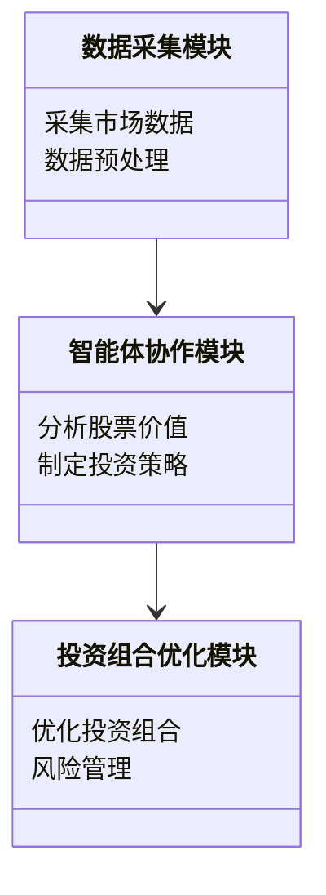
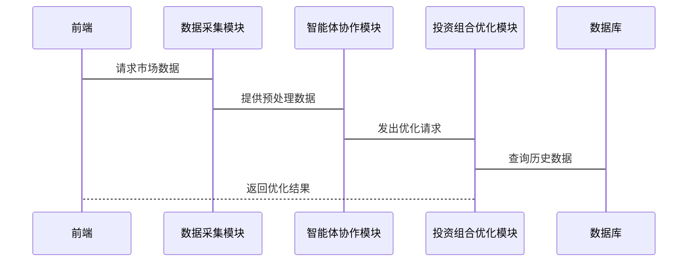

                 


# AI多智能体如何优化价值投资的资金管理策略

## 关键词
- AI多智能体
- 价值投资
- 资金管理策略
- 强化学习
- 系统架构设计

## 摘要
本文系统探讨了如何利用AI多智能体技术优化价值投资的资金管理策略。通过分析价值投资的核心要素和资金管理策略，结合多智能体系统的协作算法，提出了一个创新的优化框架。该框架包括数据驱动的股票分析、动态投资组合优化以及风险管理模型，旨在实现高效、智能的资金管理。文章详细阐述了多智能体系统的数学模型、算法实现、系统架构设计以及实际案例，为投资者和科技人员提供了理论与实践相结合的指导。

---

# 第1章: AI多智能体与价值投资的背景与概念

## 1.1 价值投资的基本概念

### 1.1.1 价值投资的定义与核心理念
- 价值投资是一种长期投资策略，强调以低于内在价值的价格买入优质资产。
- 核心理念：寻找市场中的“价值洼地”，通过深入分析企业基本面，实现长期稳定的收益。

### 1.1.2 价值投资与传统投资的区别
| 方面         | 价值投资                | 传统投资                |
|--------------|-------------------------|-------------------------|
| 时间框架     | 长期                     | 短期                     |
| 投资策略     | 股票内在价值分析         | 技术分析或短期波动       |
| 风险管理     | 严格控制仓位，分散投资   | 更注重市场趋势和波动     |

### 1.1.3 价值投资在现代金融中的地位
- 价值投资是机构投资者的重要策略之一。
- 在市场波动加剧的背景下，价值投资的优势更加凸显。

## 1.2 多智能体系统的基本概念

### 1.2.1 多智能体系统的定义
- 多智能体系统（Multi-Agent System, MAS）是由多个相互作用的智能体组成的系统，每个智能体都能感知环境、自主决策并执行任务。

### 1.2.2 多智能体系统的组成与特点
- **组成**：智能体、环境、通信协议、协作规则。
- **特点**：分布式、协作性、自治性、适应性。

### 1.2.3 多智能体系统与传统AI的区别
| 方面         | 多智能体系统            | 传统AI                  |
|--------------|-------------------------|-------------------------|
| 决策方式     | 分布式决策              | 中央化决策              |
| 信息处理     | 高度依赖通信与协作      | 依赖单个模型            |
| 应用场景     | 复杂协作任务            | 简单任务或单点问题      |

## 1.3 AI多智能体在金融领域的应用前景

### 1.3.1 金融领域的智能化需求
- 数据量大、复杂性高，需要智能化工具辅助决策。
- 市场参与者众多，需要高效协作和信息共享。

### 1.3.2 多智能体在金融投资中的优势
- 提高决策效率，优化投资组合。
- 通过协作降低风险，实现收益最大化。

### 1.3.3 未来发展趋势与挑战
- 技术挑战：智能体间的通信与协作效率。
- 市场挑战：如何应对市场的不确定性和波动性。

---

# 第2章: 价值投资与资金管理策略的核心要素

## 2.1 价值投资的核心要素

### 2.1.1 股票分析的关键指标
- **市盈率（P/E）**：衡量股价与盈利的关系。
- **市净率（P/B）**：衡量股价与资产净值的关系。
- **股息率**：衡量股票的分红能力。

### 2.1.2 投资组合的构建原则
- 分散投资：降低风险。
- 长期持有：避免短期波动影响。
- 价值导向：选择被市场低估的股票。

### 2.1.3 风险管理的重要性
- 设置止损点：避免重大损失。
- 动态调整仓位：根据市场变化及时调整。

## 2.2 资金管理策略的优化目标

### 2.2.1 资金分配的优化方向
- 根据市场情况动态分配资金。
- 根据股票的内在价值调整权重。

### 2.2.2 投资风险的控制方法
- 通过多智能体协作降低个体风险。
- 使用风险管理模型量化风险。

### 2.2.3 收益与风险的平衡点
- 在风险可控的前提下，追求最大收益。
- 通过多智能体协作实现收益与风险的动态平衡。

## 2.3 AI多智能体在资金管理中的潜在价值

### 2.3.1 数据分析能力的提升
- 多智能体系统能够处理海量数据，发现潜在投资机会。
- 通过协作提高数据分析的效率和准确性。

### 2.3.2 投资决策的智能化支持
- 智能体能够根据市场变化实时调整策略。
- 通过协作优化投资组合，提高收益。

### 2.3.3 系统化风险管理的实现
- 多智能体系统能够实时监控市场风险。
- 通过协作制定风险应对策略。

---

# 第3章: 多智能体系统的数学模型与算法原理

## 3.1 多智能体系统的数学模型

### 3.1.1 状态空间的定义
- 状态空间：市场数据、资产价格、交易记录等。

### 3.1.2 行动空间的构建
- 行动空间：买入、卖出、持有等操作。

### 3.1.3 状态转移概率的计算
- 使用马尔可夫链模型计算状态转移概率。

## 3.2 基于强化学习的多智能体协作算法

### 3.2.1 强化学习的基本原理
- 智能体通过与环境互动，学习策略以最大化累积奖励。

### 3.2.2 多智能体协作的挑战与解决方案
- **挑战**：智能体之间的信息共享和协作。
- **解决方案**：使用分布式强化学习算法，如联邦学习。

### 3.2.3 算法的数学表达式
$$ V(s) = \max_{a} [r + V(s') ] $$

## 3.3 算法实现的步骤与流程

### 3.3.1 环境的定义与初始化
- 定义市场环境，包括股票价格、交易规则等。

### 3.3.2 智能体的决策过程
- 智能体根据当前状态做出决策，并执行交易操作。

### 3.3.3 策略的更新与优化
- 使用强化学习算法更新策略，优化投资收益。

---

# 第4章: 价值投资策略的优化与实现

## 4.1 价值投资策略的优化目标

### 4.1.1 提升投资收益
- 通过多智能体协作，发现更多投资机会。

### 4.1.2 降低投资风险
- 通过动态调整投资组合，分散风险。

### 4.1.3 实现投资策略的系统化
- 将价值投资策略转化为系统化的投资模型。

## 4.2 多智能体协作优化策略的设计

### 4.2.1 策略设计的核心思想
- 利用多智能体协作，提高投资决策的效率和准确性。

### 4.2.2 策略实现的关键步骤
1. 数据采集与预处理。
2. 智能体决策与交易执行。
3. 投资组合优化与风险控制。

## 4.3 系统实现与优化建议

### 4.3.1 系统实现的核心模块
- 数据采集模块。
- 智能体协作模块。
- 投资组合优化模块。

### 4.3.2 优化建议
- 定期更新模型参数。
- 根据市场变化调整策略。

---

# 第5章: 系统分析与架构设计方案

## 5.1 系统功能设计

### 5.1.1 领域模型设计
- 使用Mermaid类图展示系统模块之间的关系。



### 5.1.2 系统架构设计
- 使用Mermaid架构图展示系统整体架构。


### 5.1.3 接口设计与交互流程
- 使用Mermaid序列图展示系统交互流程。



---

# 第6章: 项目实战与优化建议

## 6.1 项目实战

### 6.1.1 环境安装与配置
- 安装Python、TensorFlow、Keras等工具。

### 6.1.2 核心代码实现
```python
class Agent:
    def __init__(self, state_space, action_space):
        self.state_space = state_space
        self.action_space = action_space
        # 初始化策略参数
        self.theta = np.random.randn(state_space, action_space)
    
    def act(self, state):
        # 根据当前状态做出决策
        action = np.argmax(self.theta[state])
        return action
```

### 6.1.3 案例分析与结果解读
- 通过具体案例展示如何利用多智能体系统优化投资策略。

## 6.2 优化建议

### 6.2.1 算法优化
- 使用更高效的强化学习算法，如分布式训练。

### 6.2.2 系统优化
- 提高数据处理效率，优化系统架构。

### 6.2.3 实践建议
- 定期回测策略，根据市场变化调整模型。

---

# 第7章: 总结与展望

## 7.1 总结
- AI多智能体在优化价值投资的资金管理策略中具有巨大潜力。
- 通过协作和数据分析，能够显著提升投资效率和收益。

## 7.2 展望
- 进一步研究多智能体协作算法，优化投资策略。
- 探索更多应用场景，推动AI技术在金融领域的广泛应用。

---

通过以上章节的详细阐述，本文系统地探讨了AI多智能体如何优化价值投资的资金管理策略，并为实际应用提供了理论与实践指导。

