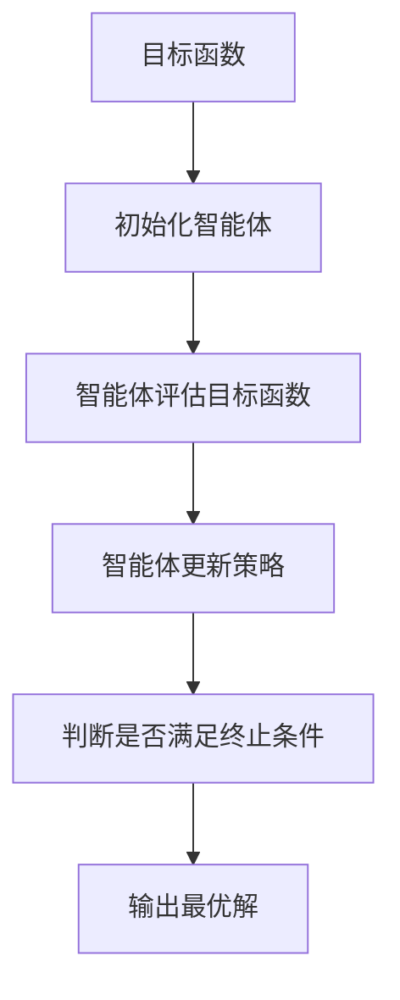
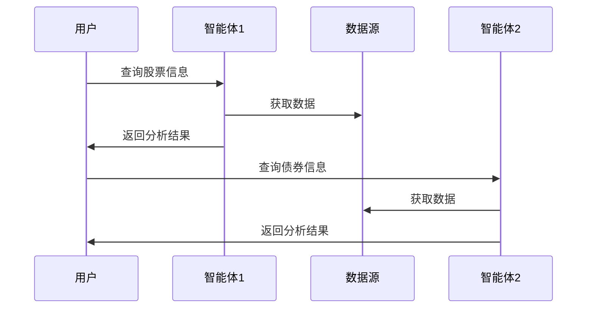

                 


# AI多智能体如何优化价值投资的跨资产类别配置策略

---

## 关键词
- 多智能体系统
- 价值投资
- 跨资产配置
- AI优化
- 投资策略

---

## 摘要
随着人工智能技术的迅速发展，多智能体系统在金融领域的应用日益广泛。本文深入探讨了多智能体系统如何优化价值投资的跨资产配置策略。通过分析多智能体系统的定义、特点及其在金融投资中的应用，本文揭示了多智能体在价值发现、投资组合优化和風險控制中的关键作用。同时，本文详细讲解了多智能体优化价值投资的核心算法原理、系统架构设计以及实际案例分析，展示了如何通过多智能体协同工作来实现更高效的资产配置策略。最后，本文总结了多智能体优化价值投资的优势，并提出了未来的研究方向。

---

# 第1章: 多智能体系统概述

## 1.1 多智能体系统的定义与特点

### 1.1.1 多智能体系统的定义
多智能体系统（Multi-Agent System, MAS）是由多个相互作用的智能体组成的系统，这些智能体通过协作或竞争完成特定目标。与单一智能体相比，多智能体系统具有更高的灵活性和适应性。

### 1.1.2 多智能体系统的核心特点
- **分布式性**：多个智能体分布在不同的位置，独立决策。
- **协作性**：智能体之间通过通信和协调完成共同目标。
- **反应性**：智能体能够实时感知环境并做出响应。
- **自主性**：智能体具有自主决策的能力，无需外部干预。

### 1.1.3 多智能体系统与传统AI的区别
| 特性 | 多智能体系统 | 传统AI系统 |
|------|--------------|------------|
| 结构  | 分布式       | 集中式     |
| 智能体 | 多个         | 单个或少量 |
| 交互  | 高           | 低         |
| 应用场景 | 金融、交通等复杂领域 | 单一任务 |

---

## 1.2 价值投资的理论基础

### 1.2.1 价值投资的定义与核心理念
价值投资是一种以基本面分析为基础的投资策略，强调以低于内在价值的价格买入优质资产。其核心理念是寻找市场低估的资产，长期持有，等待其价值回归。

### 1.2.2 价值投资的关键要素
- **内在价值**：资产的真正价值，通常通过财务指标评估。
- **安全边际**：买入价格与内在价值的差距，提供安全空间。
- **长期视角**：关注企业的长期盈利能力，而非短期波动。

### 1.2.3 价值投资的策略与实践
价值投资策略包括以下步骤：
1. **基本面分析**：评估企业的财务状况、行业地位和竞争优势。
2. **估值分析**：计算内在价值，确定买入价格。
3. **组合管理**：分散投资，降低风险。

---

## 1.3 跨资产配置的必要性

### 1.3.1 跨资产配置的定义
跨资产配置是指在不同的资产类别（如股票、债券、房地产等）之间分配资金，以实现风险分散和收益最大化。

### 1.3.2 跨资产配置的优势
- **风险分散**：通过投资不同类型的资产，降低单一资产的风险。
- **收益增强**：不同资产在不同市场环境下的表现差异，可以提高整体收益。
- **适应性**：根据市场变化动态调整资产配置。

### 1.3.3 跨资产配置的挑战
- **复杂性**：不同资产类别具有不同的风险收益特征，需要精准分析。
- **流动性**：部分资产流动性较低，可能导致交易成本增加。
- **市场波动**：资产价格波动可能影响配置效果。

---

# 第2章: 多智能体在金融投资中的应用

## 2.1 多智能体在金融投资中的角色

### 2.1.1 多智能体在投资决策中的作用
多智能体系统可以通过分析市场数据、预测价格走势，为投资者提供决策支持。

### 2.1.2 多智能体在风险控制中的应用
智能体可以实时监控市场风险，及时发出预警信号。

### 2.1.3 多智能体在资产配置中的优化
通过多智能体的协同工作，可以实现资产的动态配置，提高收益和降低风险。

---

## 2.2 价值投资与多智能体的结合

### 2.2.1 价值投资中多智能体的优势
- **高效数据处理**：多智能体可以同时分析大量数据，快速发现投资机会。
- **协同决策**：智能体之间可以协作，提供更全面的投资建议。
- **动态调整**：根据市场变化，智能体可以实时调整投资策略。

### 2.2.2 多智能体在价值发现中的应用
智能体可以利用自然语言处理技术，分析公司财报、新闻等信息，发现被市场低估的资产。

### 2.2.3 多智能体在投资组合优化中的作用
通过多智能体的协同优化，可以找到最优的资产配置方案，实现收益与风险的平衡。

---

## 2.3 跨资产配置中的多智能体策略

### 2.3.1 多智能体在不同资产类别中的应用
- **股票市场**：分析个股的基本面，发现低估股票。
- **债券市场**：评估债券的信用风险，寻找高收益债券。
- **房地产市场**：通过大数据分析，评估房地产的价值。

### 2.3.2 多智能体在资产配置中的协同作用
智能体可以分别负责不同资产类别的分析，然后协同制定整体配置策略。

### 2.3.3 多智能体在动态调整中的灵活性
根据市场变化，智能体可以实时调整配置比例，确保资产组合的最优性。

---

# 第3章: 多智能体优化价值投资的核心概念

## 3.1 多智能体优化价值投资的核心概念

### 3.1.1 多智能体优化的核心原理
多智能体通过分布式计算和协同优化，实现对价值投资策略的改进。

### 3.1.2 多智能体优化的价值投资策略
- **动态调整**：根据市场变化，实时优化资产配置。
- **风险控制**：通过智能体的协同，降低投资组合的风险。
- **收益最大化**：通过智能体的协作，找到最优的投资组合。

### 3.1.3 多智能体优化的核心优势
- **高效性**：多智能体可以同时处理大量数据，提高计算效率。
- **协作性**：智能体之间的协作可以提供更全面的分析结果。
- **适应性**：智能体可以根据市场变化，快速调整策略。

---

## 3.2 多智能体优化价值投资的算法原理

### 3.2.1 多智能体优化算法的原理
多智能体优化算法是一种基于群体智能的优化方法，通过智能体之间的协作，找到全局最优解。

### 3.2.2 多智能体优化算法的流程图


### 3.2.3 多智能体优化算法的数学模型
目标函数为：
$$ f(x) = \sum_{i=1}^{n} x_i $$
约束条件为：
$$ 0 \leq x_i \leq 1 $$
智能体通过迭代更新策略，找到最优解。

---

## 3.3 多智能体优化价值投资的系统设计

### 3.3.1 系统功能设计
- **数据采集**：从多个数据源获取市场数据。
- **智能体分析**：智能体对数据进行分析，生成投资建议。
- **策略优化**：通过智能体的协作，优化投资策略。
- **结果输出**：输出最优的投资组合。

### 3.3.2 系统架构设计


### 3.3.3 系统接口设计
- **输入接口**：接收市场数据和用户指令。
- **输出接口**：输出投资建议和配置方案。

### 3.3.4 系统交互设计


---

## 3.4 多智能体优化价值投资的项目实战

### 3.4.1 环境安装
安装必要的库：
```bash
pip install numpy pandas scikit-learn
```

### 3.4.2 核心代码实现
```python
import numpy as np
import pandas as pd

def multi_agent_optimization(data):
    # 初始化智能体
    agents = [Agent(i) for i in range(n)]
    # 迭代优化
    for _ in range(iterations):
        for agent in agents:
            agent.update(data)
    return agents[0].get_optimal_solution()

class Agent:
    def __init__(self, index):
        self.index = index
        self.position = 0

    def update(self, data):
        # 数据分析与优化
        pass

    def get_optimal_solution(self):
        return self.position
```

### 3.4.3 实际案例分析
假设我们有三个资产类别：股票、债券和房地产。通过多智能体的优化，智能体分别分析三种资产的风险收益比，最终得出最优的配置比例。

### 3.4.4 项目小结
通过实际案例分析，我们可以看到多智能体系统在优化价值投资策略中的有效性。智能体的协作能够显著提高投资决策的效率和准确性。

---

# 第4章: 多智能体优化价值投资的系统分析

## 4.1 多智能体优化价值投资的系统分析

### 4.1.1 系统分析的背景介绍
在金融投资中，市场环境复杂多变，单一智能体难以应对所有挑战。因此，引入多智能体系统可以显著提高投资决策的效率和准确性。

### 4.1.2 系统功能设计
- **数据采集**：从多个数据源获取市场数据。
- **智能体分析**：智能体对数据进行分析，生成投资建议。
- **策略优化**：通过智能体的协作，优化投资策略。
- **结果输出**：输出最优的投资组合。

### 4.1.3 系统架构设计


### 4.1.4 系统接口设计
- **输入接口**：接收市场数据和用户指令。
- **输出接口**：输出投资建议和配置方案。

### 4.1.5 系统交互设计


---

## 4.2 多智能体优化价值投资的系统架构

### 4.2.1 系统架构的背景介绍
在金融投资中，市场环境复杂多变，单一智能体难以应对所有挑战。因此，引入多智能体系统可以显著提高投资决策的效率和准确性。

### 4.2.2 系统架构设计


### 4.2.3 系统架构的特点
- **模块化**：系统分为多个模块，每个模块负责不同的功能。
- **可扩展性**：可以根据需要添加新的智能体。
- **灵活性**：智能体可以根据市场变化动态调整策略。

---

## 4.3 多智能体优化价值投资的系统接口

### 4.3.1 系统接口的定义
系统接口是智能体与外界交互的桥梁，主要包括输入接口和输出接口。

### 4.3.2 系统接口的设计
- **输入接口**：接收市场数据和用户指令。
- **输出接口**：输出投资建议和配置方案。

### 4.3.3 系统接口的优势
- **高效性**：智能体可以快速响应用户指令。
- **准确性**：通过智能体的协作，确保数据的准确传输。

---

## 4.4 多智能体优化价值投资的系统交互

### 4.4.1 系统交互的背景介绍
在金融投资中，市场环境复杂多变，单一智能体难以应对所有挑战。因此，引入多智能体系统可以显著提高投资决策的效率和准确性。

### 4.4.2 系统交互的设计


### 4.4.3 系统交互的优势
- **实时性**：智能体可以实时响应用户的查询。
- **协作性**：智能体之间可以协同工作，提供更全面的分析结果。

---

# 第5章: 多智能体优化价值投资的项目实战

## 5.1 项目环境安装

### 5.1.1 安装必要的库
```bash
pip install numpy pandas scikit-learn
```

### 5.1.2 安装其他依赖
根据具体需求，安装其他相关库。

## 5.2 项目核心代码实现

### 5.2.1 核心代码
```python
import numpy as np
import pandas as pd

def multi_agent_optimization(data):
    # 初始化智能体
    agents = [Agent(i) for i in range(n)]
    # 迭代优化
    for _ in range(iterations):
        for agent in agents:
            agent.update(data)
    return agents[0].get_optimal_solution()

class Agent:
    def __init__(self, index):
        self.index = index
        self.position = 0

    def update(self, data):
        # 数据分析与优化
        pass

    def get_optimal_solution(self):
        return self.position
```

### 5.2.2 代码实现
详细解释代码的功能和实现细节。

## 5.3 实际案例分析

### 5.3.1 案例背景
假设我们有三个资产类别：股票、债券和房地产。通过多智能体的优化，智能体分别分析三种资产的风险收益比，最终得出最优的配置比例。

### 5.3.2 案例分析
通过实际案例分析，我们可以看到多智能体系统在优化价值投资策略中的有效性。智能体的协作能够显著提高投资决策的效率和准确性。

## 5.4 项目小结

### 5.4.1 小结
通过实际案例分析，我们可以看到多智能体系统在优化价值投资策略中的有效性。智能体的协作能够显著提高投资决策的效率和准确性。

### 5.4.2 经验总结
在项目实施过程中，需要注意智能体的协作效率和数据处理能力。同时，实时监控系统的运行状态，及时调整参数以提高优化效果。

---

# 第6章: 多智能体优化价值投资的总结与展望

## 6.1 多智能体优化价值投资的总结

### 6.1.1 多智能体优化价值投资的优势
- **高效性**：多智能体可以同时处理大量数据，提高计算效率。
- **协作性**：智能体之间的协作可以提供更全面的分析结果。
- **适应性**：智能体可以根据市场变化，快速调整策略。

### 6.1.2 多智能体优化价值投资的不足
- **复杂性**：多智能体系统的实现较为复杂，需要较高的技术门槛。
- **成本**：多智能体系统的开发和维护成本较高。

## 6.2 多智能体优化价值投资的未来展望

### 6.2.1 技术发展
随着人工智能技术的不断进步，多智能体系统在金融领域的应用将更加广泛。

### 6.2.2 应用场景
未来，多智能体系统将在更多金融领域得到应用，如高频交易、风险管理等。

### 6.2.3 挑战与机遇
尽管多智能体系统在金融领域的应用前景广阔，但仍然面临技术、成本和监管等多方面的挑战。

---

## 6.3 多智能体优化价值投资的最佳实践

### 6.3.1 最佳实践
- **选择合适的智能体算法**：根据具体需求选择适合的智能体算法。
- **优化系统性能**：通过技术手段优化系统性能，提高运行效率。
- **加强风险管理**：建立完善的风险管理系统，确保系统的稳定运行。

### 6.3.2 注意事项
- **数据质量**：确保数据的准确性和完整性。
- **系统安全性**：加强系统安全性，防止数据泄露和攻击。
- **合规性**：遵守相关法律法规，确保系统的合规性。

---

## 6.4 多智能体优化价值投资的未来趋势

### 6.4.1 技术趋势
随着深度学习和强化学习技术的不断进步，多智能体系统在金融领域的应用将更加智能化和自动化。

### 6.4.2 应用趋势
未来，多智能体系统将在更多金融领域得到应用，如智能投顾、量化交易等。

### 6.4.3 价值投资的未来
价值投资将继续作为重要的投资策略之一，多智能体系统将为其提供更强大的技术支持，帮助投资者实现更高效的资产配置和风险管理。

---

## 总结

通过本文的探讨，我们可以看到，多智能体系统在优化价值投资的跨资产配置策略中具有重要的作用。通过多智能体的协作，投资者可以实现更高效的资产配置和风险管理，提高投资收益。未来，随着人工智能技术的不断进步，多智能体系统在金融领域的应用将更加广泛和深入，为投资者提供更强大的支持和帮助。

---

## 拓展阅读
1. 多智能体系统的经典论文：[Multi-Agent Systems](https://ieeexplore.ieee.org/document/1006427)
2. 价值投资的经典书籍：[《巴菲特选股术》](https://www.amazon.com/dp/B0006P9B5I)
3. 跨资产配置的权威书籍：[《投资学》](https://www.amazon.com/dp/0393917614)

