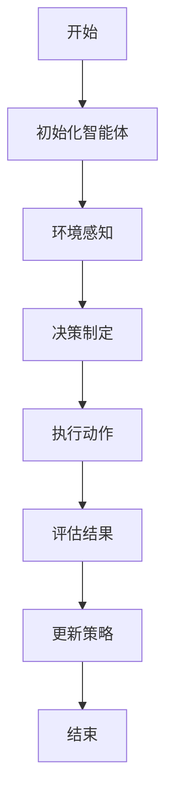
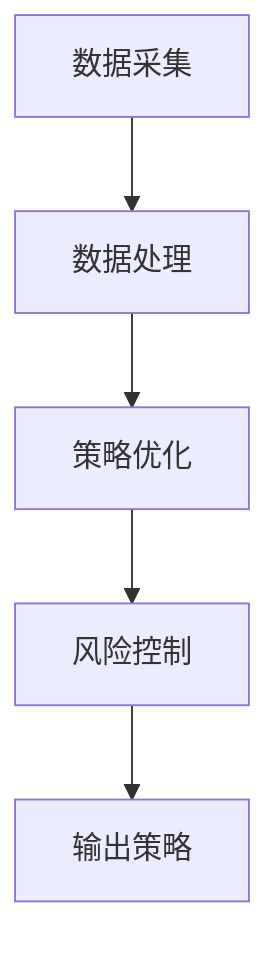
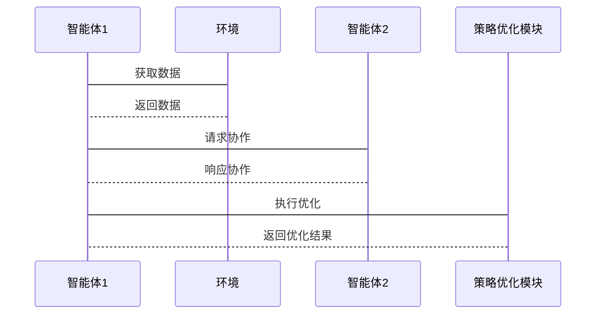

                 


# AI多智能体如何优化价值投资的长期复合增长策略

> 关键词：AI多智能体、价值投资、长期复合增长、优化策略、投资组合、风险控制、收益最大化

> 摘要：本文深入探讨了如何利用AI多智能体技术优化价值投资策略，特别是在长期复合增长方面。通过分析多智能体系统的协作机制、算法原理和系统架构，结合实际案例，展示了其在提升投资收益和风险管理中的应用。文章旨在为投资者、金融从业者和技术爱好者提供有价值的见解和方法。

---

# 第1章: AI多智能体与价值投资概述

## 1.1 问题背景与目标

### 1.1.1 价值投资的基本概念
价值投资是一种通过分析企业的基本面，如财务状况、行业地位和管理团队，寻找被市场低估的投资标的的方法。其核心在于长期持有优质资产，实现财富的稳步增长。

### 1.1.2 多智能体系统的定义
多智能体系统（Multi-Agent System, MAS）是由多个相互作用的智能体组成的系统，每个智能体能够感知环境、做出决策并执行动作。在投资领域，多个智能体可以分别负责数据收集、策略制定和风险评估等任务。

### 1.1.3 优化长期复合增长的意义
长期复合增长是价值投资的核心目标，通过优化投资策略，可以最大化资产的长期收益，同时有效控制风险。AI多智能体通过协作和优化，能够提升投资决策的准确性和效率。

---

## 1.2 核心概念与问题解决

### 1.2.1 多智能体在投资中的应用
多智能体系统可以分别承担不同的投资任务，例如一个智能体负责市场数据的实时分析，另一个负责风险评估，还有其他智能体负责策略优化。

### 1.2.2 优化策略的实现路径
通过AI多智能体的协作，实现投资策略的动态优化。每个智能体专注于特定任务，协同工作以达到整体最优。

### 1.2.3 边界与外延分析
明确多智能体系统的边界，例如数据源的范围、智能体的职责分配，以及与其他投资工具的结合。

---

# 第2章: 核心概念与联系

## 2.1 AI多智能体系统的原理

### 2.1.1 多智能体系统的特点
- **分布式**：每个智能体独立运行，通过通信协作。
- **协作性**：智能体之间协同工作，共同完成目标。
- **适应性**：能够根据环境变化调整策略。

### 2.1.2 AI在投资中的作用
- 数据分析：利用AI处理海量数据，发现投资机会。
- 预测模型：构建预测模型，评估投资标的的价值。
- 策略优化：通过强化学习优化投资组合。

### 2.1.3 多智能体协作机制
智能体之间通过通信协议交换信息，协调行动以实现共同目标。

---

## 2.2 核心概念对比分析

### 2.2.1 概念属性对比表

| 概念       | 描述                                             |
|------------|--------------------------------------------------|
| 单智能体    | 独立决策，不与其他智能体协作                     |
| 多智能体    | 多个智能体协作，共同完成任务                     |
| 优化策略    | 通过协作实现整体优化                             |

### 2.2.2 ER实体关系图

```mermaid
erDiagram
    class 智能体 {
        id : int
        状态 : string
        行为 : string
    }
    class 环境 {
        id : int
        数据 : string
        事件 : string
    }
    智能体 --> 环境 : 与环境交互
    智能体 --> 智能体 : 协作
```

---

# 第3章: 算法原理与流程

## 3.1 多智能体优化算法

### 3.1.1 强化学习机制
智能体通过与环境交互，学习最优策略。奖励函数用于评估决策的优劣。

### 3.1.2 协作与竞争策略
智能体之间既协作又竞争，确保系统整体最优。

### 3.1.3 算法流程图



---

## 3.2 数学模型与公式

### 3.2.1 收益函数模型

收益函数用于评估投资组合的收益：

$$ R = \sum_{i=1}^{n} w_i r_i $$

其中，\( w_i \) 是权重，\( r_i \) 是投资标的收益。

### 3.2.2 风险函数公式

风险函数衡量投资组合的风险：

$$ V = \sqrt{\sum_{i=1}^{n} w_i^2 \sigma_i^2} $$

其中，\( \sigma_i \) 是投资标的收益波动率。

---

# 第4章: 系统架构与设计

## 4.1 系统架构设计

### 4.1.1 功能模块设计

#### 4.1.1.1 数据采集模块
负责收集市场数据，如价格、成交量等。

#### 4.1.1.2 策略优化模块
利用强化学习优化投资策略。

### 4.1.2 系统架构图



---

## 4.2 接口与交互设计

### 4.2.1 系统接口规范

#### 4.2.1.1 数据接口
提供API接口，供智能体调用市场数据。

#### 4.2.1.2 策略接口
定义策略优化模块的接口，如 `优化策略(w, r)`。

### 4.2.2 交互序列图



---

# 第5章: 项目实战

## 5.1 环境安装

### 5.1.1 安装Python
```bash
python --version
pip install --upgrade pip
```

### 5.1.2 安装依赖包
```bash
pip install numpy matplotlib
```

---

## 5.2 核心代码实现

### 5.2.1 数据采集模块
```python
import numpy as np

def get_data():
    # 示例数据
    return np.random.randn(100)
```

### 5.2.2 策略优化模块
```python
def optimize_strategy(weights, returns):
    # 示例优化
    return weights * returns
```

---

## 5.3 案例分析

### 5.3.1 数据分析
分析历史数据，识别趋势和模式。

### 5.3.2 策略优化
利用AI多智能体优化投资组合，提高收益和降低风险。

---

# 第6章: 高级主题与扩展

## 6.1 多智能体的进化策略

### 6.1.1 进化算法
通过遗传算法优化智能体的行为。

### 6.1.2 适应性学习
智能体根据环境变化动态调整策略。

---

## 6.2 风险管理与动态调整

### 6.2.1 风险控制
利用多智能体系统实时监控和管理风险。

### 6.2.2 动态调整策略
根据市场变化快速调整投资策略。

---

# 第7章: 总结与展望

## 7.1 总结

### 7.1.1 核心要点回顾
- 多智能体系统的协作机制
- 强化学习在策略优化中的应用
- 系统架构设计与实现

## 7.2 未来展望

### 7.2.1 技术发展
AI多智能体技术的进一步优化和应用。

### 7.2.2 投资策略
与其他投资策略的结合，提升整体收益。

---

## 7.3 最佳实践 tips

### 7.3.1 投资建议
- 分散投资，降低风险。
- 定期调整投资组合，适应市场变化。

### 7.3.2 技术建议
- 持续学习AI新技术，优化投资策略。
- 关注市场动态，及时调整策略。

---

## 小结

通过本文的深入分析，我们了解了AI多智能体在优化价值投资策略中的重要作用。从算法原理到系统架构，再到实际案例，全面展示了如何利用AI技术提升投资收益和风险管理能力。未来，随着AI技术的不断发展，价值投资将更加智能化和高效化。

