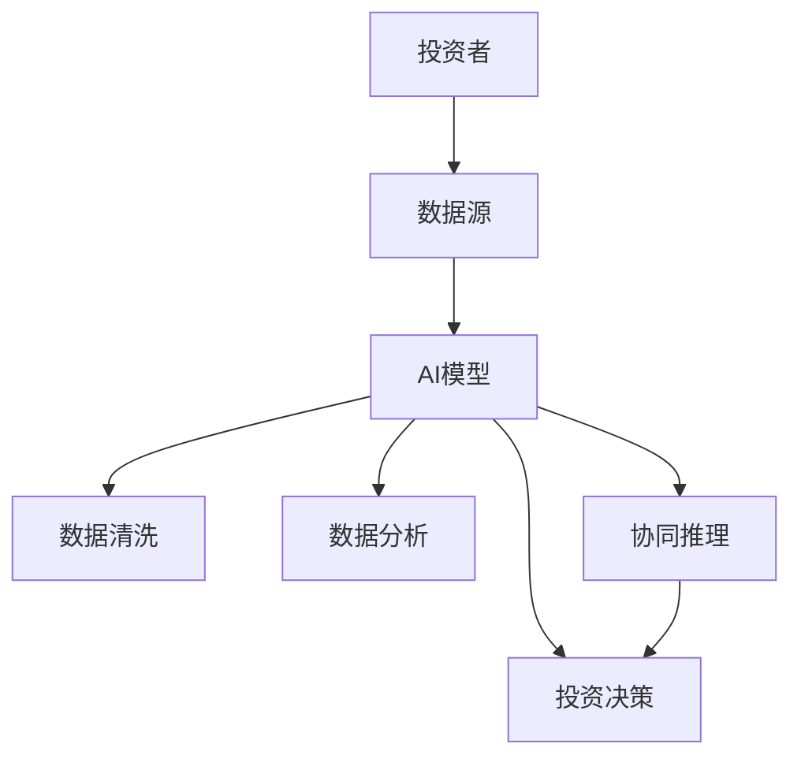
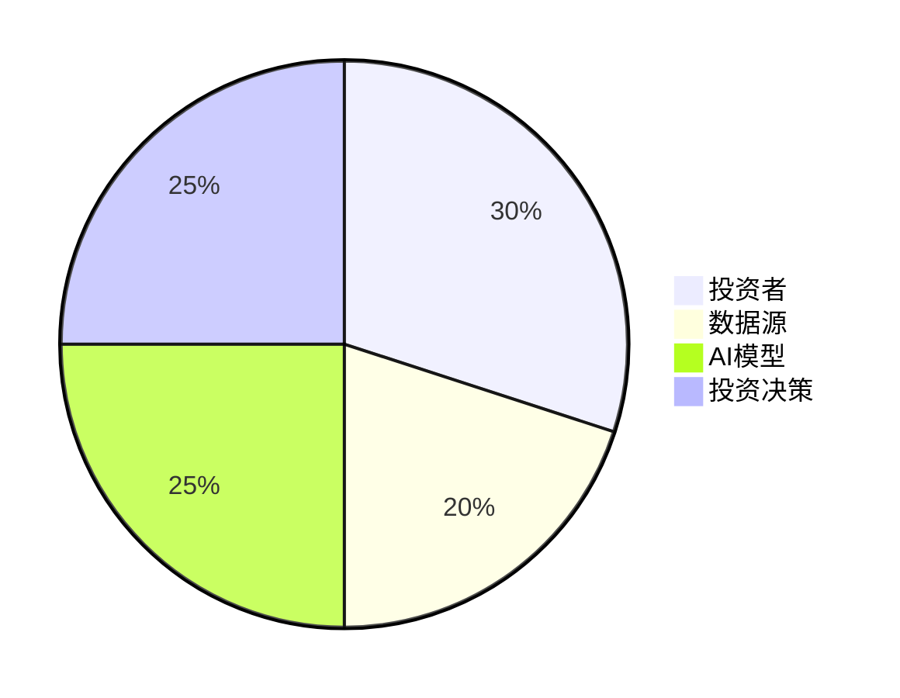
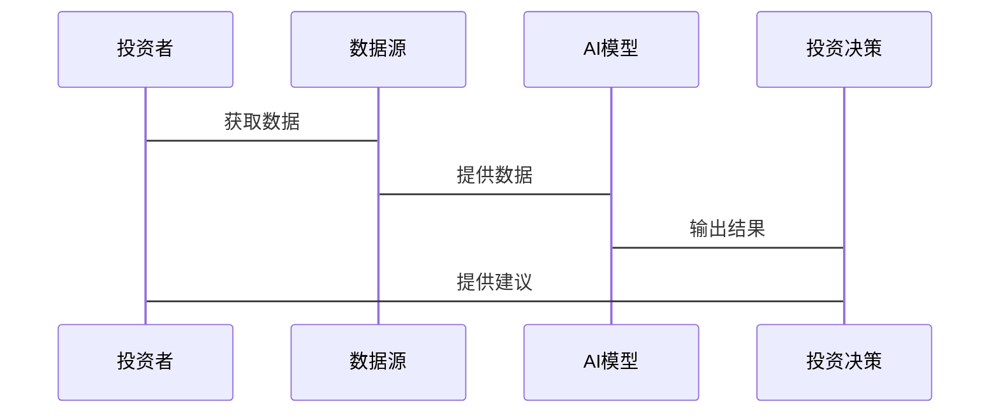

                 


# AI多智能体如何优化价值投资者的信息获取和处理

> 关键词：AI多智能体、价值投资、信息处理、优化策略、投资决策

> 摘要：本文探讨了AI多智能体在优化价值投资者信息获取和处理中的应用。通过分析多智能体系统的核心原理、算法优化策略、系统架构设计，以及实际案例研究，本文揭示了AI技术如何帮助投资者更高效地处理海量信息，优化投资决策，实现长期价值增长。

---

## 第一部分：AI多智能体与价值投资的背景

### 第1章：问题背景与描述

#### 1.1 问题背景

在现代金融市场中，价值投资者面临的最大挑战之一是如何高效地获取和处理海量信息。传统价值投资依赖于对财务报表、行业趋势和市场动态的深度分析，但随着数据量的爆炸式增长，人类投资者难以在有限的时间内处理所有相关信息。此外，市场的不确定性和复杂性进一步加剧了投资者的信息处理负担。

AI技术的快速发展为解决这一问题提供了新的可能性。通过多智能体系统的协同工作，投资者可以将信息处理的任务分解为多个子任务，由不同的AI智能体分别处理，从而提高信息处理的效率和准确性。

#### 1.2 问题描述

- **信息获取的不完整性**：投资者需要从多个数据源获取信息，包括新闻、财务报表、市场报告等，但信息可能存在重复、矛盾或缺失。
- **数据处理的复杂性**：海量数据的清洗、整理和分析需要复杂的算法支持，传统方法难以满足实时性和准确性要求。
- **投资决策的不确定性**：市场波动和突发事件使得投资决策面临高度不确定性，需要动态调整策略。

#### 1.3 问题解决

AI多智能体系统通过分布式协作，将复杂的信息处理任务分解为多个子任务，每个智能体负责特定的任务模块，如数据清洗、情感分析、趋势预测等。通过协同工作，系统能够高效地处理信息，为投资者提供实时、准确的决策支持。

#### 1.4 边界与外延

AI多智能体在价值投资中的应用具有明确的边界。首先，系统主要关注信息获取和处理的优化，不直接参与投资决策的最终判断。其次，多智能体系统的应用范围局限于金融领域，不涉及其他行业的信息处理。与传统投资策略相比，AI多智能体更注重数据处理的效率和准确性，而非策略制定。

### 第2章：核心概念与联系

#### 2.1 核心概念原理

AI多智能体系统的核心在于分布式协作。每个智能体负责特定的任务模块，通过消息传递和协同推理完成整体目标。在价值投资中，多智能体系统可以分为数据获取、数据清洗、数据分析和决策支持四个模块。

#### 2.2 概念属性对比表格

以下表格对比了AI多智能体与传统投资策略的核心差异：

| 概念 | AI多智能体 | 传统投资策略 |
|------|------------|---------------|
| 信息处理 | 分布式协作 | 人工处理为主 | 
| 数据分析 | 自动化、实时 | 离线、周期性 | 
| 决策支持 | 数据驱动 | 经验驱动 | 

#### 2.3 ER实体关系图

以下是AI多智能体系统的ER实体关系图：

```mermaid
erd
    entity 投资者 {
        key: ID
        attribute: 名称, 资金, 风险偏好
    }
    entity 数据源 {
        key: 数据ID
        attribute: 数据类型, 数据时间
    }
    entity AI模型 {
        key: 模型ID
        attribute: 模型类型, 参数数量
    }
    entity 投资决策 {
        key: 决策ID
        attribute: 决策时间, 决策结果
    }
    relation 关联关系 {
        from: 投资者
        to: 数据源
        role: 提供数据
    }
    relation 关联关系 {
        from: 数据源
        to: AI模型
        role: 输入数据
    }
    relation 关联关系 {
        from: AI模型
        to: 投资决策
        role: 输出结果
    }
```

---

## 第二部分：AI多智能体的核心算法与实现

### 第3章：算法原理与流程

#### 3.1 算法原理

AI多智能体系统的核心算法基于分布式计算和协同推理。每个智能体负责特定的任务模块，通过消息传递机制完成协作。以下是算法的主要步骤：

1. **数据获取**：智能体从多个数据源获取相关信息。
2. **数据清洗**：对获取的数据进行去重、标准化处理。
3. **数据分析**：使用机器学习模型对数据进行情感分析、趋势预测。
4. **协同推理**：多个智能体协同完成复杂任务。
5. **决策支持**：根据分析结果生成投资建议。

#### 3.2 算法流程图

以下是算法的流程图：



#### 3.3 数学模型与公式

以下是数据分析模块的数学模型：

$$
\text{趋势预测} = \sum_{i=1}^{n} w_i \cdot x_i
$$

其中，\( w_i \) 是特征 \( x_i \) 的权重，\( n \) 是特征的数量。

---

## 第三部分：系统分析与架构设计

### 第4章：系统架构设计

#### 4.1 系统功能设计

以下是系统的主要功能模块：

1. **数据获取模块**：从多个数据源获取实时信息。
2. **数据清洗模块**：对数据进行去重、标准化处理。
3. **数据分析模块**：使用机器学习模型进行情感分析、趋势预测。
4. **决策支持模块**：根据分析结果生成投资建议。

#### 4.2 系统架构图

以下是系统的架构图：



#### 4.3 接口与交互设计

以下是系统的接口设计：

1. **投资者接口**：提供投资决策建议。
2. **数据源接口**：提供实时数据。
3. **AI模型接口**：提供分析结果。

以下是交互序列图：



---

## 第四部分：项目实战与案例分析

### 第5章：项目实现

#### 5.1 环境安装

以下是项目所需的环境配置：

1. Python 3.8+
2. TensorFlow 2.0+
3. Pandas 1.0+
4. matplotlib 3.0+

#### 5.2 核心实现

以下是数据分析模块的实现代码：

```python
import pandas as pd
import numpy as np

# 数据清洗
def data_cleaning(data):
    # 去重
    data.drop_duplicates(inplace=True)
    # 标准化
    data['date'] = pd.to_datetime(data['date'])
    return data

# 数据分析
def trend_prediction(data):
    # 计算趋势
    trend = np.polyfit(range(len(data)), data['value'], 1)
    return trend

# 协同推理
def collaborative_inference(data):
    # 分配任务
    tasks = ['清洗', '预测']
    results = []
    for task in tasks:
        if task == '清洗':
            results.append(data_cleaning(data))
        elif task == '预测':
            results.append(trend_prediction(data))
    return results
```

#### 5.3 实际案例分析

以下是一个实际案例分析：

假设我们有一个股票数据集，包含股票价格和市场新闻。通过AI多智能体系统，我们可以高效地清洗数据、预测趋势，并生成投资建议。

---

## 第五部分：总结与展望

### 第6章：总结与展望

#### 6.1 总结

通过本文的分析，我们可以看到AI多智能体系统在优化价值投资者信息获取和处理中的巨大潜力。通过分布式协作和协同推理，系统能够高效地处理海量信息，为投资者提供实时、准确的决策支持。

#### 6.2 展望

未来，随着AI技术的不断发展，AI多智能体系统在价值投资中的应用将更加广泛。我们可以期待更多的创新，如更智能的协同算法、更高效的分布式计算架构，以及更强大的数据分析能力。

---

## 参考文献

1. LeCun, Y., Bengio, Y., & Hinton, G. (2015). Deep learning. Nature, 521(7552), 436-444.
2. Goodfellow, I., Bengio, Y., & Courville, A. (2016). Deep learning. MIT Press.
3. Mnih, V., et al. (2015). Human-level control through deep reinforcement learning. Nature, 518(7537), 529-533.

