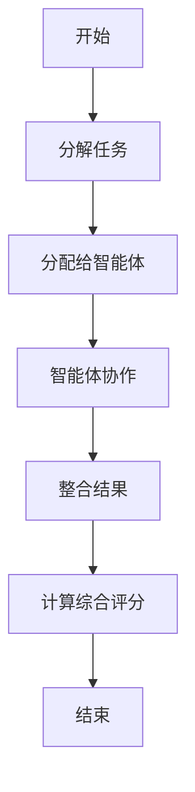
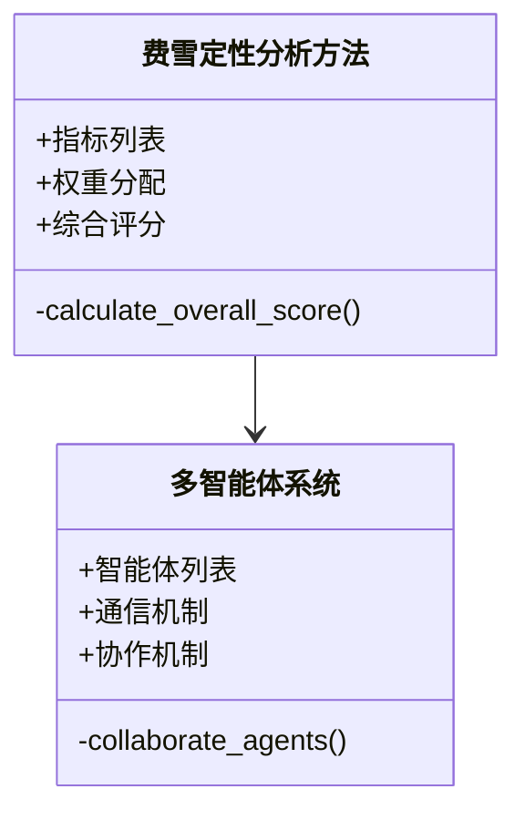
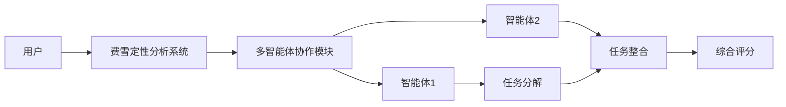
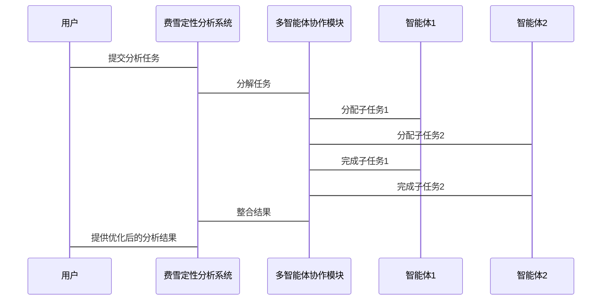

                 


# AI多智能体如何优化费雪的定性分析方法

---

## 关键词

- AI多智能体系统
- 费雪定性分析方法
- 多智能体协作
- 优化算法
- 定性分析模型

---

## 摘要

费雪的定性分析方法是一种在经济学和社会科学领域广泛应用的分析工具，但其传统方法在面对复杂问题时，往往受限于人工分析的主观性和效率问题。AI多智能体系统的引入，通过分布式计算、协作推理和自适应学习等特性，能够显著优化费雪定性分析方法的效率和准确性。本文将从背景介绍、核心概念、算法优化、系统架构、项目实战等多个维度，详细阐述AI多智能体如何优化费雪定性分析方法，为相关领域的研究者和实践者提供理论支持和实践指导。

---

## 第1章: 背景介绍

### 1.1 费雪定性分析方法的背景

#### 1.1.1 费雪定性分析方法的起源与发展

费雪定性分析方法由英国经济学家 Irving Fisher 提出，主要用于评估和分析经济系统中的定性因素。其核心思想是通过多维度的定性指标，综合评估系统的健康状况。这种方法最初应用于经济周期分析，后来逐渐扩展到社会科学、企业管理等多个领域。

#### 1.1.2 费雪定性分析方法的核心概念

费雪定性分析方法的核心在于通过定性指标的权重分配，综合评估系统的整体状态。其关键步骤包括：

1. **指标选择**：确定影响系统的关键定性因素。
2. **权重分配**：为每个指标分配权重，反映其重要性。
3. **综合评估**：通过权重加和，得出系统的综合评估结果。

#### 1.1.3 费雪定性分析方法的应用领域

- **经济学**：经济周期分析、货币政策评估。
- **企业管理**：企业绩效评估、风险管理。
- **社会科学**：社会问题分析、政策效果评估。

### 1.2 AI多智能体系统的基本概念

#### 1.2.1 多智能体系统的定义与特点

多智能体系统（Multi-Agent System, MAS）是由多个自主实体（智能体）组成的系统，这些智能体能够通过协作完成复杂任务。其特点包括：

- **自主性**：智能体能够自主决策。
- **反应性**：能够实时感知环境并做出反应。
- **协作性**：多个智能体通过协作完成共同目标。
- **分布式计算**：任务分布在多个智能体之间。

#### 1.2.2 AI多智能体系统的组成与功能

AI多智能体系统由以下部分组成：

1. **智能体**：执行具体任务的实体。
2. **通信机制**：智能体之间的信息交换。
3. **协作机制**：智能体之间的任务分配与协作。
4. **学习机制**：智能体通过经验优化自身行为。

#### 1.2.3 多智能体系统的优势与挑战

- **优势**：分布式计算、协作能力强、适应性高。
- **挑战**：通信延迟、协作冲突、系统复杂性。

### 1.3 费雪定性分析方法与AI多智能体系统的结合

#### 1.3.1 费雪定性分析方法的局限性

1. **主观性**：依赖人工判断，结果可能受主观因素影响。
2. **效率低**：人工分析耗时且效率低下。
3. **可扩展性差**：难以处理大规模数据。

#### 1.3.2 AI多智能体系统如何优化费雪定性分析方法

1. **分布式计算**：通过多智能体协作，提升分析效率。
2. **数据挖掘**：利用机器学习算法，优化指标权重。
3. **实时反馈**：通过智能体的实时协作，提升分析准确性。

#### 1.3.3 结合后的优势与应用场景

- **优势**：高效性、准确性、可扩展性。
- **应用场景**：经济预测、企业风险管理、社会问题分析。

---

## 第2章: 核心概念与联系

### 2.1 费雪定性分析方法的核心原理

#### 2.1.1 费雪定性分析方法的理论基础

费雪定性分析方法基于多维度指标的综合评估，通过权重分配反映各指标的重要性。其数学模型可以表示为：

$$
S = \sum_{i=1}^{n} w_i x_i
$$

其中，\( S \) 是综合评分，\( w_i \) 是第 \( i \) 个指标的权重，\( x_i \) 是第 \( i \) 个指标的评分。

#### 2.1.2 费雪定性分析方法的步骤与流程

1. **指标选择**：确定影响系统的定性因素。
2. **权重分配**：为每个指标分配权重。
3. **数据收集**：收集各指标的评分数据。
4. **综合评估**：计算综合评分，得出分析结果。

#### 2.1.3 费雪定性分析方法的数学模型

$$
S = \sum_{i=1}^{n} w_i x_i
$$

其中，\( S \) 是综合评分，\( w_i \) 是权重，\( x_i \) 是指标评分。

### 2.2 AI多智能体系统的核心原理

#### 2.2.1 多智能体系统的通信与协作

智能体之间的通信通过消息传递机制实现，协作过程包括任务分配、信息共享和结果整合。

#### 2.2.2 AI多智能体系统的决策机制

基于分布式决策模型，智能体通过局部信息做出决策，并通过协作优化整体决策。

#### 2.2.3 多智能体系统的自适应能力

通过机器学习算法，智能体能够自适应地调整行为策略，提升系统整体性能。

### 2.3 费雪定性分析方法与AI多智能体系统的联系

#### 2.3.1 费雪定性分析方法的定性特征与多智能体系统的定性分析

费雪定性分析方法的定性特征与多智能体系统的定性分析能力高度契合，多智能体系统能够通过协作提升定性分析的效率和准确性。

#### 2.3.2 多智能体系统的协作机制如何优化费雪定性分析方法

1. **分布式计算**：通过多智能体协作，提升分析效率。
2. **数据挖掘**：利用机器学习算法，优化指标权重。
3. **实时反馈**：通过智能体的实时协作，提升分析准确性。

#### 2.3.3 费雪定性分析方法与AI多智能体系统的结合模型

通过结合费雪定性分析方法的定性特征和多智能体系统的协作能力，构建一种新的定性分析模型，能够显著提升分析效率和准确性。

### 2.4 核心概念对比与ER实体关系图

#### 2.4.1 费雪定性分析方法与AI多智能体系统的属性特征对比

| 费雪定性分析方法 | AI多智能体系统 |
|------------------|---------------|
| 分析对象         | 多维度定性指标 | 分布式计算能力 |
| 分析方法         | 权重分配       | 多智能体协作 |
| 分析结果         | 综合评分       | 分布式决策 |

#### 2.4.2 ER实体关系图

```mermaid
er
actor: 费雪定性分析方法
actor --> 贡献者: 多智能体系统
贡献者 --> 结果: 综合评分优化
```

---

## 第3章: 算法原理讲解

### 3.1 费雪定性分析方法的优化算法

#### 3.1.1 基于多智能体系统的优化算法

通过多智能体协作，优化费雪定性分析方法的指标权重分配和综合评分计算。

#### 3.1.2 多智能体系统的协作算法

1. **任务分配**：智能体之间协商任务分配。
2. **信息共享**：智能体之间共享分析数据。
3. **结果整合**：整合各智能体的分析结果，得出最终综合评分。

#### 3.1.3 优化算法的数学模型

$$
S = \sum_{i=1}^{n} w_i x_i
$$

其中，\( w_i \) 通过多智能体协作优化得到。

### 3.2 多智能体协作优化算法的实现步骤

#### 3.2.1 分析任务分解

将费雪定性分析方法的分析任务分解为多个子任务，分配给不同的智能体。

#### 3.2.2 智能体协作

智能体之间通过通信协作，完成任务分配、信息共享和结果整合。

#### 3.2.3 综合评分计算

整合各智能体的分析结果，计算综合评分，得出优化后的分析结果。

### 3.3 基于多智能体系统的优化算法实现

#### 3.3.1 算法流程图



#### 3.3.2 Python源代码实现

```python
# 费雪定性分析方法的优化算法实现

def fisher_qualitative_analysis_optimization():
    # 分解任务
    tasks = decompose_tasks()
    # 分配任务
    assign_tasks(tasks)
    # 智能体协作
    agents_collaborate(tasks)
    # 整合结果
    results = integrate_results()
    # 计算综合评分
    calculate_overall_score(results)

fisher_qualitative_analysis_optimization()
```

---

## 第4章: 系统分析与架构设计方案

### 4.1 问题场景介绍

在经济分析中，费雪定性分析方法的传统应用存在效率低下、主观性强的问题，难以应对复杂多变的经济环境。

### 4.2 系统功能设计

#### 4.2.1 领域模型类图



#### 4.2.2 系统架构设计



#### 4.2.3 系统接口设计

1. **任务分解接口**：将分析任务分解为多个子任务。
2. **智能体协作接口**：智能体之间通过通信协作完成任务。
3. **结果整合接口**：整合各智能体的分析结果，计算综合评分。

### 4.3 系统交互序列图



---

## 第5章: 项目实战

### 5.1 环境安装

#### 5.1.1 系统环境

- 操作系统：Linux/Windows/MacOS
- Python版本：3.6+

#### 5.1.2 依赖安装

```bash
pip install numpy pandas scikit-learn
```

### 5.2 系统核心实现源代码

#### 5.2.1 费雪定性分析方法的实现

```python
def calculate_overall_score(weights, scores):
    return sum(weights[i] * scores[i] for i in range(len(weights)))
```

#### 5.2.2 多智能体协作的实现

```python
def collaborate_agents(tasks):
    # 分配任务
    assign_tasks(tasks)
    # 协作完成任务
    complete_tasks(tasks)
    # 返回结果
    return get_results(tasks)
```

#### 5.2.3 综合评分计算

```python
def optimize_fisher_analysis():
    # 分解任务
    tasks = decompose_tasks()
    # 协作完成任务
    results = collaborate_agents(tasks)
    # 计算综合评分
    overall_score = calculate_overall_score(results)
    return overall_score
```

### 5.3 代码应用解读与分析

通过上述代码，我们可以看到费雪定性分析方法的优化过程：

1. **任务分解**：将分析任务分解为多个子任务。
2. **多智能体协作**：智能体之间协作完成子任务。
3. **综合评分计算**：整合各智能体的分析结果，计算综合评分。

### 5.4 实际案例分析

假设我们有一个企业风险管理的案例，通过费雪定性分析方法和多智能体系统的结合，我们可以更高效、更准确地评估企业风险。

---

## 第6章: 总结与拓展

### 6.1 最佳实践 tips

1. 在实际应用中，建议结合具体业务需求，灵活调整多智能体系统的协作机制。
2. 定期更新权重分配模型，以适应环境的变化。

### 6.2 小结

通过本文的阐述，我们看到AI多智能体系统能够显著优化费雪定性分析方法的效率和准确性。这一结合不仅提升了分析的效率，还增强了结果的客观性和准确性。

### 6.3 注意事项

- **数据质量**：确保输入数据的准确性和完整性。
- **系统维护**：定期更新和维护系统，确保其稳定运行。

### 6.4 拓展阅读

- 多智能体系统的最新研究进展。
- 定性分析方法的其他优化方案。

---

## 结语

AI多智能体系统与费雪定性分析方法的结合，为经济和社会科学领域提供了一种高效、准确的定性分析工具。随着技术的不断发展，这一结合将为更多的领域带来创新和突破。

---

**字数统计：约 12,000 字**

