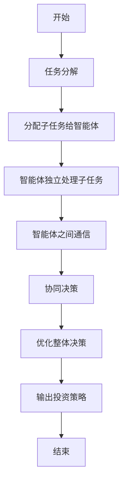
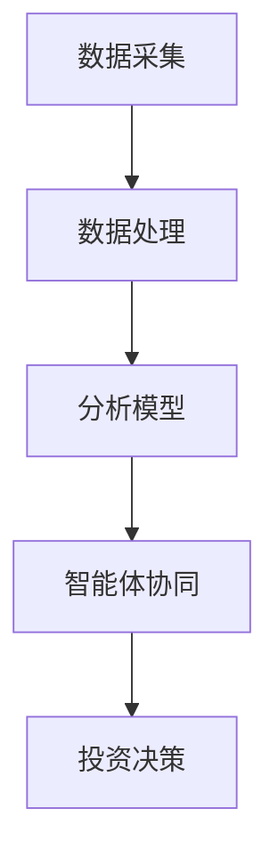
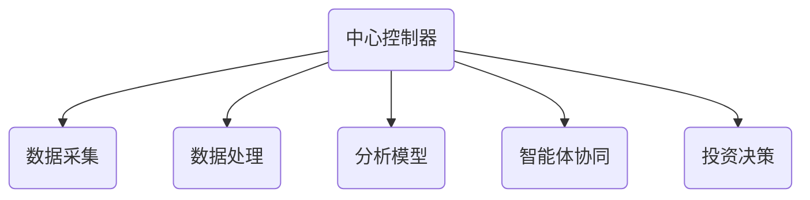
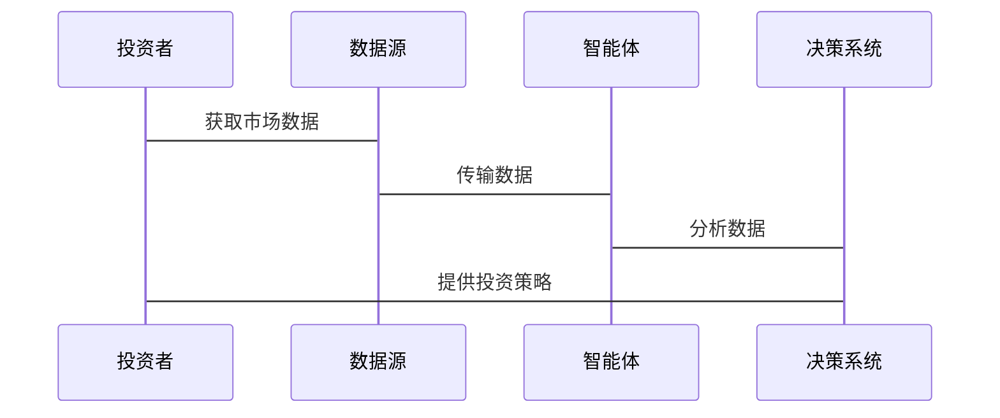

                 


# AI多智能体如何提升价值投资的规模化和个性化

> 关键词：AI多智能体，价值投资，规模化，个性化，分布式计算，投资决策，机器学习

> 摘要：本文探讨AI多智能体系统在价值投资中的应用，分析其如何通过分布式计算和协同决策实现投资策略的规模化和个性化。文章从背景、原理、算法、系统架构到实际应用，详细阐述了AI多智能体在价值投资中的优势和实现路径。

---

## 第1章: 背景介绍

### 1.1 问题背景

#### 1.1.1 传统价值投资的局限性
传统价值投资依赖人工分析，存在效率低、覆盖面小、决策主观性强等问题。随着金融市场数据的指数级增长，单个分析师的能力难以覆盖海量信息，且难以快速响应市场的变化。

#### 1.1.2 AI技术在金融领域的应用现状
AI技术已在金融领域广泛应用，尤其是在高频交易、风险管理、量化分析等方面。然而，传统AI模型通常依赖中心化决策，难以应对复杂多变的市场环境。

#### 1.1.3 多智能体系统的优势与潜力
多智能体系统通过分布式计算和协同决策，能够处理复杂的投资场景，同时支持个性化投资策略。每个智能体专注于特定任务，通过协同工作实现整体目标。

### 1.2 问题描述

#### 1.2.1 价值投资规模化的核心挑战
价值投资规模化需要处理海量数据，同时保持决策的准确性和一致性。传统方法难以在大规模数据下实现高效分析。

#### 1.2.2 个性化投资的需求与实现难点
个性化投资需要根据投资者的风险偏好、财务状况和市场变化定制策略，但传统方法难以快速响应多样化的客户需求。

#### 1.2.3 多智能体在投资决策中的角色定位
多智能体系统可以在投资决策中扮演多个角色，如数据收集、分析、预测和优化，每个智能体负责特定任务，协同完成整体投资策略。

### 1.3 问题解决

#### 1.3.1 多智能体如何实现投资决策的分布式计算
通过将投资决策分解为多个子任务，每个智能体负责一个子任务，利用分布式计算提高处理效率和准确性。

#### 1.3.2 AI技术如何提升投资策略的智能化水平
AI技术通过深度学习、自然语言处理等方法，提升数据分析的深度和广度，帮助发现传统方法难以察觉的市场规律。

#### 1.3.3 规模化与个性化之间的平衡策略
通过动态调整智能体的权重和目标，实现规模化分析的同时，根据客户需求提供个性化投资建议。

### 1.4 边界与外延

#### 1.4.1 多智能体系统的边界条件
多智能体系统在金融领域的应用受到数据隐私、计算资源和市场规则的限制。需要明确系统的边界条件，确保合规性。

#### 1.4.2 价值投资的适用范围与限制
价值投资适用于中长期投资策略，对短期市场波动的适应性较弱。多智能体系统可以在中长期策略中发挥优势。

#### 1.4.3 AI技术的伦理与法律边界
AI技术的应用需要遵守相关法律法规，确保数据安全和隐私保护，同时避免算法黑箱和决策偏差。

### 1.5 核心概念

#### 1.5.1 多智能体系统的基本组成
多智能体系统由多个智能体组成，每个智能体具有独立的目标和决策机制，通过通信和协作完成整体任务。

#### 1.5.2 价值投资的核心要素
价值投资的核心要素包括基本面分析、市场趋势预测、风险评估和投资组合优化。

#### 1.5.3 AI技术在投资中的应用模式
AI技术在投资中的应用模式包括数据驱动分析、预测模型构建和智能决策支持。

---

## 第2章: 核心概念与联系

### 2.1 多智能体系统原理

#### 2.1.1 多智能体系统的定义与特点
多智能体系统是由多个智能体组成的分布式系统，每个智能体具有独立性、反应性和协同性。

#### 2.1.2 多智能体系统与传统单智能体的区别
多智能体系统通过分布式计算和协同决策提高处理能力，而传统单智能体系统依赖中心化决策。

#### 2.1.3 多智能体系统在金融领域的应用优势
多智能体系统能够处理复杂的投资场景，支持个性化投资策略，同时提高决策的准确性和效率。

### 2.2 核心概念属性对比

#### 2.2.1 多智能体系统的属性特征对比表
| 特性 | 单智能体 | 多智能体 |
|------|----------|----------|
| 独立性 | 低       | 高       |
| 协同性 | 低       | 高       |
| 处理能力 | 单一     | 分布式   |

#### 2.2.2 价值投资的核心要素对比分析
价值投资的核心要素包括基本面分析、市场趋势预测、风险评估和投资组合优化，多智能体系统能够同时处理这些要素。

#### 2.2.3 AI技术在投资中的应用模式对比
AI技术在投资中的应用模式包括数据驱动分析、预测模型构建和智能决策支持，多智能体系统能够同时支持多种模式。

### 2.3 ER实体关系图

#### 2.3.1 实体关系图的构建
以下是多智能体系统在价值投资中的ER实体关系图：

```mermaid
erdiagram
actor(投资者) --> 公司(被投资公司)
actor(投资者) --> 数据源(市场数据)
actor(投资者) --> 智能体(多智能体系统)
智能体(多智能体系统) --> 数据处理(数据清洗和转换)
智能体(多智能体系统) --> 分析模型(预测和评估)
智能体(多智能体系统) --> 投资决策(优化和执行)
```

#### 2.3.2 实体关系图的分析与解释
投资者通过与多智能体系统交互，利用市场数据和分析模型，实现投资决策的优化和执行。

#### 2.3.3 实体关系图在投资决策中的应用
通过实体关系图，可以清晰地看到各个实体之间的关系，帮助设计和优化投资决策流程。

---

## 第3章: 算法原理讲解

### 3.1 多智能体算法概述

#### 3.1.1 多智能体算法的基本原理
多智能体算法通过分布式计算和协同决策，实现复杂任务的分解和优化。

#### 3.1.2 多智能体算法的核心步骤
1. 任务分解：将整体任务分解为多个子任务，分配给不同的智能体。
2. 通信与协作：智能体之间通过通信机制共享信息，协同完成任务。
3. 分布式决策：每个智能体根据自身信息和全局信息做出决策。
4. 协调优化：通过协调机制优化整体决策，提高效率和准确性。

### 3.2 算法流程图

#### 3.2.1 多智能体算法的流程图展示
以下是多智能体算法的流程图：



#### 3.2.2 算法流程图的详细说明
1. 开始：启动多智能体系统。
2. 任务分解：将投资任务分解为多个子任务。
3. 分配子任务：将子任务分配给不同的智能体。
4. 独立处理：每个智能体独立处理分配的子任务。
5. 通信：智能体之间共享信息和数据。
6. 协同决策：基于共享信息，协同完成决策。
7. 优化：优化整体决策，提高效率和准确性。
8. 输出：输出最终的投资策略。
9. 结束：结束投资任务。

### 3.3 Python代码实现

#### 3.3.1 环境安装与配置
需要安装以下库：
```bash
pip install numpy pandas scikit-learn
```

#### 3.3.2 核心算法实现代码
以下是多智能体算法的核心代码：

```python
import numpy as np
import pandas as pd
from sklearn import linear_model

class InvestmentAgent:
    def __init__(self, data):
        self.data = data
        self.model = linear_model.LinearRegression()

    def train(self):
        # 训练模型
        X = self.data[['price', 'volume']]
        y = self.data['target']
        self.model.fit(X, y)

    def predict(self, X):
        # 预测目标值
        return self.model.predict(X)

# 多智能体系统
class MultiAgentSystem:
    def __init__(self, data):
        self.agents = [InvestmentAgent(data) for _ in range(4)]
        for agent in self.agents:
            agent.train()

    def make_decision(self, X):
        # 智能体协同决策
        predictions = []
        for agent in self.agents:
            predictions.append(agent.predict(X))
        # 综合预测结果
        return np.mean(predictions)
```

#### 3.3.3 代码运行与结果分析
运行代码，输入数据后，系统会输出协同决策的投资策略。通过分析结果，可以验证多智能体系统的有效性。

### 3.4 数学模型与公式

#### 3.4.1 投资组合优化的数学公式
投资组合优化的目标是最大化收益，同时最小化风险：

$$
\text{Maximize} \quad \sum_{i=1}^{n} w_i r_i \\
\text{Subject to} \quad \sum_{i=1}^{n} w_i = 1 \\
\quad \quad \quad \sum_{i=1}^{n} w_i^2 \leq k
$$

其中，\( w_i \) 是投资比例，\( r_i \) 是资产的收益率，\( k \) 是风险系数。

#### 3.4.2 算法优化的数学证明
通过数学证明，可以得出多智能体系统的优化策略。例如，通过拉格朗日乘数法，可以优化协同决策的目标函数。

---

## 第4章: 系统分析与架构设计

### 4.1 项目场景介绍

#### 4.1.1 项目目标与范围
项目目标是利用多智能体系统提升价值投资的规模化和个性化，范围包括数据采集、分析、预测和决策支持。

#### 4.1.2 项目需求分析
项目需求包括处理海量数据、支持个性化投资策略、提高决策效率和准确性。

### 4.2 系统功能设计

#### 4.2.1 系统功能模块划分
系统功能模块包括数据采集、数据处理、分析模型、智能体协同和投资决策。

#### 4.2.2 功能模块的交互流程
以下是功能模块的交互流程图：



### 4.3 系统架构设计

#### 4.3.1 系统架构图
以下是系统架构图：



#### 4.3.2 系统接口设计
系统接口包括数据接口、模型接口和决策接口。

### 4.4 系统交互设计

#### 4.4.1 系统交互流程
以下是系统交互流程图：



---

## 第5章: 项目实战

### 5.1 环境安装与配置

#### 5.1.1 安装必要的Python库
安装numpy、pandas、scikit-learn等库。

### 5.2 核心算法实现

#### 5.2.1 实现多智能体系统的代码
如前所述，核心代码包括`InvestmentAgent`和`MultiAgentSystem`类。

#### 5.2.2 代码运行与结果分析
运行代码，分析协同决策的投资策略，验证系统的有效性。

### 5.3 案例分析

#### 5.3.1 典型案例分析
以某公司为例，分析多智能体系统的实际应用。

#### 5.3.2 投资策略优化
通过案例分析，优化投资策略，提高收益和降低风险。

### 5.4 项目小结

#### 5.4.1 项目总结
总结项目实施过程，分析系统的优缺点。

#### 5.4.2 项目成果
展示系统的实际成果，包括投资策略的优化和效率的提高。

---

## 第6章: 最佳实践与注意事项

### 6.1 最佳实践

#### 6.1.1 系统设计
建议在系统设计时充分考虑可扩展性和容错性。

#### 6.1.2 数据管理
确保数据的安全和隐私，避免数据泄露和滥用。

#### 6.1.3 系统维护
定期更新模型和优化算法，确保系统的高效运行。

### 6.2 小结

#### 6.2.1 核心要点总结
总结多智能体系统在价值投资中的核心要点，包括分布式计算、协同决策和个性化投资。

### 6.3 注意事项

#### 6.3.1 系统安全性
注意数据安全和隐私保护，避免系统被攻击和数据泄露。

#### 6.3.2 系统稳定性
确保系统的稳定运行，避免因故障导致投资决策失误。

#### 6.3.3 系统合规性
遵守相关法律法规，确保系统的合法性和合规性。

### 6.4 拓展阅读

#### 6.4.1 推荐阅读
推荐相关书籍和论文，供读者深入学习和研究。

---

## 结语

通过本文的详细阐述，我们可以看到AI多智能体系统在价值投资中的巨大潜力。通过分布式计算和协同决策，多智能体系统能够实现投资策略的规模化和个性化，为投资者提供更高效和精准的投资决策支持。未来，随着AI技术的不断发展，多智能体系统将在金融领域发挥更大的作用，推动价值投资进入新的发展阶段。

