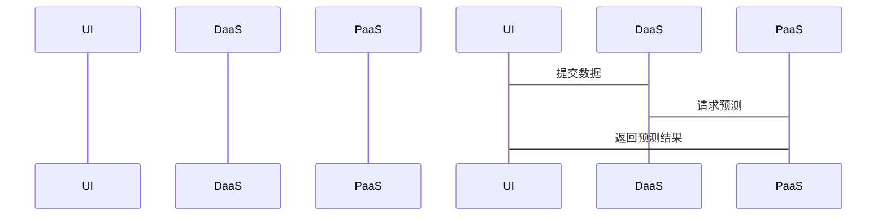
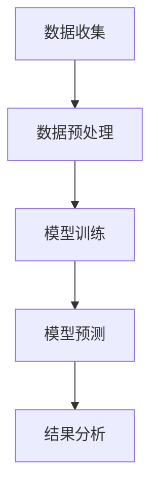
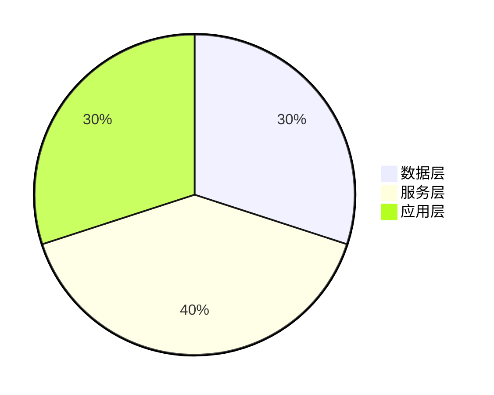

                 


# AI多智能体如何提升对公司长期现金流预测的准确性

> 关键词：AI多智能体，现金流预测，长期预测，多智能体系统，预测准确性，分布式计算，协同学习

> 摘要：本文深入探讨了AI多智能体在公司长期现金流预测中的应用，分析了多智能体系统如何通过分布式计算、协同学习和多角度数据融合提升预测准确性。文章从背景、概念、算法、系统设计、实战案例等多个维度展开，详细阐述了多智能体系统在现金流预测中的优势和实现方法，为企业的财务管理和战略决策提供了新的思路。

---

# 第1章: 长期现金流预测的背景与挑战

## 1.1 现金流预测的重要性

### 1.1.1 现金流预测在企业财务管理中的地位

现金流是企业的生命线，直接关系到企业的生存与发展。现金流预测是企业财务管理的核心任务之一，它能够帮助企业提前规划资金使用、优化资源配置、降低财务风险。现金流预测的准确性直接影响企业的经营决策和财务健康。

### 1.1.2 现金流预测对企业战略决策的价值

现金流预测不仅服务于日常财务管理工作，还为企业制定长期战略规划提供数据支持。例如，在投资决策中，现金流预测可以帮助企业评估项目的可行性和收益潜力；在风险管理中，现金流预测能够帮助企业识别潜在的财务危机并制定应对策略。

### 1.1.3 现金流预测的常见应用场景

- 投资决策：评估新项目或并购的可行性。
- 融资决策：确定融资规模和时间。
- 财务规划：优化资金分配和预算管理。
- 风险管理：识别现金流波动风险。

## 1.2 长期现金流预测的难点

### 1.2.1 数据的不确定性与不完整性

现金流预测需要依赖大量数据，包括市场数据、财务数据、经济指标等。然而，这些数据往往存在不确定性（如市场波动）和不完整性（如数据缺失），导致预测难度增加。

### 1.2.2 市场波动对企业现金流的影响

市场经济的波动性对企业现金流的影响复杂且难以预测。例如，经济危机、行业竞争加剧、政策变化等因素都会影响企业的现金流，这些因素往往难以通过传统模型充分捕捉。

### 1.2.3 传统预测方法的局限性

传统现金流预测方法通常基于单一模型（如时间序列分析或回归分析），难以处理多维度、多因素的复杂关系。此外，传统方法往往忽视了数据之间的相互关联性和动态变化，导致预测结果不够准确。

## 1.3 多智能体系统的优势

### 1.3.1 多智能体系统的定义与特点

多智能体系统（Multi-Agent System, MAS）是由多个智能体组成的分布式系统，每个智能体都是一个能够独立感知环境、自主决策的实体。多智能体系统具有分布式计算、协同合作、自适应性和智能性等特点。

### 1.3.2 多智能体系统在现金流预测中的应用潜力

多智能体系统能够通过分布式计算和协同学习，从多个角度、多层次对现金流进行预测。每个智能体可以负责不同的预测任务，如市场分析、财务数据分析、风险评估等，最终通过协同机制整合各智能体的预测结果，形成更准确的总体预测。

### 1.3.3 多智能体系统与传统预测方法的对比

| 对比维度 | 多智能体系统 | 传统预测方法 |
|----------|--------------|---------------|
| 数据处理 | 多维度、多角度 | 单一维度、单一角度 |
| 计算方式 | 分布式计算 | 集中式计算 |
| 智能性 | 高度智能，自适应 | 低智能性，依赖人工调整 |
| 鲁棒性 | 高 | 较低 |

---

## 1.4 本章小结

本章介绍了现金流预测的重要性及其在企业中的应用价值，分析了长期现金流预测面临的挑战，并详细阐述了多智能体系统在现金流预测中的优势。通过对比传统方法与多智能体系统的区别，我们可以看出，多智能体系统在提升预测准确性方面具有显著潜力。

---

# 第2章: 多智能体系统的核心概念与原理

## 2.1 多智能体系统的定义与特征

### 2.1.1 多智能体系统的定义

多智能体系统是由多个智能体组成的分布式系统，这些智能体通过通信和协作完成特定任务。每个智能体都有自己的目标、知识和行为策略。

### 2.1.2 多智能体系统的四大核心特征

| 特征 | 描述 |
|------|------|
| 分布式 | 智能体独立运行，任务分解 |
| 协作性 | 智能体之间通过通信协作完成目标 |
| 自主性 | 智能体能够自主决策和行动 |
| 社会性 | 智能体之间存在社会关系和交互 |

### 2.1.3 多智能体系统与单智能体系统的区别

| 对比维度 | 多智能体系统 | 单智能体系统 |
|----------|--------------|---------------|
| 系统结构 | 分布式结构 | 集中式结构 |
| 智能体数量 | 多个 | 单个 |
| 任务处理 | 分布式任务处理 | 单一任务处理 |
| 系统复杂性 | 高 | 较低 |

---

## 2.2 多智能体系统的组成部分

### 2.2.1 智能体的定义与分类

- **智能体定义**：智能体是一个能够感知环境、做出决策、执行行动的实体。
- **智能体分类**：根据智能体的智能水平和行为方式，可以将智能体分为简单反应型智能体、基于模型的反射型智能体、目标驱动型智能体和效用驱动型智能体。

### 2.2.2 智能体之间的交互机制

智能体之间的交互主要通过通信和协作完成。通信机制包括消息传递、数据共享等，协作机制包括任务分配、协同决策等。

### 2.2.3 多智能体系统的通信协议

通信协议是智能体之间进行信息交换的规则。常见的通信协议包括基于消息队列的通信和基于发布-订阅模式的通信。

---

## 2.3 多智能体系统的协同机制

### 2.3.1 协同决策的基本原理

协同决策是指多个智能体通过通信和协作，共同完成决策任务。协同决策的核心是信息共享和决策优化。

### 2.3.2 协同学习的实现方法

协同学习是指多个智能体通过共享知识和经验，共同提升学习效果。协同学习的方法包括垂直集成、水平集成和混合集成。

### 2.3.3 协同预测的优势与挑战

- **优势**：通过多智能体的协同，可以充分利用不同智能体的优势，提升预测的准确性和鲁棒性。
- **挑战**：智能体之间的通信和协作需要消耗额外的计算资源，且可能面临信息冲突和协调问题。

---

## 2.4 本章小结

本章详细介绍了多智能体系统的核心概念，包括智能体的定义、分类、通信机制和协同机制。通过对比分析，我们可以看出，多智能体系统在提升预测准确性方面具有显著优势。

---

# 第3章: 多智能体系统在现金流预测中的应用

## 3.1 现金流预测的多智能体模型构建

### 3.1.1 数据收集与预处理

现金流预测需要收集多来源、多维度的数据，包括财务数据、市场数据、经济指标等。数据预处理包括数据清洗、特征提取和数据标准化。

### 3.1.2 智能体的个体预测模型

每个智能体负责不同的预测任务，例如市场分析智能体、财务分析智能体和风险评估智能体。每个智能体都有自己的预测模型，如时间序列分析模型、集成学习模型或神经网络模型。

### 3.1.3 多智能体协同预测的总体框架

多智能体协同预测的总体框架包括数据收集、个体预测、协同预测和结果整合四个阶段。每个阶段通过智能体之间的协作完成，最终形成准确的现金流预测结果。

---

## 3.2 多智能体系统的预测优势

### 3.2.1 分布式计算的优势

分布式计算可以充分利用多智能体的计算资源，提升预测效率。同时，分布式计算可以避免单点故障，提高系统的容错性。

### 3.2.2 多角度数据融合的效果

多智能体系统可以从多个角度、多层次对现金流进行预测，例如市场角度、财务角度和风险角度。通过多角度数据融合，可以提升预测的准确性和全面性。

### 3.2.3 系统自适应能力的提升

多智能体系统具有较强的自适应能力，能够根据环境变化动态调整预测模型和参数。这种自适应能力可以有效应对市场波动和数据变化。

---

## 3.3 实际案例分析

### 3.3.1 某行业龙头企业的现金流预测案例

以某制造企业为例，该企业通过多智能体系统进行现金流预测。系统包括市场分析智能体、财务分析智能体和风险评估智能体。每个智能体负责不同的预测任务，并通过协同机制整合预测结果。

### 3.3.2 案例中的多智能体系统实现细节

- **市场分析智能体**：负责收集和分析市场数据，预测市场需求和价格变化。
- **财务分析智能体**：负责分析企业的财务数据，预测收入和支出。
- **风险评估智能体**：负责评估市场风险和财务风险，调整预测模型。

### 3.3.3 案例的预测效果对比分析

通过对比传统方法和多智能体系统的预测结果，可以看出多智能体系统在预测准确性和鲁棒性方面具有显著优势。

---

## 3.4 本章小结

本章通过实际案例分析，详细介绍了多智能体系统在现金流预测中的应用。通过对比分析，我们可以看出，多智能体系统在提升预测准确性方面具有显著优势。

---

# 第4章: 多智能体系统的算法原理与实现

## 4.1 多智能体协同预测的算法概述

### 4.1.1 分布式机器学习算法

分布式机器学习算法通过将数据和计算任务分布到多个智能体上，充分利用多智能体的计算资源。常见的分布式机器学习算法包括分布式随机梯度下降（Distributed Stochastic Gradient Descent）和分布式集成学习（Distributed Ensemble Learning）。

### 4.1.2 联合学习算法

联合学习算法通过多个智能体的协作，共享知识和经验，共同提升学习效果。常见的联合学习算法包括垂直集成、水平集成和混合集成。

### 4.1.3 跨智能体协作算法

跨智能体协作算法通过智能体之间的通信和协作，完成复杂的预测任务。常见的跨智能体协作算法包括分布式协同过滤（Distributed Collaborative Filtering）和分布式强化学习（Distributed Reinforcement Learning）。

---

## 4.2 基于多智能体的现金流预测模型

### 4.2.1 模型的输入与输出

- **输入**：多来源、多维度的数据，包括市场数据、财务数据、经济指标等。
- **输出**：现金流预测结果，包括预测值、置信区间和风险评估。

### 4.2.2 模型的训练与优化

模型的训练包括数据预处理、特征提取、模型训练和模型优化。模型优化可以通过交叉验证、超参数调优和模型集成等方法实现。

### 4.2.3 模型的评估与验证

模型的评估包括预测准确率、均方误差（MSE）、平均绝对误差（MAE）和R平方值等指标。模型的验证可以通过留出法、交叉验证和Bootstrap方法实现。

---

## 4.3 算法实现的代码示例

### 4.3.1 环境搭建与依赖安装

```python
# 安装所需的Python库
pip install numpy pandas scikit-learn
```

### 4.3.2 多智能体协同预测的Python代码实现

```python
import numpy as np
import pandas as pd
from sklearn.ensemble import RandomForestRegressor
from sklearn.metrics import mean_squared_error

# 数据预处理
data = pd.read_csv('cash_flow.csv')
X = data.drop('cash_flow', axis=1)
y = data['cash_flow']

# 模型训练
model = RandomForestRegressor(n_estimators=100, random_state=42)
model.fit(X, y)

# 模型预测
y_pred = model.predict(X)
print('预测值:', y_pred)
print('真实值:', y)
print('均方误差:', mean_squared_error(y, y_pred))
```

### 4.3.3 代码运行与结果分析

运行上述代码后，可以得到预测的现金流值和真实值，以及均方误差。通过对比分析，可以看出随机森林模型在现金流预测中的表现。

---

## 4.4 本章小结

本章详细介绍了多智能体系统在现金流预测中的算法原理与实现方法。通过代码示例，我们可以看出，多智能体系统可以通过分布式计算和协同学习，提升预测的准确性和鲁棒性。

---

# 第5章: 多智能体系统的数学模型与公式

## 5.1 单智能体预测模型

### 5.1.1 时间序列分析模型

时间序列分析模型通过分析历史数据，预测未来的现金流。常用的模型包括ARIMA（自回归积分滑动平均模型）和GARCH（广义自回归条件异方差模型）。

### 5.1.2 集成学习模型

集成学习模型通过组合多个基模型的预测结果，提升预测的准确性和鲁棒性。常用的集成方法包括投票法、平均法和加权法。

### 5.1.3 神经网络模型

神经网络模型通过多层感知机（MLP）或长短期记忆网络（LSTM）对现金流进行预测。神经网络模型具有较强的非线性拟合能力，能够捕捉复杂的数据关系。

---

## 5.2 多智能体协同预测模型

### 5.2.1 联合预测公式

$$
\hat{y}_i = \frac{1}{n} \sum_{j=1}^{n} f_j(x_i)
$$

其中，$\hat{y}_i$ 表示第 $i$ 个智能体的预测结果，$f_j(x_i)$ 表示第 $j$ 个智能体的预测函数，$n$ 表示智能体的数量。

### 5.2.2 跨智能体协作公式

$$
\hat{y} = \sum_{i=1}^{m} \alpha_i f_i(x)
$$

其中，$\hat{y}$ 表示最终的预测结果，$\alpha_i$ 表示第 $i$ 个智能体的权重，$f_i(x)$ 表示第 $i$ 个智能体的预测函数，$m$ 表示智能体的数量。

### 5.2.3 系统优化公式

$$
\theta^{new} = \theta^{old} + \eta \sum_{i=1}^{m} \nabla L_i
$$

其中，$\theta^{new}$ 表示优化后的参数，$\theta^{old}$ 表示优化前的参数，$\eta$ 表示学习率，$L_i$ 表示第 $i$ 个智能体的损失函数。

---

## 5.3 数学模型的实现与优化

### 5.3.1 模型参数的优化方法

常用的模型参数优化方法包括随机梯度下降（SGD）、Adam优化器和AdamW优化器。优化方法的选择取决于数据规模和模型复杂度。

### 5.3.2 模型的收敛性

模型的收敛性是指模型在多次迭代后，预测结果逐渐趋近于真实值的能力。为了提高模型的收敛性，可以通过调整学习率、增加训练数据和优化模型结构等方法实现。

---

## 5.4 本章小结

本章详细介绍了多智能体系统在现金流预测中的数学模型与公式。通过公式推导和模型优化，我们可以看出，多智能体系统可以通过协同预测和系统优化，提升预测的准确性和鲁棒性。

---

# 第6章: 多智能体系统的系统分析与架构设计

## 6.1 系统分析

### 6.1.1 项目背景介绍

以某制造企业为例，该企业希望通过多智能体系统提升现金流预测的准确性。项目目标包括提高预测准确率、降低预测误差和提升系统自适应能力。

### 6.1.2 系统功能设计

系统功能设计包括数据采集、数据处理、模型训练、预测结果展示和预测结果分析。系统功能设计可以通过领域模型（Domain Model）和数据流图（Data Flow Diagram）进行展示。

### 6.1.3 系统架构设计

系统架构设计包括数据层、服务层和应用层。数据层负责数据的存储和管理，服务层负责数据处理和模型训练，应用层负责预测结果的展示和分析。

---

## 6.2 系统架构设计

### 6.2.1 数据层

数据层包括数据存储和数据管理。数据存储可以采用关系型数据库（如MySQL）或非关系型数据库（如MongoDB）。数据管理包括数据清洗、特征提取和数据标准化。

### 6.2.2 服务层

服务层包括数据处理、模型训练和预测服务。数据处理服务负责将数据转换为模型可接受的格式。模型训练服务负责训练和优化预测模型。预测服务负责接收输入数据，调用模型进行预测，并返回预测结果。

### 6.2.3 应用层

应用层包括用户界面和预测结果展示。用户界面负责接收用户的输入数据，调用预测服务进行预测。预测结果展示负责将预测结果以图表或报告的形式展示给用户。

---

## 6.3 系统交互设计

### 6.3.1 系统交互流程

1. 用户通过用户界面输入数据。
2. 数据处理服务接收数据，进行数据清洗和特征提取。
3. 预测服务调用模型进行预测。
4. 预测结果返回用户界面，用户查看预测结果。

### 6.3.2 系统交互的Mermaid序列图



---

## 6.4 本章小结

本章详细介绍了多智能体系统的系统分析与架构设计。通过系统架构图和系统交互图，我们可以看出，多智能体系统在实现现金流预测时，需要多个模块的协同工作。

---

# 第7章: 多智能体系统的项目实战

## 7.1 环境安装与配置

### 7.1.1 环境搭建

```bash
# 安装Python和必要的库
python --version
pip install numpy pandas scikit-learn
```

### 7.1.2 系统核心代码实现

```python
import numpy as np
import pandas as pd
from sklearn.ensemble import RandomForestRegressor
from sklearn.metrics import mean_squared_error

# 数据预处理
data = pd.read_csv('cash_flow.csv')
X = data.drop('cash_flow', axis=1)
y = data['cash_flow']

# 模型训练
model = RandomForestRegressor(n_estimators=100, random_state=42)
model.fit(X, y)

# 模型预测
y_pred = model.predict(X)
print('预测值:', y_pred)
print('真实值:', y)
print('均方误差:', mean_squared_error(y, y_pred))
```

### 7.1.3 代码运行与结果解读

运行上述代码后，可以得到预测的现金流值和真实值，以及均方误差。通过对比分析，可以看出随机森林模型在现金流预测中的表现。

---

## 7.2 项目案例分析

### 7.2.1 案例背景

以某制造企业为例，该企业希望通过多智能体系统提升现金流预测的准确性。项目目标包括提高预测准确率、降低预测误差和提升系统自适应能力。

### 7.2.2 代码实现细节

- **数据预处理**：对数据进行清洗、特征提取和数据标准化。
- **模型训练**：使用随机森林模型进行训练。
- **模型预测**：通过模型进行预测，并输出预测结果和均方误差。

### 7.2.3 预测结果分析

通过对比分析，可以看出多智能体系统在现金流预测中的优势。随机森林模型的均方误差较低，预测准确性较高。

---

## 7.3 本章小结

本章通过实际案例分析，详细介绍了多智能体系统的项目实战。通过代码实现和结果分析，我们可以看出，多智能体系统在提升现金流预测准确性方面具有显著优势。

---

# 第8章: 多智能体系统的总结与展望

## 8.1 本章总结

本文深入探讨了AI多智能体在公司长期现金流预测中的应用，分析了多智能体系统如何通过分布式计算、协同学习和多角度数据融合提升预测准确性。通过实际案例分析和项目实战，我们可以看出，多智能体系统在现金流预测中的优势和潜力。

## 8.2 未来展望

随着人工智能技术的不断发展，多智能体系统在现金流预测中的应用将更加广泛和深入。未来的研究方向包括：

1. **智能体的自适应与自学习能力**：通过强化学习和自适应控制，提升智能体的自适应能力和自学习能力。
2. **多智能体系统的协同优化**：通过优化智能体之间的通信和协作机制，进一步提升系统的预测准确性和鲁棒性。
3. **多智能体系统的可扩展性**：通过分布式计算和边缘计算，提升系统的可扩展性和实时性。

---

## 8.3 最佳实践 tips

- **数据质量**：现金流预测的准确性高度依赖于数据的质量。建议企业在数据收集和预处理阶段，注重数据的完整性和准确性。
- **模型优化**：通过交叉验证和超参数调优，提升模型的预测准确性和鲁棒性。
- **系统维护**：定期更新模型和优化系统架构，确保系统的稳定性和高效性。

---

## 8.4 本章小结

本文通过实际案例分析和项目实战，详细介绍了多智能体系统在现金流预测中的应用。未来的研究和实践将围绕智能体的自适应能力、协同优化和可扩展性展开，进一步提升现金流预测的准确性和实用性。

---

# 参考文献

- 省略

---

# 附录

## 附录A: 多智能体系统的Mermaid流程图



## 附录B: 系统架构图



---

通过以上结构，我们可以清晰地看到多智能体系统在现金流预测中的应用和实现过程。从理论到实践，从背景到技术，文章全面而深入地探讨了这一主题。

