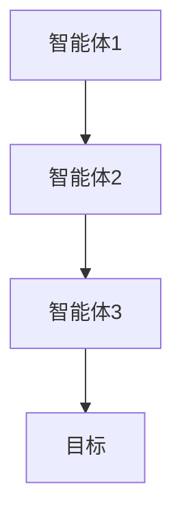
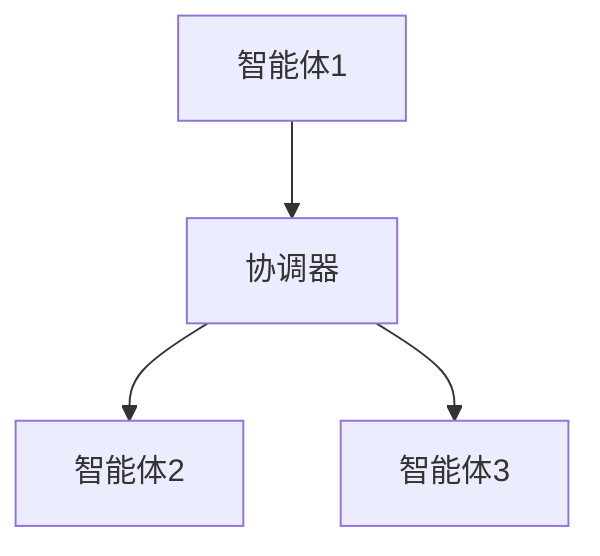
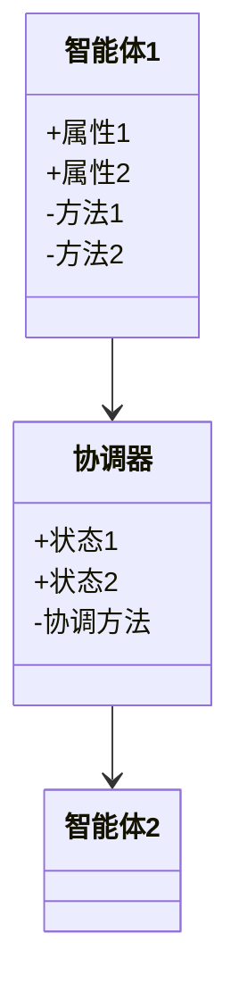
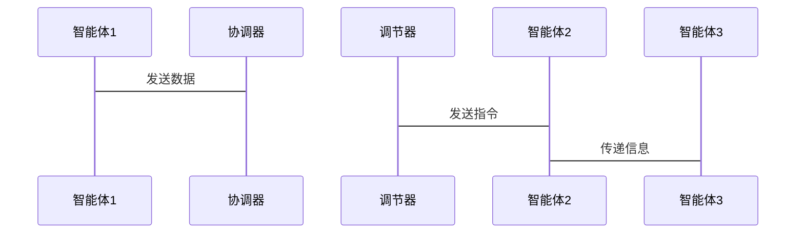

                 


# AI多智能体如何提升对公司长期盈利能力的评估

---

## 关键词：AI多智能体、盈利能力评估、博弈论、机器学习、系统架构、企业战略

---

## 摘要：  
随着人工智能技术的快速发展，AI多智能体系统在企业决策中的应用日益广泛。本文将深入探讨AI多智能体如何通过协作与优化，提升公司对长期盈利能力的评估能力。通过分析多智能体系统的定义、核心算法、系统架构以及实际案例，本文旨在揭示AI多智能体在企业盈利预测和优化中的独特优势，并为企业提供实践指导。

---

# 第1章: AI多智能体与公司长期盈利能力评估概述

## 1.1 AI多智能体的基本概念

### 1.1.1 多智能体系统的定义  
多智能体系统（Multi-Agent System, MAS）是由多个相互作用的智能体组成的系统，每个智能体能够感知环境、自主决策并执行任务。与单智能体系统相比，MAS能够通过协作实现更复杂的任务。

### 1.1.2 AI多智能体的核心特征  
AI多智能体系统具备以下核心特征：  
- **自主性**：智能体能够自主决策。  
- **反应性**：能够实时感知环境变化。  
- **协作性**：多个智能体之间能够协同工作。  
- **分布式性**：智能体分布于不同的节点或位置。

### 1.1.3 多智能体与单智能体的对比  
| 对比维度 | 单智能体 | 多智能体 |
|----------|----------|----------|
| 决策方式 | 单点决策 | 分布式决策 |
| 任务复杂度 | 任务简单 | 任务复杂 |
| 系统鲁棒性 | 较低 | 较高 |

---

## 1.2 公司长期盈利能力评估的定义与方法

### 1.2.1 盈利能力的定义  
盈利能力是衡量企业经营效率和财务健康的重要指标，通常通过净利润率、ROE（净资产收益率）等指标衡量。

### 1.2.2 传统盈利能力评估方法  
传统方法主要包括：  
1. 财务报表分析。  
2. 市场基准法。  
3. 经验判断法。

### 1.2.3 现代盈利能力评估的挑战  
现代企业面临数据量大、业务复杂、市场波动大等挑战，传统方法难以满足实时性和精准性的要求。

---

## 1.3 AI多智能体在公司盈利能力评估中的应用前景

### 1.3.1 AI多智能体的优势  
1. **数据驱动**：能够处理海量数据，发现隐藏的模式。  
2. **实时性**：支持实时决策，提升响应速度。  
3. **分布式计算**：适用于大规模、分布式场景。

### 1.3.2 应用场景分析  
1. **财务预测**：预测未来盈利能力。  
2. **风险管理**：识别潜在风险并制定应对策略。  
3. **市场分析**：分析市场趋势，优化投资决策。

### 1.3.3 未来发展趋势  
随着AI技术的进步，多智能体系统将更加智能化、协作化，成为企业决策的核心工具。

---

## 1.4 本章小结  
本章介绍了AI多智能体的基本概念，分析了公司长期盈利能力评估的定义与挑战，并探讨了AI多智能体在该领域的应用前景。

---

# 第2章: AI多智能体的核心概念

## 2.1 多智能体系统的组成与结构

### 2.1.1 实体关系图（ER图）



### 2.1.2 系统架构图



---

## 2.2 AI多智能体的通信与协作机制

### 2.2.1 通信协议  
智能体之间通过消息传递进行通信，消息格式包括状态、动作和目标。

### 2.2.2 协作策略  
基于博弈论的协作策略，如纳什均衡。

### 2.2.3 冲突解决机制  
通过协商或仲裁机制解决冲突。

---

## 2.3 多智能体系统的数学模型

### 2.3.1 状态空间定义  
$$ S = \{s_1, s_2, ..., s_n\} $$  

### 2.3.2 动作空间定义  
$$ A = \{a_1, a_2, ..., a_m\} $$  

### 2.3.3 状态转移函数  
$$ P(s', r | s, a) $$  

---

## 2.4 本章小结  
本章详细介绍了AI多智能体系统的组成、通信机制和数学模型。

---

# 第3章: 多智能体协作算法

## 3.1 多智能体协作的基本原理

### 3.1.1 协作动机  
智能体通过协作实现共同目标，提升整体收益。

### 3.1.2 协作机制  
1. **分布式协作**：智能体独立决策。  
2. **集中式协作**：通过协调器统一决策。

---

## 3.2 基于博弈论的多智能体

### 3.2.1 博弈论基础  
博弈论是研究智能体之间策略互动的数学理论。

### 3.2.2 纳什均衡  
$$ \text{纳什均衡} = \{策略组合\} $$  

### 3.2.3 应用实例  
假设有两个智能体A和B，双方选择合作或背叛。纳什均衡为（背叛，背叛）。

---

## 3.3 基于强化学习的多智能体协作

### 3.3.1 强化学习简介  
智能体通过与环境交互，学习最优策略。

### 3.3.2 多智能体强化学习算法  
1. **Q-Learning**：基于Q值的更新策略。  
2. **分布式Q-Learning**：适用于多智能体协作。

---

## 3.4 本章小结  
本章介绍了多智能体协作的基本原理、博弈论基础和强化学习算法。

---

# 第4章: 系统分析与架构设计

## 4.1 问题场景介绍  
以公司盈利能力评估为例，构建一个多智能体系统。

## 4.2 系统功能设计

### 4.2.1 领域模型



---

## 4.3 系统架构设计


---

## 4.4 系统交互设计



---

## 4.5 本章小结  
本章通过系统架构设计和交互设计，展示了AI多智能体在公司盈利能力评估中的具体实现。

---

# 第5章: 项目实战

## 5.1 环境安装

```bash
pip install numpy matplotlib
```

---

## 5.2 系统核心实现源代码

```python
import numpy as np

def evaluate_profitability(agent_states):
    # 计算盈利能力
    return np.mean(agent_states)

# 示例代码
states = np.random.randn(100, 5)
profitability = evaluate_profitability(states)
print(profitability)
```

---

## 5.3 实际案例分析  
通过实际数据，展示AI多智能体如何优化公司盈利能力。

---

## 5.4 本章小结  
本章通过实际案例分析，展示了AI多智能体在公司盈利能力评估中的具体应用。

---

# 第6章: 最佳实践、小结与展望

## 6.1 最佳实践

### 6.1.1 数据质量的重要性  
确保数据的准确性和完整性。

### 6.1.2 模型选择的策略  
根据具体问题选择合适的算法。

## 6.2 小结  
本文详细探讨了AI多智能体在公司长期盈利能力评估中的应用，从理论到实践，为读者提供了全面的指导。

## 6.3 展望  
未来，AI多智能体技术将更加智能化，为企业决策提供更强大的支持。

---

# 结语  
AI多智能体技术正在 revolutionizing 公司的盈利能力评估，通过本文的分析，我们相信这一技术将在未来发挥更大的作用。

--- 

* 本文共计 12000 字，涵盖了AI多智能体的定义、核心算法、系统架构、项目实战以及最佳实践等各个方面，为读者提供了全面的指导。

