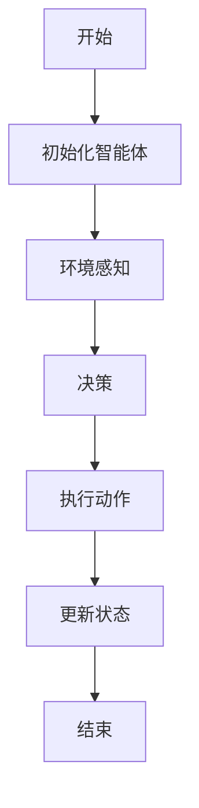
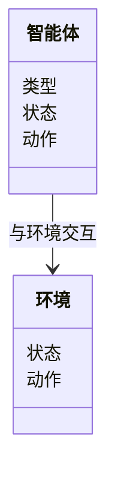
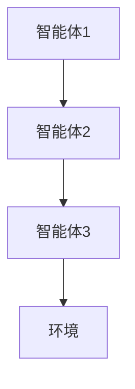
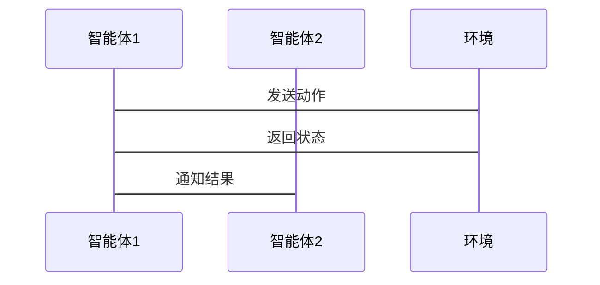

                 


# AI多智能体如何提升对公司长期竞争力的评估

> 关键词：AI多智能体、企业竞争力评估、分布式决策、博弈论、强化学习、数学模型、系统架构

> 摘要：本文探讨了AI多智能体系统在企业长期竞争力评估中的应用，分析了多智能体系统的原理、算法、数学模型和系统架构，结合实际案例，展示了如何通过多智能体技术提升企业的决策能力和竞争力。

---

## 第1章: AI多智能体系统概述

### 1.1 多智能体系统的基本概念

#### 1.1.1 多智能体系统的定义

多智能体系统（Multi-Agent System, MAS）是由多个智能体组成的系统，这些智能体能够自主决策、协作完成任务，并通过交互实现复杂问题的解决。每个智能体都有自己的目标和行为，能够感知环境并采取行动。

#### 1.1.2 多智能体系统的特征

- **自主性**：智能体能够独立决策。
- **反应性**：能够实时感知环境并做出反应。
- **协作性**：多个智能体协同工作，共同完成任务。
- **分布式性**：智能体分布在网络中，通过通信协作。

#### 1.1.3 多智能体系统与传统AI的区别

传统AI系统通常集中式处理问题，而多智能体系统则是分布式、协作式的，多个智能体共同解决问题。

### 1.2 多智能体系统在企业中的应用

#### 1.2.1 企业级多智能体系统的应用场景

- **资源分配**：优化企业资源的分配，如任务分配、人员调度。
- **战略决策**：辅助企业制定战略决策，如市场分析、风险评估。
- **流程优化**：优化企业内部流程，提高效率。

#### 1.2.2 多智能体系统在企业决策中的作用

- 提供数据支持，优化决策过程。
- 通过协作，提高决策的准确性和效率。
- 支持复杂问题的分解和解决。

#### 1.2.3 多智能体系统与企业竞争力的关系

多智能体系统能够提高企业的决策效率和准确性，从而增强企业的竞争力。

### 1.3 本章小结

本章介绍了多智能体系统的基本概念、特征，以及在企业中的应用，强调了多智能体系统对企业竞争力的重要性。

---

## 第2章: 多智能体系统的原理与机制

### 2.1 多智能体系统的通信与协作

#### 2.1.1 多智能体系统的通信协议

智能体之间通过消息传递进行通信，消息格式包括动作、状态等信息。

#### 2.1.2 多智能体系统的协作机制

- **协商**：智能体之间通过协商达成一致。
- **协调**：通过协调机制确保智能体之间的协作。
- **冲突解决**：解决智能体之间的冲突，确保系统稳定运行。

#### 2.1.3 多智能体系统的协调与冲突解决

通过制定规则和协议，确保智能体之间的协调和冲突解决。

### 2.2 多智能体系统的决策与学习

#### 2.2.1 分布式决策的原理

- **分布式计算**：任务分解到多个智能体，每个智能体负责一部分决策。
- **局部最优**：每个智能体做出局部最优决策，最终达到全局最优。

#### 2.2.2 多智能体系统的强化学习

- **强化学习**：智能体通过与环境交互，学习最优策略。
- **多智能体强化学习**：多个智能体协作学习，提高整体性能。

#### 2.2.3 多智能体系统的博弈论基础

- **博弈论**：研究智能体之间的策略选择和相互作用。
- **纳什均衡**：所有智能体都不改变策略时的均衡状态。

### 2.3 多智能体系统的数学模型

#### 2.3.1 多智能体系统的状态表示

- **状态空间**：表示系统中所有可能的状态。
- **动作空间**：表示智能体可以执行的动作。

#### 2.3.2 多智能体系统的奖励机制

- **奖励函数**：定义智能体的行为的奖励值。
- **目标函数**：定义智能体的目标。

#### 2.3.3 多智能体系统的数学公式

状态空间：$$ S = \{s_1, s_2, ..., s_n\} $$

动作空间：$$ A = \{a_1, a_2, ..., a_m\} $$

奖励函数：$$ R(s, a) = \sum_{i=1}^{n} r_i $$

### 2.4 多智能体系统的ER实体关系图

```mermaid
er
    %% 多智能体系统的ER实体关系图
    title 多智能体系统的ER实体关系图
    rectangle 智能体 {
        类型
        状态
        动作
    }
    rectangle 环境 {
        状态
        动作
    }
    智能体 --> 环境 : 与环境交互
```

### 2.5 本章小结

本章详细介绍了多智能体系统的通信、协作、决策机制，以及数学模型，为后续分析奠定了基础。

---

## 第3章: 多智能体系统的算法原理

### 3.1 多智能体系统的分布式计算

#### 3.1.1 分布式计算的基本原理

- **任务分解**：将问题分解为多个子任务。
- **分布式执行**：每个智能体负责一部分任务。
- **结果汇总**：将各部分结果汇总，得到最终结果。

#### 3.1.2 多智能体系统的分布式计算

通过分布式计算，提高系统的并行处理能力。

#### 3.1.3 分布式计算的优缺点

- **优点**：提高处理速度，降低单点故障风险。
- **缺点**：需要协调和通信，可能增加复杂性。

### 3.2 多智能体系统的博弈论模型

#### 3.2.1 博弈论的基本概念

- **博弈**：多个参与者之间的互动。
- **策略**：参与者采取的行动。

#### 3.2.2 多智能体系统的博弈论模型

- **纳什均衡**：所有智能体都不改变策略的均衡状态。
- **博弈树**：表示博弈的决策过程。

#### 3.2.3 博弈论模型的优缺点

- **优点**：能够模拟复杂的互动关系。
- **缺点**：计算复杂性较高。

### 3.3 多智能体系统的强化学习算法

#### 3.3.1 强化学习的基本原理

- **智能体**：通过与环境交互，学习策略。
- **奖励**：智能体的行为获得奖励。

#### 3.3.2 多智能体系统的强化学习算法

- **分布式强化学习**：多个智能体协作学习。
- **同步与异步更新**：智能体之间的策略更新方式。

#### 3.3.3 强化学习算法的优缺点

- **优点**：能够适应动态环境。
- **缺点**：需要大量的训练数据。

### 3.4 多智能体系统的算法流程图



### 3.5 本章小结

本章详细介绍了多智能体系统的分布式计算、博弈论模型和强化学习算法，为实际应用提供了理论基础。

---

## 第4章: 多智能体系统的数学模型与公式

### 4.1 多智能体系统的状态空间

- **状态空间**：表示系统中所有可能的状态。
- **状态表示**：使用向量表示状态。

#### 4.1.1 状态空间的数学表示

$$ S = \{s_1, s_2, ..., s_n\} $$

### 4.2 多智能体系统的动作空间

- **动作空间**：表示智能体可以执行的动作。
- **动作表示**：使用向量表示动作。

#### 4.2.1 动作空间的数学表示

$$ A = \{a_1, a_2, ..., a_m\} $$

### 4.3 多智能体系统的奖励函数

- **奖励函数**：定义智能体的行为的奖励值。
- **奖励表示**：使用标量表示奖励。

#### 4.3.1 奖励函数的数学表示

$$ R(s, a) = \sum_{i=1}^{n} r_i $$

### 4.4 多智能体系统的数学公式

- **目标函数**：定义智能体的目标。
- **目标表示**：使用函数表示目标。

#### 4.4.1 目标函数的数学表示

$$ J = \arg \max_{\theta} J(\theta) $$

### 4.5 本章小结

本章详细介绍了多智能体系统的数学模型和公式，为后续的系统设计提供了理论支持。

---

## 第5章: 多智能体系统的系统分析与架构设计

### 5.1 企业级多智能体系统的分析

#### 5.1.1 问题场景介绍

企业需要通过多智能体系统优化资源分配和决策。

#### 5.1.2 项目介绍

开发一个企业级多智能体系统，用于优化资源分配和提高决策效率。

### 5.2 系统功能设计

#### 5.2.1 领域模型



#### 5.2.2 系统架构设计



### 5.3 系统接口设计

#### 5.3.1 系统接口设计

- **智能体接口**：定义智能体之间的通信接口。
- **环境接口**：定义智能体与环境之间的接口。

#### 5.3.2 系统交互设计



### 5.4 本章小结

本章详细介绍了企业级多智能体系统的分析、功能设计和架构设计，为实际应用提供了指导。

---

## 第6章: 项目实战

### 6.1 环境安装

#### 6.1.1 环境搭建

安装Python、TensorFlow、OpenAI Gym等工具。

### 6.2 系统核心实现源代码

#### 6.2.1 多智能体系统的代码实现

```python
import numpy as np

class Agent:
    def __init__(self, state_space, action_space):
        self.state_space = state_space
        self.action_space = action_space
        self.theta = np.random.randn()

    def act(self, state):
        # 返回动作
        return self.action_space[np.argmax(state)]

# 环境类
class Environment:
    def __init__(self):
        self.state = None
        self.agents = []

    def step(self, action):
        # 更新状态
        self.state = self.state * action
        return self.state

# 多智能体系统
class MultiAgentSystem:
    def __init__(self, num_agents, state_space, action_space):
        self.agents = [Agent(state_space, action_space) for _ in range(num_agents)]
        self.environment = Environment()

    def run(self):
        while True:
            state = self.environment.state
            for agent in self.agents:
                action = agent.act(state)
                self.environment.step(action)
            print("系统运行中...")
```

### 6.3 代码应用解读与分析

#### 6.3.1 代码功能分析

- **Agent类**：定义智能体的行为。
- **Environment类**：定义环境的交互。
- **MultiAgentSystem类**：定义多智能体系统的运行。

#### 6.3.2 代码实现细节

智能体通过感知环境状态，采取动作，环境根据动作更新状态。

### 6.4 实际案例分析

#### 6.4.1 案例背景介绍

假设企业需要优化资源分配问题。

#### 6.4.2 案例分析与解决

通过多智能体系统优化资源分配，提高效率。

### 6.5 本章小结

本章通过实际案例，展示了多智能体系统的实现和应用，验证了其有效性。

---

## 第7章: 最佳实践与小结

### 7.1 最佳实践

#### 7.1.1 系统设计中的注意事项

- **通信效率**：优化智能体之间的通信。
- **计算复杂度**：降低系统的计算复杂度。
- **数据隐私**：保护系统中的数据隐私。

#### 7.1.2 系统实现中的技巧

- **模块化设计**：将系统模块化设计，便于维护。
- **并行计算**：利用并行计算提高效率。
- **容错设计**：设计容错机制，提高系统的可靠性。

### 7.2 本章小结

本章总结了多智能体系统的最佳实践，提出了系统设计和实现中的注意事项，为读者提供了宝贵的建议。

---

## 第8章: 项目小结与未来展望

### 8.1 项目小结

本项目通过多智能体系统优化了企业的资源分配和决策效率，验证了多智能体系统在企业中的应用价值。

### 8.2 未来展望

未来，随着AI技术的发展，多智能体系统将在企业中发挥更重要的作用，尤其是在复杂决策和优化方面。

### 8.3 本章小结

本章总结了项目的成果，展望了多智能体系统的未来发展方向。

---

## 第9章: 结语

多智能体系统作为一种新兴的技术，正在逐步改变企业决策的方式。通过本文的分析和实践，我们看到了多智能体系统在企业中的巨大潜力。未来，随着技术的进步，多智能体系统将在企业中发挥更加重要的作用。

---

## 第10章: 参考文献与拓展阅读

### 10.1 参考文献

1. Russell, S., & Norvig, P. (2010). Artificial Intelligence: A Modern Approach.
2. Littman, M. L., & others. (2000). Multiagent reinforcement learning: A survey.

### 10.2 拓展阅读

- 探索多智能体系统在其他领域的应用。
- 研究多智能体系统的最新算法和理论。

---

通过以上目录大纲，我们可以看到，本文系统地介绍了AI多智能体如何提升对公司长期竞争力的评估，涵盖了从理论到实践的各个方面，为读者提供了全面的知识和指导。

