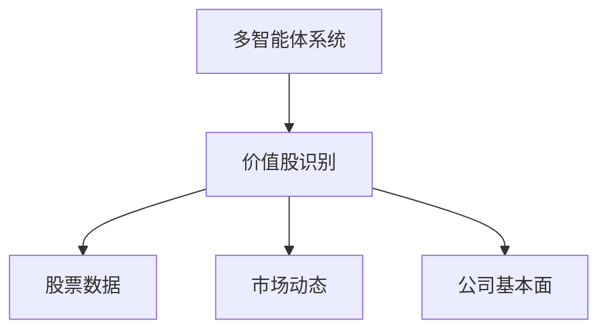
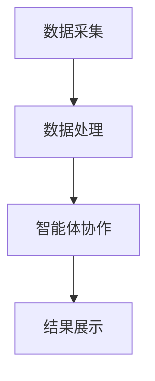

                 

# AI多智能体如何提升对新兴市场价值股的识别

## 关键词：AI多智能体，新兴市场，价值股识别，深度强化学习，系统架构，金融数据分析

## 摘要：本文探讨AI多智能体在新兴市场价值股识别中的应用，分析其算法原理、系统架构，并通过实战案例展示其优势，提出未来研究方向。

---

# 第一部分：AI多智能体与新兴市场价值股识别基础

## 第1章：AI多智能体与价值股识别概述

### 1.1 AI多智能体系统的基本概念
多智能体系统由多个智能体组成，通过协作完成复杂任务。其特点包括分布式、协作性和自主性。

### 1.2 新兴市场价值股识别的挑战与机遇
新兴市场波动大，数据复杂，但蕴含高增长潜力。AI多智能体能处理海量数据，识别潜在价值股。

### 1.3 多智能体系统如何赋能价值股识别
通过分布式计算和协作学习，多智能体系统提高数据处理效率和准确性。

## 第2章：多智能体系统的核心概念与联系

### 2.1 多智能体系统的核心原理
包括智能体间的通信与协作，共同完成复杂任务。

### 2.2 多智能体系统与价值股识别的关系
通过分析市场动态、公司基本面，多智能体系统辅助识别价值股。

### 2.3 核心概念对比
| 属性 | 多智能体系统 | 价值股识别 |
|------|------------|------------|
| 输入 | 市场数据 | 股票数据 |
| 输出 | 策略建议 | 价值股列表 |
| 关键词 | 智能体协作 | 财务指标 |

### 2.4 ER实体关系图

## 第3章：多智能体协同学习算法原理

### 3.1 基本原理
多智能体协同学习通过智能体间的协作，提升整体性能。

### 3.2 基于DRL的算法
使用深度强化学习，通过策略网络和价值网络优化决策。

### 3.3 数学模型
多智能体系统中的动作空间和奖励函数：

$$ R = \sum_{i=1}^{n} r_i $$

### 3.4 实例分析
智能体协作识别价值股，避免单点故障，提高准确率。

---

# 第二部分：系统架构与项目实战

## 第4章：系统架构设计

### 4.1 功能模块设计
包括数据采集、处理、分析、展示模块。

### 4.2 系统架构图

### 4.3 接口设计
API接口实现数据交互，使用JSON格式传递数据。

## 第5章：项目实战

### 5.1 环境安装
安装Python、TensorFlow、Keras等库。

### 5.2 核心功能实现
编写数据处理、智能体协作的代码，训练模型。

### 5.3 案例分析
分析新兴市场数据，识别价值股，验证模型效果。

---

# 第三部分：总结与展望

## 第6章：小结
AI多智能体提升价值股识别的准确性，带来投资机会。

## 第7章：未来研究方向
优化算法、扩展数据源、提升系统实时性。

---

通过以上结构，文章系统地介绍了AI多智能体在新兴市场中的应用，从基础概念到算法实现，再到系统设计，为读者提供了全面的知识框架。

