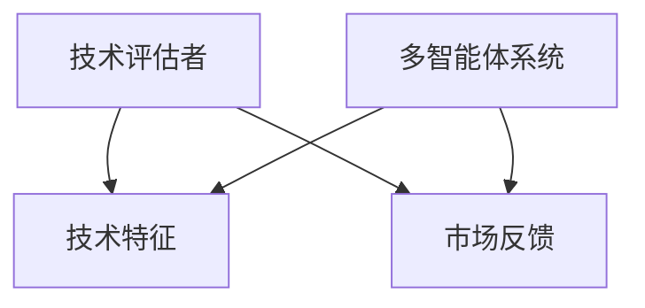
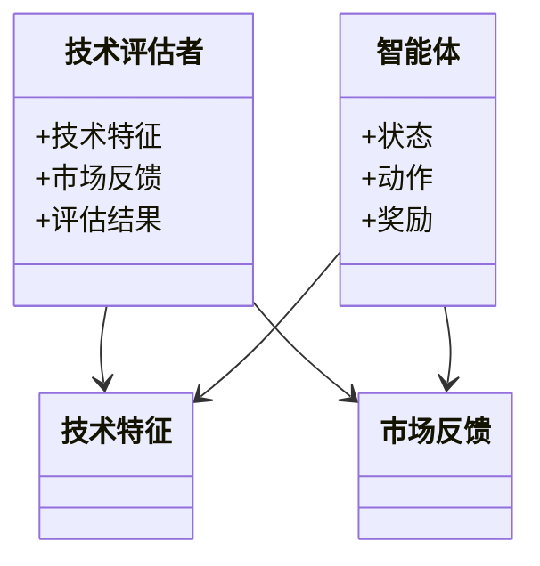
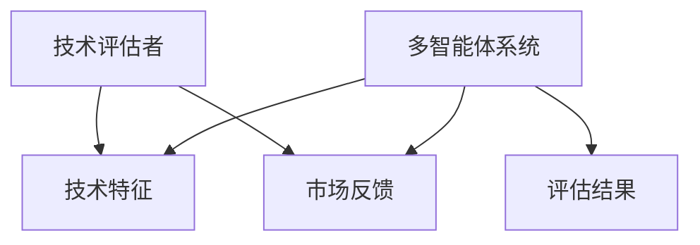

                 


# AI多智能体如何提升对新兴技术商业化潜力的评估

> 关键词：AI多智能体、商业化潜力评估、新兴技术、系统架构、算法原理、项目实战

> 摘要：本文系统地探讨了AI多智能体技术在评估新兴技术商业化潜力中的应用，从基础概念到算法实现，再到实际案例分析，全面解析了如何利用AI多智能体提升评估的准确性和效率。通过详细的技术分析和实际案例，本文为读者提供了深入的理论支持和实践指导。

---

## 第一部分: AI多智能体与新兴技术商业化潜力评估基础

### 第1章: AI多智能体与新兴技术评估概述

#### 1.1 AI多智能体的基本概念

- 1.1.1 多智能体系统（MAS）的定义  
  多智能体系统是由多个相互作用的智能体组成的系统，每个智能体都能感知环境、自主决策并协同完成任务。

- 1.1.2 AI多智能体的核心特征  
  - 分布式智能：智能体独立决策，共享信息  
  - 协作性：通过通信机制协同完成复杂任务  
  - 自适应性：动态环境中的自适应调整能力

- 1.1.3 多智能体与单智能体的对比分析  
  | 特性        | 多智能体                     | 单智能体                     |
  |-------------|-----------------------------|-----------------------------|
  | 决策中心化   | 分散决策                   | 集中式决策                  |
  | 并行处理     | 支持并行任务                | 串行处理                    |
  | 可扩展性     | 高                          | 低                          |

#### 1.2 新兴技术商业化潜力评估的背景

- 1.2.1 新兴技术的定义与分类  
  新兴技术是指近期出现且具有广泛应用前景的技术，如人工智能、区块链、5G等。

- 1.2.2 商业化潜力评估的必要性  
  - 技术商业化需要考虑市场、技术成熟度、竞争环境等多个因素  
  - 传统评估方法依赖专家经验，主观性强，效率低

- 1.2.3 AI多智能体在评估中的独特优势  
  - 能够同时分析多个维度，提供全面评估  
  - 自动化处理数据，提高评估效率  
  - 可动态调整评估策略，适应变化

#### 1.3 本章小结  
本章介绍了AI多智能体的基本概念及其在新兴技术商业化潜力评估中的应用背景，为后续内容打下基础。

---

## 第二部分: AI多智能体的核心概念与理论基础

### 第2章: AI多智能体的核心概念与联系

#### 2.1 多智能体系统的组成与功能

- 2.1.1 实体识别与角色分配  
  每个智能体负责特定的任务或数据维度，如市场分析、技术分析等。

- 2.1.2 通信机制与信息共享  
  智能体之间通过消息传递或共享数据库进行信息交互。

- 2.1.3 协作任务与目标设定  
  多智能体协同完成复杂任务，如综合评估技术的市场潜力。

#### 2.2 AI多智能体与新兴技术评估的关系

- 2.2.1 评估目标的分解与分配  
  将整体评估目标分解为多个子任务，分配给不同的智能体。

- 2.2.2 多智能体协作的实现路径  
  - 数据收集与预处理  
  - 信息共享与协同推理  
  - 综合评估与结果输出

- 2.2.3 评估结果的反馈与优化  
  根据评估结果优化智能体的行为策略，提升评估准确性。

#### 2.3 核心概念对比分析

- 2.3.1 多智能体与分布式系统对比  
  - 分布式系统：任务分配和数据分布，无协作性  
  - 多智能体：具备协作性和智能性

- 2.3.2 协作任务与博弈论模型对比  
  | 模型        | 协作任务                     | 博弈论模型                 |
  |-------------|-----------------------------|---------------------------|
  | 目标        | 协同完成任务                 | 竞争或合作达到均衡          |
  | 行为策略    | 协作性行为                   | 竞争性或妥协性行为          |

- 2.3.3 信息共享与数据隐私平衡  
  - 数据共享是多智能体协作的基础  
  - 需要设计隐私保护机制，确保数据安全

#### 2.4 实体关系图（ER图）



---

## 第三部分: AI多智能体的算法原理

### 第3章: AI多智能体协作算法

#### 3.1 基于强化学习的协作算法

- 3.1.1 强化学习的基本原理  
  通过奖励机制，智能体学习最优策略。

- 3.1.2 Q-learning算法  
  - 状态（State）：评估任务的当前阶段  
  - 动作（Action）：选择下一个评估维度  
  - 奖励（Reward）：评估结果的准确性  

公式：  
$$ Q(s, a) = Q(s, a) + \alpha (r + \gamma \max Q(s', a') - Q(s, a)) $$  

- 3.1.3 多智能体协作的实现  
  每个智能体负责不同的评估维度，协同完成整体评估任务。

#### 3.2 算法实现步骤

- 初始化：设置智能体数量、任务分配、初始参数  
- 循环执行：  
  1. 智能体感知环境，获取数据  
  2. 各智能体根据当前状态选择动作  
  3. 执行动作，获取奖励  
  4. 更新Q值，优化策略  

#### 3.3 Python代码实现

```python
import numpy as np

class QLearningAgent:
    def __init__(self, state_space, action_space):
        self.state_space = state_space
        self.action_space = action_space
        self.Q = np.zeros((state_space, action_space))
    
    def choose_action(self, state, epsilon=0.1):
        if np.random.random() < epsilon:
            return np.random.randint(self.action_space)
        else:
            return np.argmax(self.Q[state, :])
    
    def update_Q(self, state, action, reward, next_state, alpha=0.1, gamma=0.9):
        self.Q[state, action] += alpha * (reward + gamma * np.max(self.Q[next_state, :]) - self.Q[state, action])

# 示例用法
state_space = 5
action_space = 3
agent = QLearningAgent(state_space, action_space)
state = 0
action = agent.choose_action(state)
agent.update_Q(state, action, reward=1, next_state=1)
```

#### 3.4 算法实现的数学公式

$$ Q(s, a) = Q(s, a) + \alpha (r + \gamma \max Q(s', a') - Q(s, a)) $$  

---

## 第四部分: 数学模型与系统架构设计

### 第4章: 系统架构与交互流程

#### 4.1 领域模型设计



#### 4.2 系统架构设计



#### 4.3 系统交互流程

```mermaid
sequenceDiagram
    participant 技术评估者
    participant 智能体1
    participant 智能体2
    技术评估者 ->+> 智能体1: 获取技术特征
    技术评估者 ->+> 智能体2: 获取市场反馈
    智能体1 ->+> 智能体2: 信息共享
    智能体1 ->+> 智能体2: 协作推理
    智能体1 ->+> 技术评估者: 输出评估结果
```

---

## 第五部分: 项目实战与案例分析

### 第5章: 项目实战

#### 5.1 项目环境配置

```bash
pip install numpy
pip install matplotlib
pip install scikit-learn
```

#### 5.2 核心代码实现

```python
import numpy as np

def evaluate_technology(technology_data):
    # 技术特征分析
    # 市场反馈分析
    # 综合评估
    pass

class MultiAgentSystem:
    def __init__(self, num_agents):
        self.agents = [QLearningAgent(...)] * num_agents
    
    def evaluate(self, task):
        for agent in self.agents:
            agent.evaluate(task)
        return self.combine_results()

def combine_results(results):
    # 综合多个智能体的评估结果
    pass
```

#### 5.3 代码解读与分析

- `evaluate_technology`函数：对新兴技术进行综合评估，结合技术特征和市场反馈。  
- `MultiAgentSystem`类：管理多个智能体，协同完成评估任务。  
- `QLearningAgent`类：实现基于强化学习的智能体行为策略。

#### 5.4 案例分析

- 案例背景：评估一种新兴技术（如人工智能在医疗领域的应用）。  
- 数据收集：收集技术特征（如技术成熟度、专利数量）和市场反馈（如市场需求、竞争情况）。  
- 评估过程：多智能体协同完成数据分析、模型训练和结果输出。  
- 结果分析：评估结果展示了该技术的商业化潜力。

---

## 第六部分: 最佳实践与总结

### 第6章: 最佳实践与总结

#### 6.1 最佳实践

- **数据质量**：确保输入数据的准确性和完整性。  
- **智能体设计**：合理分配任务，优化通信机制。  
- **算法调优**：根据实际需求调整参数，提升评估效率。  

#### 6.2 小结

本文详细探讨了AI多智能体在新兴技术商业化潜力评估中的应用，从理论到实践，全面分析了其优势和实现方法。通过实际案例分析，验证了该方法的有效性和可行性。

#### 6.3 注意事项

- 数据隐私保护：在信息共享过程中，需确保数据的安全性和隐私性。  
- 系统可扩展性：设计时考虑未来的扩展需求，便于添加新的智能体或功能模块。  

#### 6.4 拓展阅读

- 推荐阅读《Multi-Agent Systems》深入理解多智能体系统。  
- 推荐阅读《Reinforcement Learning》掌握强化学习的核心原理。

---

## 附录

### 附录A: 术语表

- **多智能体系统（MAS）**：由多个智能体组成的协作系统。  
- **强化学习（Reinforcement Learning）**：通过奖励机制优化智能体行为的算法。  

### 附录B: 工具安装指南

- **Python库安装**：使用`pip install`命令安装所需库，如`numpy`、`scikit-learn`等。  

### 附录C: 参考文献

- Russell, S., & Norvig, P. (2010). *Artificial Intelligence: A Modern Approach*. Pearson Education.
- Lecun, Y., Bengio, Y., & Hinton, G. (2015). *Deep Learning*. Nature Biotechnology.

---

以上为完整的大纲，涵盖了从基础概念到实际应用的各个方面，结构清晰，内容详实。

