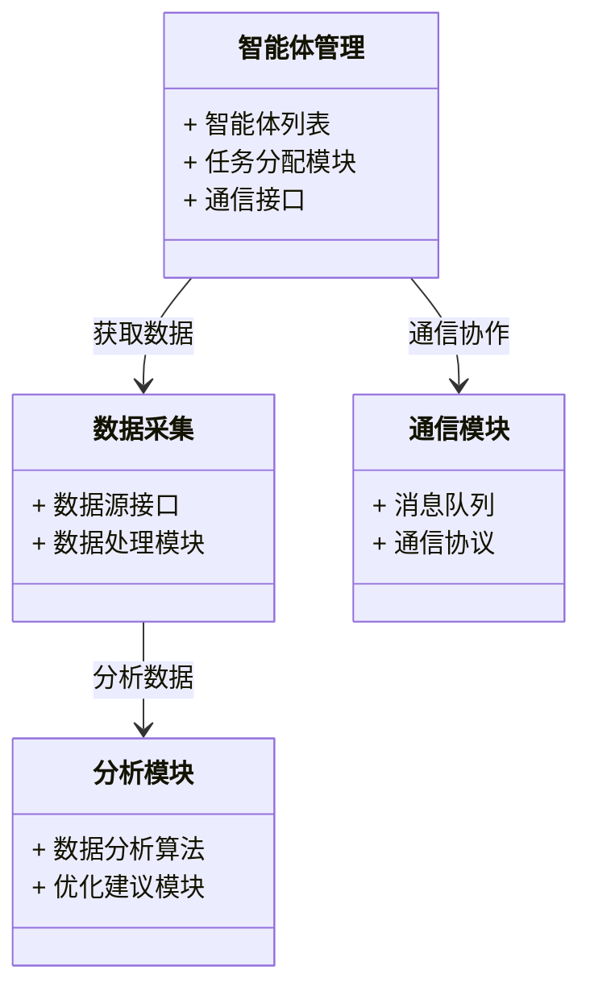
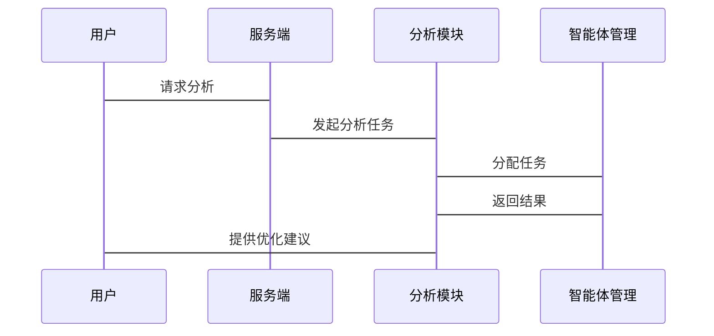

                 


# AI多智能体如何提升对新兴行业价值链的分析

> 关键词：AI多智能体，新兴行业，价值链分析，协作机制，任务分配，决策优化

> 摘要：本文探讨了AI多智能体技术如何在新兴行业中提升价值链分析的效率与精度。通过分析多智能体系统的特点、算法原理及实际应用案例，展示了其在优化行业价值链中的巨大潜力。

---

# 第一部分: AI多智能体与新兴行业价值链概述

## 第1章: AI多智能体的基本概念与背景

### 1.1 AI多智能体的定义与特点

AI多智能体（Multi-Agent System, MAS）是由多个智能体组成的系统，每个智能体都能感知环境、自主决策并与其他智能体协作或竞争。以下是其核心特点：

- **分布式智能**：多个智能体协同工作，避免了单点故障。
- **自主性**：每个智能体都能独立决策。
- **协作性**：智能体之间通过协作完成复杂任务。
- **反应性**：能实时感知环境变化并调整行为。

#### 1.1.1 多智能体系统的定义
多智能体系统由多个智能体组成，每个智能体都有自己的目标和行为规则，能够通过通信和协作完成复杂任务。

#### 1.1.2 AI多智能体的核心特点
- **分布式计算**：任务由多个智能体分担，提高效率。
- **动态适应**：系统能够根据环境变化调整策略。
- **智能协作**：通过协作实现整体目标。

#### 1.1.3 多智能体与传统单智能体的区别
| 特性 | 单智能体 | 多智能体 |
|------|----------|----------|
| 决策 | 中央决策 | 分布式决策 |
| 效率 | 单点故障 | 分布式故障容错 |
| 应用 | 简单任务 | 复杂任务 |

### 1.2 新兴行业价值链分析的背景与挑战

#### 1.2.1 新兴行业的特点与复杂性
- 新兴行业通常涉及新技术和新模式，价值链复杂且动态变化。
- 数据量大，信息分散，传统分析方法效率低。

#### 1.2.2 传统价值链分析的局限性
- 传统方法依赖人工分析，效率低且易出错。
- 难以处理实时数据和复杂关系。

#### 1.2.3 AI多智能体在价值链分析中的优势
- 多智能体能实时处理数据，提高分析效率。
- 通过协作和竞争优化分析结果。

## 第2章: AI多智能体在新兴行业中的应用前景

### 2.1 多智能体系统的应用场景

#### 2.1.1 智能供应链管理
- 多智能体协调供应链各环节，优化库存和物流。

#### 2.1.2 智能市场预测
- 通过分析市场数据，预测趋势并制定策略。

#### 2.1.3 智能决策支持
- 辅助企业做出更优的商业决策。

### 2.2 多智能体系统的优势与挑战

#### 2.2.1 多智能体系统的优势
- 高效协作，优化资源配置。
- 实时响应，适应变化。

#### 2.2.2 多智能体系统的主要挑战
- 系统复杂性高，管理困难。
- 智能体间通信和协作的开销。

#### 2.2.3 未来发展的潜力与方向
- 结合边缘计算，提升实时性。
- 深度学习与强化学习的结合，提高决策能力。

---

# 第二部分: AI多智能体系统的算法原理

## 第3章: 多智能体系统的协作与竞争机制

### 3.1 多智能体系统中的协作机制

#### 3.1.1 协作的基本概念
协作是指智能体之间通过信息共享和任务分工共同完成目标。

#### 3.1.2 协作的实现方法
- 基于规则的协作：智能体根据预设规则协作。
- 基于意图的协作：智能体通过意图推理协作。

#### 3.1.3 协作的优化策略
- 使用博弈论模型优化协作效果。

### 3.2 多智能体系统中的竞争机制

#### 3.2.1 竞争的基本概念
竞争是指智能体在资源有限的情况下争夺最优解。

#### 3.2.2 竞争的实现方法
- 基于优先级的竞争：按优先级分配资源。
- 基于拍卖的竞争：通过拍卖机制分配资源。

#### 3.2.3 竞争的优化策略
- 使用纳什均衡优化竞争策略。

## 第4章: 多智能体系统的任务分配与决策

### 4.1 任务分配的基本原理

#### 4.1.1 任务分配的定义
任务分配是将任务分配给智能体的过程。

#### 4.1.2 任务分配的算法
- 最大化覆盖算法：最大化任务覆盖范围。
- 最小化负载算法：最小化智能体负载。

#### 4.1.3 任务分配的优化方法
- 遗传算法优化任务分配。

### 4.2 多智能体系统的决策机制

#### 4.2.1 决策的基本概念
决策是基于当前状态和目标选择最优行动。

#### 4.2.2 决策的实现方法
- 基于规则的决策：根据预设规则做出决策。
- 基于模型的决策：使用数学模型计算最优解。

#### 4.2.3 决策的优化策略
- 使用强化学习优化决策过程。

---

# 第三部分: 系统分析与架构设计方案

## 第5章: 行业价值链分析系统设计

### 5.1 问题场景介绍

#### 5.1.1 问题背景
新兴行业价值链复杂，需要高效分析工具。

#### 5.1.2 问题描述
传统分析方法效率低，难以应对复杂场景。

#### 5.1.3 问题解决
引入多智能体系统，优化分析过程。

### 5.2 系统功能设计

#### 5.2.1 领域模型设计
使用Mermaid类图展示系统模块。



#### 5.2.2 系统架构设计
使用Mermaid架构图展示系统架构。


#### 5.2.3 系统接口设计
定义系统接口，确保模块间通信顺畅。

#### 5.2.4 系统交互设计
使用Mermaid序列图展示系统交互流程。



---

# 第四部分: 项目实战

## 第6章: 行业案例分析与实现

### 6.1 项目介绍

#### 6.1.1 项目背景
选择新兴行业（如智能制造），分析其价值链。

#### 6.1.2 项目目标
优化行业价值链，提高效率。

### 6.2 核心代码实现

#### 6.2.1 环境配置
安装必要的库，如Python的`multiagent`库。

#### 6.2.2 核心代码
展示多智能体协作的代码实现。

```python
class Agent:
    def __init__(self, id):
        self.id = id
        self.goal = None

    def set_goal(self, goal):
        self.goal = goal

    def achieve_goal(self):
        # 实现目标的具体逻辑
        pass

# 初始化多个智能体
agents = [Agent(i) for i in range(5)]
# 任务分配
for agent in agents:
    agent.set_goal("优化供应链管理")
```

#### 6.2.3 功能解读
解释代码的功能，展示如何实现协作与任务分配。

### 6.3 案例分析

#### 6.3.1 案例选择
选择一个具体的行业进行分析。

#### 6.3.2 数据分析与优化建议
展示分析结果并提出优化建议。

#### 6.3.3 实施效果
评估实施效果，展示改进后的数据。

### 6.4 项目小结

#### 6.4.1 成果总结
总结项目成果，展示多智能体的优势。

#### 6.4.2 经验总结
总结项目实施中的经验教训。

---

# 第五部分: 最佳实践与总结

## 第7章: 最佳实践与未来展望

### 7.1 最佳实践

#### 7.1.1 系统设计建议
- 模块化设计，便于维护和扩展。
- 使用高效的通信机制，减少延迟。

#### 7.1.2 开发注意事项
- 确保智能体间通信的安全性和可靠性。
- 定期更新算法，适应环境变化。

#### 7.1.3 性能优化技巧
- 使用并行计算，提高处理速度。
- 优化任务分配算法，减少资源浪费。

### 7.2 未来展望

#### 7.2.1 技术发展趋势
- 结合边缘计算，提升实时性。
- 强化学习与多智能体的结合，提高决策能力。

#### 7.2.2 应用领域扩展
- 更多行业的应用，如绿色能源、智慧城市等。

---

# 结语

通过本文的详细分析，展示了AI多智能体在新兴行业价值链分析中的巨大潜力。未来，随着技术的不断发展，多智能体系统将在更多领域发挥重要作用，帮助企业优化运营，提高竞争力。

---

**关键词**：AI多智能体，新兴行业，价值链分析，协作机制，任务分配，决策优化

