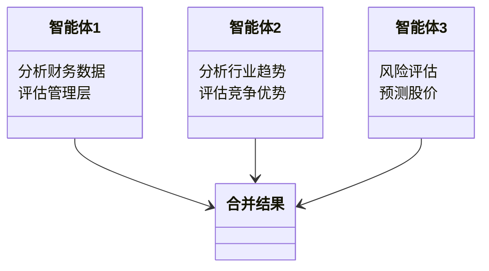
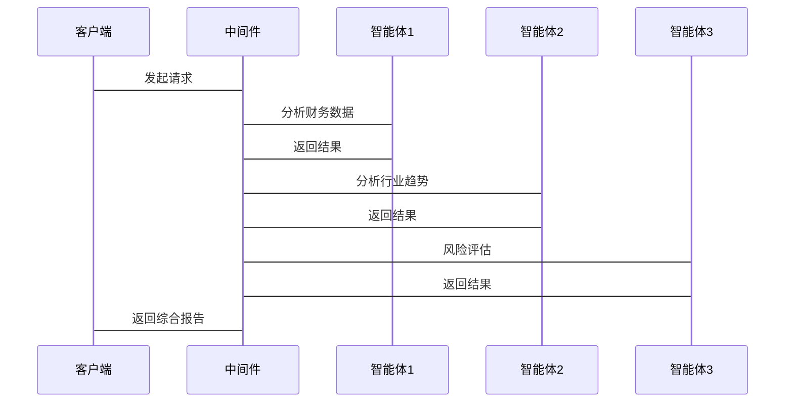

                 


# AI多智能体如何改进传统的价值投资尽职调查流程

## 关键词：AI多智能体、价值投资、尽职调查流程、金融分析、分布式强化学习、协同优化、系统架构设计

## 摘要：本文探讨AI多智能体技术如何改进传统价值投资的尽职调查流程。通过分析多智能体系统的算法原理、系统架构和实际案例，展示AI多智能体如何通过协同优化和高效数据分析提升投资决策的准确性和效率，减少人为错误，增强投资策略的科学性。

---

# 第一部分：AI多智能体与价值投资尽职调查的背景

## 第1章：价值投资与传统尽职调查流程

### 1.1 价值投资的核心理念

#### 1.1.1 价值投资的定义与历史发展
价值投资是一种投资策略，强调以低于市场价值的价格购买优质资产。其核心在于识别被市场低估的企业，通过长期持有实现资本增值。该理念由本杰明·格雷厄姆和戴维·多德提出，经过百年发展，成为投资领域的重要流派。

#### 1.1.2 价值投资中的尽职调查流程
尽职调查是价值投资的关键步骤，包括对企业财务状况、管理层质量、行业地位、竞争优势等多方面的深入分析。传统方法依赖人工分析，效率低下，容易受主观因素影响。

#### 1.1.3 尽职调查在投资决策中的作用
尽职调查帮助投资者识别潜在风险和机会，确保投资决策的科学性和可靠性。它是价值投资成功与否的关键因素。

### 1.2 传统尽职调查的局限性

#### 1.2.1 传统尽职调查的主要步骤
传统尽职调查包括收集数据、分析财务报表、评估管理层、行业分析等步骤。这些步骤繁琐且耗时，容易因人为疏忽导致遗漏关键信息。

#### 1.2.2 传统方法的效率问题
传统方法依赖人工分析，效率低下，难以处理大量数据。分析结果受分析师经验限制，可能存在偏差。

#### 1.2.3 数据分析的局限性
传统方法在处理非结构化数据（如文本、图像）方面能力有限，难以全面捕捉企业信息。

### 1.3 AI多智能体技术的引入

#### 1.3.1 多智能体系统的定义
多智能体系统是指多个智能体协同工作，通过信息共享和协作完成复杂任务的系统。每个智能体负责特定任务，共同实现整体目标。

#### 1.3.2 AI多智能体的优势
AI多智能体能够高效处理大量数据，识别复杂模式，提供精准分析结果。多个智能体协同工作，显著提高分析效率和准确性。

#### 1.3.3 多智能体在金融领域的应用潜力
多智能体系统可以应用于金融数据分析、风险评估、投资组合优化等领域，为金融决策提供支持。

### 1.4 本章小结
本章介绍了价值投资的核心理念和传统尽职调查的局限性，阐述了AI多智能体技术的引入及其在金融领域的应用潜力。

---

## 第2章：AI多智能体的核心概念与技术

### 2.1 多智能体系统的基本原理

#### 2.1.1 多智能体系统的架构
多智能体系统由多个智能体组成，每个智能体负责特定任务。系统通过通信机制共享信息，实现协同决策。

#### 2.1.2 智能体之间的通信机制
智能体之间通过消息传递、共享数据库等方式进行通信，确保信息同步和协作。

#### 2.1.3 多智能体系统的协调与协作
系统需要设计有效的协调机制，确保多个智能体协同工作，避免冲突和资源浪费。

### 2.2 AI多智能体在金融分析中的应用

#### 2.2.1 数据分析与模式识别
AI多智能体能够高效分析大量数据，识别市场趋势和潜在风险。

#### 2.2.2 风险评估与预测
通过协同分析，AI多智能体能够更准确地评估投资风险，提供可靠的预测结果。

#### 2.2.3 多智能体协同优化
多个智能体协同优化投资组合，实现风险与收益的最佳平衡。

### 2.3 多智能体系统的算法基础

#### 2.3.1 分布式强化学习
分布式强化学习算法允许多个智能体在不同环境中学习，通过共享经验提高整体性能。

#### 2.3.2 联合学习
联合学习算法通过多个智能体协同学习，提升模型的泛化能力和预测精度。

#### 2.3.3 跨智能体决策机制
智能体之间通过协商和协作，共同制定最优决策。

### 2.4 本章小结
本章详细介绍了AI多智能体的核心概念和技术，重点阐述了其在金融分析中的应用及其算法基础。

---

## 第3章：AI多智能体的算法原理与实现

### 3.1 分布式强化学习算法

#### 3.1.1 分布式强化学习的基本概念
分布式强化学习是指多个智能体在不同的环境中独立学习，通过共享经验和策略优化整体性能。

#### 3.1.2 分布式强化学习的实现流程
1. 初始化多个智能体。
2. 每个智能体在环境中学习，更新策略。
3. 定期同步智能体之间的经验。
4. 优化整体策略。

#### 3.1.3 分布式强化学习的优缺点
优点：提高学习效率，增强泛化能力；缺点：需要解决通信延迟和同步问题。

### 3.2 联合学习算法

#### 3.2.1 联合学习的定义与特点
联合学习是指多个智能体协同学习，共享数据和模型参数，提升整体性能。

#### 3.2.2 联合学习的实现步骤
1. 初始化智能体网络。
2. 每个智能体在本地数据上训练模型。
3. 智能体之间交换模型参数，更新全局模型。

#### 3.2.3 联合学习的实际案例
例如，在股票价格预测中，多个智能体分别分析不同市场数据，协同训练提高预测精度。

### 3.3 跨智能体决策算法

#### 3.3.1 跨智能体决策的基本原理
多个智能体通过协商和协作，共同制定最优决策。

#### 3.3.2 跨智能体决策的实现流程
1. 收集各智能体的决策建议。
2. 通过协商机制达成共识。
3. 执行最优决策。

#### 3.3.3 跨智能体决策的优化方法
采用投票机制、加权平均等方式优化决策过程。

### 3.4 本章小结
本章详细讲解了AI多智能体的算法原理，重点介绍了分布式强化学习、联合学习和跨智能体决策算法的实现及其应用。

---

## 第4章：系统分析与架构设计方案

### 4.1 问题场景介绍

#### 4.1.1 价值投资尽职调查的场景描述
在价值投资中，投资者需要对多个企业进行全面分析，包括财务数据、行业趋势、管理层能力等。

#### 4.1.2 AI多智能体在尽职调查中的应用目标
通过AI多智能体技术，提高数据分析效率和准确性，辅助投资者制定科学的投资决策。

#### 4.1.3 系统的预期功能与性能指标
系统预期功能包括数据采集、分析、预测和决策支持；性能指标包括处理速度、准确率和响应时间。

### 4.2 系统功能设计

#### 4.2.1 领域模型设计（使用 mermaid）



#### 4.2.2 系统架构设计（使用 mermaid）


#### 4.2.3 系统接口设计
系统接口包括数据输入接口、智能体通信接口和用户交互接口，确保各部分协同工作。

#### 4.2.4 系统交互设计（使用 mermaid）



### 4.3 本章小结
本章通过系统分析与架构设计，展示了AI多智能体在价值投资尽职调查中的应用，确保系统各部分协同工作，提高整体效率和准确性。

---

## 第5章：项目实战

### 5.1 环境安装与配置

#### 5.1.1 安装Python与相关库
安装Python 3.8及以上版本，安装TensorFlow、Keras、Scikit-learn等库。

#### 5.1.2 安装AI框架
安装多智能体框架，如Ray、PettingZoo等。

#### 5.1.3 配置开发环境
配置IDE，如PyCharm或VS Code，确保环境变量配置正确。

### 5.2 系统核心实现

#### 5.2.1 实现分布式强化学习算法
编写代码实现分布式强化学习，训练多个智能体协同工作。

#### 5.2.2 实现联合学习算法
编写代码实现联合学习，多个智能体协同训练模型。

#### 5.2.3 实现跨智能体决策机制
编写代码实现跨智能体决策，通过协商机制制定最优决策。

### 5.3 代码实现与解读

#### 5.3.1 分布式强化学习代码示例
```python
import ray
from ray.tune import register_env, run_experiments

@ray.remote
class MultiAgentEnv:
    def __init__(self):
        # 初始化环境
        pass
    def step(self, action):
        # 环境步骤
        return
    def reset(self):
        # 重置环境
        return

ray.init()
register_env("multiagent_env", MultiAgentEnv)
run_experiments({
    "training": {
        "env": "multiagent_env",
        "num_respid": 0,
        "num_episodes": 1000,
        "max_episode_len": 100,
    }
})
```

#### 5.3.2 联合学习代码示例
```python
import numpy as np
from sklearn.ensemble import RandomForestRegressor

class Agent:
    def __init__(self, data):
        self.model = RandomForestRegressor()
        self.data = data
        self.model.fit(self.data, targets)

    def predict(self, input):
        return self.model.predict(input)

# 初始化多个Agent
agents = [Agent(data1), Agent(data2), Agent(data3)]

# 联合预测
def联合预测(input):
    predictions = [agent.predict(input) for agent in agents]
    return np.mean(predictions)

print(联合预测(input_data))
```

### 5.4 实际案例分析与详细解读
通过实际案例展示AI多智能体在价值投资尽职调查中的应用，分析其效果和优势。

### 5.5 项目小结
本章通过项目实战，展示了AI多智能体技术的实际应用，验证了其在价值投资尽职调查中的有效性。

---

## 第6章：最佳实践与注意事项

### 6.1 最佳实践

#### 6.1.1 系统设计中的注意事项
确保系统架构合理，避免通信瓶颈和数据冗余。

#### 6.1.2 算法实现中的技巧
选择合适的算法和参数，确保训练效率和模型性能。

#### 6.1.3 系统优化建议
通过并行计算、分布式存储等方式优化系统性能。

### 6.2 小结
本章总结了AI多智能体在实际应用中的最佳实践和注意事项，帮助读者更好地实施相关系统。

### 6.3 注意事项
在实施过程中，需注意数据隐私、系统稳定性和智能体协作效果等问题。

### 6.4 拓展阅读
推荐相关书籍和论文，供读者深入学习AI多智能体技术。

---

## 第7章：未来展望与挑战

### 7.1 未来发展趋势

#### 7.1.1 多智能体技术的进一步发展
随着AI技术进步，多智能体系统将更加智能化和协同化。

#### 7.1.2 在金融领域的应用扩展
多智能体技术将在更多金融场景中得到应用，如实时交易、风险管理等。

#### 7.1.3 新兴技术的融合
多智能体技术将与区块链、边缘计算等技术深度融合，推动金融创新。

### 7.2 当前面临的主要挑战

#### 7.2.1 技术挑战
包括算法优化、通信效率、计算资源分配等问题。

#### 7.2.2 数据挑战
涉及数据隐私、数据质量和数据量等问题。

#### 7.2.3 应用挑战
包括系统集成、用户接受度和法规合规等问题。

### 7.3 本章小结
本章展望了AI多智能体技术的未来发展趋势，并分析了当前面临的主要挑战。

---

## 结语

通过本文的详细探讨，我们看到了AI多智能体技术在改进价值投资尽职调查流程中的巨大潜力。随着技术的发展和应用场景的扩展，AI多智能体将在金融领域发挥越来越重要的作用，为投资者提供更科学、更高效的决策支持。

--- 

## 致谢

感谢读者的耐心阅读，感谢技术专家和同仁们的指导与支持。

--- 

## 参考文献

（此处列出相关文献和资料来源）

