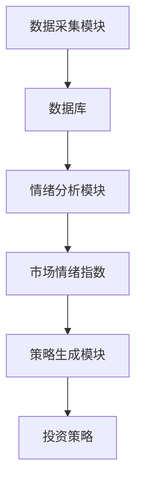
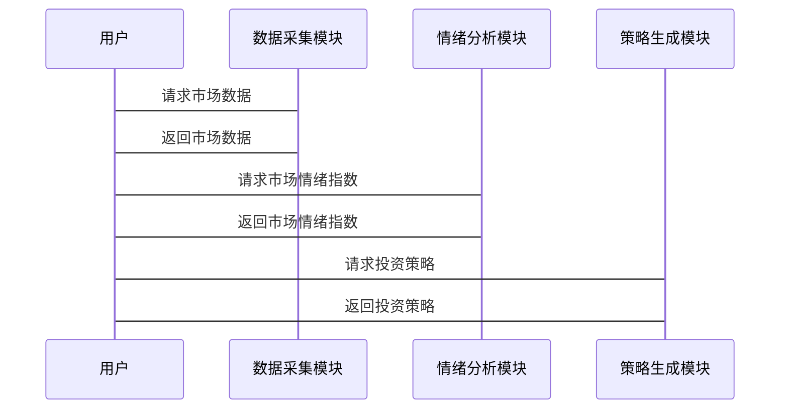

                 


# AI多智能体提升价值投资的市场情绪判断

## 关键词：AI多智能体，价值投资，市场情绪，协同学习，强化学习，金融市场分析

## 摘要：本文探讨了AI多智能体在价值投资中的应用，特别是如何利用多智能体系统提升市场情绪判断的准确性。通过分析多智能体协同学习的算法原理、系统架构设计以及实际项目案例，展示了如何利用AI技术优化投资决策过程，为投资者提供更精准的市场情绪分析工具。

---

## 第一部分: 背景介绍与核心概念

---

### 第1章: AI多智能体与价值投资的结合

#### 1.1 价值投资与市场情绪的定义

##### 1.1.1 价值投资的核心理念

价值投资是一种投资策略，强调通过分析企业的基本面（如财务状况、行业地位、竞争优势等）来判断其内在价值。投资者在市场中寻找被低估的股票，长期持有以实现资本增值。传统价值投资依赖于对财务报表的分析和行业趋势的判断，但随着市场的复杂化和信息量的爆炸式增长，单纯依靠人工分析已难以应对快速变化的市场环境。

##### 1.1.2 市场情绪的定义与分类

市场情绪是指投资者在市场中的整体情绪状态，通常表现为乐观或悲观。市场情绪可以通过多种指标来衡量，如波动率、交易量、投资者情绪指数（如CBOE恐慌指数）等。市场情绪对资产价格有显著影响，尤其是在短期市场波动中。

##### 1.1.3 价值投资与市场情绪的关系

虽然价值投资强调长期基本面分析，但市场情绪对短期价格波动有重要影响。忽视市场情绪的短期影响可能导致投资决策失误，尤其是在市场恐慌或狂热时。因此，将市场情绪分析与价值投资相结合，可以帮助投资者更好地捕捉市场机会和规避风险。

---

#### 1.2 AI多智能体系统的基本概念

##### 1.2.1 多智能体系统的定义

多智能体系统（Multi-Agent System, MAS）是由多个相互作用的智能体组成的系统，这些智能体能够感知环境、协作解决问题并实现共同目标。每个智能体都有自己的目标、知识和决策机制，通过通信和协作完成复杂的任务。

##### 1.2.2 多智能体系统的核心特点

- **分布性**：多个智能体独立运行，各自负责不同的任务。
- **协作性**：智能体之间通过通信和协作完成复杂任务。
- **反应性**：智能体能够根据环境变化动态调整行为。
- **自主性**：智能体能够自主决策，无需外部干预。

##### 1.2.3 AI多智能体系统的优势

- **分布式计算能力**：多个智能体可以同时处理大量数据，提高计算效率。
- **协作优化**：通过协作，智能体能够互补优势，提高整体性能。
- **适应性**：智能体能够动态调整策略，适应复杂多变的环境。

---

#### 1.3 问题背景与目标

##### 1.3.1 传统市场情绪分析的局限性

传统市场情绪分析主要依赖于统计方法和专家经验，存在以下问题：
- 数据来源单一，难以覆盖多维度信息。
- 分析结果主观性较强，缺乏客观性。
- 对实时数据的处理能力有限，难以应对高频交易的需求。

##### 1.3.2 AI多智能体在市场情绪分析中的优势

- **数据处理能力强**：多智能体系统可以同时处理海量数据，提高分析效率。
- **协作优化**：通过智能体之间的协作，可以综合多方面的信息，提高分析的准确性。
- **动态适应性**：智能体能够实时调整分析策略，适应市场变化。

##### 1.3.3 本书的研究目标与范围

本书旨在探讨如何利用AI多智能体系统提升价值投资中的市场情绪判断能力。研究目标包括：
- 构建基于多智能体的市场情绪分析模型。
- 探讨多智能体系统在价值投资中的应用方法。
- 提供实际案例，验证模型的有效性。

---

### 第2章: 核心概念与联系

#### 2.1 多智能体系统的核心原理

##### 2.1.1 多智能体系统的组成

- **智能体**：每个智能体负责特定任务，如数据采集、情绪分析、策略生成等。
- **通信机制**：智能体之间通过通信协议交换信息。
- **协作机制**：智能体通过协作完成复杂任务，优化整体性能。

##### 2.1.2 多智能体系统之间的协作机制

- **分布式计算**：多个智能体协同完成任务，提高计算效率。
- **任务分配**：根据智能体的能力分配任务，优化资源利用。
- **信息共享**：智能体之间共享信息，提高整体分析能力。

##### 2.1.3 多智能体系统的通信协议

- **消息传递**：智能体通过消息传递交换信息。
- **协议设计**：设计高效的通信协议，减少信息传输延迟。
- **安全性**：确保通信过程中的数据安全。

---

#### 2.2 市场情绪分析的数学模型

##### 2.2.1 情感分类的基本模型

- **基于统计的方法**：如朴素贝叶斯模型，适用于简单的分类任务。
- **基于深度学习的方法**：如卷积神经网络（CNN）和循环神经网络（RNN），适用于复杂的情感分析任务。

##### 2.2.2 基于多智能体的市场情绪分析模型

- **分布式情感表示**：每个智能体负责特定的情感维度，如乐观、悲观、中性等。
- **多智能体协作**：通过协作，综合各智能体的情感分析结果，得出整体市场情绪。

##### 2.2.3 模型的输入输出关系

- **输入**：市场数据（如股票价格、交易量、新闻标题等）。
- **输出**：市场情绪指数（如乐观指数、悲观指数）。

---

#### 2.3 价值投资与市场情绪的关联

##### 2.3.1 价值投资中的情绪偏差

- **过度乐观**：投资者在市场繁荣时可能过于乐观，导致高估资产价值。
- **过度悲观**：投资者在市场恐慌时可能过于悲观，导致低估资产价值。

##### 2.3.2 市场情绪对投资决策的影响

- **短期波动**：市场情绪影响短期资产价格波动。
- **长期趋势**：市场情绪可能影响长期资产价格走势。

##### 2.3.3 多智能体系统在价值投资中的应用

- **实时监控**：实时监控市场情绪变化，捕捉投资机会。
- **风险预警**：通过市场情绪分析，提前预警潜在风险。

---

## 第二部分: 算法原理讲解

---

### 第3章: 多智能体协同学习算法

#### 3.1 联邦学习（Federated Learning）

##### 3.1.1 联邦学习的基本原理

联邦学习是一种分布式学习方法，多个智能体在本地数据上训练模型，通过通信协议共享模型参数，最终形成一个全局模型。

##### 3.1.2 联邦学习的应用场景

- **数据隐私保护**：适用于数据不能集中存储的场景。
- **分布式计算**：适用于大规模数据场景。

##### 3.1.3 联邦学习的实现步骤

1. **初始化**：每个智能体初始化本地模型。
2. **本地训练**：智能体在本地数据上训练模型。
3. **模型聚合**：智能体将本地模型参数上传到中心服务器，服务器聚合所有模型参数，形成全局模型。
4. **模型分发**：服务器将全局模型分发给所有智能体，更新本地模型。

---

#### 3.2 联合学习（Collaborative Learning）

##### 3.2.1 联合学习的基本原理

联合学习是一种多智能体协作学习方法，多个智能体在不同数据集上训练模型，通过协作优化模型性能。

##### 3.2.2 联合学习的应用场景

- **数据分布不均**：适用于数据分布不均的场景。
- **模型优化**：适用于需要优化模型性能的场景。

##### 3.2.3 联合学习的实现步骤

1. **任务分配**：根据智能体的能力分配任务。
2. **本地训练**：智能体在分配的任务数据上训练模型。
3. **模型协作**：智能体之间协作优化模型，共享模型参数。
4. **模型更新**：更新全局模型，提高整体性能。

---

#### 3.3 强化学习的市场情绪预测

##### 3.3.1 强化学习的基本原理

强化学习是一种基于奖励机制的学习方法，智能体通过与环境交互，学习最优策略。

##### 3.3.2 强化学习在市场情绪预测中的应用

- **状态空间**：市场数据（如价格、交易量等）。
- **动作空间**：智能体的决策（如买入、卖出、持有）。
- **奖励机制**：根据预测结果，智能体获得奖励或惩罚。

##### 3.3.3 强化学习的实现步骤

1. **环境定义**：定义市场环境，包括市场数据和规则。
2. **智能体初始化**：初始化智能体的参数和策略。
3. **与环境交互**：智能体根据当前状态做出决策，与环境交互。
4. **更新策略**：根据奖励机制，更新智能体的策略，优化预测结果。

---

## 第三部分: 系统分析与架构设计

---

### 第4章: 系统分析与架构设计

#### 4.1 问题场景介绍

- **目标**：构建一个基于多智能体的市场情绪分析系统，辅助投资者进行价值投资。
- **场景**：投资者需要实时监控市场情绪，捕捉投资机会。

#### 4.2 项目介绍

- **项目名称**：AI多智能体市场情绪分析系统。
- **项目目标**：提升市场情绪分析的准确性和实时性，辅助投资者做出明智的投资决策。

#### 4.3 系统功能设计

##### 4.3.1 领域模型设计

- **数据采集模块**：采集市场数据，如股票价格、新闻标题等。
- **情绪分析模块**：分析市场数据，得出市场情绪指数。
- **策略生成模块**：根据市场情绪指数，生成投资策略。

##### 4.3.2 系统架构设计

1. **数据采集模块**：负责采集市场数据，存储在数据库中。
2. **情绪分析模块**：对市场数据进行情感分类，得出市场情绪指数。
3. **策略生成模块**：根据市场情绪指数，生成投资策略。

#### 4.4 系统架构图



#### 4.5 系统接口设计

- **数据接口**：与数据源（如股票交易所）对接，获取市场数据。
- **用户接口**：提供用户友好的界面，展示市场情绪指数和投资策略。

#### 4.6 系统交互流程图



---

## 第四部分: 项目实战

---

### 第5章: 项目实战

#### 5.1 环境安装

```bash
# 安装Python
# 安装必要的库
pip install numpy pandas scikit-learn tensorflow
```

#### 5.2 核心实现源代码

##### 5.2.1 数据采集模块

```python
import requests
import json

def get_market_data(api_key):
    url = f"https://api.example.com/market-data?api_key={api_key}"
    response = requests.get(url)
    return json.loads(response.text)
```

##### 5.2.2 情绪分析模块

```python
from tensorflow.keras.models import Sequential
from tensorflow.keras.layers import Dense, LSTM

def build_model(input_dim):
    model = Sequential()
    model.add(LSTM(units=50, input_shape=(1, input_dim)))
    model.add(Dense(1, activation='sigmoid'))
    model.compile(loss='binary_crossentropy', optimizer='adam', metrics=['accuracy'])
    return model
```

##### 5.2.3 策略生成模块

```python
def generate_strategy(market_sentiment):
    if market_sentiment > 0.7:
        return "买入"
    elif market_sentiment < 0.3:
        return "卖出"
    else:
        return "持有"
```

#### 5.3 实际案例分析

##### 5.3.1 案例背景

假设我们有一个股票市场数据集，包括股票价格、交易量和新闻标题。我们需要训练一个模型，根据这些数据预测市场情绪。

##### 5.3.2 数据预处理

```python
import pandas as pd
import numpy as np

data = pd.read_csv("market_data.csv")
data = data.dropna()
data = (data - data.mean()) / data.std()  # 标准化处理
```

##### 5.3.3 模型训练

```python
model = build_model(input_dim=data.shape[1])
model.fit(x_train, y_train, epochs=100, batch_size=32)
```

##### 5.3.4 结果分析

```python
y_pred = model.predict(x_test)
accuracy = model.evaluate(x_test, y_test)[1]
print(f"准确率: {accuracy}")
```

---

## 第五部分: 总结与展望

---

### 第6章: 总结与展望

#### 6.1 小结

本文探讨了AI多智能体在价值投资中的应用，特别是如何利用多智能体系统提升市场情绪判断的准确性。通过分析多智能体协同学习的算法原理、系统架构设计以及实际项目案例，展示了如何利用AI技术优化投资决策过程。

#### 6.2 注意事项

- 数据隐私保护：在实际应用中，需要注意数据隐私保护，确保数据安全。
- 模型优化：需要不断优化模型，提高预测准确率。
- 系统维护：需要定期维护系统，确保系统稳定运行。

#### 6.3 拓展阅读

- 《多智能体系统》：深入探讨多智能体系统的理论与应用。
- 《强化学习实战》：学习强化学习的实现方法与应用案例。

---

### 结语

随着AI技术的不断发展，多智能体系统在金融领域的应用前景广阔。通过不断研究和实践，我们可以进一步提升市场情绪分析的准确性和实时性，为投资者提供更精准的投资决策支持。

