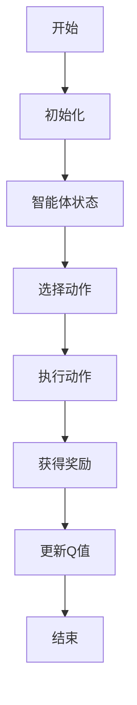
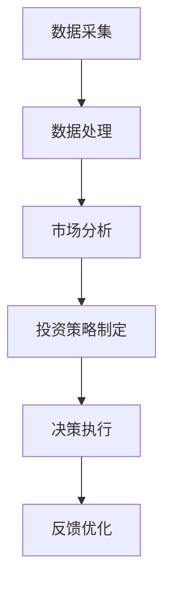
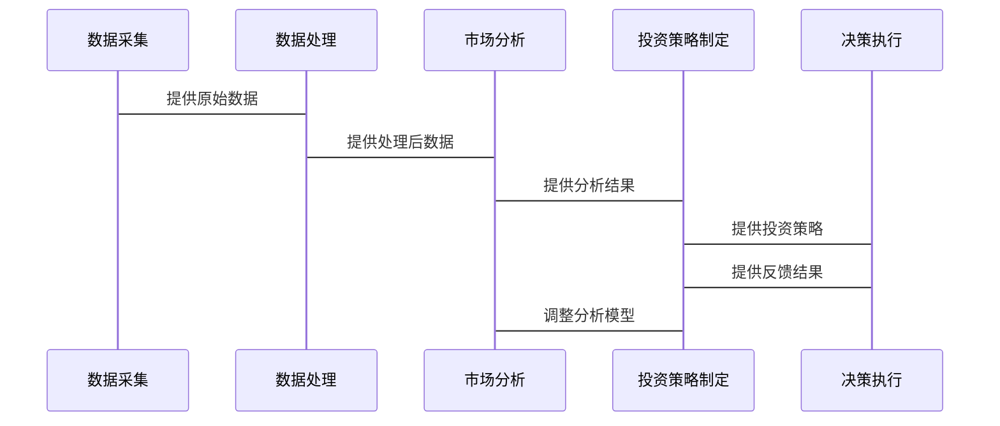

                 


# AI多智能体系统优化价值投资决策链

> 关键词：AI多智能体系统、价值投资、决策链优化、协同决策、投资组合优化、分布式计算

> 摘要：本文探讨如何利用AI多智能体系统优化价值投资的决策链。通过分析传统投资决策的局限性，提出多智能体协同优化的方法，详细讲解算法原理、系统架构设计、项目实战和最佳实践，为价值投资提供高效解决方案。

---

# 第一部分: AI多智能体系统与价值投资决策链的背景介绍

## 第1章: 问题背景与核心概念

### 1.1 问题背景

#### 1.1.1 传统投资决策链的局限性
传统的价值投资决策链依赖于人工分析和经验判断，存在效率低、决策周期长、信息处理复杂等问题。投资者需要处理海量数据，但决策过程缺乏系统性和实时性，容易受到主观因素影响。

#### 1.1.2 多智能体系统在投资决策中的优势
多智能体系统通过分布式计算和协同优化，能够高效处理复杂数据，快速生成决策建议。多个智能体分别负责不同的任务，如数据收集、市场分析、风险评估等，最终协同制定最优投资策略。

#### 1.1.3 价值投资决策链的优化目标
优化目标是通过多智能体系统的协同作用，提升决策链的效率和准确性，降低投资风险，提高投资回报率。

### 1.2 核心概念与定义

#### 1.2.1 多智能体系统的定义
多智能体系统（Multi-Agent System, MAS）由多个智能体组成，每个智能体具有自主性、反应性和协作性，能够通过通信和协调完成复杂任务。

#### 1.2.2 价值投资决策链的定义
价值投资决策链是指从数据收集、分析、评估到最终投资决策的整个过程。优化该链路的目标是提高决策的准确性和效率。

#### 1.2.3 多智能体系统与价值投资的结合
通过多智能体系统的协同优化，价值投资决策链能够实现数据实时处理、多维度分析和快速决策，提升投资效果。

---

## 第2章: 多智能体系统的核心原理

### 2.1 多智能体系统的组成与特点

#### 2.1.1 多智能体系统的组成
- **智能体**：负责特定任务，如数据收集、分析、风险评估。
- **通信机制**：智能体之间通过消息传递进行协作。
- **协同优化**：通过分布式计算实现全局最优。

#### 2.1.2 多智能体系统的通信机制
智能体之间通过消息传递进行信息共享，确保协同决策。通信机制包括发布-订阅模型和点对点通信。

#### 2.1.3 多智能体系统的协同优化
通过分布式计算和任务分配，多个智能体协同完成复杂任务，提升整体效率。

### 2.2 价值投资决策链的优化目标

#### 2.2.1 投资决策链的优化方向
- 提高数据处理效率
- 优化投资组合
- 减少决策风险

#### 2.2.2 多智能体系统在投资决策中的角色
- 数据采集与处理
- 风险评估与控制
- 投资策略优化

#### 2.2.3 优化后的决策链效率提升
通过多智能体系统的协同优化，决策链的效率和准确性显著提升，投资回报率提高。

---

## 第3章: 多智能体系统与价值投资的结合

### 3.1 多智能体系统在价值投资中的应用

#### 3.1.1 数据采集与处理
智能体负责从多个数据源收集市场数据，进行清洗和预处理，为后续分析提供高质量数据。

#### 3.1.2 智能体的协同决策
多个智能体协同完成市场分析、风险评估和投资策略制定，确保决策的全面性和准确性。

#### 3.1.3 投资组合优化
通过多智能体系统的协同优化，实现投资组合的动态调整，最大化收益并降低风险。

### 3.2 价值投资决策链的优化流程

#### 3.2.1 数据分析与建模
利用机器学习算法对市场数据进行建模，识别投资机会和风险点。

#### 3.2.2 智能体协同优化
通过多智能体系统的协同作用，优化投资组合，制定最优投资策略。

#### 3.2.3 决策结果的反馈与调整
根据市场变化和反馈，动态调整投资策略，持续优化决策链。

---

# 第二部分: 多智能体系统的算法原理与数学模型

## 第4章: 多智能体系统的算法原理

### 4.1 多智能体系统的核心算法

#### 4.1.1 分布式计算与通信
通过分布式计算，多个智能体协同完成任务，通信机制确保信息共享。

#### 4.1.2 协同优化算法
采用协同优化算法，如Q-learning，实现智能体之间的协作与竞争。

#### 4.1.3 Q-learning算法流程图
使用mermaid绘制Q-learning算法流程图，展示算法执行步骤。



### 4.2 算法实现与数学模型

#### 4.2.1 Q-learning算法的数学模型
Q值更新公式：
$$ Q(s, a) = Q(s, a) + \alpha (r + \gamma \max Q(s', a') - Q(s, a)) $$

其中：
- \( s \)：当前状态
- \( a \)：当前动作
- \( r \)：获得的奖励
- \( \gamma \)：折扣因子
- \( \alpha \)：学习率

#### 4.2.2 Python代码实现
以下是Q-learning算法的Python代码示例：

```python
import numpy as np

class QLearning:
    def __init__(self, state_space, action_space, alpha=0.1, gamma=0.9):
        self.state_space = state_space
        self.action_space = action_space
        self.alpha = alpha
        self.gamma = gamma
        self.q_table = np.zeros((state_space, action_space))
    
    def choose_action(self, state, epsilon=0.1):
        if np.random.random() < epsilon:
            return np.random.randint(self.action_space)
        else:
            return np.argmax(self.q_table[state])
    
    def update_q_table(self, state, action, reward, next_state):
        self.q_table[state, action] = self.q_table[state, action] + self.alpha * (reward + self.gamma * np.max(self.q_table[next_state]) - self.q_table[state, action])

# 示例使用
ql = QLearning(5, 3)
action = ql.choose_action(2)
ql.update_q_table(2, action, reward, next_state)
```

---

## 第5章: 系统分析与架构设计方案

### 5.1 系统架构设计

#### 5.1.1 问题场景介绍
系统需要处理海量市场数据，实时分析并制定投资策略。通过多智能体协同优化，提升决策效率和准确性。

#### 5.1.2 系统功能设计
- 数据采集与处理
- 市场分析与建模
- 投资策略制定
- 决策结果反馈

#### 5.1.3 系统架构图
使用mermaid绘制系统架构图，展示各模块的协同关系。



### 5.2 接口与交互设计

#### 5.2.1 系统接口设计
- 数据接口：与数据源对接，获取实时市场数据。
- 分析接口：调用分析模块进行数据建模。
- 决策接口：输出投资策略并执行。

#### 5.2.2 系统交互序列图
使用mermaid绘制系统交互序列图，展示各模块的协作过程。



---

## 第6章: 项目实战

### 6.1 环境安装

#### 6.1.1 安装必要的库
安装TensorFlow、Keras、NumPy等库，确保环境配置正确。

```bash
pip install tensorflow keras numpy pandas
```

### 6.2 核心代码实现

#### 6.2.1 数据采集与处理代码
```python
import pandas as pd
import numpy as np

def collect_data():
    # 示例数据采集代码
    data = pd.DataFrame(np.random.randn(100, 5), columns=['open', 'high', 'low', 'close', 'volume'])
    return data

data = collect_data()
print(data)
```

#### 6.2.2 投资策略制定代码
```python
def generate_strategy(data):
    # 示例策略代码
    strategy = []
    for i in range(len(data)):
        if data['close'][i] > data['open'][i]:
            strategy.append('Buy')
        else:
            strategy.append('Sell')
    return strategy

strategy = generate_strategy(data)
print(strategy)
```

### 6.3 案例分析

#### 6.3.1 案例背景
假设我们有某股票的历史数据，目标是通过多智能体系统制定投资策略。

#### 6.3.2 数据分析与建模
使用机器学习模型对数据进行分析，识别投资机会。

#### 6.3.3 投资策略制定
根据分析结果，制定最优投资策略，并进行回测验证。

#### 6.3.4 结果展示
展示优化后的投资策略效果，对比传统策略的优劣。

### 6.4 项目小结

通过项目实战，验证了多智能体系统在优化价值投资决策链中的有效性，证明了其在提高决策效率和准确性方面的优势。

---

## 第7章: 最佳实践、小结与注意事项

### 7.1 最佳实践

#### 7.1.1 系统设计
- 明确各智能体的职责
- 设计高效的通信机制
- 确保系统的可扩展性

#### 7.1.2 算法选择
- 根据具体问题选择合适的算法
- 确保算法的高效性和准确性
- 定期更新和优化算法

#### 7.1.3 系统维护
- 定期检查系统运行状态
- 及时修复潜在问题
- 根据市场变化调整系统参数

### 7.2 小结

本文详细探讨了AI多智能体系统在优化价值投资决策链中的应用，通过理论分析和项目实战，证明了其在提高投资效率和准确性方面的优势。

### 7.3 注意事项

- 确保系统的安全性和稳定性
- 合规性：遵守相关法律法规
- 风险控制：制定有效的风险管理策略

### 7.4 拓展阅读

建议进一步学习分布式计算、多智能体系统和强化学习的相关知识，深入研究其在金融领域的应用。

---

# 结语

通过本文的探讨，我们深入了解了AI多智能体系统如何优化价值投资决策链，从理论到实践，全面分析了其优势和实现方法。希望本文能为相关领域的研究和实践提供有价值的参考。

