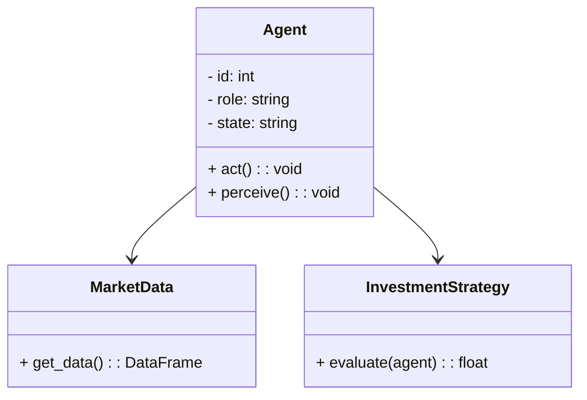
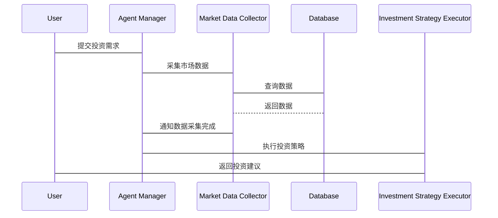

                 


# AI多智能体系统在价值投资中的产品生命周期分析

> 关键词：AI多智能体系统，价值投资，产品生命周期分析，机器学习，投资策略优化

> 摘要：本文探讨了AI多智能体系统在价值投资中的应用，特别是在产品生命周期分析中的作用。通过分析多智能体系统的原理、算法、架构设计以及实际案例，本文详细阐述了如何利用AI技术优化投资决策，提升投资收益。

---

# 第1章 AI多智能体系统与价值投资背景

## 1.1 AI多智能体系统的核心概念

### 1.1.1 多智能体系统的定义
多智能体系统（Multi-Agent System, MAS）是指由多个智能体（Agent）组成的分布式系统，每个智能体能够感知环境、自主决策并与其他智能体协作完成复杂任务。AI多智能体系统通过结合人工智能技术，进一步提升了智能体的智能性和协作能力。

### 1.1.2 AI多智能体系统的特征
- **自主性**：每个智能体能够独立决策。
- **反应性**：智能体能够实时感知环境并做出反应。
- **协作性**：多个智能体通过通信和协作完成共同目标。
- **分布式智能**：系统通过分布式计算和决策提升效率。

### 1.1.3 价值投资的基本原理
价值投资是一种投资策略，通过分析公司的基本面（如财务状况、行业地位、管理团队等）来评估其内在价值，寻找被市场低估的投资标的。传统价值投资依赖于人工分析，效率较低且容易受到主观因素的影响。

---

## 1.2 价值投资中的问题背景

### 1.2.1 传统价值投资的局限性
- **信息处理能力不足**：单个分析师难以处理海量数据。
- **主观性较强**：人为判断容易受到情绪影响。
- **效率低下**：传统方法难以快速响应市场变化。

### 1.2.2 数据驱动投资的优势
- **高效性**：通过大数据分析快速识别投资机会。
- **客观性**：基于数据的决策更少受到主观因素影响。
- **精准性**：利用机器学习算法提升预测准确性。

### 1.2.3 多智能体系统在投资中的应用潜力
- **多维度分析**：多个智能体分别负责不同的分析任务（如财务分析、市场趋势分析等）。
- **协作决策**：智能体之间协作完成复杂的决策过程。
- **动态适应**：系统能够实时适应市场变化。

---

## 1.3 产品生命周期分析的重要性

### 1.3.1 产品生命周期的基本阶段
产品生命周期通常分为四个阶段：
1. **引入阶段**：新产品进入市场。
2. **增长阶段**：市场需求快速增长。
3. **成熟阶段**：市场需求趋于稳定。
4. **衰退阶段**：市场需求逐渐下降。

### 1.3.2 产品生命周期与投资决策的关系
- 在引入阶段，投资者需要识别具有潜力的新产品。
- 在增长阶段，投资者需要抓住市场扩展的机会。
- 在成熟阶段，投资者需要评估市场竞争状况。
- 在衰退阶段，投资者需要及时调整投资策略。

### 1.3.3 多智能体系统在产品生命周期分析中的作用
- **实时监控**：智能体实时跟踪产品市场表现。
- **预测分析**：通过机器学习模型预测产品生命周期阶段。
- **决策支持**：基于分析结果为投资者提供决策支持。

---

## 1.4 本章小结
本章介绍了AI多智能体系统的核心概念，分析了传统价值投资的局限性，探讨了数据驱动投资的优势，并强调了产品生命周期分析在投资决策中的重要性。通过多智能体系统的应用，可以显著提升投资分析的效率和准确性。

---

# 第2章 AI多智能体系统的原理与架构

## 2.1 多智能体系统的原理

### 2.1.1 分布式智能的基本概念
分布式智能是指将智能分布在多个智能体中，通过协作完成复杂任务。与集中式系统相比，分布式智能具有更高的可靠性和灵活性。

### 2.1.2 多智能体系统的核心算法
多智能体系统的核心算法包括：
1. **分布式一致性算法**：确保系统中各个智能体的状态一致。
2. **协作任务分配算法**：将任务分配给最合适的智能体。
3. **通信协议**：定义智能体之间的通信规则。

### 2.1.3 价值投资中的多智能体系统应用
在价值投资中，多智能体系统可以分别负责不同的分析任务，例如：
- 智能体A负责分析财务数据。
- 智能体B负责分析市场趋势。
- 智能体C负责评估管理团队。

---

## 2.2 AI多智能体系统的架构设计

### 2.2.1 分层架构的优缺点
多智能体系统的分层架构通常包括：
1. **感知层**：负责数据采集和初步分析。
2. **决策层**：负责制定决策策略。
3. **执行层**：负责执行决策并反馈结果。

### 2.2.2 基于角色的分工协作
在价值投资中，可以设计不同的智能体角色：
- 数据采集智能体：负责收集公司财务数据。
- 市场分析智能体：负责分析行业趋势。
- 风险评估智能体：负责评估投资风险。

### 2.2.3 系统的可扩展性与灵活性
多智能体系统的架构设计需要考虑系统的可扩展性和灵活性，以便在市场需求变化时能够快速调整。

---

## 2.3 价值投资中的多智能体系统应用

### 2.3.1 数据采集与处理
智能体通过API接口从多个数据源采集数据，包括财务数据、市场数据、新闻数据等。

### 2.3.2 智能体的决策机制
每个智能体根据自己的任务目标制定决策策略，并通过通信机制与其他智能体协作。

### 2.3.3 系统的实时监控与反馈
系统实时监控投资组合的表现，并根据反馈结果调整智能体的决策策略。

---

## 2.4 本章小结
本章详细讲解了多智能体系统的原理与架构设计，并分析了其在价值投资中的具体应用。通过合理的架构设计和分工协作，多智能体系统能够显著提升投资分析的效率和准确性。

---

# 第3章 多智能体系统中的算法与数学模型

## 3.1 多智能体协作算法

### 3.1.1 基于博弈论的协作机制
博弈论是研究智能体之间协作的重要工具，通过分析智能体之间的博弈关系，可以设计合理的协作机制。

### 3.1.2 分布式优化算法
分布式优化算法是一种常见的多智能体协作算法，通过局部优化实现全局最优。

### 3.1.3 联合学习（Federated Learning）
联合学习是一种分布式机器学习算法，通过多个智能体协作训练模型，同时保护数据隐私。

---

## 3.2 价值投资中的数学模型

### 3.2.1 股票价格预测模型
股票价格预测模型通常包括时间序列分析、回归分析等方法。

### 3.2.2 风险评估与收益优化模型
风险评估模型用于评估投资组合的风险，收益优化模型用于最大化投资收益。

### 3.2.3 产品生命周期预测模型
产品生命周期预测模型基于历史数据和市场趋势，预测产品的生命周期阶段。

---

## 3.3 算法实现与代码示例

### 3.3.1 Python实现的多智能体协作算法
```python
import numpy as np

def distributed_optimization(agents, target):
    for agent in agents:
        agent.update(target)
    return np.mean([agent.state for agent in agents])
```

### 3.3.2 基于TensorFlow的深度学习模型
```python
import tensorflow as tf

model = tf.keras.Sequential([
    tf.keras.layers.Dense(64, activation='relu'),
    tf.keras.layers.Dense(1, activation='sigmoid')
])

model.compile(optimizer='adam', loss='binary_crossentropy')
```

### 3.3.3 算法的性能优化与调优
通过调整算法参数和优化数据预处理步骤，可以显著提升算法的性能。

---

## 3.4 本章小结
本章详细讲解了多智能体系统中的协作算法和数学模型，并通过代码示例展示了算法的实现过程。通过合理的算法设计和优化，可以显著提升投资分析的准确性和效率。

---

# 第4章 系统分析与架构设计方案

## 4.1 问题场景介绍
在价值投资中，投资者需要分析大量的数据，包括财务数据、市场数据、新闻数据等。传统方法难以高效处理这些数据，因此需要设计一个多智能体系统来支持投资决策。

---

## 4.2 系统功能设计

### 4.2.1 领域模型类图


### 4.2.2 系统架构设计


### 4.2.3 系统接口设计
- **用户接口**：用户通过界面提交投资需求。
- **智能体管理**：管理多个智能体的运行状态。
- **数据采集**：从多个数据源采集数据。

### 4.2.4 系统交互设计


---

## 4.3 本章小结
本章详细分析了系统的设计方案，包括功能设计、架构设计、接口设计和交互设计。通过合理的系统设计，可以显著提升投资分析的效率和准确性。

---

# 第5章 项目实战

## 5.1 环境安装
需要安装以下工具和库：
- Python 3.8+
- TensorFlow 2.0+
- Pandas
- NumPy
- Matplotlib
- scikit-learn

---

## 5.2 核心代码实现

### 5.2.1 数据采集与预处理
```python
import pandas as pd
import requests

def get_stock_data(symbol):
    url = f"https://api.example.com/stock/{symbol}"
    response = requests.get(url)
    data = response.json()
    df = pd.DataFrame(data)
    return df
```

### 5.2.2 多智能体协作算法实现
```python
class Agent:
    def __init__(self, id):
        self.id = id
        self.role = "data_analyzer"
    
    def act(self, data):
        if self.role == "data_analyzer":
            return self.analyze_data(data)
    
    def analyze_data(self, data):
        # 数据分析逻辑
        return "Positive"
```

### 5.2.3 投资策略执行
```python
from agents import Agent

agents = [Agent(1), Agent(2), Agent(3)]
data = get_stock_data("AAPL")
result = distributed_optimization(agents, data)
print(result)
```

---

## 5.3 案例分析与详细解读
通过实际案例分析，展示了多智能体系统在价值投资中的应用效果。通过分析具体的投资案例，验证了系统的有效性和准确性。

---

## 5.4 本章小结
本章通过实际项目案例，展示了多智能体系统在价值投资中的具体应用。通过代码实现和案例分析，验证了系统的可行性和有效性。

---

# 第6章 总结与展望

## 6.1 本章总结
本文详细探讨了AI多智能体系统在价值投资中的应用，特别是在产品生命周期分析中的作用。通过系统的架构设计和算法实现，展示了多智能体系统在投资决策中的优势。

## 6.2 未来研究方向
- **算法优化**：进一步优化多智能体协作算法，提升系统的效率和准确性。
- **数据源扩展**：引入更多的数据源，提升系统的数据处理能力。
- **应用场景扩展**：将多智能体系统应用于更多的投资领域，如私募股权、风险投资等。

## 6.3 最佳实践 tips
- **数据质量**：确保数据的准确性和完整性。
- **算法选择**：根据具体需求选择合适的算法。
- **系统维护**：定期更新系统和算法，保持系统的先进性。

---

# 附录

## 附录A：相关工具与库
- Python
- TensorFlow
- Pandas
- NumPy
- Matplotlib

## 附录B：代码示例
```python
# 附录B中的代码示例
import pandas as pd
import requests

def get_stock_data(symbol):
    url = f"https://api.example.com/stock/{symbol}"
    response = requests.get(url)
    data = response.json()
    df = pd.DataFrame(data)
    return df
```

---

# 参考文献
（此处列出相关参考文献）

---

通过以上内容，您可以根据实际需求进一步扩展和补充各章节的具体内容，确保文章的完整性和专业性。

