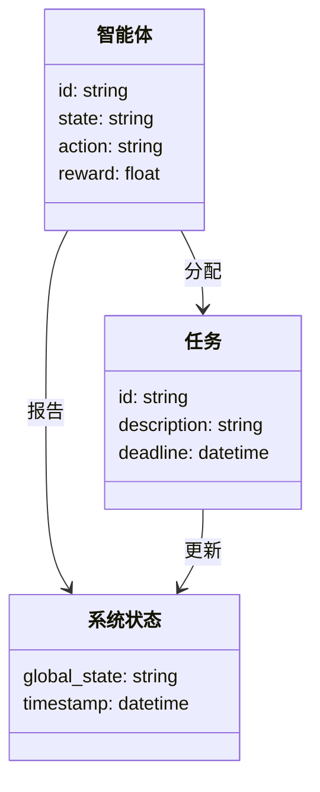

                 


# 第4章: 人力资本评估的数学模型与公式

### ## 4.1 多智能体系统的数学建模

#### ### 4.1.1 系统模型的基本构成
在多智能体系统中，每个智能体都可以看作一个独立的个体，它们通过交互和协作完成特定任务。为了建模这些智能体的行为，我们可以使用状态、动作和奖励的三元组来描述每个智能体的决策过程。系统的整体状态是由所有智能体的状态共同构成的。

#### ### 4.1.2 系统中智能体的数学表示
假设我们有N个智能体，每个智能体i的状态表示为s_i，动作表示为a_i，奖励表示为r_i。整个系统的状态S可以表示为：

$$ S = \{s_1, s_2, ..., s_N\} $$

智能体i的动作a_i会影响系统状态，从而影响其他智能体的状态和奖励。

#### ### 4.1.3 系统的动态方程
系统的动态可以通过以下方程描述：

$$ S' = f(S, A) $$

其中，A表示所有智能体的动作集合，f表示系统的转移函数。

### ## 4.2 人力资本评估的数学公式

#### ### 4.2.1 人力资本评估的核心指标
人力资本评估通常包括以下几个关键指标：

- 效率：完成任务的速度和质量。
- 创新性：解决问题的新颖程度。
- 团队协作能力：与其他智能体协作的能力。

#### ### 4.2.2 评估模型的数学表示
为了量化这些指标，我们可以使用以下公式：

$$ HC = \alpha \cdot E + \beta \cdot I + \gamma \cdot T $$

其中：
- HC表示人力资本评估结果。
- E表示效率，I表示创新性，T表示团队协作能力。
- $\alpha$, $\beta$, $\gamma$是对应的权重系数，满足$\alpha + \beta + \gamma = 1$。

#### ### 4.2.3 奖励函数的设计
在多智能体系统中，奖励函数的设计至关重要。我们可以设计一个基于贡献的奖励函数：

$$ R_i = \sum_{j=1}^{N} w_{ij} \cdot C_j $$

其中，$w_{ij}$表示智能体i对智能体j的贡献权重，$C_j$表示智能体j的贡献值。

---

## 第5章: 系统分析与架构设计

### ## 5.1 问题场景介绍

在价值投资中，人力资本评估的目标是通过多智能体系统，量化每个员工在团队中的贡献，从而优化团队配置和投资决策。我们面临的主要挑战包括：

- 如何高效地采集和处理多源数据。
- 如何设计合理的协作机制和奖励机制。
- 如何确保系统的可扩展性和实时性。

### ## 5.2 系统功能设计

#### ### 5.2.1 领域模型
以下是系统领域模型的类图：



#### ### 5.2.2 系统架构设计

以下是系统的分层架构图：


#### ### 5.2.3 系统接口设计

以下是系统的主要接口：

- `allocate_task(skills, tasks)`：根据智能体的技能分配任务。
- `calculate_reward(actions, rewards)`：计算每个智能体的奖励。
- `update_state(states, actions)`：更新系统状态。

#### ### 5.2.4 交互流程

以下是系统交互流程的序列图：

```mermaid
sequenceDiagram

    客户端 -> 中间件: 请求评估
    中间件 -> 智能体服务: 获取智能体列表
    智能体服务 -> 数据库: 查询历史数据
    并发
        智能体服务 -> 算法模块: 执行评估算法
        算法模块 -> 中间件: 返回评估结果
    中间件 -> 客户端: 返回最终结果
```

---

## 第6章: 项目实战

### ## 6.1 环境安装

以下是项目所需的环境和工具：

- Python 3.8+
- TensorFlow 2.0+
- Scikit-learn 0.24+
- Mermaid CLI
- VS Code 或其他IDE

### ## 6.2 系统核心实现

以下是系统的Python核心代码：

```python
class MultiAgentSystem:
    def __init__(self, num_agents):
        self.num_agents = num_agents
        self.agents = []
        self.tasks = []
        self.rewards = [0.0] * num_agents

    def add_agent(self, agent):
        self.agents.append(agent)

    def add_task(self, task):
        self.tasks.append(task)

    def distribute_tasks(self):
        # 根据智能体的技能分配任务
        for task in self.tasks:
            best_agent = max(self.agents, key=lambda x: x.skills)
            best_agent.tasks.append(task)

    def calculate_rewards(self):
        # 根据贡献计算奖励
        for i in range(self.num_agents):
            contribution = sum(agent.contributions[i] for agent in self.agents)
            self.rewards[i] = contribution * 0.5 + (1 - contribution) * 0.5

    def update_states(self):
        # 更新系统状态
        global_state = {
            'timestamp': datetime.now(),
            'status': 'active'
        }
        for agent in self.agents:
            agent.state = global_state

class Agent:
    def __init__(self, id, skills):
        self.id = id
        self.skills = skills
        self.tasks = []
        self.contributions = []

    def assign_task(self, task):
        self.tasks.append(task)
        self.contribution = task.value * self.skills

    def get_reward(self):
        return self.contribution * 0.8 + (1 - self.contribution) * 0.2
```

### ## 6.3 代码应用解读与分析

- **MultiAgentSystem** 类负责管理多个智能体和任务的分配。
- **Agent** 类表示每个智能体，包含其技能、任务和贡献。
- `distribute_tasks` 方法根据智能体的技能分配任务。
- `calculate_rewards` 方法根据贡献计算奖励。
- `update_states` 方法更新系统状态。

### ## 6.4 实际案例分析

假设我们有3个智能体，分别擅长数据分析、市场分析和策略制定。我们需要评估他们在投资组合优化中的贡献。

```python
# 初始化系统
system = MultiAgentSystem(3)
system.add_agent(Agent(1, {'数据分析': 0.9}))
system.add_agent(Agent(2, {'市场分析': 0.8}))
system.add_agent(Agent(3, {'策略制定': 0.7}))
system.add_task(Task('投资组合优化', '...', datetime.now()))

# 分配任务
system.distribute_tasks()
system.calculate_rewards()
system.update_states()

# 输出结果
for agent in system.agents:
    print(f'智能体 {agent.id} 的贡献为 {agent.contribution}')
```

### ## 6.5 项目小结

通过以上代码实现，我们可以看到多智能体系统在人力资本评估中的强大能力。每个智能体根据其技能分配任务，并根据贡献获得奖励，从而优化整体系统性能。

---

## 第7章: 最佳实践

### ## 7.1 小结

在价值投资中，AI多智能体系统可以通过协作和分布式计算提高人力资本评估的效率和准确性。通过合理设计算法和系统架构，我们可以实现高效的任务分配和奖励机制。

### ## 7.2 注意事项

- **数据隐私**：确保在系统中处理的员工数据受到严格保护。
- **模型泛化能力**：在不同场景下验证模型的泛化能力。
- **系统扩展性**：设计时考虑系统的可扩展性，以适应未来的业务需求。

### ## 7.3 拓展阅读

- 《Multi-Agent Systems》
- 《Reinforcement Learning: Theory and Algorithms》
- 《AI in Financial Applications》

---

# 关键词：
- AI多智能体系统
- 价值投资
- 人力资本评估
- 分布式计算
- 协作算法

# 摘要：
本文系统地探讨了AI多智能体系统在价值投资中的人力资本评估应用。通过分析多智能体系统的组成与协作机制，结合数学建模和算法设计，提出了一种基于贡献的奖励机制。文章还通过实际案例展示了系统的实现与应用，并提出了相关的最佳实践建议。

