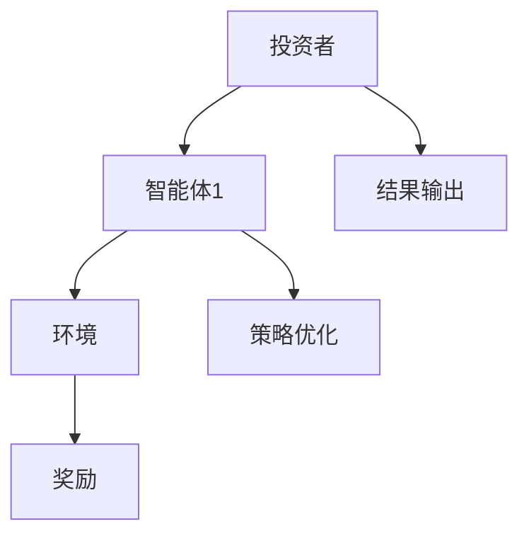
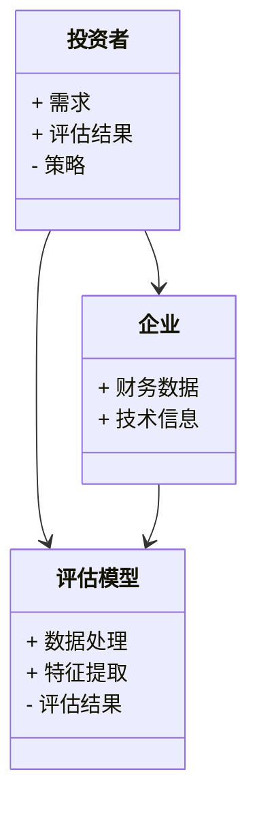
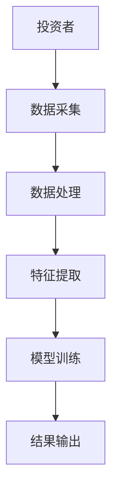
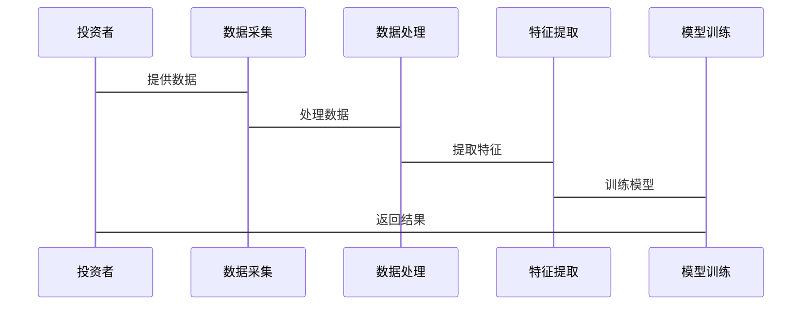

                 


# AI多智能体系统在价值投资中的商业秘密价值评估

## 关键词：AI多智能体系统，价值投资，商业秘密，价值评估，强化学习

## 摘要：  
本文探讨了AI多智能体系统在价值投资中的应用，特别是如何利用该技术评估商业秘密的价值。通过分析多智能体系统的优势、AI技术的核心算法、系统架构设计及实际案例，本文为读者提供了从理论到实践的全面指导，展示了如何通过技术手段提升商业秘密的价值评估能力。

---

## 第一章：背景介绍

### 1.1 问题背景
#### 1.1.1 多智能体系统在价值投资中的应用
价值投资依赖于对企业的深入分析，包括财务数据、市场趋势和竞争优势等因素。传统的价值评估方法往往依赖于经验丰富的分析师，而AI多智能体系统通过分布式计算和协作学习，能够更高效地处理复杂信息，提供更精准的评估结果。

#### 1.1.2 商业秘密价值评估的重要性
商业秘密是企业核心竞争力的体现，其价值往往难以量化。准确评估商业秘密的价值，可以帮助企业在并购、知识产权保护等方面做出更明智的决策。

#### 1.1.3 当前价值评估方法的局限性
传统评估方法通常依赖人工分析，存在主观性强、效率低、难以量化等问题。AI多智能体系统通过数据驱动的方法，能够克服这些局限性，提供更客观、高效的评估手段。

### 1.2 问题描述
#### 1.2.1 价值投资中的核心问题
价值投资的核心在于发现被低估的企业，这需要对企业的内在价值进行准确评估。然而，市场波动、信息不全等因素增加了评估的难度。

#### 1.2.2 商业秘密价值评估的难点
商业秘密往往涉及非公开信息，其价值评估需要综合考虑多种因素，包括技术、市场、法律等。传统方法难以全面捕捉这些因素。

#### 1.2.3 现有方法的不足与改进方向
传统方法依赖人工经验，存在主观性强、效率低的问题。AI多智能体系统通过数据挖掘和机器学习，可以更客观地评估商业秘密的价值。

### 1.3 问题解决
#### 1.3.1 多智能体系统的优势
多智能体系统通过协作和分布式计算，能够处理复杂的信息，提供更全面的评估结果。

#### 1.3.2 AI技术在价值评估中的应用
AI技术通过分析大量数据，识别潜在的市场趋势和企业优势，辅助评估商业秘密的价值。

#### 1.3.3 商业秘密价值评估的新思路
结合AI和多智能体系统，可以构建更高效的评估模型，综合考虑多种因素，提供更准确的价值评估。

### 1.4 边界与外延
#### 1.4.1 价值投资的边界
价值投资的边界包括市场环境、数据质量和评估模型的准确性。

#### 1.4.2 商业秘密的定义与范围
商业秘密包括未公开的技术、策略和数据等，其范围和定义需要明确。

#### 1.4.3 多智能体系统的适用场景
多智能体系统适用于复杂环境下的决策问题，如金融市场和企业评估。

### 1.5 核心概念结构与组成
#### 1.5.1 多智能体系统的核心要素
多智能体系统包括智能体、环境、通信机制和协作策略等核心要素。

#### 1.5.2 商业秘密价值评估的模型组成
评估模型包括数据采集、特征提取、模型训练和结果输出等部分。

#### 1.5.3 AI技术在系统中的作用
AI技术通过数据处理和模型训练，为多智能体系统的决策提供支持。

---

## 第二章：核心概念与联系

### 2.1 核心概念原理
#### 2.1.1 多智能体系统的基本原理
多智能体系统通过多个智能体协作，共同完成复杂任务。每个智能体都有自己的目标和策略，通过通信和协作实现整体目标。

#### 2.1.2 商业秘密价值评估模型
评估模型通过分析企业数据，识别关键因素，计算商业秘密的价值。

#### 2.1.3 AI技术在多智能体系统中的应用
AI技术用于智能体的决策和协作，通过机器学习和深度学习提升系统的智能化水平。

### 2.2 概念属性特征对比
| 概念          | 特征1 | 特征2 | 特征3 |
|---------------|-------|-------|-------|
| 多智能体系统   | 分布式 | 协作性 | 动态性 |
| 商业秘密       | 未公开 | 竞争力 | 难以量化 |
| 价值评估模型   | 数据驱动 | 客观性 | 高效性 |

### 2.3 ER实体关系图
```mermaid
er
actor(投资者) --> 商业秘密(企业)
actor(投资者) --> 评估模型(系统)
企业 --> 评估模型(系统)
```

---

## 第三章：算法原理讲解

### 3.1 多智能体强化学习算法
#### 3.1.1 算法流程
1. 初始化多个智能体。
2. 智能体与环境交互，获取奖励。
3. 通过强化学习优化策略。
4. 协作完成任务。

#### 3.1.2 算法实现


#### 3.1.3 数学模型
多智能体强化学习的损失函数：
$$ L = \sum_{i=1}^{n} (r_i - \hat{r}_i)^2 $$

### 3.2 多智能体协作机制
#### 3.2.1 协作流程
1. 智能体接收任务。
2. 通过通信协商策略。
3. 协作完成任务。

#### 3.2.2 通信协议
```python
class Message:
    def __init__(self, sender, receiver, content):
        self.sender = sender
        self.receiver = receiver
        self.content = content
```

---

## 第四章：系统分析与架构设计方案

### 4.1 问题场景介绍
价值投资中的商业秘密评估需要处理大量非公开数据，要求系统具备高效的分析能力和协作能力。

### 4.2 系统功能设计
#### 4.2.1 领域模型类图


### 4.3 系统架构设计
#### 4.3.1 系统架构图


### 4.4 系统接口设计
#### 4.4.1 接口描述
- 输入接口：投资者需求
- 输出接口：评估结果

#### 4.4.2 交互序列图


---

## 第五章：项目实战

### 5.1 环境安装
安装必要的工具和库：
```bash
pip install numpy pandas tensorflow matplotlib
```

### 5.2 核心实现源代码
```python
import numpy as np
import tensorflow as tf

class MultiAgentSystem:
    def __init__(self):
        self.agents = []

    def add_agent(self, agent):
        self.agents.append(agent)

    def run(self):
        for agent in self.agents:
            agent.run()
```

### 5.3 代码解读与分析
- `MultiAgentSystem`类管理多个智能体。
- `add_agent`方法添加智能体。
- `run`方法启动所有智能体。

### 5.4 实际案例分析
分析某企业的商业秘密价值，通过模型计算其市场竞争力和潜在价值。

### 5.5 项目总结
总结项目的成果和经验，提出改进建议。

---

## 第六章：最佳实践

### 6.1 小结
本文详细介绍了AI多智能体系统在价值投资中的应用，展示了如何通过技术手段提升商业秘密的价值评估能力。

### 6.2 注意事项
- 数据隐私保护
- 模型泛化能力
- 系统可扩展性

### 6.3 拓展阅读
推荐相关书籍和资源，供进一步学习。

---

## 总结
通过本文的详细讲解，读者可以深入了解AI多智能体系统在价值投资中的应用，掌握商业秘密价值评估的核心技术和方法。

