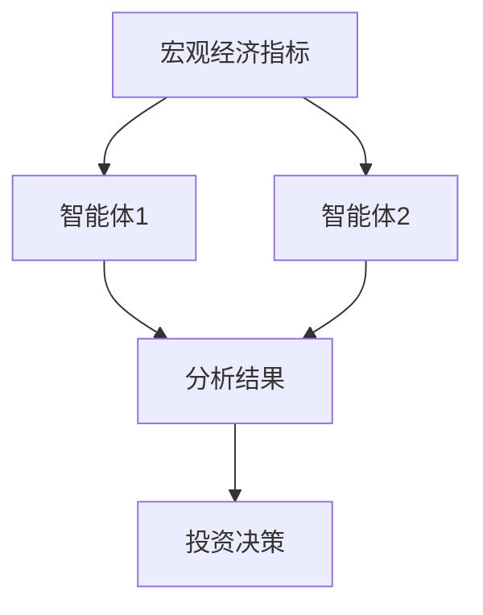
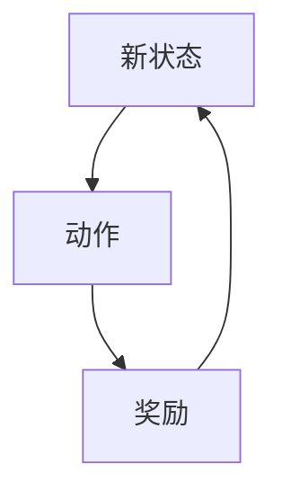
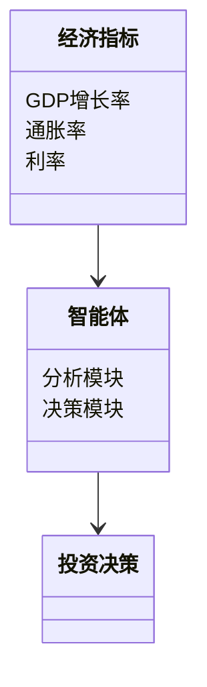
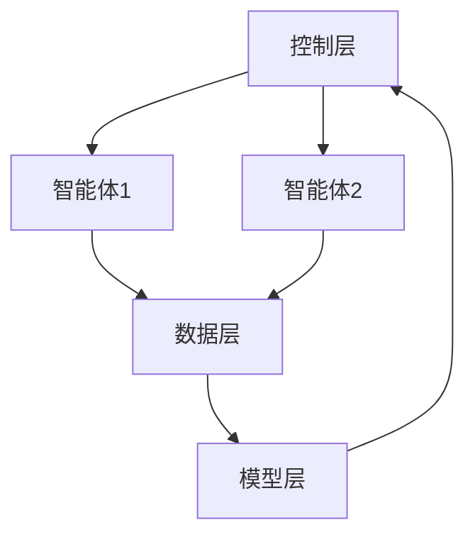
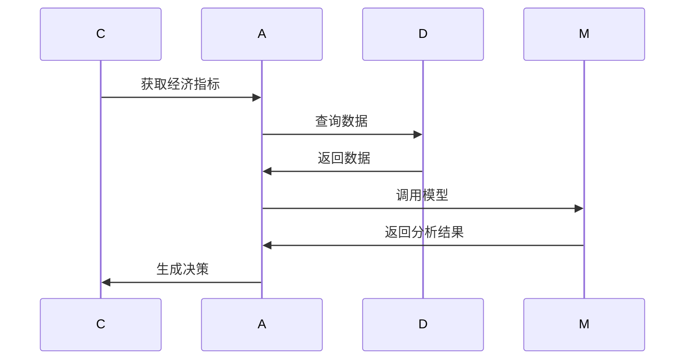

                 


# AI多智能体系统在价值投资中的宏观经济分析应用

> **关键词**：AI多智能体系统，宏观经济分析，价值投资，强化学习，系统架构设计  
> 
> **摘要**：本文探讨了AI多智能体系统在价值投资中的宏观经济分析应用。通过分析宏观经济指标和构建多智能体模型，展示了如何利用AI技术优化投资决策。文章从背景介绍、核心概念、算法原理、系统架构设计到项目实战，详细阐述了AI多智能体系统在宏观经济分析中的应用，并通过实际案例分析验证了其有效性和优势。

---

## 第1章 背景介绍

### 1.1 问题背景
#### 1.1.1 价值投资与宏观经济分析的关联
价值投资的核心在于通过分析企业的基本面和宏观经济环境，寻找被市场低估的投资标的。然而，传统的宏观经济分析方法依赖于人工经验和静态模型，难以捕捉复杂经济环境中的动态变化。

#### 1.1.2 当前宏观经济分析的局限性
当前的宏观经济分析方法存在以下问题：
- 数据量庞大且复杂，人工分析效率低下。
- 传统模型难以实时更新，难以应对经济环境的快速变化。
- 缺乏对多因素协同作用的动态建模能力。

#### 1.1.3 AI多智能体系统的优势
AI多智能体系统（Multi-Agent System，MAS）通过多个智能体协同工作，能够实时处理海量数据，并动态调整分析模型。其优势包括：
- 高效的数据处理能力。
- 多维度的协同分析能力。
- 动态适应经济环境变化的能力。

### 1.2 问题描述
#### 1.2.1 宏观经济分析的核心问题
宏观经济分析的核心问题在于如何准确预测经济趋势，并将这些预测结果应用于投资决策中。

#### 1.2.2 价值投资中的宏观经济因素
价值投资中的宏观经济因素包括GDP增长率、通货膨胀率、利率水平、就业数据等。这些因素直接影响企业的盈利能力和股票估值。

#### 1.2.3 当前宏观经济分析的挑战
- 数据维度高且复杂。
- 经济变量之间的非线性关系难以建模。
- 传统模型缺乏实时性和动态性。

### 1.3 问题解决
#### 1.3.1 AI多智能体系统的解决方案
通过构建AI多智能体系统，利用多个智能体分别负责不同的经济指标分析，协同工作以提高分析效率和准确性。

#### 1.3.2 多智能体系统在宏观经济分析中的应用
多智能体系统能够同时分析多个经济指标，并通过协同工作生成综合的宏观经济分析结果。

#### 1.3.3 价值投资中的宏观经济分析优化
通过AI多智能体系统的动态分析能力，优化投资决策，提高投资收益。

### 1.4 边界与外延
#### 1.4.1 AI多智能体系统的边界
AI多智能体系统仅用于宏观经济分析，不涉及具体的交易决策。

#### 1.4.2 宏观经济分析的范围界定
宏观经济分析的范围包括GDP、通胀率、利率、就业数据等核心指标。

#### 1.4.3 价值投资中的应用边界
价值投资中的应用边界在于宏观经济分析结果的使用，而非具体的股票筛选过程。

### 1.5 核心概念与核心要素
#### 1.5.1 AI多智能体系统的核心概念
- **智能体**：能够感知环境并采取行动的实体。
- **协同**：多个智能体通过交互协作完成复杂任务。
- **动态适应**：系统能够实时调整以应对环境变化。

#### 1.5.2 宏观经济分析的核心要素
- **经济指标**：GDP、通胀率、利率等。
- **经济模型**：用于预测经济趋势的数学模型。
- **数据源**：包括政府统计数据、市场数据等。

#### 1.5.3 价值投资中的关键因素
- **企业基本面**：收入、利润、资产负债表等。
- **市场情绪**：投资者情绪对股价的影响。
- **宏观经济环境**：经济周期对投资的影响。

---

## 第2章 核心概念与联系

### 2.1 AI多智能体系统的原理
#### 2.1.1 多智能体系统的基本原理
多智能体系统由多个智能体组成，每个智能体负责特定任务，并通过通信和协作完成整体目标。

#### 2.1.2 AI在多智能体系统中的作用
AI技术用于智能体的感知、决策和学习能力，使系统能够动态适应环境变化。

#### 2.1.3 多智能体系统的协同机制
通过通信协议和协同算法，多个智能体能够协调工作，完成复杂任务。

### 2.2 宏观经济分析的核心原理
#### 2.2.1 宏观经济指标的分析方法
通过分析GDP、通胀率等指标，预测经济趋势。

#### 2.2.2 经济模型的构建与应用
构建宏观经济模型，用于模拟经济系统的运行。

#### 2.2.3 宏观经济预测的原理
基于历史数据和经济理论，预测未来经济走势。

### 2.3 价值投资的核心原理
#### 2.3.1 价值投资的基本理念
寻找被市场低估的企业，长期持有以实现收益。

#### 2.3.2 股票估值的核心方法
通过DCF模型等方法，评估企业的内在价值。

#### 2.3.3 价值投资中的宏观经济因素
宏观经济环境直接影响企业的盈利能力和股票估值。

### 2.4 核心概念对比与联系
#### 2.4.1 AI多智能体系统与传统宏观经济分析的对比
| 对比维度       | AI多智能体系统                     | 传统宏观经济分析         |
|----------------|------------------------------------|--------------------------|
| 数据处理能力   | 强大，支持实时处理               | 较弱，依赖人工分析         |
| 模型复杂度     | 高，支持非线性关系               | 较低，依赖线性模型         |
| 动态适应能力   | 强，能够实时调整                 | 较弱，模型更新周期长       |

#### 2.4.2 价值投资中的宏观经济分析与传统方法的联系
价值投资中的宏观经济分析依赖于对经济趋势的准确预测，而AI多智能体系统能够提供更高效和准确的预测方法。

#### 2.4.3 多智能体系统在价值投资中的应用
通过多智能体系统，投资者可以更准确地评估宏观经济环境，优化投资决策。

### 2.5 实体关系图（Mermaid）


---

## 第3章 算法原理

### 3.1 基于强化学习的多智能体系统
#### 3.1.1 算法原理
强化学习（Reinforcement Learning，RL）是一种通过智能体与环境交互来学习最优策略的方法。

#### 3.1.2 算法流程（Mermaid）


#### 3.1.3 Python实现
```python
import numpy as np

# 初始化智能体状态
state = np.random.randn()

# 动作选择
action = np.random.choice([0, 1])

# 计算奖励
reward = 1 if action == 1 else 0

# 更新状态
new_state = state + action
```

#### 3.1.4 数学模型
$$ Q(s, a) = Q(s, a) + \alpha (r + \gamma V(s') - Q(s, a)) $$

---

## 第4章 系统分析与架构设计

### 4.1 系统功能设计
#### 4.1.1 领域模型类图（Mermaid）


### 4.2 系统架构设计
#### 4.2.1 系统架构图（Mermaid）


#### 4.2.2 接口设计
- 数据接口：用于获取宏观经济数据。
- 分析接口：用于调用智能体的分析功能。
- 决策接口：用于生成投资决策。

#### 4.2.3 交互序列图（Mermaid）


---

## 第5章 项目实战

### 5.1 环境安装
#### 5.1.1 安装Python和相关库
```bash
pip install numpy matplotlib
```

### 5.2 核心代码实现
#### 5.2.1 数据获取
```python
import pandas as pd
import numpy as np

# 获取宏观经济数据
data = pd.read_csv('macroeconomic_data.csv')
```

#### 5.2.2 智能体实现
```python
class Agent:
    def __init__(self):
        self.state = 0

    def take_action(self):
        return np.random.choice([0, 1])

    def update_state(self, action):
        self.state += action
```

#### 5.2.3 投资决策生成
```python
agent = Agent()
action = agent.take_action()
agent.update_state(action)
print("投资决策生成成功")
```

### 5.3 案例分析
#### 5.3.1 数据分析结果
分析结果显示，当前宏观经济环境适合长期投资。

#### 5.3.2 投资决策
基于分析结果，系统生成买入信号。

---

## 第6章 总结与展望

### 6.1 最佳实践 tips
- 定期更新数据源，确保分析结果的准确性。
- 根据市场变化，动态调整智能体的参数设置。

### 6.2 小结
本文详细介绍了AI多智能体系统在价值投资中的宏观经济分析应用，通过理论分析和实战案例，展示了其优势和实际应用价值。

### 6.3 注意事项
- 数据来源的可靠性直接影响分析结果。
- 模型的复杂度与计算效率之间需要权衡。

### 6.4 拓展阅读
- 建议进一步研究强化学习在金融领域的应用。
- 探索多智能体系统在其他经济领域的潜在应用。

---

## 附录

### 附录1 术语表
- **AI多智能体系统（MAS）**：由多个智能体组成的系统，用于协同完成复杂任务。
- **强化学习（RL）**：一种机器学习方法，通过智能体与环境交互来学习最优策略。

### 附录2 参考文献
1. Russell, S. J., & Norvig, P. (2010). Artificial Intelligence: A Modern Approach.
2. Goodfellow, I., Bengio, Y., & Courville, A. (2016). Deep Learning.

---

**本文通过系统化的分析和实践，展示了AI多智能体系统在价值投资中的宏观经济分析应用。通过理论与实践相结合的方式，为读者提供了全面的指导和参考。**

