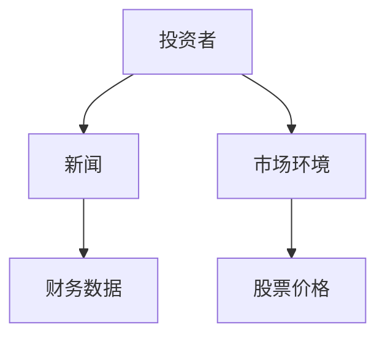
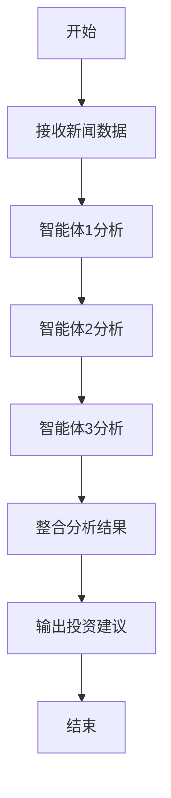
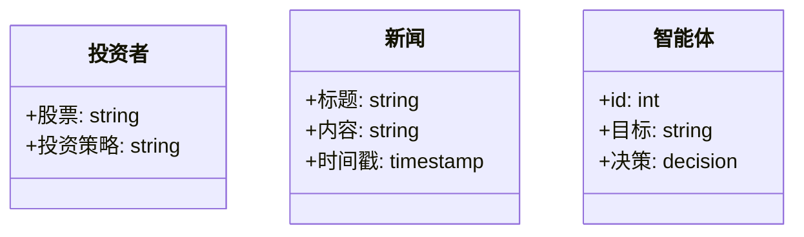
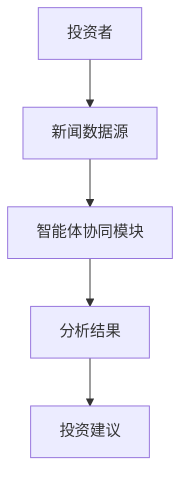
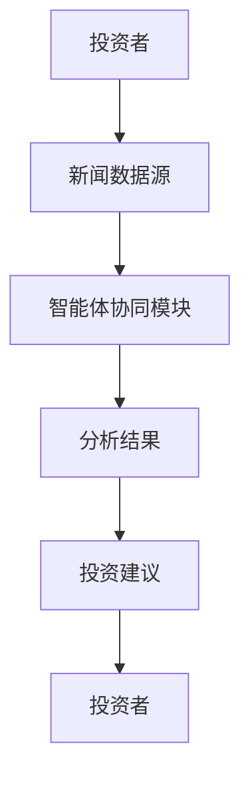

                 


# AI多智能体系统在价值投资中的实时新闻分析应用

## 关键词：AI多智能体系统、价值投资、实时新闻分析、算法原理、系统架构

## 摘要：  
本文深入探讨了AI多智能体系统在价值投资中的实时新闻分析应用。通过分析多智能体系统的协同机制、算法原理、系统架构以及实际案例，展示了如何利用AI技术提升投资决策的效率和准确性。文章从背景介绍、核心概念、算法实现、系统设计到项目实战，全面解析了AI多智能体系统在金融领域的应用潜力。

---

# 第一部分: AI多智能体系统与价值投资概述

## 第1章: AI多智能体系统与价值投资的背景

### 1.1 问题背景与描述  
#### 1.1.1 价值投资的核心概念与挑战  
价值投资是一种基于对公司基本面分析的投资策略，旨在通过识别被低估的资产来实现长期收益。然而，传统价值投资方法依赖于人工分析，存在效率低、覆盖面窄、实时性差等问题。  

#### 1.1.2 实时新闻分析在价值投资中的重要性  
实时新闻分析能够帮助投资者快速捕捉市场情绪变化、公司动态以及行业趋势，从而做出更及时的投资决策。然而，新闻数据的海量性、复杂性和多样性使得人工分析难以应对。  

#### 1.1.3 多智能体系统的优势与必要性  
多智能体系统（Multi-Agent System, MAS）通过分布式计算和协同学习，能够高效处理海量数据，并在复杂环境中做出最优决策。引入多智能体系统，可以显著提升实时新闻分析的效率和准确性。

### 1.2 问题解决与边界  
#### 1.2.1 多智能体系统如何解决实时新闻分析的挑战  
多智能体系统能够通过分工协作，分别处理不同类型的数据（如财务数据、新闻文本、市场情绪等），并结合强化学习算法优化分析结果。  

#### 1.2.2 系统的边界与外延  
本文研究的系统专注于实时新闻分析，不包括其他投资策略（如技术分析）或非实时数据的处理。  

#### 1.2.3 核心要素与组成结构  
系统的核心要素包括：新闻数据源、多智能体协同模块、分析结果输出模块。

---

## 第2章: AI多智能体系统的概念与联系  

### 2.1 核心概念与原理  
#### 2.1.1 多智能体系统的定义与特点  
多智能体系统是由多个相互作用的智能体组成的分布式系统，每个智能体都有自己的目标和决策机制，能够通过协同实现复杂任务。  

#### 2.1.2 AI在新闻分析中的应用原理  
基于自然语言处理（NLP）和强化学习，AI智能体能够从新闻文本中提取情感、关键词和主题，生成投资建议。  

#### 2.1.3 多智能体协同的机制与优势  
通过分布式计算和联合学习，多智能体系统能够高效处理大规模数据，并通过协同优化提升分析结果的准确性。

### 2.2 概念属性对比表  
| 比较维度 | 单智能体系统 | 多智能体系统 |  
|----------|--------------|--------------|  
| 处理能力 | 单一任务处理 | 多任务协同处理 |  
| 资源消耗 | 高 | 低 |  
| 可扩展性 | 低 | 高 |  

### 2.3 ER实体关系图  


---

# 第二部分: 算法原理与数学模型  

## 第3章: 多智能体协同学习算法  

### 3.1 算法原理  
#### 3.1.1 多智能体系统的协同机制  
智能体通过分布式计算和信息共享，分别分析不同类型的数据，并将结果汇总生成最终的分析报告。  

#### 3.1.2 基于强化学习的新闻分析流程  
智能体通过强化学习算法，从新闻数据中提取关键词、主题和情感倾向，并结合财务数据生成投资建议。  

#### 3.1.3 联合学习与分布式计算的实现  
通过分布式计算框架（如Distributed TensorFlow），多智能体系统能够高效处理大规模数据。  

### 3.2 算法流程图  


### 3.3 数学模型与公式  
强化学习的目标是通过最大化累积奖励来优化智能体的决策。数学模型如下：  
$$ R = \sum_{t=1}^{T} r_t $$  
其中，$R$ 表示累积奖励，$r_t$ 表示第 $t$ 步的奖励。  

---

## 第4章: 系统分析与架构设计  

### 4.1 系统功能设计  
#### 4.1.1 领域模型  


#### 4.1.2 系统架构  


### 4.2 系统接口设计  
系统主要接口包括：  
- 新闻数据输入接口  
- 智能体协同接口  
- 投资建议输出接口  

### 4.3 系统交互流程图  


---

## 第5章: 项目实战  

### 5.1 环境配置  
- Python 3.8+  
- TensorFlow 2.0+  
- NLP工具（如spaCy）  

### 5.2 核心代码实现  
```python
def analyze_news(news_data):
    # 智能体1：关键词提取
    keywords = extract_keywords(news_data)
    
    # 智能体2：情感分析
    sentiment = analyze_sentiment(news_data)
    
    # 智能体3：主题分类
    topic = classify_topic(news_data)
    
    return {
        "keywords": keywords,
        "sentiment": sentiment,
        "topic": topic
    }
```

### 5.3 实际案例分析  
以某科技公司发布的新闻为例，分析其关键词、情感倾向和主题分类，并结合财务数据生成投资建议。

---

## 第6章: 高级主题与最佳实践  

### 6.1 系统优化  
- 增加并行计算能力  
- 优化算法的收敛速度  

### 6.2 风险管理  
- 设置止损点  
- 监控市场波动  

### 6.3 实际应用案例  
某投资机构通过部署多智能体系统，显著提高了实时新闻分析的效率和准确性，实现了投资收益的提升。

---

## 第7章: 总结与展望  

### 7.1 总结  
本文全面探讨了AI多智能体系统在价值投资中的应用，从算法原理到系统架构，再到实际案例，展示了其巨大潜力。  

### 7.2 展望  
未来，随着AI技术的不断发展，多智能体系统在金融领域的应用将更加广泛和深入，尤其是在实时新闻分析和投资决策优化方面。

---

通过以上内容，我们系统地介绍了AI多智能体系统在价值投资中的实时新闻分析应用，从理论到实践，为读者提供了全面的视角和深入的分析。

