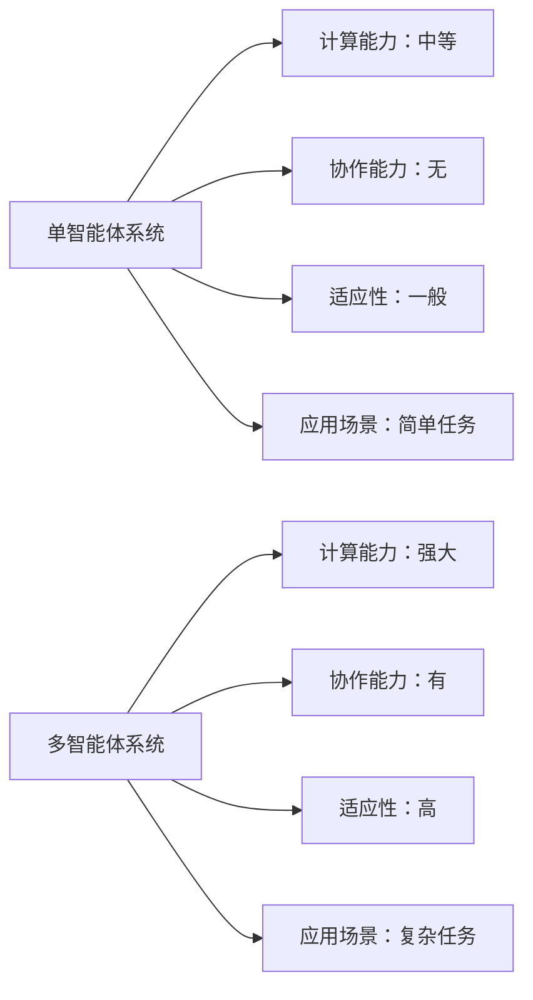
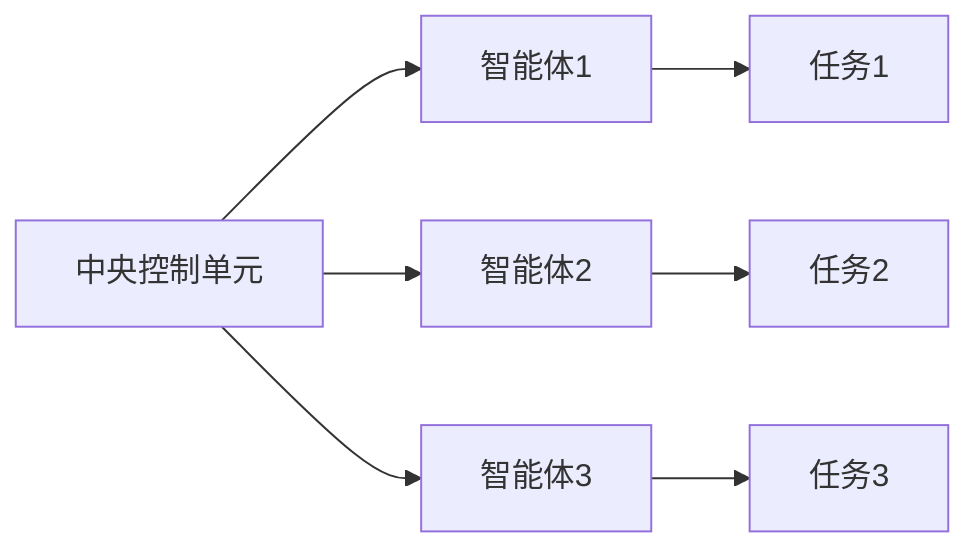
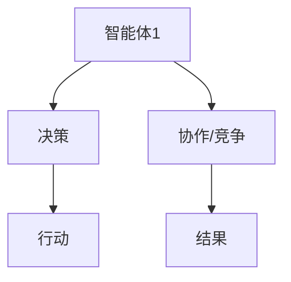
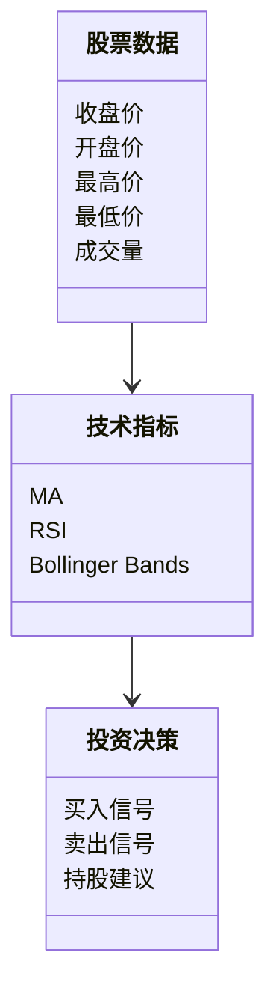
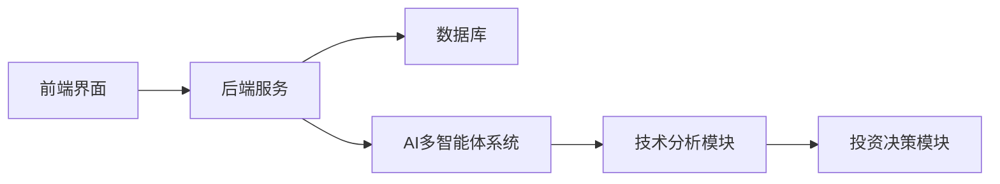
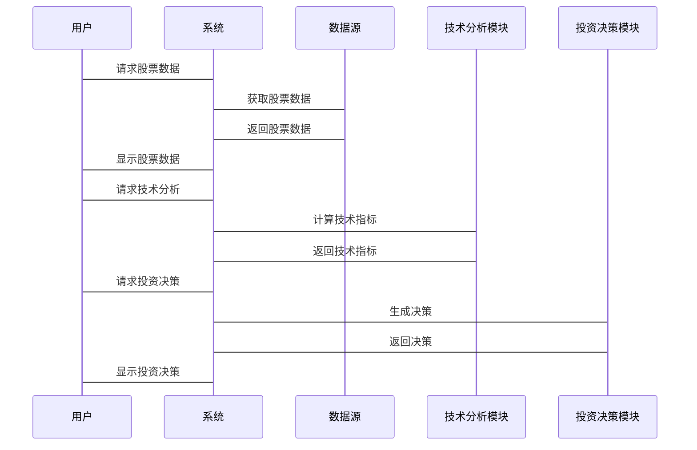

                 


# AI多智能体系统在价值投资中的技术分析整合

## 关键词：AI多智能体系统, 价值投资, 技术分析, 金融投资, 人工智能算法

## 摘要：本文详细探讨了AI多智能体系统在价值投资中的技术分析整合。通过分析多智能体系统的原理、技术分析的数学模型、系统架构设计以及项目实战，展示了如何利用AI技术提升投资决策的准确性和效率。文章结合理论与实践，为金融投资领域提供了新的思路和方法。

---

# 第1章 AI多智能体系统与价值投资的背景

## 1.1 AI多智能体系统的定义与特点

### 1.1.1 多智能体系统的定义
多智能体系统（Multi-Agent System, MAS）是由多个相互作用的智能体组成的系统，这些智能体能够通过协作或竞争完成复杂的任务。AI多智能体系统将人工智能技术融入其中，使得智能体能够自主学习和优化。

### 1.1.2 AI多智能体系统的独特优势
1. **分布式计算能力**：通过多个智能体协同工作，能够处理更大的数据量和复杂问题。
2. **自主学习**：智能体能够通过强化学习、深度学习等方法不断优化自身的决策能力。
3. **适应性**：系统能够根据市场变化动态调整策略。

### 1.1.3 多智能体系统与单智能体系统的对比

| 特性             | 单智能体系统          | 多智能体系统          |
|------------------|---------------------|---------------------|
| **计算能力**      | 中等                | 强大                |
| **协作能力**      | 无                  | 有                  |
| **适应性**        | 一般                | 高                  |
| **应用场景**      | 简单任务            | 复杂任务            |

### 1.1.4 图1-1：多智能体系统与单智能体系统的对比



## 1.2 价值投资的核心概念

### 1.2.1 价值投资的定义
价值投资是一种投资策略，强调以低于内在价值的价格购买优质资产。其核心是寻找市场低估的股票，长期持有，等待其价值回归。

### 1.2.2 价值投资的关键要素
1. **内在价值**：资产在市场上的真实价值。
2. **安全边际**：买入价格与内在价值的差距。
3. **长期视角**：关注长期收益，而非短期波动。

### 1.2.3 价值投资与技术分析的结合
价值投资注重基本面分析，而技术分析关注价格和成交量的变化。两者的结合可以提高投资决策的准确性。

## 1.3 技术分析的基本原理

### 1.3.1 技术分析的定义
技术分析是一种通过分析历史价格和成交量数据，预测未来价格走势的方法。

### 1.3.2 技术分析的主要方法
1. **移动平均线（MA）**：用于平滑价格波动，识别趋势。
2. **相对强弱指数（RSI）**：衡量资产的超买或超卖状态。
3. **布林带（Bollinger Bands）**：识别价格波动的范围。

### 1.3.3 技术分析在投资决策中的作用
技术分析可以帮助投资者识别市场趋势、买卖信号，从而做出更明智的投资决策。

## 1.4 AI在金融领域的应用现状

### 1.4.1 AI在金融领域的应用领域
1. **股票预测**：利用机器学习模型预测股票价格。
2. **风险控制**：通过AI技术评估和管理投资风险。
3. **交易自动化**：实现自动化的高频交易。

### 1.4.2 AI在技术分析中的应用案例
1. **股票价格预测**：使用LSTM模型预测股票价格。
2. **情绪分析**：通过自然语言处理技术分析市场情绪。

### 1.4.3 AI多智能体系统在金融投资中的潜力
AI多智能体系统可以在复杂市场环境中协同工作，提供更精准的投资决策支持。

## 1.5 本章小结
本章介绍了AI多智能体系统的定义与特点，阐述了价值投资的核心概念，分析了技术分析的基本原理，并探讨了AI在金融领域的应用现状及其在金融投资中的潜力。

---

# 第2章 AI多智能体系统的原理

## 2.1 多智能体系统的架构

### 2.1.1 分布式多智能体系统
分布式多智能体系统由多个独立的智能体组成，每个智能体负责不同的任务。

### 2.1.2 集中式多智能体系统
集中式多智能体系统有一个中央控制单元，协调各个智能体的工作。

### 2.1.3 混合式多智能体系统
混合式多智能体系统结合了分布式和集中式的特点，适用于复杂任务。

### 2.1.4 图2-1：多智能体系统架构



## 2.2 多智能体系统的核心算法

### 2.2.1 协作与竞争算法
协作算法通过智能体之间的合作提高整体性能，竞争算法通过竞争机制优化决策。

### 2.2.2 联合推理算法
联合推理算法通过多个智能体协同推理，提高系统的决策能力。

### 2.2.3 分布式决策算法
分布式决策算法允许每个智能体独立决策，同时考虑全局目标。

### 2.2.4 图2-2：多智能体系统算法流程



## 2.3 多智能体系统的通信机制

### 2.3.1 通信协议的选择
选择适合的通信协议，如HTTP、WebSocket等。

### 2.3.2 信息传递的效率优化
通过压缩数据、减少数据传输量等方法优化通信效率。

### 2.3.3 通信中的安全问题
通过加密、认证等技术保障通信安全。

## 2.4 多智能体系统的实现步骤

### 2.4.1 系统需求分析
明确系统的功能需求和性能需求。

### 2.4.2 系统设计与架构
设计系统的整体架构和模块划分。

### 2.4.3 系统实现与测试
编写代码，进行系统测试和优化。

## 2.5 本章小结
本章详细介绍了多智能体系统的架构、核心算法、通信机制和实现步骤，为后续章节的分析奠定了基础。

---

# 第3章 技术分析的数学模型

## 3.1 技术分析的核心指标

### 3.1.1 移动平均线（MA）
移动平均线是将一定时期内的价格数据求平均值，用于平滑价格波动。

### 3.1.2 相对强弱指数（RSI）
RSI用于衡量资产的超买或超卖状态，范围在0到100之间。

### 3.1.3 布林带（Bollinger Bands）
布林带用于衡量价格的波动范围，由三条线组成：上轨、中轨和下轨。

## 3.2 技术分析的数学公式

### 3.2.1 移动平均线的计算公式
$$ MA_n = \frac{1}{n} \sum_{i=1}^{n} P_i $$
其中，$P_i$为第i个价格数据。

### 3.2.2 相对强弱指数的计算公式
$$ RSI_n = \frac{100 - \frac{100}{1 + \frac{S}{A}}}{1} $$
其中，$S$为上涨幅度，$A$为下跌幅度。

### 3.2.3 布林带的计算公式
$$ BB_n = \pm \sigma_n \times d $$
其中，$\sigma_n$为标准差，$d$为倍数。

## 3.3 技术分析的算法实现

### 3.3.1 移动平均线的计算
```python
def calculate_ma(prices, window):
    return prices.rolling(window).mean()
```

### 3.3.2 RSI的计算
```python
def calculate_rsi(prices, window):
    delta = prices.diff()
    up = delta.where(delta > 0, 0)
    down = delta.where(delta < 0, 0)
    rs = up.rolling(window).mean() / down.rolling(window).mean()
    return 100 - 100 / (1 + rs)
```

### 3.3.3 布林带的计算
```python
def calculate_bollinger Bands(prices, window, sigma=2):
    rolling_mean = prices.rolling(window).mean()
    rolling_std = prices.rolling(window).std()
    upper_band = rolling_mean + sigma * rolling_std
    lower_band = rolling_mean - sigma * rolling_std
    return upper_band, lower_band
```

## 3.4 本章小结
本章通过数学公式和Python代码，详细讲解了技术分析的核心指标及其计算方法，为后续章节的系统设计提供了理论基础。

---

# 第4章 系统分析与架构设计

## 4.1 系统应用场景

### 4.1.1 股票价格预测
利用AI多智能体系统预测股票价格走势。

### 4.1.2 风险评估
通过技术分析评估投资风险，制定风险管理策略。

### 4.1.3 交易决策
基于系统的分析结果，制定交易决策。

## 4.2 系统功能设计

### 4.2.1 领域模型


### 4.2.2 系统架构设计


### 4.2.3 接口设计
1. **获取股票数据接口**：从数据源获取股票数据。
2. **计算技术指标接口**：计算MA、RSI等技术指标。
3. **生成投资决策接口**：根据技术分析结果生成投资决策。

### 4.2.4 交互设计


## 4.3 本章小结
本章通过系统应用场景、功能设计、架构设计和交互设计，详细介绍了AI多智能体系统在价值投资中的技术分析整合的实现方案。

---

# 第5章 项目实战

## 5.1 环境安装

### 5.1.1 安装Python
```bash
python --version
pip install --upgrade pip
```

### 5.1.2 安装必要的库
```bash
pip install pandas numpy matplotlib scikit-learn
```

## 5.2 系统核心实现

### 5.2.1 数据获取
```python
import pandas as pd
import numpy as np

def get_stock_data(ticker, start, end):
    # 数据获取逻辑
    pass
```

### 5.2.2 技术指标计算
```python
import pandas as pd

def calculate_ma(prices, window):
    return prices.rolling(window).mean()

def calculate_rsi(prices, window):
    delta = prices.diff()
    up = delta.where(delta > 0, 0)
    down = delta.where(delta < 0, 0)
    rs = up.rolling(window).mean() / down.rolling(window).mean()
    return 100 - 100 / (1 + rs)
```

### 5.2.3 投资决策逻辑
```python
import pandas as pd

def generate_signals(data, threshold):
    signals = pd.DataFrame(index=data.index)
    signals['signal'] = 0
    signals['signal'][data['RSI'] < threshold] = -1
    signals['signal'][data['RSI'] > (100 - threshold)] = 1
    return signals
```

## 5.3 案例分析

### 5.3.1 数据准备
```python
data = get_stock_data('AAPL', '2020-01-01', '2023-12-31')
```

### 5.3.2 计算技术指标
```python
data['MA_20'] = calculate_ma(data['Close'], 20)
data['RSI_14'] = calculate_rsi(data['Close'], 14)
```

### 5.3.3 生成投资决策
```python
signals = generate_signals(data, 30)
```

## 5.4 本章小结
本章通过实际案例展示了AI多智能体系统在价值投资中的技术分析整合的实现过程，包括环境安装、核心代码实现和案例分析。

---

# 第6章 总结与展望

## 6.1 总结
本文详细探讨了AI多智能体系统在价值投资中的技术分析整合，从理论到实践，系统地介绍了相关的核心概念、算法原理、系统设计和项目实现。

## 6.2 展望
未来，随着AI技术的不断发展，AI多智能体系统在金融投资中的应用将更加广泛和深入。可以通过以下方式进一步优化：
1. **增强多智能体协同能力**：优化协作算法，提高系统决策能力。
2. **结合自然语言处理**：利用NLP技术分析市场情绪，提升投资决策的准确性。
3. **实时数据处理**：优化数据处理速度，实现实时交易决策。

## 6.3 最佳实践Tips
- **数据质量**：确保数据的准确性和完整性。
- **模型优化**：定期优化模型，适应市场变化。
- **风险管理**：建立完善的风险控制机制，降低投资风险。

---

# 结语

通过本文的分析与实践，我们看到了AI多智能体系统在价值投资中的巨大潜力。希望本文能够为相关领域的研究者和实践者提供有价值的参考和启示，推动AI技术在金融投资中的广泛应用。

--- 

# END

